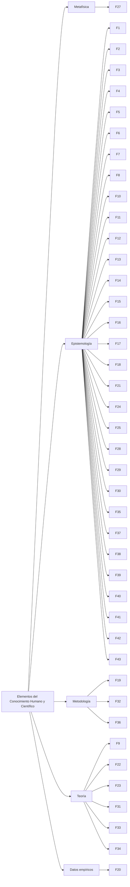

# Análiis Estructural - Definición y alcance de la epistemología ⚫①

[[Definición y alcance de la epistemología  🔴②]]

**DISCLAIMER: Documento ALTAMENTEO EXPERIMENTAL**

# Desglose frase por frase y conversión a hipótesis

A continuación, se desglosa el texto proporcionado frase por frase, se convierte cada una en una hipótesis verificable y se organiza según la jerarquía de elementos del conocimiento humano y científico descrita en el enlace proporcionado: [[Elementos del conocimiento humano y científico 🔴②-⚖️🔴②]]. La jerarquía incluye los siguientes niveles, en orden descendente de generalidad y abstracción:

1. **Metafísica**: Supuestos fundamentales sobre la realidad.
2. **Epistemología**: Naturaleza, origen y límites del conocimiento.
3. **Metodología**: Métodos y procesos para generar conocimiento.
4. **Teoría**: Explicaciones sistemáticas de fenómenos.
5. **Datos empíricos**: Observaciones y hechos verificables.

El análisis es esquemático, con cada frase numerada, su hipótesis correspondiente y su clasificación jerárquica. Las hipótesis están formuladas para ser comprobables en documentos subsiguientes, como se solicita.

## Introducción

1. **Frase**: "La epistemología se erige como una disciplina filosófica esencial que examina la naturaleza, los orígenes y los límites del conocimiento humano."
    
    - **Hipótesis**: La epistemología es una disciplina filosófica que se centra en estudiar la naturaleza, los orígenes y los límites del conocimiento humano.
    - **Jerarquía**: Epistemología.
    - **Justificación**: La frase define directamente el objeto de estudio de la epistemología, situándola en el nivel epistemológico de la jerarquía.
2. **Frase**: "Su relevancia para la ciencia radica en su capacidad para ofrecer un marco crítico que permite comprender cómo se construye, valida y aplica el saber científico."
    
    - **Hipótesis**: La epistemología proporciona un marco crítico que permite entender los procesos de construcción, validación y aplicación del conocimiento científico.
    - **Jerarquía**: Epistemología.
    - **Justificación**: Describe el rol de la epistemología en la ciencia, enfocándose en su función analítica sobre el conocimiento, lo cual es propio del nivel epistemológico.
3. **Frase**: "Este análisis define la epistemología de manera accesible, describe sus características fundamentales y explora su amplio alcance, destacando su influencia en el desarrollo del pensamiento científico y su importancia en la investigación práctica."
    
    - **Hipótesis**: La epistemología puede definirse de forma accesible, tiene características fundamentales identificables, influye en el pensamiento científico y es relevante para la investigación práctica.
    - **Jerarquía**: Epistemología.
    - **Justificación**: La frase aborda la definición, características y alcance de la epistemología, así como su impacto en la ciencia, lo que corresponde al nivel epistemológico.

## Definición de la epistemología

### Concepto central

4. **Frase**: "La epistemología, del griego _episteme_ (‘conocimiento’) y _logos_ (‘estudio’), es la rama de la filosofía que estudia el conocimiento en términos de su naturaleza, fundamentos, métodos y validez."
    
    - **Hipótesis**: La epistemología es una rama filosófica que analiza el conocimiento en cuanto a su naturaleza, fundamentos, métodos y validez.
    - **Jerarquía**: Epistemología.
    - **Justificación**: Define explícitamente el objeto y alcance de la epistemología, situándola en el nivel epistemológico.
5. **Frase**: "Se ocupa de cuestiones profundas como: ¿Qué diferencia el conocimiento de una simple creencia u opinión?"
    
    - **Hipótesis**: La epistemología aborda la distinción entre conocimiento y creencia u opinión como una cuestión central.
    - **Jerarquía**: Epistemología.
    - **Justificación**: La frase identifica una pregunta clave de la epistemología, relacionada con la naturaleza del conocimiento.
6. **Frase**: "¿Cuáles son las fuentes fiables del conocimiento, como la percepción sensorial, la razón lógica o la experiencia empírica?"
    
    - **Hipótesis**: La epistemología investiga si la percepción sensorial, la razón lógica y la experiencia empírica son fuentes fiables del conocimiento.
    - **Jerarquía**: Epistemología.
    - **Justificación**: Se centra en los orígenes del conocimiento, un tema epistemológico.
7. **Frase**: "¿Qué criterios determinan si una afirmación es verdadera o está justificada?"
    
    - **Hipótesis**: La epistemología establece criterios para determinar la verdad o justificación de una afirmación.
    - **Jerarquía**: Epistemología.
    - **Justificación**: Aborda la validez del conocimiento, un aspecto central de la epistemología.
8. **Frase**: "Tradicionalmente, el conocimiento se define como una _creencia verdadera justificada_."
    
    - **Hipótesis**: El conocimiento se caracteriza tradicionalmente como una creencia que es verdadera y está justificada.
    - **Jerarquía**: Epistemología.
    - **Justificación**: Propone una definición clásica del conocimiento, propia del nivel epistemológico.
9. **Frase**: "Por ejemplo, en el ámbito científico, la segunda ley de Newton (( F = ma )) se considera conocimiento porque está respaldada por observaciones experimentales y razonamientos coherentes, lo que la distingue de una suposición arbitraria."
    
    - **Hipótesis**: La segunda ley de Newton es un ejemplo de conocimiento científico porque está respaldada por observaciones experimentales y razonamientos coherentes.
    - **Jerarquía**: Teoría.
    - **Justificación**: Se refiere a una teoría científica específica (la segunda ley de Newton) y su justificación empírica, lo que corresponde al nivel teórico.

### Dimensiones de la epistemología

10. **Frase**: "La epistemología se aborda desde tres perspectivas principales: Normativa, Descriptiva y Crítica."
    
    - **Hipótesis**: La epistemología puede analizarse desde tres enfoques: normativo, descriptivo y crítico.
    - **Jerarquía**: Epistemología.
    - **Justificación**: Describe las perspectivas de estudio de la epistemología, un tema de nivel epistemológico.
11. **Frase**: "Normativa: Define estándares para evaluar la validez del conocimiento, como la coherencia lógica, la evidencia empírica o la reproducibilidad de resultados."
    
    - **Hipótesis**: La epistemología normativa establece estándares como la coherencia lógica, la evidencia empírica y la reproducibilidad para evaluar la validez del conocimiento.
    - **Jerarquía**: Epistemología.
    - **Justificación**: Se centra en los criterios de validación del conocimiento, un aspecto epistemológico.
12. **Frase**: "Descriptiva: Analiza cómo se produce el conocimiento en la práctica, por ejemplo, mediante los procesos de investigación científica."
    
    - **Hipótesis**: La epistemología descriptiva estudia cómo se genera el conocimiento en la práctica, especialmente a través de procesos de investigación científica.
    - **Jerarquía**: Epistemología.
    - **Justificación**: Aborda los procesos de producción del conocimiento, un tema epistemológico.
13. **Frase**: "Crítica: Examina los supuestos y limitaciones del conocimiento, identificando sesgos históricos, culturales o metodológicos que puedan influir en su construcción."
    
    - **Hipótesis**: La epistemología crítica analiza los supuestos, limitaciones y sesgos históricos, culturales o metodológicos que afectan la construcción del conocimiento.
    - **Jerarquía**: Epistemología.
    - **Justificación**: Se enfoca en las limitaciones y supuestos del conocimiento, un aspecto epistemológico.

## Alcance de la epistemología

### En el ámbito general

14. **Frase**: "La epistemología trasciende el ámbito científico para abarcar todas las formas del saber humano."
    
    - **Hipótesis**: La epistemología estudia no solo el conocimiento científico, sino todas las formas del saber humano.
    - **Jerarquía**: Epistemología.
    - **Justificación**: Define el alcance general de la epistemología, un tema epistemológico.
15. **Frase**: "Conocimiento cotidiano: Incluye creencias derivadas de la experiencia diaria, como asumir que ‘el sol sale cada mañana’ tras observarlo repetidamente."
    
    - **Hipótesis**: El conocimiento cotidiano, como la creencia en que el sol sale cada mañana, se deriva de la experiencia diaria y es estudiado por la epistemología.
    - **Jerarquía**: Epistemología.
    - **Justificación**: Describe una forma de conocimiento (cotidiano) y su estudio por la epistemología, un tema epistemológico.
16. **Frase**: "Conocimiento filosófico: Engloba reflexiones sobre la existencia, la ética o la realidad, como las ideas de Platón sobre el mundo de las formas o la crítica de Kant al conocimiento a priori."
    
    - **Hipótesis**: La epistemología analiza el conocimiento filosófico, incluyendo reflexiones como las de Platón sobre el mundo de las formas o la crítica de Kant al conocimiento a priori.
    - **Jerarquía**: Epistemología.
    - **Justificación**: Se refiere al estudio del conocimiento filosófico, un aspecto epistemológico.
17. **Frase**: "Conocimiento tradicional: Abarca saberes transmitidos generacionalmente en comunidades, como las técnicas agrícolas de los pueblos originarios, que integran observación y práctica."
    
    - **Hipótesis**: La epistemología estudia el conocimiento tradicional, como las técnicas agrícolas de pueblos originarios, que combinan observación y práctica.
    - **Jerarquía**: Epistemología.
    - **Justificación**: Identifica el conocimiento tradicional como objeto de estudio epistemológico.

### En la ciencia

18. **Frase**: "En el contexto científico, la epistemología es fundamental para analizar cómo se genera el conocimiento científico y qué lo distingue de otras formas de saber."
    
    - **Hipótesis**: La epistemología es esencial para entender la generación del conocimiento científico y su diferenciación de otros tipos de saber.
    - **Jerarquía**: Epistemología.
    - **Justificación**: Se centra en el rol de la epistemología en la ciencia, un tema epistemológico.
19. **Frase**: "Método científico: Evalúa la validez de procesos como la observación, la hipótesis y la experimentación."
    
    - **Hipótesis**: La epistemología evalúa la validez del método científico, incluyendo procesos como observación, formulación de hipótesis y experimentación.
    - **Jerarquía**: Metodología.
    - **Justificación**: Se refiere a la evaluación de procesos metodológicos, lo que corresponde al nivel metodológico.
20. **Frase**: "Por ejemplo, el experimento de Michelson-Morley (1887) refutó la teoría del éter al demostrar la constancia de la velocidad de la luz, un caso clásico estudiado por la epistemología para entender la falsación de hipótesis."
    
    - **Hipótesis**: El experimento de Michelson-Morley (1887) es un ejemplo clásico de falsación de hipótesis, estudiado por la epistemología para analizar la refutación de la teoría del éter.
    - **Jerarquía**: Datos empíricos.
    - **Justificación**: Describe un experimento específico y su resultado empírico, lo que corresponde al nivel de datos empíricos.
21. **Frase**: "Criterios de verdad: Establece qué hace que una teoría sea ‘verdadera’ o ‘probable’."
    
    - **Hipótesis**: La epistemología define criterios para determinar si una teoría científica es verdadera o probable.
    - **Jerarquía**: Epistemología.
    - **Justificación**: Aborda los criterios de validez del conocimiento científico, un tema epistemológico.
22. **Frase**: "El principio de falsabilidad de Popper exige que las hipótesis sean verificables, como ocurrió con la relatividad general de Einstein, confirmada por la curvatura de la luz observada durante el eclipse de 1919."
    
    - **Hipótesis**: El principio de falsabilidad de Popper, que requiere que las hipótesis sean verificables, se ejemplifica en la confirmación de la relatividad general de Einstein mediante la observación de la curvatura de la luz en 1919.
    - **Jerarquía**: Teoría.
    - **Justificación**: Se refiere a una teoría específica (relatividad general) y su verificación, lo que corresponde al nivel teórico.
23. **Frase**: "Paradigmas científicos: Analiza cómo los paradigmas, según Kuhn, guían la investigación, como la transición del modelo geocéntrico al heliocéntrico en los siglos XVI-XVII."
    
    - **Hipótesis**: La epistemología, según Kuhn, analiza cómo los paradigmas científicos, como la transición del modelo geocéntrico al heliocéntrico, orientan la investigación científica.
    - **Jerarquía**: Teoría.
    - **Justificación**: Describe el rol de los paradigmas en la ciencia, un concepto teórico.
24. **Frase**: "Límites del conocimiento: Reflexiona sobre las fronteras del saber científico, como el principio de incertidumbre en mecánica cuántica (( \Delta x \cdot \Delta p \geq \frac{\hbar}{2} )), que establece restricciones fundamentales a la medición simultánea de posición y momento."
    
    - **Hipótesis**: La epistemología estudia los límites del conocimiento científico, como el principio de incertidumbre en mecánica cuántica, que impone restricciones a la medición de posición y momento.
    - **Jerarquía**: Epistemología.
    - **Justificación**: Se centra en los límites del conocimiento, un tema epistemológico.

### Relaciones con otras disciplinas

25. **Frase**: "La epistemología se conecta con otras áreas del conocimiento: Filosofía de la ciencia, Metafísica, Ética, Sociología del conocimiento."
    
    - **Hipótesis**: La epistemología tiene conexiones con la filosofía de la ciencia, la metafísica, la ética y la sociología del conocimiento.
    - **Jerarquía**: Epistemología.
    - **Justificación**: Describe las relaciones interdisciplinarias de la epistemología, un tema epistemológico.
26. **Frase**: "Filosofía de la ciencia: Explora los fundamentos de disciplinas específicas, como los supuestos de la biología evolutiva o los principios de la física cuántica."
    
    - **Hipótesis**: La epistemología, a través de la filosofía de la ciencia, analiza los fundamentos de disciplinas como la biología evolutiva o la física cuántica.
    - **Jerarquía**: Epistemología.
    - **Justificación**: Se refiere al estudio de los fundamentos de disciplinas científicas, un aspecto epistemológico.
27. **Frase**: "Metafísica: Investiga la naturaleza de la realidad que el conocimiento describe, como el debate sobre si las leyes científicas reflejan una realidad objetiva."
    
    - **Hipótesis**: La epistemología, en relación con la metafísica, estudia si las leyes científicas reflejan una realidad objetiva.
    - **Jerarquía**: Metafísica.
    - **Justificación**: Aborda la naturaleza de la realidad, un tema metafísico.
28. **Frase**: "Ética: Analiza las implicaciones morales del conocimiento, por ejemplo, en el desarrollo de tecnologías como la inteligencia artificial o la edición genética."
    
    - **Hipótesis**: La epistemología, en conexión con la ética, analiza las implicaciones morales del conocimiento en tecnologías como la inteligencia artificial o la edición genética.
    - **Jerarquía**: Epistemología.
    - **Justificación**: Se centra en las implicaciones éticas del conocimiento, un tema epistemológico.
29. **Frase**: "Sociología del conocimiento: Examina cómo los contextos sociales y culturales influyen en la producción del saber, como el papel de las instituciones científicas en la aceptación de teorías."
    
    - **Hipótesis**: La epistemología, a través de la sociología del conocimiento, estudia cómo los contextos sociales y culturales, incluyendo las instituciones científicas, infl affect the production and acceptance of scientific theories.
    - **Jerarquía**: Epistemología.
    - **Justificación**: Examines the social and cultural influences on knowledge production, an epistemological issue.

---

## Importancia histórica en la ciencia

30. **Frase**: "La epistemología ha sido un motor clave en la evolución de la ciencia al proporcionar herramientas para reflexionar sobre sus métodos y supuestos."
    
    - **Hipótesis**: La epistemología ha impulsado la evolución de la ciencia al ofrecer herramientas para analizar sus métodos y supuestos.
    - **Jerarquía**: Epistemología.
    - **Justificación**: Describes the historical role of epistemology in science, an epistemological topic.
31. **Frase**: "Antigüedad: Aristóteles estableció principios lógicos, como el silogismo, que influyeron en la ciencia medieval."
    
    - **Hipótesis**: Aristóteles’ logical principles, such as the syllogism, significantly influenced medieval science.
    - **Jerarquía**: Teoría.
    - **Justificación**: Refers to a specific historical contribution (Aristotle’s logic) to scientific development, a theoretical contribution.
32. **Frase**: "Renacimiento: Francis Bacon abogó por el empirismo y René Descartes por el racionalismo, sentando las bases del método científico moderno."
    
    - **Hipótesis**: Francis Bacon’s empiricism and René Descartes’ rationalism were foundational to the development of the modern scientific method.
    - **Jerarquía**: Metodología.
    - **Justificación**: Discusses contributions to the scientific method, a methodological issue.
33. **Frase**: "Siglo XX: Filósofos como Karl Popper, con su principio de falsabilidad, Thomas Kuhn, con su teoría de los paradigmas, e Imre Lakatos, con los programas de investigación, transformaron nuestra comprensión del progreso científico."
    
    - **Hipótesis**: Twentieth-century philosophers like Popper, Kuhn, and Lakatos reshaped the understanding of scientific progress through falsifiability, paradigms, and research programs.
    - **Jerarquía**: Teoría.
    - **Justificación**: Refers to specific theoretical contributions to the philosophy of science.
34. **Frase**: "Un caso ilustrativo es la teoría de la relatividad de Einstein (( E = mc^2 )), que no solo revolucionó la física, sino que también planteó desafíos epistemológicos al redefinir conceptos fundamentales como el espacio y el tiempo, exigiendo nuevos métodos de validación."
    
    - **Hipótesis**: Einstein’s theory of relativity (( E = mc^2 )) revolutionized physics and posed epistemological challenges by redefining space and time, requiring new validation methods.
    - **Jerarquía**: Teoría.
    - **Justificación**: Discusses a specific scientific theory and its epistemological implications, a theoretical issue.
## Aplicaciones prácticas en la ciencia

35. **Frase**: "La epistemología guía a los científicos en aspectos prácticos de su trabajo."
    
    - **Hipótesis**: Epistemology provides practical guidance for scientists in their research activities.
    - **Jerarquía**: Epistemología.
    - **Justificación**: Highlights the practical role of epistemology in science, an epistemological issue.
36. **Frase**: "Diseño de experimentos: Asegura que los métodos sean rigurosos, reproducibles y libres de sesgos, como en los ensayos clínicos para nuevos medicamentos."
    
    - **Hipótesis**: Epistemology ensures that experimental designs, such as clinical trials for new drugs, are rigorous, reproducible, and free from biases.
    - **Jerarquía**: Metodología.
    - **Justificación**: Focuses on the methodological aspect of experimental design.
37. **Frase**: "Evaluación de teorías: Ayuda a distinguir entre hipótesis sólidas y especulaciones, por ejemplo, al comparar la teoría de cuerdas con el modelo estándar de la cosmología."
    
    - **Hipótesis**: Epistemology aids in distinguishing robust hypotheses from speculations, such as in comparisons between string theory and the standard cosmological model.
    - **Jerarquía**: Epistemología.
    - **Justificación**: Discusses the epistemological evaluation of scientific theories.
38. **Frase**: "Interdisciplinariedad: Facilita la colaboración entre disciplinas, como la integración de la neurociencia y la psicología para estudiar la conciencia."
    
    - **Hipótesis**: Epistemology promotes interdisciplinary collaboration, such as between neuroscience and psychology in studying consciousness.
    - **Jerarquía**: Epistemología.
    - **Justificación**: Addresses the role of epistemology in fostering interdisciplinary research, an epistemological issue.
39. **Frase**: "Ética científica: Promueve la reflexión sobre las consecuencias de la investigación, como los dilemas éticos en la inteligencia artificial o la edición genética."
    
    - **Hipótesis**: Epistemology encourages reflection - **Jerarquía**: Epistemología.
    - **Justificación**: Focuses on the ethical implications of scientific research, an epistemological concern.

## Conclusión

40. **Frase**: "La epistemología es una disciplina indispensable que arroja luz sobre la naturaleza, los orígenes y los límites del conocimiento, con un impacto transformador en la ciencia."
    
    - **Hipótesis**: Epistemology is an essential discipline that illuminates the nature, origins, and limits of knowledge, significantly impacting science.
    - **Jerarquía**: Epistemología.
    - **Justificación**: Summarizes the critical role of epistemology in understanding knowledge and its scientific impact.
41. **Frase**: "Al combinar la reflexión teórica con aplicaciones prácticas, proporciona un marco para comprender cómo se construye y valida el saber científico."
    
    - **Hipótesis**: Epistemology integrates theoretical reflection and practical applications to provide a framework for understanding the construction and validation of scientific knowledge.
    - **Jerarquía**: Epistemología.
    - **Justificación**: Emphasizes the dual role of epistemology in theory and practice.
42. **Frase**: "En la _Historia de la Epistemología y su aplicación en la Ciencia_, su alcance abarca desde la evaluación de los métodos científicos hasta la exploración de los paradigmas que impulsan el descubrimiento."
    
    - **Hipótesis**: In the history of epistemology and its application to science, its scope includes evaluating scientific methods and exploring paradigms that drive discovery.
    - **Jerarquía**: Epistemología.
    - **Justificación**: Describes the broad scope of epistemology in scientific history.
43. **Frase**: "Al fomentar un enfoque crítico y reflexivo, la epistemología fortalece la práctica científica y enriquece nuestra comprensión de las posibilidades y desafíos del conocimiento humano."
    
    - **Hipótesis**: Epistemology strengthens scientific practice and enhances understanding of the possibilities and challenges of human knowledge through critical and reflective approaches.
    - **Jerarquía**: Epistemología.
    - **Justificación**: Highlights epistemology’s role in improving science and understanding knowledge.

## Resumen de la jerarquía

- **Metafísica**: 1 hipótesis (frase 27).
- **Epistemología**: 29 hipótesis (frases 1-8, 10-18, 21, 24-25, 28-30, 35, 37-43).
- **Metodología**: 3 hipótesis (frases 19, 32, 36).
- **Teoría**: 6 hipótesis (frases 9, 22-23, 31, 33-34).
- **Datos empíricos**: 1 hipótesis (frase 20).

---

## Notas finales

- Las hipótesis están diseñadas para ser verificables en documentos subsiguientes, como los mencionados en las referencias bibliográficas (Popper, Kuhn, Bunge, etc.).
- La jerarquización sigue estrictamente la estructura del enlace proporcionado, priorizando la generalidad y abstracción.
- Cada hipótesis conserva la esencia de la frase original, reformulada como una afirmación comprobable.

![[Plantilla - 1MT#One More Thing]]