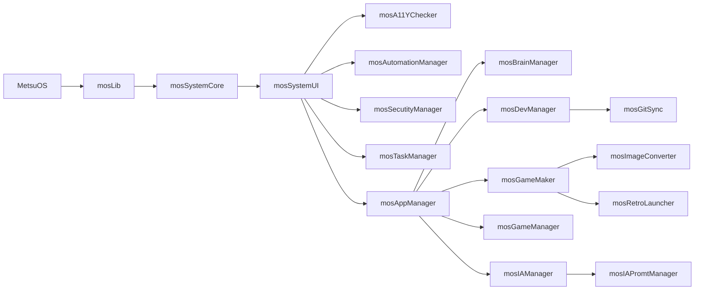

# Apps


[[PublicBrain/Index|Index]]


> WIP

Siguiendo la estela de [[El Proyecto|las patas de este proyecto]], enumero aquí aquí las apps que forman parte del toolkit que nos permitira, una vez en funcionamiento, la creación y mantenimiento de videojuegos accesibles que, en el fondo, es en buena medida de lo que va todo esto.

Organizo la estructura en capas al estilo cebolla crocante con ligeras trazas de vinagreta agridulce, para construir, mas que una "aplicación" un sistema cuyas partes puedan ser usadas como un conjunto cuyo resultado sea mayor que la suma de sus partes.

En cuanto a las versiones, cada aplicación, modulo y libreria del sistema pretendo tenga las siguientes versiones:

* **Community** .- Será la que tenga código disponble en abierto, y potencie al máximo lo que el software libre y de codigo abierto puede paportar.
* **Pro** - Se apoyará en la Community como si esta fuera una app, de modo que de aquí en adelante ya no hablamos de softrware libre ni de codigo abierto, sino de apps privadas y en el futuro comerciales mediante - probablemente - licencias. Esta capa tendrá por objetivo el uso de la versión Community pero adaptada a las necesidades, agilidad y robustez de un profesional.
* **Enterprise** .- Estas versiones, tambien privadas, se apoyan en la pro, y tienen por objetivo llevar la gestión profesional al nivel de lo que una empresa de tamaño pequeño o medio, requiere, trabajando también - probablemente - con un sistema de licencias.

En algunos casos, [como propuse en este tweet con el conversor de imagenes 🌐](https://x.com/metsuke/status/1971099781633130801), es posible que proponga alguna forma de uso gratuito limitado de las versiones pro, a modo de prueba y como regalo a los que siguen el proyecto con atención, pero siempre como servicio sin acceso al código.

Este planteamiento está vivo, pero es algo que he reflexionado  bastante, ni quiero dejar en la estacada a los que colaboran con el software libre construyendo una base sólida que evita que los desarrolladores se enquisten en monopolios ni quiero someter el proyecto a la falta de profesionalidad real del desarrollo al estilo "do it yourself". En el equilibrio y la variedad de opciones, está el punto medio.

## MetsuOS System Core

Este es el núcleo del sistema operativo, incluye el sistema operativo como tal sobre el que trabaja una libreria sobre la que se asientan el resto de elementos.  Esto permite que MetsuOS, a futuro, pueda correr tanto como sistema operativo nativo o como algo asentado sobre la versione de la mosLib correspondiente a nuestro sistema.

--- start-multi-column: BloqueMicrohobbit01\
```column-settings  
Number of Columns: 2
Border: off
```


## MetsuOS: El Sistema Operativo que Libera tu Potencial

**MetsuOS** es más que un sistema operativo: es una plataforma innovadora basada en GNU/Linux, diseñada para integrarse perfectamente en cualquier entorno. Flexible, potente y adaptable, MetsuOS es la base ideal para ejecutar aplicaciones en diversos sistemas, desde Windows y macOS hasta otras distribuciones Linux.

En el corazón de MetsuOS está **mosLib**, una biblioteca robusta que asegura una experiencia fluida y eficiente, sin importar el sistema operativo subyacente. Con MetsuOS, automatizamos los procesos repetitivos, liberándote para que puedas enfocarte en lo que realmente importa: ser humano, crear y alcanzar tus metas.

**MetsuOS**: Automatización inteligente. Libertad para innovar.

 --- column-end ---

  
## mosLib: El Corazón de MetsuOS

**mosLib** es la biblioteca fundamental que impulsa **MetsuOS**, diseñada para ofrecer una ejecución fluida y versátil, ya sea de forma nativa o en cualquier sistema operativo o entorno, como Windows, macOS o distribuciones Linux.

Con **mosLib**, todos los módulos del sistema funcionan en armonía. Esta potente biblioteca unifica, gestiona y optimiza desde las funciones esenciales del entorno hasta características avanzadas de accesibilidad, garantizando estabilidad y rendimiento sin igual.

**mosLib**: La base sólida para un sistema sin límites.

 --- column-end ---


## mosSystemCore: El Puente Unificador de MetsuOS

mosSystemCore es el bloque fundamental de código que actúa como adaptador inteligente entre mosLib y las particularidades de cada sistema operativo host. Toma las funciones universales de mosLib —diseñadas para una ejecución fluida y versátil— y las transforma, integrando las especificidades nativas de entornos como GNU/Linux, Windows, macOS u otras distribuciones, para generar un corpus único de funcionalidades unificadas. De esta manera, mosSystemCore asegura que el ecosistema de MetsuOS opere de forma homogénea y eficiente, independientemente del sustrato subyacente, eliminando fricciones y maximizando la compatibilidad.

Este núcleo no solo traduce y optimiza llamadas a APIs, manejo de recursos y dependencias del host, sino que también incorpora capas de abstracción para accesibilidad, automatización y seguridad, permitiendo que el resto de módulos —como mosSystemUI o mosAppManager— funcionen sin interrupciones. 

*mosSystemCore : Unificación sin fronteras. Eficiencia en cualquier entorno.*

 --- column-end ---
## mosSystemUI

 --- column-end ---
--- multi-column-end

## MetsuOS in a Nutshell



![[Plantilla - 1MT#One More Thing]]


