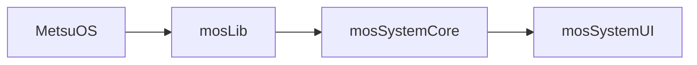
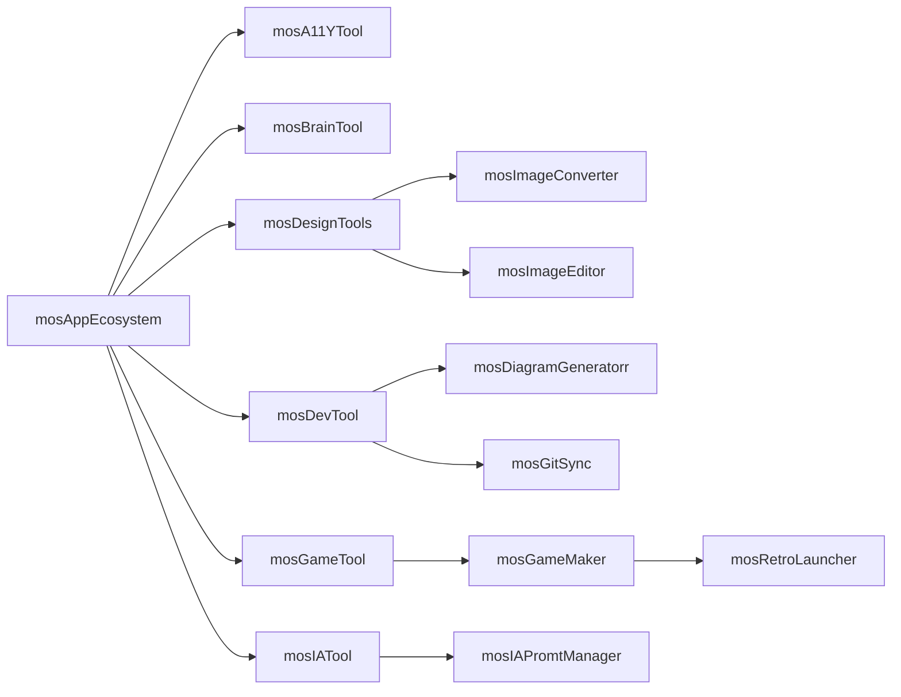

# Apps


[[PublicBrain/Index|Index]]


> WIP

Siguiendo la estela de [[El Proyecto|las patas de este proyecto]], enumero aquí aquí las apps que forman parte del toolkit que nos permitira, una vez en funcionamiento, la creación y mantenimiento de videojuegos accesibles que, en el fondo, es en buena medida de lo que va todo esto.

Organizo la estructura en capas al estilo cebolla crocante con ligeras trazas de vinagreta agridulce, para construir, mas que una "aplicación" un sistema cuyas partes puedan ser usadas como un conjunto cuyo resultado sea mayor que la suma de sus partes.

En cuanto a las capas de funcionamiento implicadas, cada aplicación, modulo y libreria del sistema pretendo tenga las siguientes versiones:

* **GFan Layer .- Será la que tenga el código disponible en abierto, pero limitado a componentes compatibles con GNU. Si un componente no existe bajo GNU la funcionalidad no será implementada en esta capa, pero ofrecera una guia clara para los Fans de GNU de que cosas tienen que implementar si quieren ganar presencia y efectividad. Se usará licencias GNU Compatibles.
* **Community** Layer .- Será la que tenga código disponble en abierto, y potencie al máximo lo que el software libre y de codigo abierto puede aportar. Usara componentes de la versión GFan si existe o implementará las que no, con licencia MIT o compatibles.
* **Pro** Layer - Se apoyará en la Community como si esta fuera una app, de modo que de aquí en adelante ya no hablamos de softrware libre ni de codigo abierto, sino de apps privadas y en el futuro comerciales mediante - probablemente - licencias. Esta capa tendrá por objetivo el uso de la versión Community pero adaptada a las necesidades, agilidad y robustez de un profesional.
* **Enterprise** Layer .- Estas versiones, tambien privadas, se apoyan en la pro, y tienen por objetivo llevar la gestión profesional al nivel de lo que una empresa de tamaño pequeño o medio, requiere, trabajando también - probablemente - con un sistema de licencias.

En algunos casos, [como propuse en este tweet con el conversor de imagenes 🌐](https://x.com/metsuke/status/1971099781633130801), es posible que proponga alguna forma de uso gratuito limitado de las versiones pro, a modo de prueba y como regalo a los que siguen el proyecto con atención, pero siempre como servicio sin acceso al código.

Este planteamiento está vivo, pero es algo que he reflexionado  bastante, ni quiero dejar en la estacada a los que colaboran con el software libre construyendo una base sólida que evita que los desarrolladores se enquisten en monopolios ni quiero someter el proyecto a la falta de profesionalidad real del desarrollo al estilo "do it yourself". En el equilibrio y la variedad de opciones, está el punto medio. Puedes ver más sobre esto en [[De Software Libre, Licencias y Filosofías en entornos VUCA 🟡③]]

## MetsuOS System Core

Este es el núcleo del sistema operativo, incluye el sistema operativo como tal sobre el que trabaja una libreria sobre la que se asientan el resto de elementos.  Esto permite que MetsuOS, a futuro, pueda correr tanto como sistema operativo nativo o como algo asentado sobre la versione de la mosLib correspondiente a nuestro sistema.



--- start-multi-column: BloqueMicrohobbit01\
```column-settings  
Number of Columns: 2
Border: off
```


### MetsuOS: El Sistema Operativo que Libera tu Potencial

**MetsuOS** es más que un sistema operativo: es una plataforma innovadora basada en GNU/Linux, diseñada para integrarse perfectamente en cualquier entorno. Flexible, potente y adaptable, MetsuOS es la base ideal para ejecutar aplicaciones en diversos sistemas, desde Windows y macOS hasta otras distribuciones Linux.

En el corazón de MetsuOS está **mosLib**, una biblioteca robusta que asegura una experiencia fluida y eficiente, sin importar el sistema operativo subyacente. Con MetsuOS, automatizamos los procesos repetitivos, liberándote para que puedas enfocarte en lo que realmente importa: ser humano, crear y alcanzar tus metas.

**MetsuOS**: Automatización inteligente. Libertad para innovar.

 --- column-end ---

  
### mosLib: El Corazón de MetsuOS

**mosLib** es la biblioteca fundamental que impulsa **MetsuOS**, diseñada para ofrecer una ejecución fluida y versátil, ya sea de forma nativa o en cualquier sistema operativo o entorno, como Windows, macOS o distribuciones Linux.

Con **mosLib**, todos los módulos del sistema funcionan en armonía. Esta potente biblioteca unifica, gestiona y optimiza desde las funciones esenciales del entorno hasta características avanzadas de accesibilidad, garantizando estabilidad y rendimiento sin igual.

**mosLib**: La base sólida para un sistema sin límites.

Continuar leyendo en ... [[mosLib - El Corazón de MetsuOS  ⚫①]]

 --- column-end ---


### mosSystemCore: El Puente Unificador de MetsuOS

mosSystemCore es el bloque fundamental de código que actúa como adaptador inteligente entre mosLib y las particularidades de cada sistema operativo host. Toma las funciones universales de mosLib —diseñadas para una ejecución fluida y versátil— y las transforma, integrando las especificidades nativas de entornos como GNU/Linux, Windows, macOS u otras distribuciones, para generar un corpus único de funcionalidades unificadas. De esta manera, mosSystemCore asegura que el ecosistema de MetsuOS opere de forma homogénea y eficiente, independientemente del sustrato subyacente, eliminando fricciones y maximizando la compatibilidad.

Este núcleo no solo traduce y optimiza llamadas a APIs, manejo de recursos y dependencias del host, sino que también incorpora capas de abstracción para accesibilidad, automatización y seguridad, permitiendo que el resto de módulos —como mosSystemUI o mosAppManager— funcionen sin interrupciones. 

*mosSystemCore : Unificación sin fronteras. Eficiencia en cualquier entorno.*

 --- column-end ---


### mosSystemUI: La Interfaz que Conecta tu Visión con la Realidad

mosSystemUI es el lienzo vivo de MetsuOS, una interfaz de usuario intuitiva y adaptable que transforma la complejidad subyacente del sistema en una experiencia visual y táctil accesible para todos. Construida sobre las bases sólidas de mosSystemCore, esta capa proporciona elementos de UI unificados —como paneles dinámicos, menús contextuales y dashboards personalizables— que se renderizan de manera consistente en cualquier entorno host, desde entornos nativos GNU/Linux hasta aplicaciones en Windows o macOS.

Con mosSystemUI, la accesibilidad no es un añadido, sino el núcleo: integra herramientas como lectores de pantalla integrados, navegación por gestos y modos de alto contraste que se adaptan automáticamente al usuario, garantizando que creadores de videojuegos y jugadores por igual puedan interactuar sin barreras. Desde la gestión de tareas hasta la supervisión de automatizaciones, mosSystemUI orquesta la armonía entre el usuario y el sistema, haciendo que lo abstracto sea tangible y lo técnico, humano.

mosSystemUI: Interfaz sin límites. Donde la accesibilidad encuentra la innovación.

 --- column-end ---
--- multi-column-end

## MetsuOS Base System: El Pilar Accesible de la Interfaz Unificada

MetsuOS Base System es la base estructural y accesible que se edifica directamente sobre mosSystemUI, integrando una capa intermedia de módulos clave como mosA11YManager, mosAutomationManager, mosBrainManager, mosIAManager, mosLegalManager, mosNetManager, mosRTManager, mosSecurityManager, y mosTaskManager en un núcleo cohesivo y dinámico. 

Este sistema fundamental transforma la interfaz intuitiva de mosSystemUI en un puente hacia la inclusión, asegurando una verificación constante de accesibilidad a través de herramientas como mosA11YTool, automatizando procesos repetitivos con mosAutomationManager, reforzando la seguridad con mosSecurityManager, gestionando tareas con precisión mediante mosTaskManager, y facilitando un ecosistema de aplicaciones coordinado por mosAppEcosystem, que integra herramientas como mosGameTool para mosGameMaker y mosRetroLauncher en cualquier entorno. 

En el corazón de MetsuOS, Base System encarna la esencia de un sistema sin barreras, donde la accesibilidad impulsa la innovación y convierte la complejidad técnica en un espacio humano de empoderamiento para creadores y usuarios.

Los módulos Manager integran funcionalidad y configuración, y mediante mosBrainManager aplican la metodología de validación de contenidos de MetsuOS, persiguiendo el máximo rigor científico con un enfoque adaptativo que evalúa credibilidad y solidez, mientras neutralizan dogmas "científicos", religiosos e ideológicos, buscando ofrecer al usuario información validada, neutral y contextualizada.

MetsuOS Base System: Accesibilidad ilimitada. Innovación sin fronteras.


--- start-multi-column: BloqueMicrohobbit01\
```column-settings  
Number of Columns: 2
Border: off
```

### mosA11YManager


**mosA11YManager: El Guardián de la Accesibilidad Universal en MetsuOS**

mosA11YManager es el módulo central que orquesta la accesibilidad en todo el ecosistema MetsuOS, integrándose directamente con mosSystemUI y herramientas como mosA11YTool para garantizar que cada interacción sea inclusiva por diseño. Este gestor verifica en tiempo real el cumplimiento de estándares como WCAG, implementa lectores de pantalla avanzados, navegación por voz y gestos, y adapta dinámicamente la interfaz a necesidades individuales —desde modos de alto contraste hasta soporte para discapacidades motoras o cognitivas—.

Más allá de la corrección, mosA11YManager impulsa la creación de videojuegos accesibles mediante mosGameMaker, auditando assets en mosImageConverter y entornos en mosRetroLauncher. Con mosBrainManager, evalúa la usabilidad con rigor probabilístico, neutralizando barreras y fomentando la innovación inclusiva.

mosA11YManager: Accesibilidad como superpoder. Inclusión sin excepciones.

--- column-end --- 
### mosAutomationManager


**mosAutomationManager: La Orquestadora de Procesos Inteligentes en MetsuOS**

mosAutomationManager es el motor de automatización que libera al usuario de tareas repetitivas, construyendo flujos inteligentes sobre mosSystemUI para optimizar el desarrollo y mantenimiento de videojuegos accesibles. Integra scripts personalizables, macros contextuales y workflows que se activan por eventos —desde compilación automática en mosGameMaker hasta sincronización en mosGitSync—.

Apoyado en mosTaskManager para priorización y mosSecurityManager para ejecución segura, este módulo transforma rutinas en eficiencia, permitiendo enfocarte en la creatividad. En versiones Pro y Enterprise, añade IA predictiva para anticipar necesidades y escalar operaciones en equipos.

mosAutomationManager: Automatiza lo mundano. Libera lo extraordinario.

--- column-end --- 
### mosBrainManager


**mosBrainManager: El Validador de Sabiduría Contextual en MetsuOS**

mosBrainManager es el núcleo cognitivo que aplica el sistema de niveles de validación ⚫🔴🟡🟢🔵⚪ en todos los contenidos y procesos de MetsuOS, asegurando información neutral, rigurosa y libre de dogmas. Integrado con mosSystemUI, evalúa credibilidad probabilística —combinando análisis científico, filosófico y empático— para etiquetar datos en herramientas como mosBrainTool o mosIAPromtManager.

Neutraliza sesgos ideológicos o "opiniones expertas" anticientíficas, incorporando el estándar OTAN de fiabilidad (A-F / 1-6) y referencias cruzadas. En el ecosistema de apps, guía la creación de juegos con conocimiento consolidado, promoviendo decisiones informadas y éticas.

mosBrainManager: Sabiduría probabilística. Conocimiento sin cadenas.

--- column-end --- 
### mosIAManager


**mosIAManager: El Orquestador de Ejecución IA en MetsuOS**

mosIAManager es el gestor central de ejecución de inteligencia artificial que coordina, optimiza y supervisa todos los procesos IA dentro del ecosistema MetsuOS, asentado sobre mosSystemUI. Controla la carga, priorización y escalado de modelos —desde inferencia local hasta integración con servicios externos— en herramientas como mosIAPromtManager, mosBrainTool o mosGameMaker para generación accesible de assets, diálogos o mecánicas.

Integra con mosTaskManager para colas inteligentes, mosSecurityManager para ejecución en sandbox y mosBrainManager para validación probabilística de salidas IA. En versiones Pro y Enterprise, habilita pipelines personalizados, fine-tuning seguro y despliegue multi-GPU/TPU, manteniendo la soberanía del usuario sobre datos y modelos.

mosIAManager: Ejecución IA sin límites. Inteligencia al servicio de la creación.

--- column-end ---
### mosLegalManager


**mosLegalManager: El Escudo de Cumplimiento Normativo en MetsuOS**

mosLegalManager es el módulo que asegura el cumplimiento legal y ético en todo el sistema, verificando licencias, derechos de autor y regulaciones —como GDPR o accesibilidad— sobre mosSystemUI. Integra con mosAppEcosystem para auditar assets, contratos o distribuciones.

Apoyado en mosBrainManager para análisis probabilístico de riesgos legales, genera reportes automáticos y alertas. En versiones Enterprise, gestiona licencias comerciales y auditorías para PYMEs, manteniendo el equilibrio entre software libre (Community) y privado.

mosLegalManager: Legalidad proactiva. Innovación con integridad.

--- column-end --- 
### mosNetManager


**mosNetManager: El Conector Universal de Redes en MetsuOS**

mosNetManager es el gestor de conectividad que unifica redes locales, cloud y P2P en MetsuOS, asegurando comunicación fluida y segura sobre mosSystemUI. Maneja protocolos adaptativos —WebRTC, VPN integradas y offline-first— para sincronización en mosGitSync, multiplayer en mosGameMaker o actualizaciones en mosAppEcosystem.

Con mosSecurityManager, encripta tráfico y optimiza latencia; mosRTManager añade soporte en tiempo real. En Pro/Enterprise, escala a redes empresariales con balanceo de carga y monitoreo predictivo.

mosNetManager: Conexión sin fronteras. Red inteligente y resiliente.

--- column-end --- 
### mosRTManager


**mosRTManager: El Maestro del Tiempo Real en MetsuOS**

mosRTManager es el módulo especializado en operaciones en tiempo real, optimizando latencia y sincronización en entornos dinámicos sobre mosSystemUI. Impulsa multiplayer accesible en mosGameMaker, emulación fluida en mosRetroLauncher y flujos colaborativos en mosDevTool.

Integra con mosNetManager para redes RT y mosTaskManager para priorización crítica. En versiones avanzadas, incorpora predicción IA para jitter y escalabilidad en juegos o automatizaciones.

mosRTManager: Tiempo real impecable. Experiencias instantáneas y accesibles.

--- column-end --- 
### mosSecurityManager


**mosSecurityManager: La Fortaleza Inquebrantable de MetsuOS**

mosSecurityManager es el guardián integral de seguridad que protege datos, procesos y usuarios en todo MetsuOS, sobre mosSystemUI. Implementa encriptación end-to-end, detección de amenazas IA y auditorías continuas, integrándose con mosIAManager para accesos y mosAutomationManager para ejecuciones seguras.

Bloquea vulnerabilidades en apps como mosImageConverter o mosGameMaker, con sandboxing y actualizaciones zero-trust. En Enterprise, añade compliance avanzado y respuesta a incidentes.

mosSecurityManager: Seguridad como prioridad. Privacidad que empodera.

--- column-end --- 
### mosTaskManager


**mosTaskManager: El Director de Orquesta de Tareas en MetsuOS**

mosTaskManager es el gestor de tareas que prioriza, agenda y ejecuta procesos con eficiencia inteligente sobre mosSystemUI. Integra colas dinámicas, dependencias y notificaciones para workflows en mosAutomationManager, builds en mosGameMaker o sincronizaciones en mosGitSync.

Con mosBrainManager, asigna prioridades probabilísticas; mosRTManager maneja tareas críticas. En Pro/Enterprise, soporta equipos con dashboards colaborativos y métricas predictivas.

mosTaskManager: Tareas bajo control. Productividad sin esfuerzo.

 --- column-end ---
--- multi-column-end


## MetsuOS in a Nutshell

### Capas de Infraestructura


### Capa de Servicios


### Capa de Aplicaciones




![[Plantilla - 1MT#One More Thing]]


