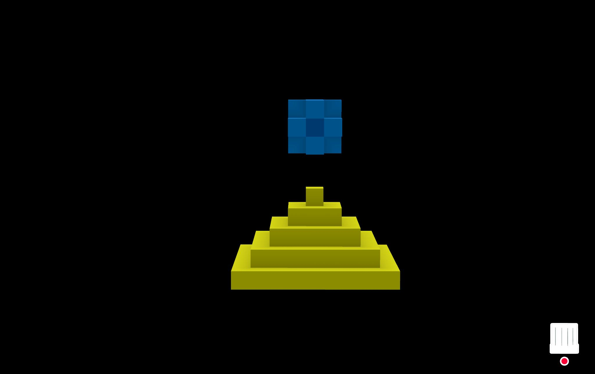

# Blog

**En esta fase, recuperando y poniendo al dia entradas relevantes de la web anterior**

--- start-multi-column: BloqueMicrohobbit01\
```column-settings  
Number of Columns: 2
Border: off
```

 --- column-end ---
 

## Dios es gallego: del gráfico de Nolan a la pirámide de Coherentum



Es la pregunta, la que nos quita el sueño a ti, a mí, y a tantos otros, es la más profunda después del gran “¿por qué?” que lo abarca todo. Es esquiva, ambigua. Algunos la tildan de infantil; otros, de imposible. Nadie tiene una respuesta sin sesgos, pero todos creen estar en lo cierto.

Continua leyendo en ... [[Blog - Dios es Gallego - Del Gráfico de Nolan a la Pirámide de Coherentum - 2025-05-22 🔴②]]

--- column-end ---
--- multi-column-end


--- start-multi-column: BloqueOMT\
```column-settings  
Number of Columns: 1
Border: off
```

![[Plantilla - 1MT#One More Thing]]

 --- column-end ---
--- multi-column-end


