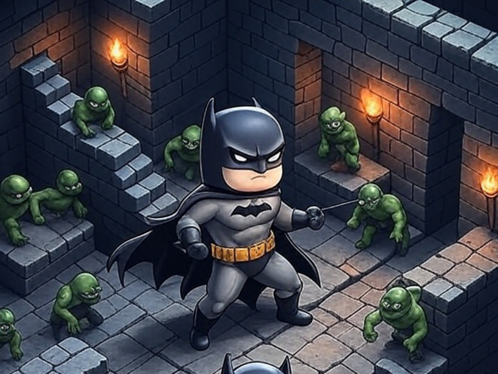
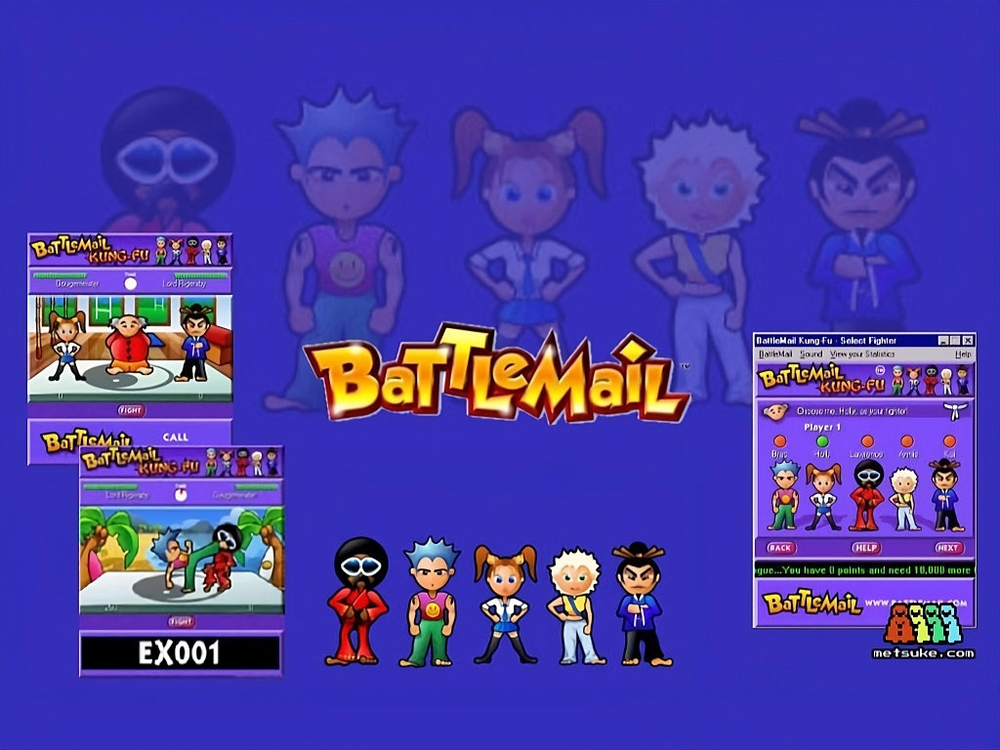

# Blog

**En esta fase, recuperando y poniendo al dia entradas relevantes de la web anterior**

--- start-multi-column: BloqueBlog002\
```column-settings  
Number of Columns: 2
Border: off
```


## Sobre el sistema de validacion de contenido de MetsuOS

Inspirado por el trabajo de Diego Vargas Pardo y el documental en preparación que anunció en el canal del Spectrumero Javi Ortiz, he decidido compartir con el público generalista los fundamentos del sistema de validación de contenido de mi proyecto, MetsuOS. Este sistema, representado por las icónicas "pelotillas de colores" ([[⚫🔴🟡🟢🔵⚪ (🔴②)]]), no solo se aplica al desarrollo de videojuegos, sino que aborda una problemática más amplia: la gestión del conocimiento en un mundo saturado de información no necesariamente fidedigna.

Continuar leyendo en ... [[Blog - Sobre el sistema de validacion de contenido de MetsuOS - 2025-06-01 🔴②]]

--- column-end ---


## Aventuras de verano con el enmascarado

El calor era como una manta pesada que no te quitabas ni abriendo todas las ventanas. Nuestra calle, en Carabanchel, olía a polvo y a verano, con el descampado al final del bloque donde los críos jugaban al fútbol hasta que anochecía. A veces, desde mi cuarto, veía a los yonquis rondando cerca del descampado, con sus miradas perdidas. Mamá siempre decía que no fuéramos por allí de noche, pero a mí no me importaba tanto. Lo que me tenía atrapado era el ZX Spectrum que mi padre me compró por mi cumpleaños, y ese juego, _Batman_, que Juan y yo no podíamos dejar de jugar.

Continuar leyendo en ... [[Blog - Aventuras de verano con el enmascarado - 2025-05-26  🟡③]]

--- column-end ---


## Battlemail: Mi primer juego viral

Corría el inicio de los 2000 cuando descubrí Battlemail, un juego de lucha que se jugaba a través de correos electrónicos y que se convirtió en una sensación viral. Recuerdo con cariño la emoción de instalar aquel cliente en mi ordenador, un ejecutable que integraba Flash y que me permitía crear mi propio personaje para desafiar a amigos.

Continuar leyendo en ... [[Blog - Battlemail - Mi primer juego viral - 2025-05-24  🔴②]]

 --- column-end ---


## Parece extremadamente probable que la verdad absoluta no exista

En un instante más breve que un nanosegundo, un campo de energía repulsiva expande el espacio hasta dimensiones visibles y lo llena con una sopa de partículas subatómicas llamadas quarks, a una edad del universo de ( 10^{-32} ) segundos

Continuar leyendo en ... [[Blog - Parece extremadamente probable que la verdad absoluta no exista - 2025-05-23 🔴②]]

 --- column-end ---
 


## Dios es gallego: del gráfico de Nolan a la pirámide de Coherentum

Es la pregunta, la que nos quita el sueño a ti, a mí, y a tantos otros, es la más profunda después del gran “¿por qué?” que lo abarca todo. Es esquiva, ambigua. Algunos la tildan de infantil; otros, de imposible. Nadie tiene una respuesta sin sesgos, pero todos creen estar en lo cierto.

Continua leyendo en ... [[Blog - Dios es Gallego - Del Gráfico de Nolan a la Pirámide de Coherentum - 2025-05-22 🔴②]]

 --- column-end ---
--- multi-column-end

![[Plantilla - 1MT#One More Thing]]


