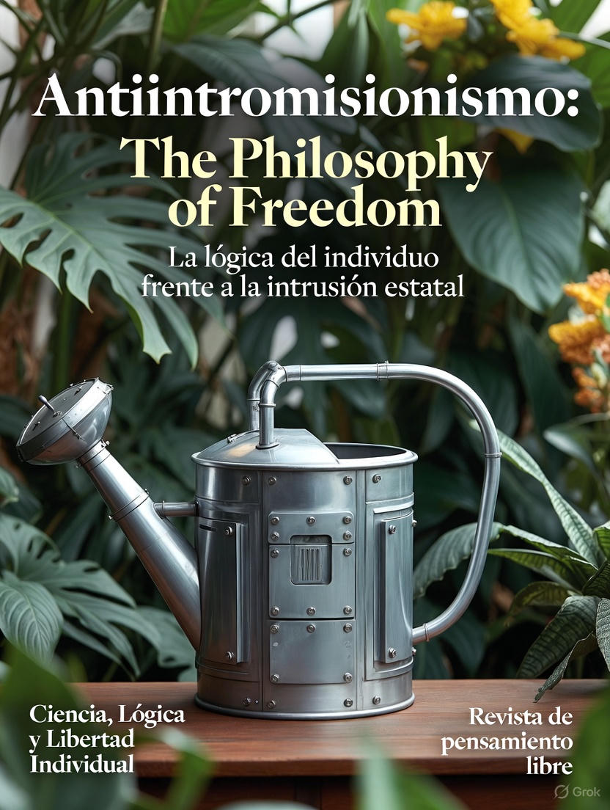
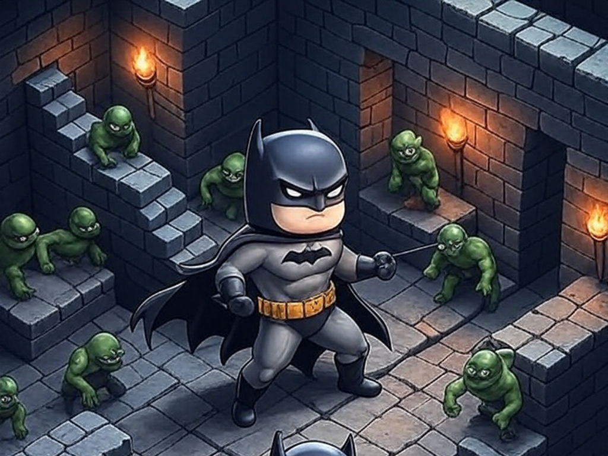
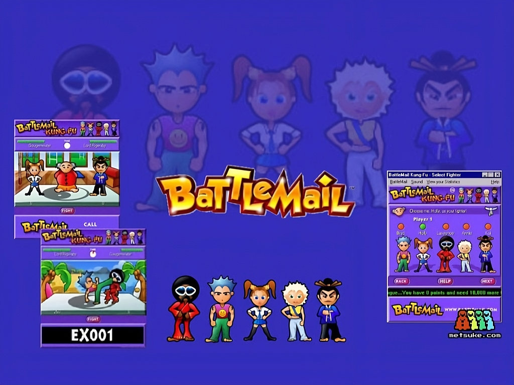
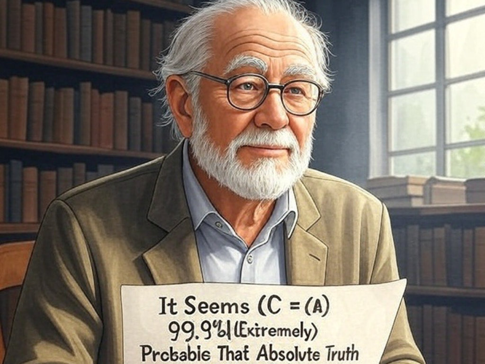

# Blog

**En esta fase, recuperando y poniendo al dia entradas relevantes de la web anterior**

--- start-multi-column: BloqueMicrohobbit01\
```column-settings  
Number of Columns: 2
Border: off
```


## El Archivero del Retro

Es esta una parte del proyecto que tenia reservada para más adelante, pero la "actualidad" manda, es hora de aprovechar mi fondo en cuanto a cds y disquettes para aportar mi minúsculo grano de arena en este mundillo retro tan activo en nuestros dias.

Continua leyendo en ... [[Blog - El Archivero del Retro  ⚫①]]


--- column-end ---



## El Antiintromisionismo, una propuesta filosófica y práctica

El antiintromisionismo nace como una evolución crítica del liberalismo político. Su objetivo es preservar la libertad individual sin cargar con las distorsiones narrativas que afectan al término «liberalismo». En lugar de adoptar un ideario completo, se centra en un núcleo claro y poco ambiguo: **prohibir cualquier intromisión en la vida ajena**, salvo que se demuestre con lógica y evidencia científica que esa no-intromisión daña la libertad de terceros.

Continuar leyendo en ... [[Blog - El Antiintromisionismo, una propuesta filosófica y práctica 🟡③]]

--- column-end ---


## El tiempo, resulta que si es oro

Los que programamos, como forma de vida, con independencia de que sea nuestra profesion habitual o no, sabemos desde siempre que el tiempo es oro, o, de forma más precisa, que si no automatizas, no llegarás muy lejos.

De las máquinas programables con decenas de miles de cablecitos físicos, los transistores que permitieron máquinas cada vez mas genéricas programadas directamente con ceros y unos, el assembler, c y todos los niveles de abstracción posteriores que han permitido una explosión de creatividad expansiva, son hijos de la misma premisa, y a nadie en su sano juicio se le ha ocurido reivindicar lo injusto de los compiladores de c que vienen a quitar el trabajo a los creadores de código artesano para la ENIAC.

Continua leyendo en ... [[Blog - El tiempo resulta que si es oro - 2025-08-11 ⚫①]]

--- column-end ---


## Cansado de construir sobre arenas movedizas

Desde que comencé a programar, siempre ha sido la misma historia, cuando empiezas a tener una base solida sobre la que construir, el suelo bajo tus pies desaparece por caprichos tecnicos, persecución de objetos brillantes o, como pasa en el mundo retro, muerte o abandono de los creadores.

Está claro que nada dura para siempre, pero empiezo a estar muy cansado de la tendencia del mundo del retro a pensar en local, en pequeño, y que el que venga "se busque la vida", yo hago mi herramienta para mi windows, dejo que mi ego me impida abrir el codigo y cuando desaparezco, me llevo media scene conmigo o, cuando menos dificulto su trabajo. Esto debe terminar.

Continua leyendo en ... [[Blog - Cansado de construir sobre arenas movedizas - 2025-07-29 ⚫①]]

--- column-end ---


## Sobre el sistema de validacion de contenido de MetsuOS

Inspirado por el trabajo de Diego Vargas Pardo y el documental en preparación que anunció en el canal del Spectrumero Javi Ortiz, he decidido compartir con el público generalista los fundamentos del sistema de validación de contenido de mi proyecto, MetsuOS. 

Este sistema, representado por las icónicas "pelotillas de colores" ([[⚫🔴🟡🟢🔵⚪ (🔴②)]]), no solo se aplica al desarrollo de videojuegos, sino que aborda una problemática más amplia: la gestión del conocimiento en un mundo saturado de información no necesariamente fidedigna.

Continuar leyendo en ... [[Blog - Sobre el sistema de validacion de contenido de MetsuOS - 2025-06-01 🔴②]]

--- column-end ---


## Aventuras de verano con el enmascarado

El calor era como una manta pesada que no te quitabas ni abriendo todas las ventanas. Nuestra calle, en Carabanchel, olía a polvo y a verano, con el descampado al final del bloque donde los críos jugaban al fútbol hasta que anochecía. 

A veces, desde mi cuarto, veía a los yonquis rondando cerca del descampado, con sus miradas perdidas. Mamá siempre decía que no fuéramos por allí de noche, pero a mí no me importaba tanto. Lo que me tenía atrapado era el ZX Spectrum que mi padre me compró por mi cumpleaños, y ese juego, _Batman_, que Juan y yo no podíamos dejar de jugar.

Continuar leyendo en ... [[Blog - Aventuras de verano con el enmascarado - 2025-05-26  🟡③]]

--- column-end ---


## Battlemail: Mi primer juego viral

Corría el inicio de los 2000 cuando descubrí Battlemail, un juego de lucha que se jugaba a través de correos electrónicos y que se convirtió en una sensación viral. 

Recuerdo con cariño la emoción de instalar aquel cliente en mi ordenador, un ejecutable que integraba Flash y que me permitía crear mi propio personaje para desafiar a amigos.

Continuar leyendo en ... [[Blog - Battlemail - Mi primer juego viral - 2025-05-24 🟡③]]

 --- column-end ---



## Parece extremadamente probable que la verdad absoluta no exista

La realidad que percibimos y la esencia de esa realidad, no necesariamente coinciden.

En un instante más breve que un nanosegundo, un campo de energía repulsiva expande el espacio hasta dimensiones visibles y lo llena con una sopa de partículas subatómicas llamadas quarks, a una edad del universo de ( 10^{-32} ) segundos ...

Continuar leyendo en ... [[Blog - Parece extremadamente probable que la verdad absoluta no exista - 2025-05-23 🔴②]]

 --- column-end ---
 


## Dios es gallego: del gráfico de Nolan a la pirámide de Coherentum

Es la pregunta, la que nos quita el sueño a ti, a mí, y a tantos otros, es la más profunda después del gran “¿por qué?” que lo abarca todo. 

Es esquiva, ambigua. Algunos la tildan de infantil; otros, de imposible. Nadie tiene una respuesta sin sesgos, pero todos creen estar en lo cierto.

Continua leyendo en ... [[Blog - Dios es Gallego - Del Gráfico de Nolan a la Pirámide de Coherentum - 2025-05-22 🔴②]]

 --- column-end ---
--- multi-column-end

![[Plantilla - 1MT#One More Thing]]


