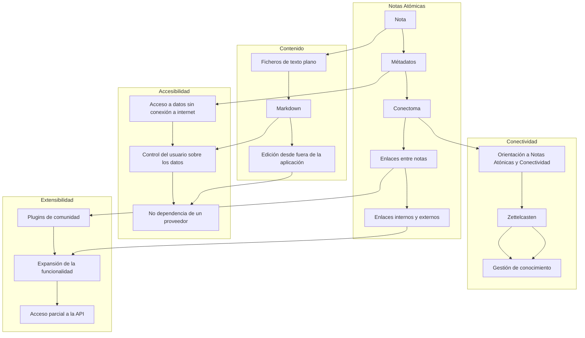

# Diagrama de bloques del sistema de gestion de conocimiento en MetsuOS ⚫①

[[Creando MetsuOS ⚫①]]

**DISCLAIMER Texto Experimental**

A continuación, te presento un diagrama de bloques que ilustra las funcionalidades universales para la gestión de notas en MetsuOS, utilizando Mermaid:

En este diagrama, se pueden ver las siguientes funcionalidades universales para la gestión de notas en MetsuOS:

* **Notas Atónicas**: Las notas son la base de la gestión de conocimiento en MetsuOS. Cada nota tiene sus propios metadatos y conectoma, que permiten la creación de enlaces entre notas.
* **Contenido**: El contenido de las notas se almacena en ficheros de texto plano, utilizando Markdown como formato preferido. Esto permite la edición de las notas desde fuera de la aplicación.
* **Accesibilidad**: La aplicación permite el acceso a los datos sin conexión a internet, y el control del usuario sobre los datos es fundamental. No hay dependencia de un proveedor, lo que significa que el usuario tiene la libertad de trabajar con sus datos como considere oportuno.
* **Conectividad**: La aplicación se orienta a la gestión de notas atónicas y conectividad, utilizando la metodología Zettelcasten. Esto permite la gestión de conocimiento y la creación de enlaces entre notas.
* **Extensibilidad**: La aplicación permite la creación de plugins de comunidad, que pueden expandir la funcionalidad de la aplicación. También se prevé el acceso parcial a la API, lo que permitirá a los desarrolladores crear aplicaciones que interactúen con MetsuOS.

En resumen, el diagrama de bloques de las [[Funcionalidades Universales para gestión de notas en MetsuOS ⚫①]] muestra la importancia de la accesibilidad, la conectividad y la extensibilidad en la aplicación.

![[Plantilla - 1MT#One More Thing]]