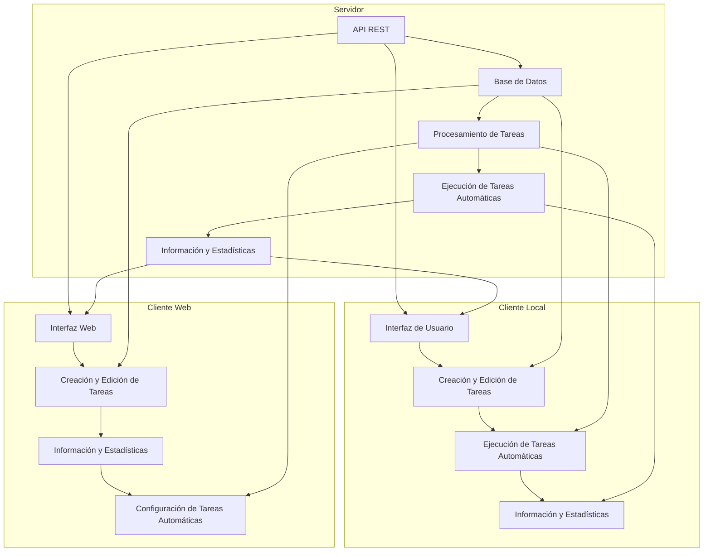

# Diagrama de bloques del sistema operativo MetsuOS  ⚫①

[[Creando MetsuOS ⚫①]]

**DISCLAIMER Texto experimental**

En este diagrama, se pueden ver los siguientes componentes:

* **Servidor**: El corazón del sistema, que se encarga de procesar y almacenar las tareas. Está compuesto por:
 + **API REST**: La interfaz de comunicación con los clientes.
 + **Base de Datos**: El almacenamiento de las tareas y la información del usuario.
 + **Procesamiento de Tareas**: El motor que ejecuta las tareas automáticas y manuales.
 + **Ejecución de Tareas Automáticas**: El componente que ejecuta las tareas automáticas en segundo plano.
 + **Información y Estadísticas**: El componente que proporciona información y estadísticas sobre las tareas.
* **Cliente Local**: La aplicación que se instala en la máquina del usuario y se comunica con el servidor a través de la API REST. Está compuesto por:
 + **Interfaz de Usuario**: La interfaz que muestra las tareas asignadas al usuario.
 + **Creación y Edición de Tareas**: El componente que permite al usuario crear y editar tareas manuales.
 + **Ejecución de Tareas Automáticas**: El componente que ejecuta las tareas automáticas en segundo plano.
 + **Información y Estadísticas**: El componente que proporciona información y estadísticas sobre las tareas.
* **Cliente Web**: La interfaz web que permite a los usuarios gestionar las tareas de forma remota. Está compuesto por:
 + **Interfaz Web**: La interfaz que muestra las tareas asignadas al usuario.
 + **Creación y Edición de Tareas**: El componente que permite al usuario crear y editar tareas manuales.
 + **Información y Estadísticas**: El componente que proporciona información y estadísticas sobre las tareas.
 + **Configuración de Tareas Automáticas**: El componente que permite al usuario configurar las tareas automáticas.

En resumen, el diagrama de bloques del sistema operativo MetsuOS muestra la arquitectura del sistema, que se compone de un servidor que procesa y almacena las tareas, y dos clientes (local y web) que permiten a los usuarios gestionar las tareas de forma remota.

![[Plantilla - 1MT#One More Thing]]