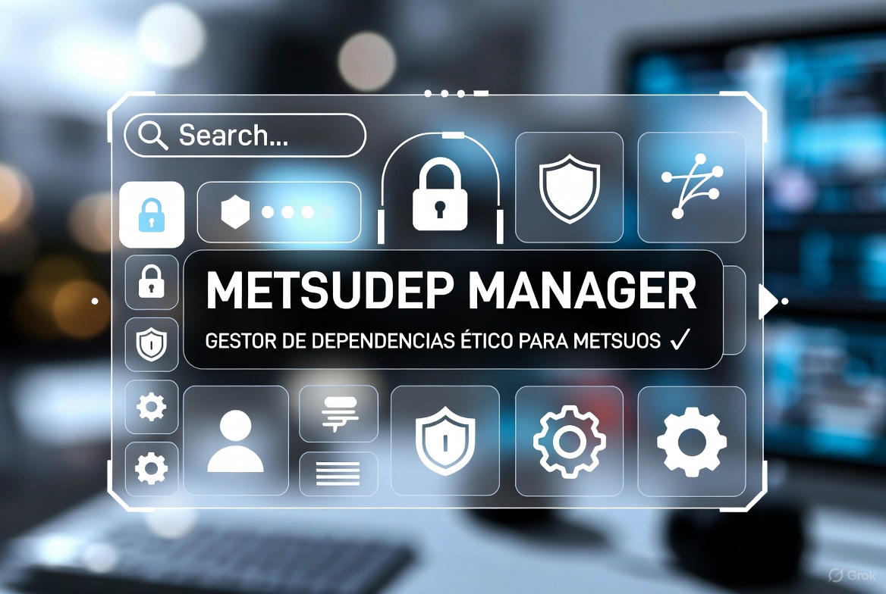

# Index 
# Construyendo la plena inclusión a través del videojuego.

## Cadena Federal

--- start-multi-column: BloqueMicrohobbit01\
```column-settings  
Number of Columns: 2
Border: off
```


### Noticias - Lanzamiento de  Perseus para ZX Spectrum 128K: Una aventura épica impulsada por el motor Tuerkas128

Continuar leyendo en ... [[Noticias - Lanzamiento de Perseus para ZX Spectrum 128K -  Una aventura épica impulsada por el motor Tuerkas128 - 2025-12-26 🟡③]]

--- column-end ---



### MetsuOS - MetsuDepManager – Gestor de Dependencias Ético para MetsuOS 🟡③

Continuyar leyendo en ... [[MetsuDepManager - Visión general del proyecto 🟡③]] y [[Curso sobre desarrollo de un gestor de paquetes python que use poetry como backend 🟡③]]

 --- column-end ---


### Biblioteca - La Biblioteca del Archivero del Retro

Continua leyendo en ... [[La Biblioteca del Archivero del Retro 🟡③]]

--- column-end ---


### Blog - El Archivero del Retro

Continua leyendo en ... [[Blog - El Archivero del Retro  ⚫①]]

--- column-end ---


### Ciencia - Conceptos básicos sobre ciencia y su evolución histórica

Continuar leyendo en ... [[Conceptos básicos sobre ciencia y su evolución histórica 🟡③]]

--- column-end ---


### Desarrollo - Aprender sobre Desarrollo de Software

Continua leyendo en ... [[Aprender sobre Desarrollo de Software 🟡③]]

--- column-end ---


### Epistemología - Diferencias y similitudes entre epistemología y gnoseología

Continua leyendo en ... [[Diferencias y similitudes entre epistemología y gnoseología 🟡③]]

--- column-end ---


### Negocios - Estructurar una Microagencia de Marketing Digital 

Continua leyendo en ... [[Estructurar una Microagencia de Marketing Digital 🟡③]]

--- column-end ---


### Videojuegos - Historia Mundial de los videojuegos de aventura

Continua leyendo en [[Curso Historia Mundial de los videojuegos de aventura 🟡③]]


--- column-end ---
--- multi-column-end

## ¿Deseas saber más?


## ¡Bienvenidos a MetsuOS: Videojuegos para Todos!

¿Recuerdas la emoción de tu primer videojuego? Esa chispa de ilusión, la espera interminable hasta Navidad para jugar, o los paseos al quiosco por la última revista de juegos. En MetsuOS, queremos que **todos** puedan sentir esa magia, sin importar sus capacidades o habilidades.

### Un Mundo de Videojuegos Inclusivos

En MetsuOS, creemos que los videojuegos no deberían ser un privilegio para unos pocos. Históricamente, el mundo tecnológico ha dejado fuera a muchas personas con necesidades diversas: problemas de visión, reflejos limitados o dificultades de concentración. **Esto tiene que cambiar**. Nuestra misión es crear videojuegos accesibles que abran las puertas de la diversión y la creatividad a todos los públicos.


### ¿Cómo lo haremos?

Inspirados por iniciativas como APX (Accessible Player Experiences), vamos más allá. MetsuOS combina **accesibilidad**, **ciencia**, **comunicación**, **productividad** y un profundo amor por los videojuegos para desarrollar experiencias inclusivas. Desde estudiar técnicas de diseño accesible hasta optimizar procesos y concienciar a la comunidad, nuestro enfoque es integral y transformador.

### Únete al Viaje

¿Te apasiona la idea de un mundo donde todos puedan disfrutar de los videojuegos? Explora nuestro proyecto y descubre cómo estamos marcando la diferencia:

- **[[Novedades]]**: Mantente al día con los últimos avances y anuncios de MetsuOS.
    
- **[[El Proyecto|Sobre el Proyecto]]**: Conoce nuestra visión, misión y cómo planeamos cambiar el panorama de los videojuegos.
    
- **[Public Brain](https://www.metsuke.com/publicbrain/index.html)**: Participa en nuestra comunidad, comparte ideas y ayúdanos a construir un futuro inclusivo a través de esta base de datos de conocimiento basada en evidencia.


**¡Acompáñanos en esta aventura y hagamos que los videojuegos sean para todos!**


