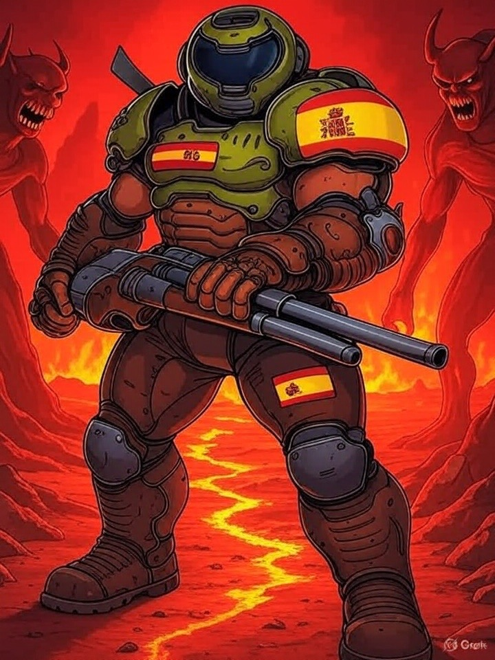

# Index 
# Construyendo la plena inclusión a través del videojuego.

## ¡Bienvenidos a MetsuOS: Videojuegos para Todos!

¿Recuerdas la emoción de tu primer videojuego? Esa chispa de ilusión, la espera interminable hasta Navidad para jugar, o los paseos al quiosco por la última revista de juegos. En MetsuOS, queremos que **todos** puedan sentir esa magia, sin importar sus capacidades o habilidades.

### Un Mundo de Videojuegos Inclusivos

En MetsuOS, creemos que los videojuegos no deberían ser un privilegio para unos pocos. Históricamente, el mundo tecnológico ha dejado fuera a muchas personas con necesidades diversas: problemas de visión, reflejos limitados o dificultades de concentración. **Esto tiene que cambiar**. Nuestra misión es crear videojuegos accesibles que abran las puertas de la diversión y la creatividad a todos los públicos.

### ¿Cómo lo haremos?

Inspirados por iniciativas como APX (Accessible Player Experiences), vamos más allá. MetsuOS combina **accesibilidad**, **ciencia**, **comunicación**, **productividad** y un profundo amor por los videojuegos para desarrollar experiencias inclusivas. Desde estudiar técnicas de diseño accesible hasta optimizar procesos y concienciar a la comunidad, nuestro enfoque es integral y transformador.

### Únete al Viaje

¿Te apasiona la idea de un mundo donde todos puedan disfrutar de los videojuegos? Explora nuestro proyecto y descubre cómo estamos marcando la diferencia:

- **[[Novedades]]**: Mantente al día con los últimos avances y anuncios de MetsuOS.
    
- **[[El Proyecto|Sobre el Proyecto]]**: Conoce nuestra visión, misión y cómo planeamos cambiar el panorama de los videojuegos.
    
- **[Public Brain](https://www.metsuke.com/publicbrain/index.html)**: Participa en nuestra comunidad, comparte ideas y ayúdanos a construir un futuro inclusivo a través de esta base de datos de conocimiento basada en evidencia.

**¡Acompáñanos en esta aventura y hagamos que los videojuegos sean para todos!**

