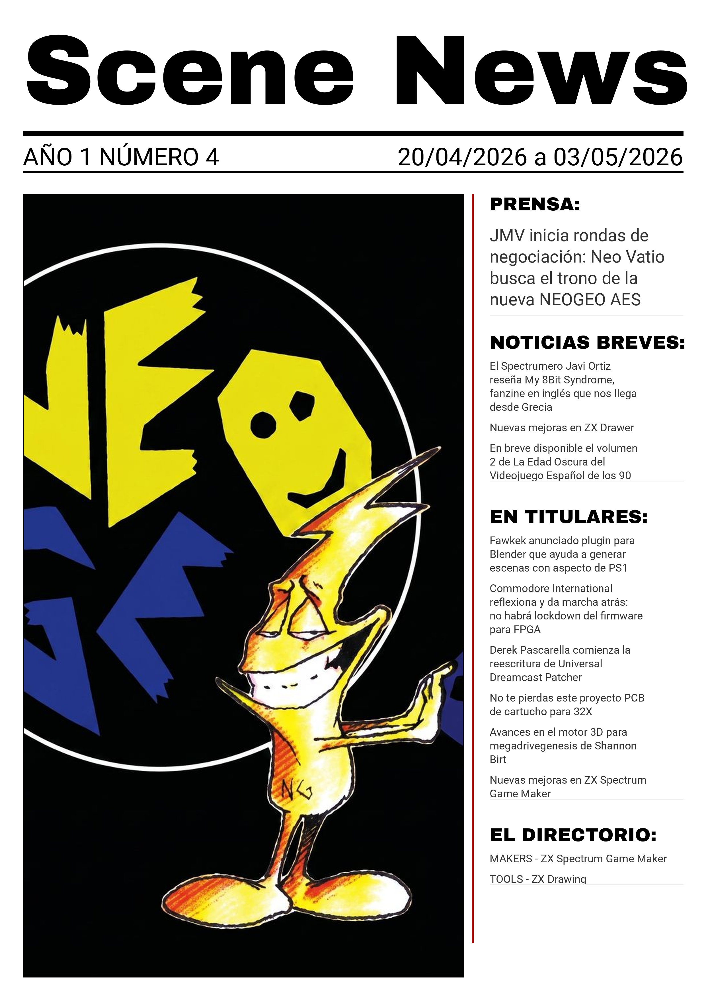
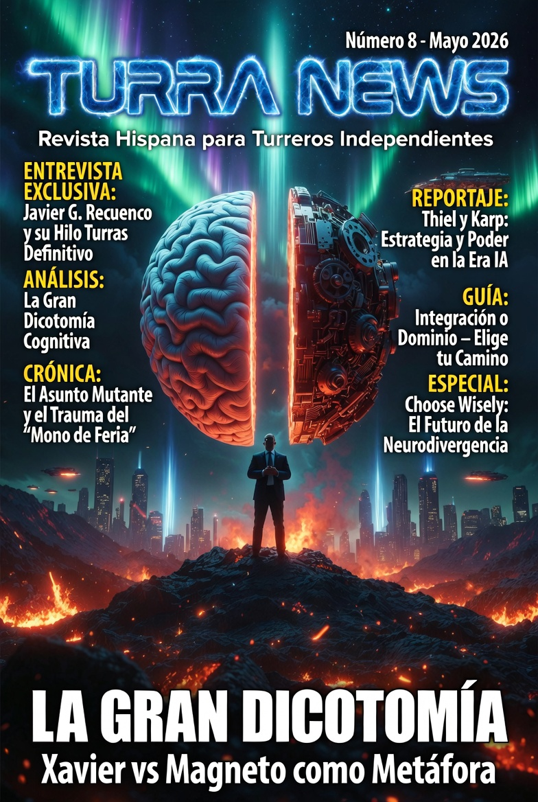
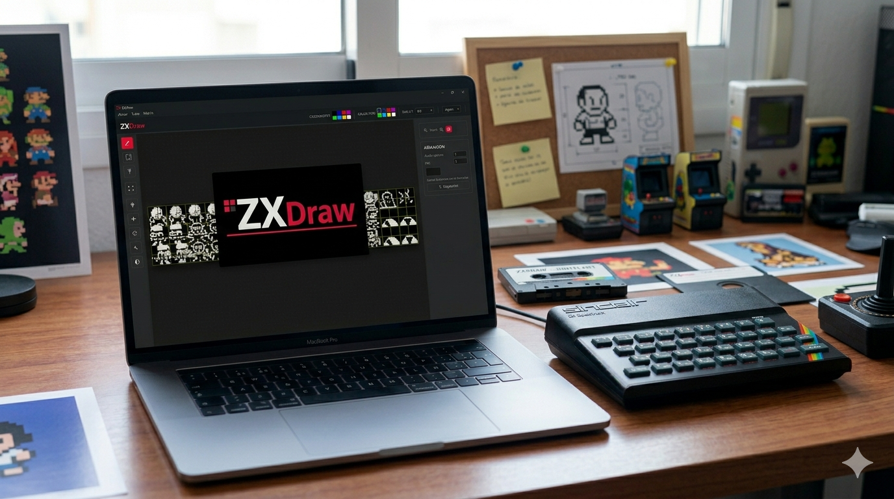

# Index 
# Construyendo la plena inclusión a través del videojuego.

## Cadena Federal

--- start-multi-column: BloqueMicrohobbit01\
```column-settings  
Number of Columns: 2
Border: off
```

	


### Scene News 004

Continua leyendo en ... [[Hemeroteca - Scene News 004]]

--- column-end ---


### Turra News 008

Continua leyendo en ... [[Hemeroteca - Turra News 008 🟡③]]

--- column-end ---


### Reportajes - Lanzamiento de  Perseus para ZX Spectrum 128K: Una aventura épica impulsada por el motor Tuerkas128

Continuar leyendo en ... [[Reportajes - Lanzamiento de Perseus para ZX Spectrum 128K -  Una aventura épica impulsada por el motor Tuerkas128 - 2025-12-26 🟡③]]

--- column-end ---


### MetsuOS - MetsuDepManager – Gestor de Dependencias Ético para MetsuOS 🟡③

Continuyar leyendo en ... [[MetsuDepManager - Visión general del proyecto 🟡③]] y [[Curso sobre desarrollo de un gestor de paquetes python que use poetry como backend 🟡③]]

 --- column-end ---


### Biblioteca - La Biblioteca del Archivero del Retro

Continua leyendo en ... [[La Biblioteca del Archivero del Retro 🟡③]]

--- column-end ---


### Blog - El "Pánico Bromado" Un Análisis Psicohistórico de la Campaña contra el Plástico Negro en la Cocina (2024-2026)

Continua leyendo en ... [[El "Pánico Bromado" Un Análisis Psicohistórico de la Campaña contra el Plástico Negro en la Cocina (2024-2026) 🟡③]]

--- column-end ---


### Ciencia - Conceptos básicos sobre ciencia y su evolución histórica

Continuar leyendo en ... [[Conceptos básicos sobre ciencia y su evolución histórica 🟡③]]

--- column-end ---


### Desarrollo - Introducción al paradigma Spec-Driven Development: más allá del código

Continua leyendo en ... [[Curso SDD 001 - Introducción al paradigma Spec-Driven Development - más allá del código 🟡③]]

--- column-end ---


### Epistemología como arquitectura del saber científico

Continua leyendo en ... [[Epistemología - La Arquitectura del Saber Científico 🟡③]]


--- column-end ---


### Curso sobre Administración de un Negocio Automatizado

Continua leyendo en ... [[Curso sobre Administración de un Negocio Automatizado 🟡③]]

--- column-end ---


### Publicación Editorial - Curso Publicacion de Contenido Editorial como Aventura de Texto

Continuar leyendo en ... [[Curso Publicacion de Contenido Editorial como Aventura de Texto 🟡③]]


--- column-end ---




### Videojuegos - Curso de ZX-Draw

Continuar leyendo en ... [[Curso de ZX-DRAW 🔴②]]

--- column-end ---
--- multi-column-end

## ¿Deseas saber más?


## ¡Bienvenidos a MetsuOS: Videojuegos para Todos!

¿Recuerdas la emoción de tu primer videojuego? Esa chispa de ilusión, la espera interminable hasta Navidad para jugar, o los paseos al quiosco por la última revista de juegos. En MetsuOS, queremos que **todos** puedan sentir esa magia, sin importar sus capacidades o habilidades.

### Un Mundo de Videojuegos Inclusivos

En MetsuOS, creemos que los videojuegos no deberían ser un privilegio para unos pocos. Históricamente, el mundo tecnológico ha dejado fuera a muchas personas con necesidades diversas: problemas de visión, reflejos limitados o dificultades de concentración. **Esto tiene que cambiar**. Nuestra misión es crear videojuegos accesibles que abran las puertas de la diversión y la creatividad a todos los públicos.


### ¿Cómo lo haremos?

Inspirados por iniciativas como APX (Accessible Player Experiences), vamos más allá. MetsuOS combina **accesibilidad**, **ciencia**, **comunicación**, **productividad** y un profundo amor por los videojuegos para desarrollar experiencias inclusivas. Desde estudiar técnicas de diseño accesible hasta optimizar procesos y concienciar a la comunidad, nuestro enfoque es integral y transformador.

### Únete al Viaje

¿Te apasiona la idea de un mundo donde todos puedan disfrutar de los videojuegos? Explora nuestro proyecto y descubre cómo estamos marcando la diferencia:

- **[[Novedades]]**: Mantente al día con los últimos avances y anuncios de MetsuOS.
    
- **[[El Proyecto|Sobre el Proyecto]]**: Conoce nuestra visión, misión y cómo planeamos cambiar el panorama de los videojuegos.
    
- **[Public Brain](https://www.metsuke.com/publicbrain/index.html)**: Participa en nuestra comunidad, comparte ideas y ayúdanos a construir un futuro inclusivo a través de esta base de datos de conocimiento basada en evidencia.


**¡Acompáñanos en esta aventura y hagamos que los videojuegos sean para todos!**


## Mirrors

Dada la deriva autoritaria de diferentes gobiernos y organizaciones como la liga, he empezado a crear mirros que minimicen las opciones de censura, listo los puntos de entrada actuales a continuación:

* [https://metsuke.com](https://metsuke.com)
* [https://metsuke.github.io/web/](https://metsuke.github.io/web/)


