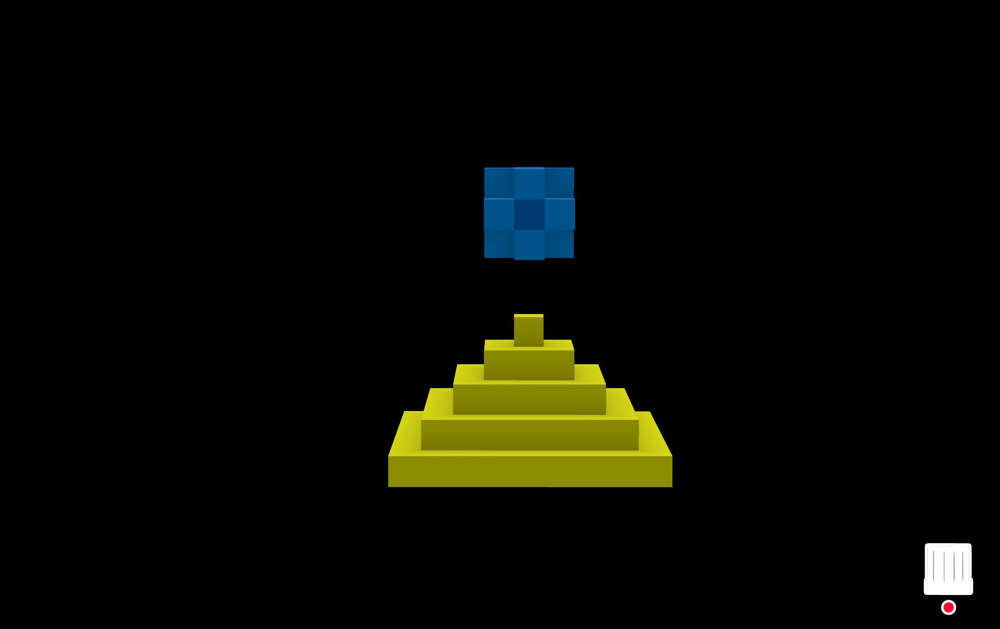

# Index 
# Construyendo la plena inclusión a través del videojuego.


## Comunicación

--- start-multi-column: Region01
```column-settings  
Number of Columns: 2
Border: off
```


 
--- column-end ---


[### Diferénciate mostrando tu verdadero yo](https://metsuke.com/diferenciate-mostrando-tu-verdadero-yo)

 

 --- column-end ---
--- multi-column-end


--- start-multi-column: Region02
```column-settings  
Number of Columns: 2
Border: off
```



[### Dios es Gallego: Del gráfico de Nolan a la Pirámide de Coherentum](https://metsuke.com/dios-es-gallego-del-grafico-de-nolan-a-la-piramide-de-coherentum/)

--- column-end ---


 
 
[### 7 errores graves a evitar cuando vendes online un producto excelente](https://metsuke.com/7-errores-graves-a-evitar-cuando-vendes-online-un-producto-excelente-errores-de-marketing-0/)
 
 --- column-end ---
--- multi-column-end


## Productividad


--- start-multi-column: BloqueProductuvidad01\
```column-settings  
Number of Columns: 2
Border: off
```


 
 --- column-end ---


[### Resolver el cubo de Rubik con el método Fridrich Reducido (avanzado)](https://metsuke.com/metodo-avanzado-fridrich-reducido-para-resolver-el-cubo-de-rubik)


--- column-end ---
--- multi-column-end


--- start-multi-column: BloqueProductividad02\
```column-settings  
Number of Columns: 2
Border: off
```

[### Aprender a resolver el cubo de Rubik: te comparto el tutorial principiante que yo usé para ello.](https://metsuke.com/el-tutorial-principiante-con-el-que-aprendi-a-resolver-el-cubo-de-rubik/)


--- column-end ---

 
 
 --- column-end ---
--- multi-column-end

## Videojuegos

--- start-multi-column: Videojuegos01\
```column-settings  
Number of Columns: 2
Border: off
```


--- column-end ---


 [### Joyas de UAGames: Perched!](https://metsuke.com/joyas-de-uagames-perched)
 
 --- column-end ---
--- multi-column-end


--- start-multi-column: Videojuegos02\
```column-settings  
Number of Columns: 2
Border: off
```

[### The Swordl of Ianna (Código fuente de juegos 1)](https://metsuke.com/the-sword-of-ianna-codigo-fuente-de-juegos-1/)

--- column-end ---

 
 [### The Big Javi's Adventure (2017)](https://metsuke.com/the-big-javis-adventure-2017)
 
 --- column-end ---
--- multi-column-end


