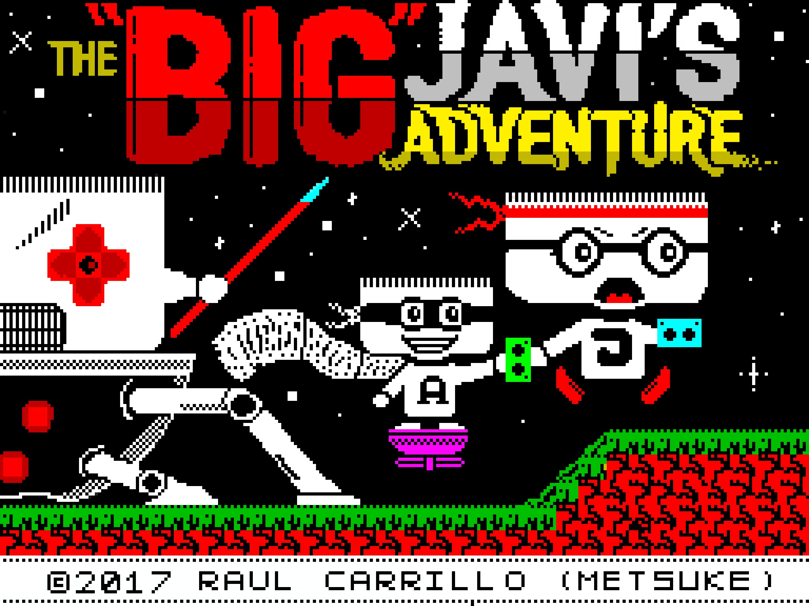
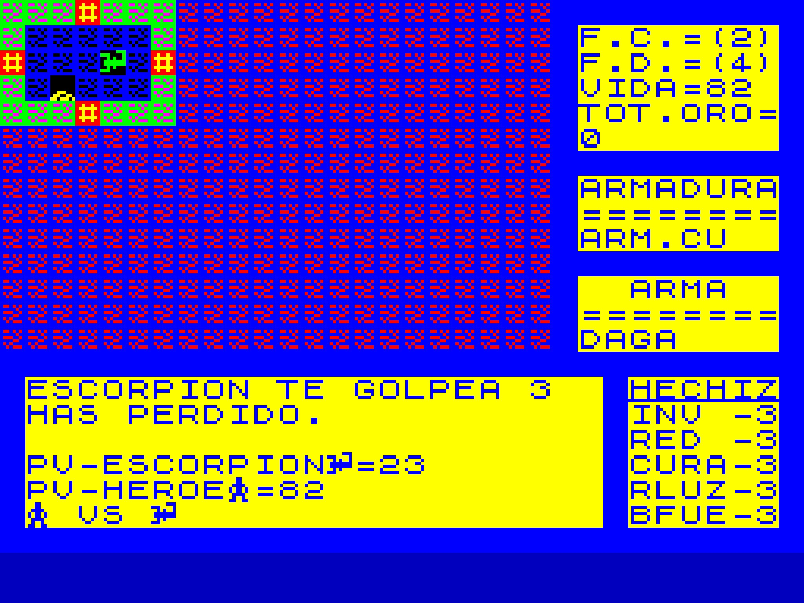
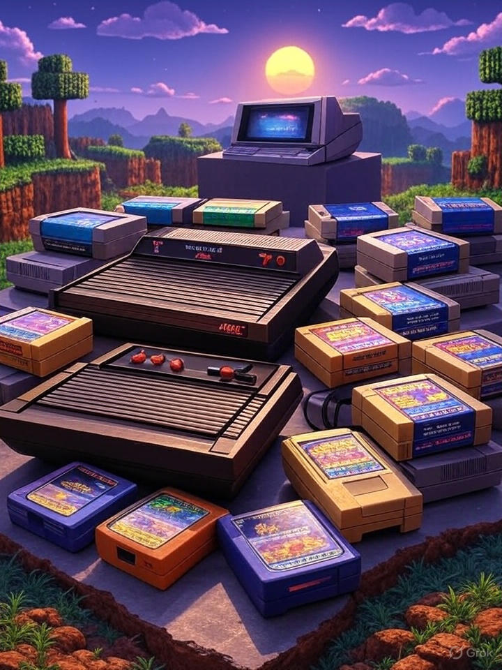

# Juegos

## Publicados

--- start-multi-column: BloqueMicrohobbit00
```column-settings  
Number of Columns: 2
Border: off
```


## The Big Javi's Adventure (ZX Specturm - 2017)


**¡Evita que Vegatrón se haga con el control de EMS!** 

El malvado Vegatrón y sus secuaces han decidido robar a los miembros de El Mundo del Spectrum todo el material para el próximo podcast. Queda en manos del "GRAN" Javi Ortiz encargarse, con la ayuda de A-Hero, de recuperar todo ese manterial mientras el resto del equipo se prepara para el contraataque. 

De ti jugador depende asumir el papel de Javi para recuperar los 60 bloques de información en forma de cintas de cassette, diskettes y hojas impresas, a través de más de 30 pantallas totalmente infestadas de esbirros de Vegatrón.

Continua leyendo en ... [[MOS Games - The Big Javis Adventure - ZX Spectrum - 2017]]
 
--- column-end ---


## Hero Quest (ZX Specturm - 1994)

Hace años, el rey de Daal, tu padre, fue asesinado por el malvado Dalverna mediante un hechizo que drenó su vida. Ahora, a los 21 años, estás listo para reclamar la corona, pero primero debes cumplir una misión: vengar a tu padre y liberar al reino de la tiranía de Dalverna.

Este es un juego de aventuras basado en el código de *Mazmorras y Demonios*, extraído del libro *Juegos Gráficos de Aventura: Técnicas de Diseño* de Richard G. Hurley, publicado por Anaya. El juego original, diseñado para ejecutarse en tiempo real, ha sido adaptado a un sistema por turnos, incorporando trampas, tiendas para adquirir armamento y hechizos, y otras mejoras. 

Continua leyendo en ... [[MOS Games - Hero Quest - ZX Spectrum - 1994]]

 --- column-end ---
--- multi-column-end

## En Desarrollo

--- start-multi-column: BloqueMicrohobbit01\
```column-settings  
Number of Columns: 2
Border: off
```


## MOS Games - Cursed Zapatilla - La Excéntrica Cruzada de Sir Patillas (En desarrollo desde 2025 - Release previsto ¿2026?)

¡Ponte la armadura de Sir Patillas en este emocionante juego de plataformas homenaje a los clásicos _Ghouls 'n Ghosts_, _Ghosts 'n Goblins_ y, especialmente, el naravilloso _Cursed Castilla_! 

Con tus botas de batalla como arma principal, te enfrentarás a zombis, esqueletos y criaturas infernales a base de zapatillazos. En un mundo tétrico pero lleno de color, con cementerios decorados con ...

Continuar leyendo en ... [[MOS Games - Cursed Zapatilla - La Excéntrica Cruzada de Sir Patillas (En desarrollo desde 2025 - Release previsto 2026)]]
 --- column-end ---




## 3971 juegos para dominarlos a todos, un 32 in 1 muy particular

Tres juegos para la Atari 2600 bajo el cielo pixelado, siete para la NES en sus cartuchos dorados, nueve para la Sega Mega Drive en su velocidad condenados, uno para la Commodore 64 en su trono retro sentado, en la tierra de los 8 bits donde los sprites reinan, un juego para gobernarlos a todos, un juego para encontrarlos, un juego para atraerlos a todos y en la nostalgia atarlos, en la tierra de los 8 bits donde los sprites reinan.

¿Y el ZX Spectrum? para ese un 32 in 1 xDDD ... si, probablemente el anillo único me ha hecho perder tantos puntos de cordura que he empezado a usar nudos en cuerdas de esparto para acordarme de las cosas, pero vamos a divertirnos sin miedo, que de eso va la vida, o al menos en parte.

Continua leyendo en ... [[MOS Games - 3791 juegos para dominarlos a todos - un 32 in 1 muy particular  ⚫①]]
 --- column-end ---
--- multi-column-end


![[Plantilla - 1MT#One More Thing]]


