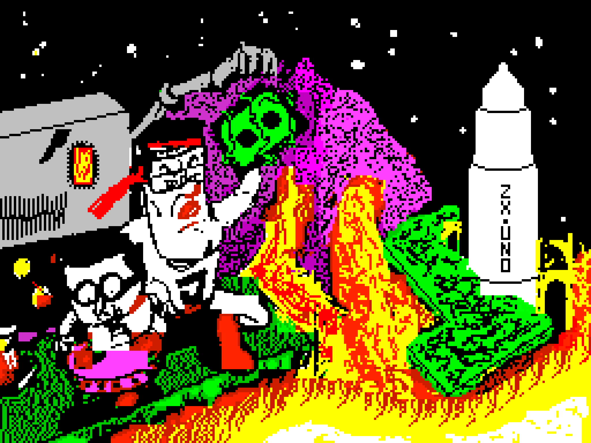

# Juegos

--- start-multi-column: BloqueMicrohobbit00
```column-settings  
Number of Columns: 2
Border: off
```



## The Big Javi's Adventure (ZX Specturm - 2017)


**¡Evita que Vegatrón se haga con el control de EMS!** 

El malvado Vegatrón y sus secuaces han decidido robar a los miembros de El Mundo del Spectrum todo el material para el próximo podcast. Queda en manos del "GRAN" Javi Ortiz encargarse, con la ayuda de A-Hero, de recuperar todo ese manterial mientras el resto del equipo se prepara para el contraataque. 

De ti jugador depende asumir el papel de Javi para recuperar los 60 bloques de información en forma de cintas de cassette, diskettes y hojas impresas, a través de más de 30 pantallas totalmente infestadas de esbirros de Vegatrón.

Continua leyendo en ... [[MOS Games - The Big Javis Adventure - ZX Spectrum - 2017]]
 
--- column-end ---


## Hero Quest (ZX Specturm - 1994)

Hace años, el rey de Daal, tu padre, fue asesinado por el malvado Dalverna mediante un hechizo que drenó su vida. Ahora, a los 21 años, estás listo para reclamar la corona, pero primero debes cumplir una misión: vengar a tu padre y liberar al reino de la tiranía de Dalverna.

Este es un juego de aventuras basado en el código de *Mazmorras y Demonios*, extraído del libro *Juegos Gráficos de Aventura: Técnicas de Diseño* de Richard G. Hurley, publicado por Anaya. El juego original, diseñado para ejecutarse en tiempo real, ha sido adaptado a un sistema por turnos, incorporando trampas, tiendas para adquirir armamento y hechizos, y otras mejoras. 

Continua leyendo en ... [[MOS Games - Hero Quest - ZX Spectrum - 1994]]

 --- column-end ---

--- multi-column-end


--- start-multi-column: BloqueOMT\
```column-settings  
Number of Columns: 1
Border: off
```

![[Plantilla - 1MT#One More Thing]]

 --- column-end ---
--- multi-column-end


