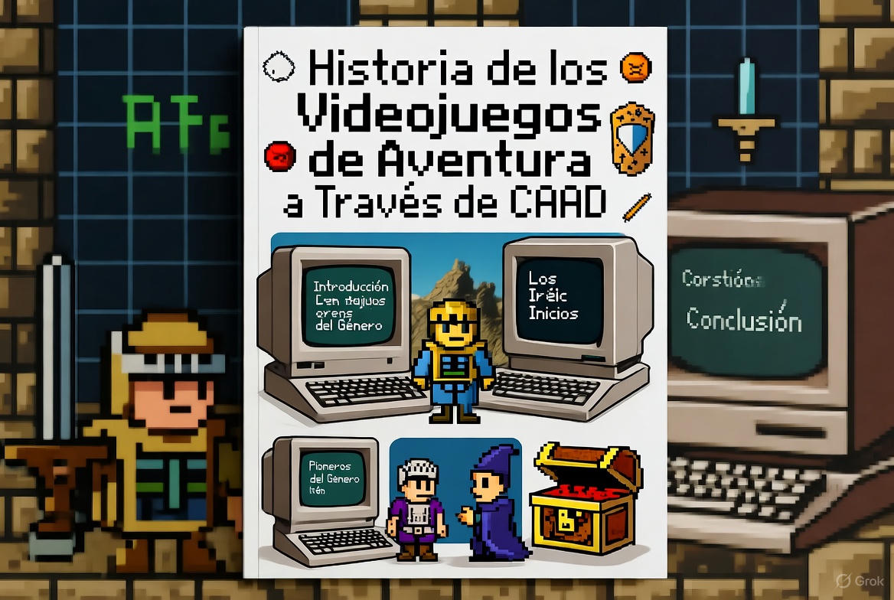
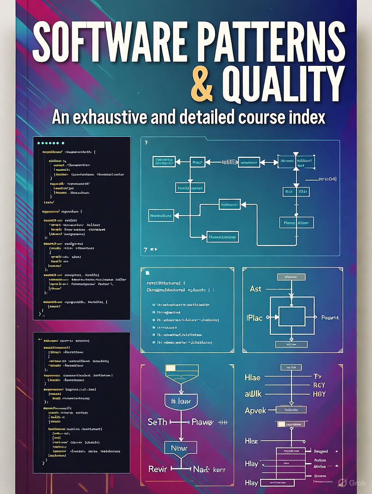
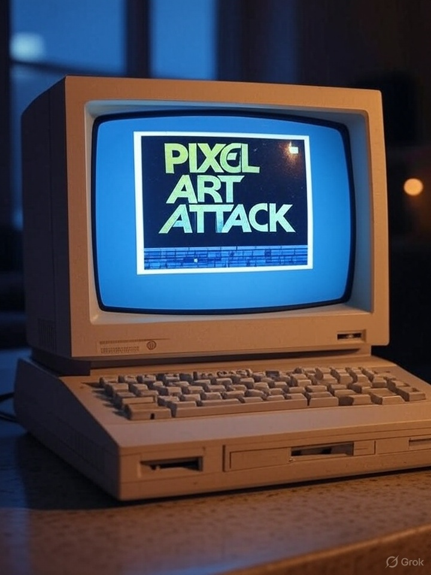

# KB

--- start-multi-column: BloqueMicrohobbit00
```column-settings  
Number of Columns: 2
Border: off
```




## Historia de los videojuegos de aventura a traves de CAAD

En las profundidades de la era dorada del software español, cuando los ordenadores de 8 bits parpadeaban con promesas de mundos imposibles, nació un fanzine que no solo documentó, sino que *tejió* la historia viva de los videojuegos de aventura: **CAAD**. Desde su primer número en 1989 hasta la Tercera Edad digital de 2025, este boletín epistolar, luego foro y ahora archivo interactivo, no es un mero repositorio de soluciones y reseñas: es el **diario de bitácora de una generación** que convirtió la imaginación en código, el parser en poesía y la comunidad en resistencia cultural. Este curso no estudia la aventura —la *vive* a través de sus páginas—, desgranando número por número la evolución de un género que, contra todo pronóstico, sigue desafiando al tiempo.

Continua leyendo en ... [[Historia de los videojuegos de aventura a traves de CAAD  🔴②]]

--- column-end ---


## Curso Patrones y Calidad del Software

En este curso trataremos las cuestiones relacionadas con patrones de diseño y calidad del software. Comenzaremos con las bases e iremos avanzando hacia una serie de prompts de contexto que nos sirvan en nuestro desarrollo en el dia a dia.

Continuar leyendo en ... [[Curso sobre Patrones y Calidad del Software 🔴②]]


--- column-end ---


## Aprendeizaje basado en evidencia

Imagina un camino de aprendizaje donde cada paso que das está guiado por luces que te muestran lo que realmente funciona. 

Eso es el aprendizaje basado en evidencia (EBL, por sus siglas en inglés: Evidence-Based Learning), una aventura educativa en la que usamos datos, investigaciones y experiencias reales para crear momentos de aprendizaje que de verdad conectan contigo. 

No se trata solo de teorías frías; es un enfoque vivo que combina lo mejor de la ciencia con las historias y necesidades únicas de cada estudiante. ¿Te animas a descubrir cómo aprender de una manera más efectiva y personalizada?


Continuar leyendo en ... [[Aprendizaje basado en evidencia  ⚫①]]

--- column-end ---


## Aprender a desarrollar videojuegos

Aprender a desarrollar videojuegos es una aventura apasionante que combina creatividad, tecnología y narrativa. 

Este proceso no solo implica programar, sino también diseñar mundos, personajes e historias que cautiven a los jugadores. Desde pequeños proyectos independientes hasta grandes producciones AAA, el desarrollo de videojuegos ofrece un espacio para explorar ideas innovadoras y conectar con audiencias globales. 

Continuar leyendo en ... [[Aprender a desarrollar videojuegos  ⚫①]]

--- column-end ---


## Galería de Imágenes de Efemérides

En esta sección agrego una pequeña galería de las imáganes de cabecera creadas para las diferentes efemérides de las que hablamos en la cabecera de la web.

¡Espero que la disfruten!

Continuar leyendo en ... [[Galería de Imágenes de Efemétides  ⚫①]]

 --- column-end ---



## Pixel Art Attack - Creando gráficos retro

Esta es una sección que nace del [concepto creado por Igor Errazkin en este video  🌐🟡③](https://www.youtube.com/watch?v=r_t6IBm8-Ac), en el que muestra el paso a paso de una edición pixelart en una conversión de Amiga a ZX-Spectrum.

En mi caso, y con la excusa de que ando creando pantallas, ire añadiendo colecciones de posts en los que ire mostrando el paso a paso de las pantallas que voy creando, por si a alguno de vosotros os sirve para inspiraos, además de servirme a mi como archivo del proceso.

Continuar leyendo en ... [[Pixel Art Attack - Creando gráficos retro ⚫①]]


 --- column-end ---
--- multi-column-end


![[Plantilla - 1MT#One More Thing]]


