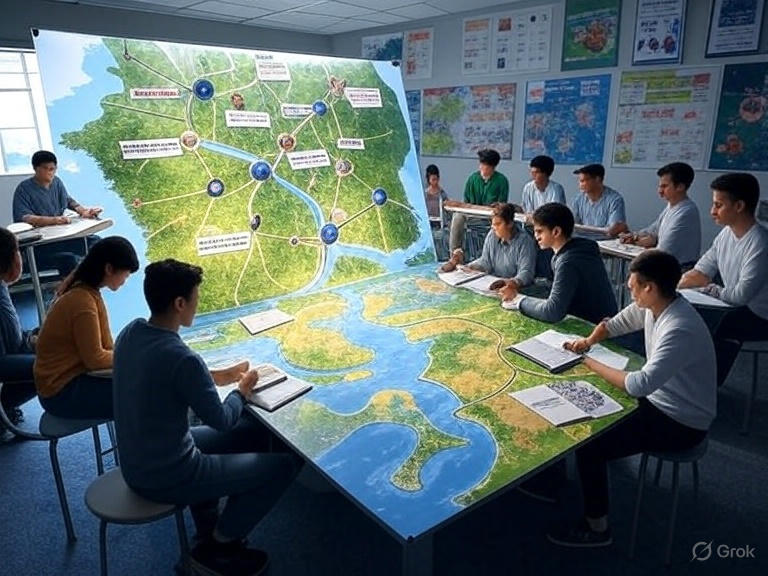
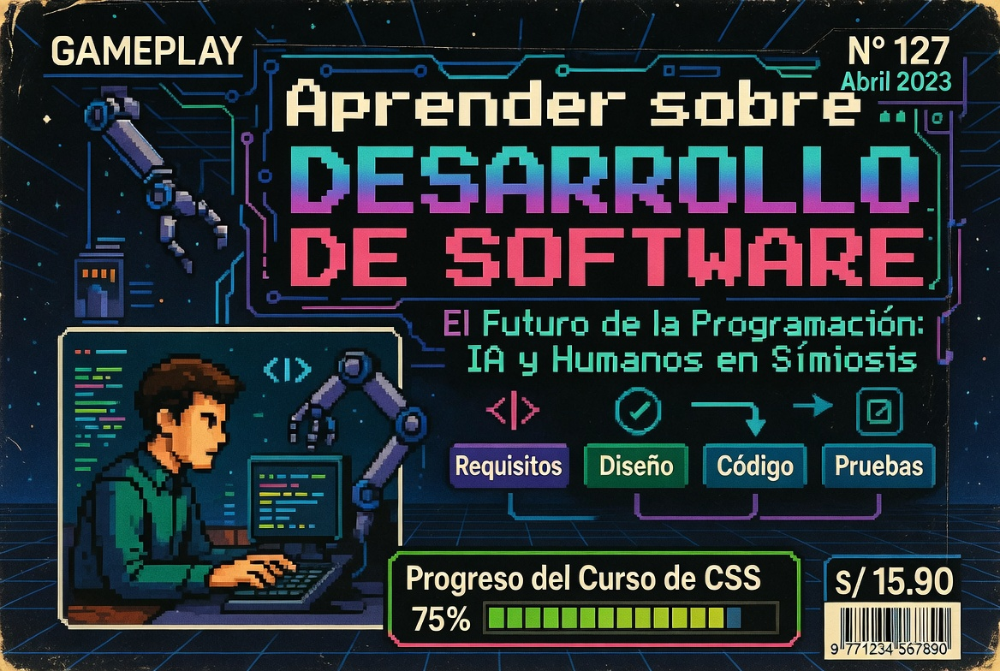
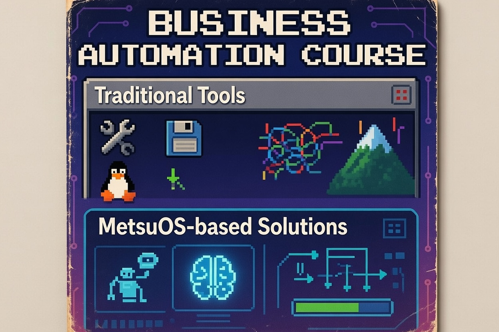
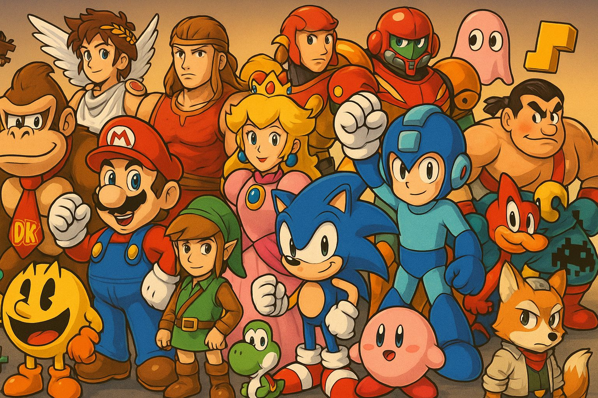
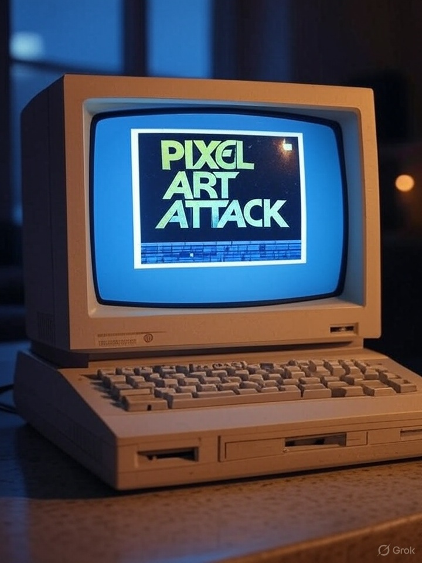

# KB

## Biblioteca


## La Biblioteca del Archivero del Retro

Este proyecto busca crear una base de datos completa y detallada de libros, revistas, juegos, autores, desarrolladores, diseñadores, grafistas, compañias, eventos y, en general todo lo relacionado con la historia del videojuego.

Continua leyendo en ... [[La Biblioteca del Archivero del Retro 🟡③]]


## Ciencia



## Aprendizaje basado en evidencia

Imagina un camino de aprendizaje donde cada paso que das está guiado por luces que te muestran lo que realmente funciona. 

Eso es el aprendizaje basado en evidencia (EBL, por sus siglas en inglés: Evidence-Based Learning), una aventura educativa en la que usamos datos, investigaciones y experiencias reales para crear momentos de aprendizaje que de verdad conectan contigo. 

No se trata solo de teorías frías; es un enfoque vivo que combina lo mejor de la ciencia con las historias y necesidades únicas de cada estudiante. ¿Te animas a descubrir cómo aprender de una manera más efectiva y personalizada?


Continuar leyendo en ... [[Aprendizaje basado en evidencia  ⚫①]]

## Ingenieria


## Aprender sobre Desarrollo de Software

El aprendizaje del desarrollo de software hoy no consiste en memorizar comandos, sino en heredar el **legado intelectual** que la humanidad ha construido bit a bit. Esta sección nace de una convicción: la Inteligencia Artificial no es un sustituto del intelecto, sino un espejo de nuestro conocimiento acumulado.

Continua leyendo en ... [[Aprender sobre Desarrollo de Software 🟡③]]

## Negocios

--- start-multi-column: BloqueMicrohobbit01\
```column-settings  
Number of Columns: 2
Border: off
```


## Curso sobre Estructura e Implementación NO Automatizada de un Negocio

Este curso está pensado para emprendedores, dueños de pequeñas empresas y profesionales que desean construir y dirigir un negocio de manera manual y colaborativa, centrándose en el factor humano. 

Se inspira en enfoques automatizados, pero se adapta completamente a un modelo donde las personas son el eje principal. Definimos roles claros, habilidades necesarias, flujos de trabajo en equipo, herramientas de software **libre** (priorizando licencias GNU GPL o MIT; solo excepciones justificadas si no existe alternativa adecuada), y protocolos de documentación para mantener todo coordinado. 

Cada sección incluye una nota breve sobre cómo se podría automatizar, solo como complemento.

Continua leyendo en ... [[Curso sobre Estructura e Implementación NO Automatizada de un Negocio 🟡③]]

--- column-end ---


## Curso sobre estructura e implementación automática de un negocio

Este curso está diseñado para emprendedores, dueños de negocios y profesionales que buscan optimizar y escalar sus operaciones mediante automatización. El enfoque principal es comparar métodos habituales con herramientas actuales (como Make, n8n, Zapier o plataformas comerciales) con la implementación en accesibilidad y la IA distribuida.

Continua leyendo en ... [[Curso sobre estructura e implementación automática de un negocio 🟡③]]

--- column-end ---


## Estructurar una Microagencia de Marketing Digital 

Inspirado en este [[Curso de Platzi sobre Estructurar una Microagencia de Marketing Digital 🔴②]] estoy desarrollando mi metodología sobre habilidades, perfiles y tareas para MetsuOS tomando como base lo aprendido en este curso, para posteriormente integrar mas conocimientos.

[[Estructurar una Microagencia de Marketing Digital 🟡③]]


 --- column-end ---
--- multi-column-end

## Videojuegos

--- start-multi-column: BloqueMicrohobbit01\
```column-settings  
Number of Columns: 2
Border: off
```


## Aprender a desarrollar videojuegos

Aprender a desarrollar videojuegos es una aventura apasionante que combina creatividad, tecnología y narrativa. 

Este proceso no solo implica programar, sino también diseñar mundos, personajes e historias que cautiven a los jugadores. Desde pequeños proyectos independientes hasta grandes producciones AAA, el desarrollo de videojuegos ofrece un espacio para explorar ideas innovadoras y conectar con audiencias globales. 

Continuar leyendo en ... [[Aprender a desarrollar videojuegos  ⚫①]]

--- column-end ---



## Galería de Imágenes de Efemérides

En esta sección agrego una pequeña galería de las imáganes de cabecera creadas para las diferentes efemérides de las que hablamos en la cabecera de la web.

¡Espero que la disfruten!

Continuar leyendo en ... [[Galería de Imágenes de Efemérides  ⚫①]]

 --- column-end ---



## Pixel Art Attack - Creando gráficos retro

Esta es una sección que nace del [concepto creado por Igor Errazkin en este video  🌐🟡③](https://www.youtube.com/watch?v=r_t6IBm8-Ac), en el que muestra el paso a paso de una edición pixelart en una conversión de Amiga a ZX-Spectrum.

En mi caso, y con la excusa de que ando creando pantallas, ire añadiendo colecciones de posts en los que ire mostrando el paso a paso de las pantallas que voy creando, por si a alguno de vosotros os sirve para inspiraos, además de servirme a mi como archivo del proceso.

Continuar leyendo en ... [[Pixel Art Attack - Creando gráficos retro ⚫①]]

 --- column-end ---
--- multi-column-end


![[Plantilla - 1MT#One More Thing]]


