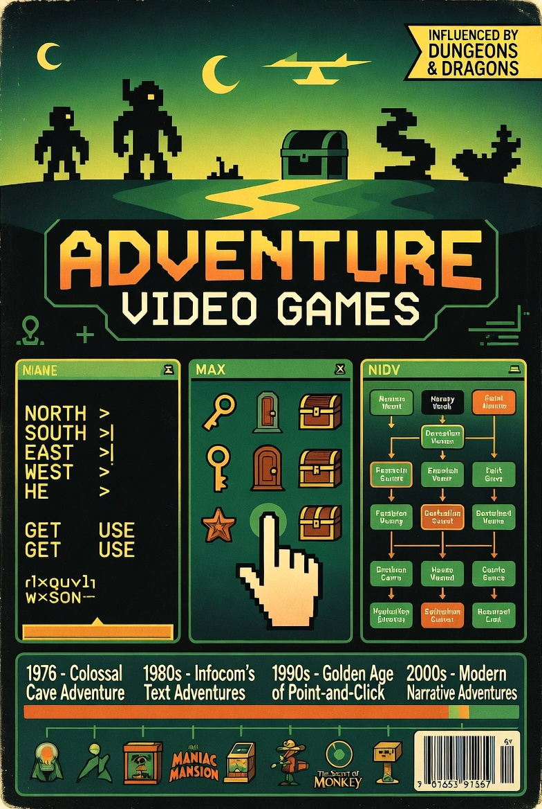
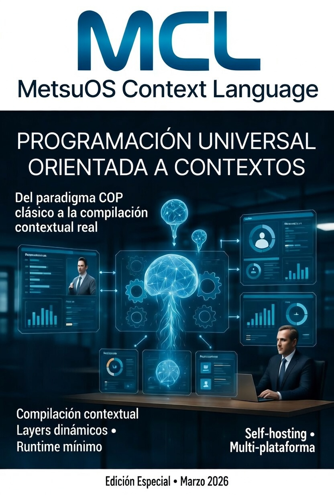
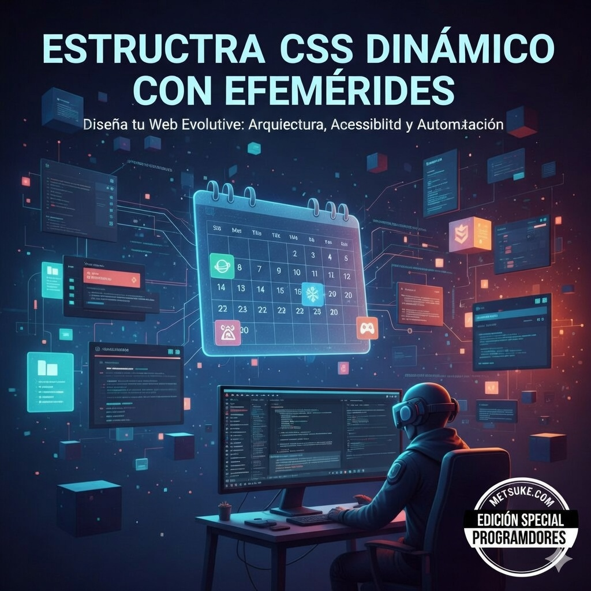
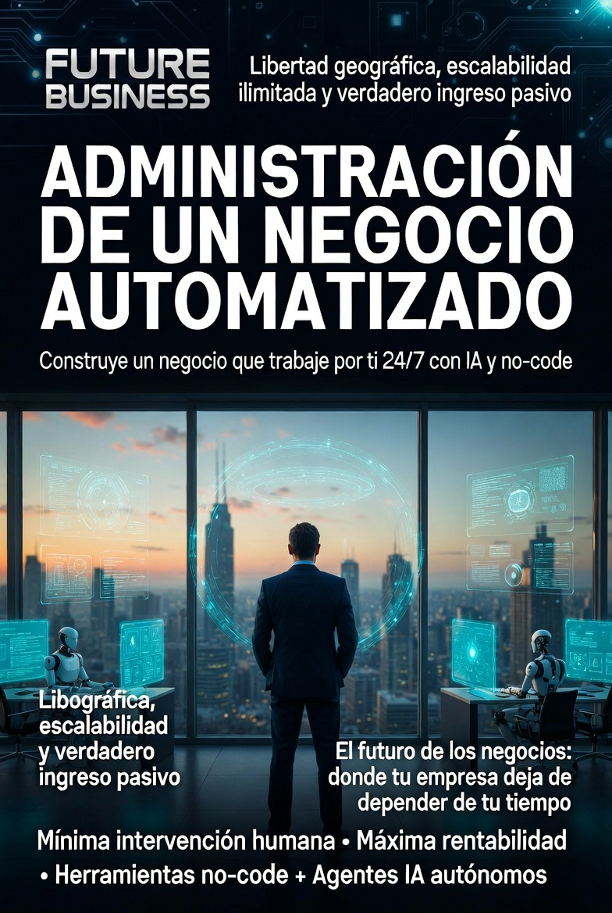
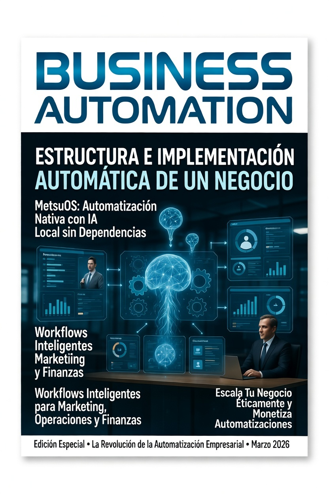

# KB

## Biblioteca


--- start-multi-column: BloqueMicrohobbit01\
```column-settings  
Number of Columns: 2
Border: off
```


## La Biblioteca del Archivero del Retro

Este proyecto busca crear una base de datos completa y detallada de libros, revistas, juegos, autores, desarrolladores, diseñadores, grafistas, compañias, eventos y, en general todo lo relacionado con la historia del videojuego.

Continua leyendo en ... [[La Biblioteca del Archivero del Retro 🟡③]]

 --- column-end ---



### Lección 1.1: Concepto Histórico y Delimitación del Género

Exploramos el núcleo del género: juegos que priorizan la resolución de enigmas y el desarrollo de historias, diferenciándolos de híbridos como *The Legend of Zelda*, que incorporan elementos de acción.

[[Curso Historia Mundial de los Videojuegos de Aventura 001 - Concepto Histórico y Delimitación del Género 🟡③]]

 --- column-end ---
--- multi-column-end


## Ciencia

--- start-multi-column: BloqueMicrohobbit01\
```column-settings  
Number of Columns: 2
Border: off
```


## Aprendizaje basado en evidencia

Imagina un camino de aprendizaje donde cada paso que das está guiado por luces que te muestran lo que realmente funciona. 

Eso es el aprendizaje basado en evidencia (EBL, por sus siglas en inglés: Evidence-Based Learning), una aventura educativa en la que usamos datos, investigaciones y experiencias reales para crear momentos de aprendizaje que de verdad conectan contigo. 

No se trata solo de teorías frías; es un enfoque vivo que combina lo mejor de la ciencia con las historias y necesidades únicas de cada estudiante. ¿Te animas a descubrir cómo aprender de una manera más efectiva y personalizada?


Continuar leyendo en ... [[Aprendizaje basado en evidencia  ⚫①]]

 --- column-end ---


## Historia de la Epistemología y su aplicación en la Ciencia

Te invito a un fascinante recorrido por la historia de la epistemología, desde sus raíces filosóficas hasta su impacto en la ciencia moderna. Exploraremos cómo las teorías del conocimiento han dado forma a las prácticas científicas y cómo los descubrimientos científicos han transformado, a su vez, nuestra comprensión del saber. 

Combinando un enfoque histórico con aplicaciones prácticas, trataré de fomentar la reflexión crítica y la conexión entre disciplinas, preparando a todo aquel capaz de aceptar el reto para analizar el conocimiento científico en un mundo complejo.

Continuar leyendo en [[Historia de la Epistemología y su aplicación en la Ciencia 🟡③]]

 --- column-end ---
--- multi-column-end


## Ingenieria


--- start-multi-column: BloqueMicrohobbit01\
```column-settings  
Number of Columns: 2
Border: off
```




## Curso e introducción técnica sobre  MCL (MetsuOS Context Language)

**MCL** (MetsuOS Context Language) es un lenguaje de programación de alto nivel con sintaxis natural que convierte el **contexto** en una entidad de primera clase a lo largo de todo el ciclo de vida del software: desde el diseño y la compilación hasta la ejecución.

Continua leyendo en ... [[Curso e introducción técnica sobre  MCL (MetsuOS Context Language) 🟡③]]

--- column-end ---


## Aprender sobre Desarrollo de Software

El aprendizaje del desarrollo de software hoy no consiste en memorizar comandos, sino en heredar el **legado intelectual** que la humanidad ha construido bit a bit. Esta sección nace de una convicción: la Inteligencia Artificial no es un sustituto del intelecto, sino un espejo de nuestro conocimiento acumulado.

Continua leyendo en ... [[Aprender sobre Desarrollo de Software 🟡③]]

 --- column-end ---



## Curso Estructura de CSS Dinámico con Efemérides

**Arquitectura de Sistemas Mutables, Accesibilidad Universal y Automatización**

Este curso propone un viaje técnico desde la rigidez de una estructura base inamovible hasta la fluidez estética de las efemérides. Aprenderemos a diseñar interfaces que "recuerdan" fechas especiales, mutando su piel sin comprometer la semántica ni la accesibilidad para ningún usuario.

Continua leyendo en ... [[Curso Estructura de CSS Dinámico con Efemérides 🟡③]]

 --- column-end ---
--- multi-column-end


## Negocios

--- start-multi-column: BloqueMicrohobbit01\
```column-settings  
Number of Columns: 2
Border: off
```



## Curso sobre Administración de un Negocio Automatizado

**En un mundo donde el tiempo se ha convertido en el recurso más valioso, la administración de un negocio automatizado representa la forma más inteligente y liberadora de emprender en la era digital.** Este curso te enseñará, paso a paso y de forma práctica, cómo diseñar, lanzar y gestionar un negocio que genera ingresos de manera prácticamente automática, con la mínima intervención humana diaria. A lo largo de estas semanas aprenderás a combinar las mejores herramientas *no-code*, la inteligencia artificial, sistemas de automatización y estrategias probadas para crear un sistema empresarial que trabaje por ti las 24 horas, los 7 días de la semana. Mientras tanto, tú podrás disfrutar de libertad geográfica, escalabilidad ilimitada y un verdadero ingreso pasivo.  

Continua leyendo en ... [[Curso sobre Administración de un Negocio Automatizado 🟡③]]

--- column-end ---


## Curso sobre Estructura e Implementación NO Automatizada de un Negocio

Este curso está pensado para emprendedores, dueños de pequeñas empresas y profesionales que desean construir y dirigir un negocio de manera manual y colaborativa, centrándose en el factor humano. 

Se inspira en enfoques automatizados, pero se adapta completamente a un modelo donde las personas son el eje principal. Definimos roles claros, habilidades necesarias, flujos de trabajo en equipo, herramientas de software **libre** (priorizando licencias GNU GPL o MIT; solo excepciones justificadas si no existe alternativa adecuada), y protocolos de documentación para mantener todo coordinado. 

Cada sección incluye una nota breve sobre cómo se podría automatizar, solo como complemento.

Continua leyendo en ... [[Curso sobre Estructura e Implementación NO Automatizada de un Negocio 🟡③]]

--- column-end ---


## Curso sobre estructura e implementación automática de un negocio

Este curso está diseñado para emprendedores, dueños de negocios y profesionales que buscan optimizar y escalar sus operaciones mediante automatización. El enfoque principal es comparar métodos habituales con herramientas actuales (como Make, n8n, Zapier o plataformas comerciales) con la implementación en accesibilidad y la IA distribuida.

Continua leyendo en ... [[Curso sobre estructura e implementación automática de un negocio 🟡③]]

--- column-end ---


## Estructurar una Microagencia de Marketing Digital 

Inspirado en este [[Curso de Platzi sobre Estructurar una Microagencia de Marketing Digital 🔴②]] estoy desarrollando mi metodología sobre habilidades, perfiles y tareas para MetsuOS tomando como base lo aprendido en este curso, para posteriormente integrar mas conocimientos.

Continuar leyendo en ... [[Estructurar una Microagencia de Marketing Digital 🟡③]]


 --- column-end ---
--- multi-column-end

## Publicación Editorial

--- start-multi-column: BloqueMicrohobbit01\
```column-settings  
Number of Columns: 2
Border: off
```


## Curso Publicacion de Contenido Editorial como Aventura de Texto

Este curso te invita a sumergirte en el fascinante mundo de la publicación editorial transformada en aventuras de texto, un formato que convierte la lectura tradicional en una experiencia interactiva y envolvente. Imagina adaptar tus posts, artículos, libros o revistas a narrativas donde el lector toma decisiones que alteran el rumbo de la historia, todo ello en plataformas tanto retro como modernas, y enriquecido con elementos multimedia cuando sea posible. Es una oportunidad perfecta para creativos que quieran fusionar escritura, diseño y tecnología, desarrollando habilidades que innoven en el panorama digital actual. Si te apasiona contar historias de manera dinámica, este curso te ayudará a dar vida a tus ideas de forma original y atractiva.

Continuar leyendo en ... [[Curso Publicacion de Contenido Editorial como Aventura de Texto 🟡③]]

 --- column-end ---


 --- column-end ---
--- multi-column-end


## Videojuegos

--- start-multi-column: BloqueMicrohobbit01\
```column-settings  
Number of Columns: 2
Border: off
```


## Aprender a desarrollar videojuegos

Aprender a desarrollar videojuegos es una aventura apasionante que combina creatividad, tecnología y narrativa. 

Este proceso no solo implica programar, sino también diseñar mundos, personajes e historias que cautiven a los jugadores. Desde pequeños proyectos independientes hasta grandes producciones AAA, el desarrollo de videojuegos ofrece un espacio para explorar ideas innovadoras y conectar con audiencias globales. 

Continuar leyendo en ... [[Aprender a desarrollar videojuegos  ⚫①]]

--- column-end ---


## Galería de Imágenes de Efemérides

En esta sección agrego una pequeña galería de las imáganes de cabecera creadas para las diferentes efemérides de las que hablamos en la cabecera de la web.

¡Espero que la disfruten!

Continuar leyendo en ... [[Galería de Imágenes de Efemérides  ⚫①]]

 --- column-end ---


## Pixel Art Attack - Creando gráficos retro

Esta es una sección que nace del [concepto creado por Igor Errazkin en este video  🌐🟡③](https://www.youtube.com/watch?v=r_t6IBm8-Ac), en el que muestra el paso a paso de una edición pixelart en una conversión de Amiga a ZX-Spectrum.

En mi caso, y con la excusa de que ando creando pantallas, ire añadiendo colecciones de posts en los que ire mostrando el paso a paso de las pantallas que voy creando, por si a alguno de vosotros os sirve para inspiraos, además de servirme a mi como archivo del proceso.

Continuar leyendo en ... [[Pixel Art Attack - Creando gráficos retro ⚫①]]

 --- column-end ---
--- multi-column-end


![[Plantilla - 1MT#One More Thing]]


