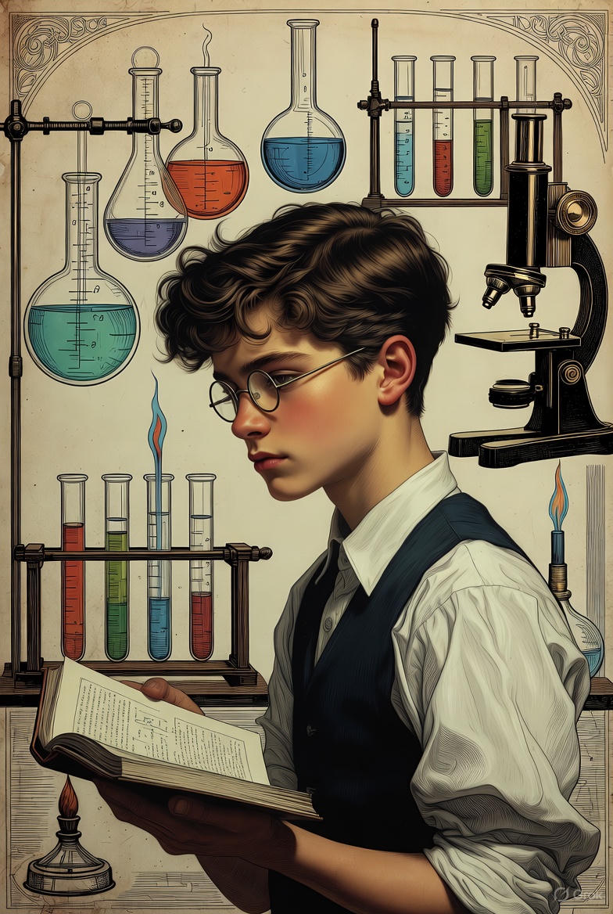
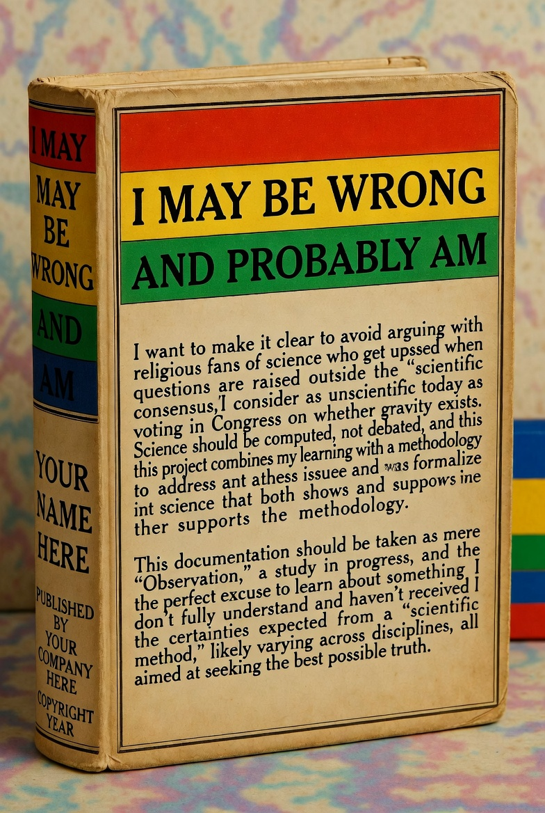
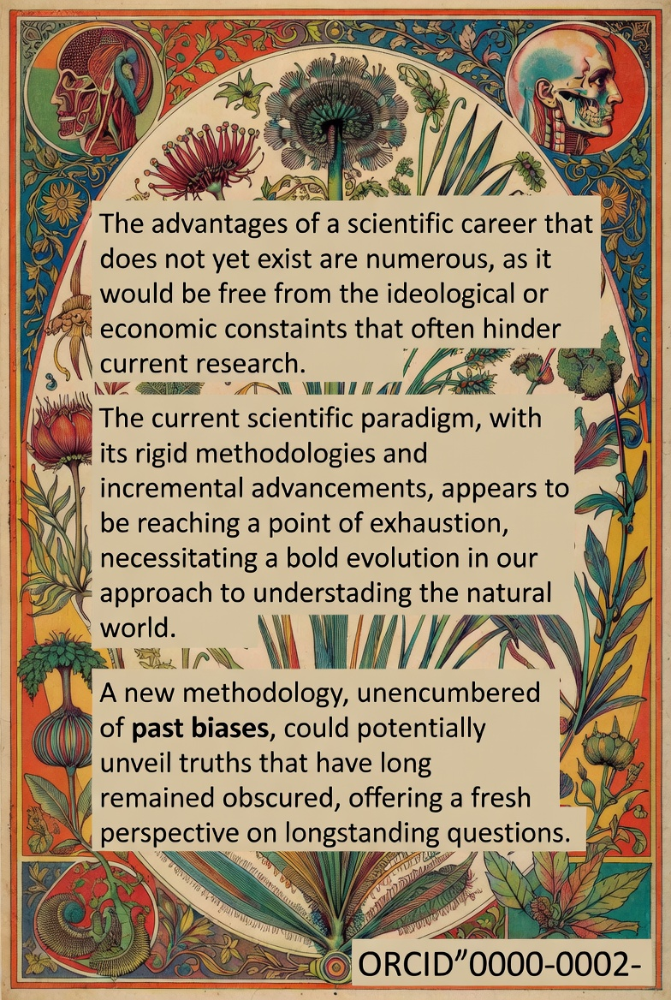
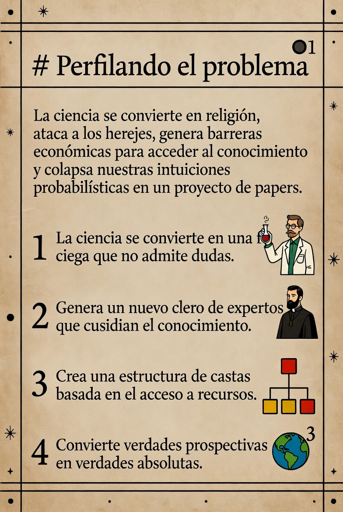
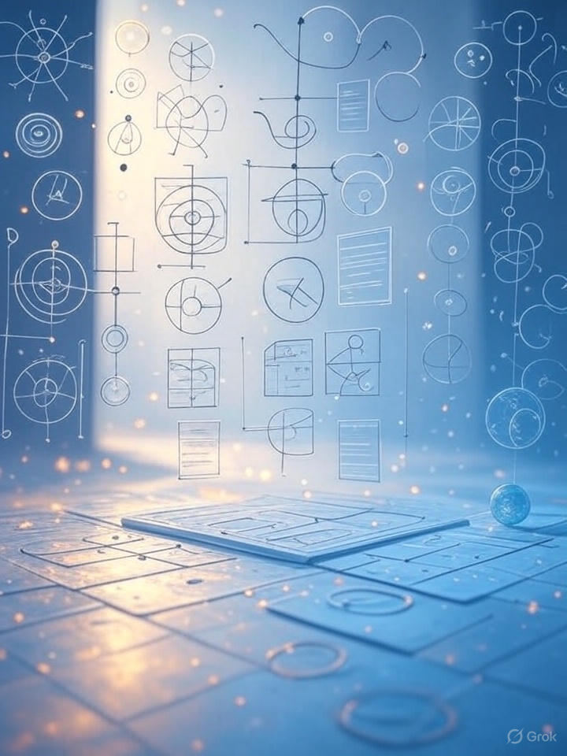

# NPL



* Estado actual del proyecto  ⚫①
* Project: New Probabilistic Language
* Codename: Napalm

Arrancamos en este sección un proyecto en torno al cual llevo dando vueltas durante algunos años, tengo la percepción - personal y por ahora no reproducible y respaldada por pares de intuiciones - de que la ciencia se enseña mal, como el inglés, y que esa forma erronea de enseñarla está convirtiendo la ciencia en una herramienta de pura geopolítica, y no en la disciplina que aporta luz y conocimiento a la humanidad que creo firmemente que deberia ser  ⚫①

> Este proyecto lleva un punto más allá de lo que se viene haciendo en el resto de la web, en lugar de limitarse a indicar un grado de credibilidad del documento completo, bajamos a nivel de parrafo, un paso más para explorar la construcción de conocimiento mediante agregación de sentencias que se conviertan en conjuntos de ideas falsables  ⚫①


## Un poco de contexto intelectual  ⚫①

Vaya por delante: PUEDO ESTAR EQUIVOCADO Y PROBABLEMENTE LO ESTÉ. Quiero dejarlo claro para no tener que entrar a discutir con los fanáticos religiosos de la ciencia de turno, que se rasgan las vestiduras cuando se plantean cuestiones fuera del recipiente del "consenso cientifico" que, dicho sea de paso considero en la actualidad tan anticientífico como votar en el congreso si existe la gravedad.  ⚫①

Derivado de lo anterior, mi percepción de que la ciencia debe computarse no debatirse, ya veremos si puedo respaldar la afirmación en el proceso o no, pero desde luego es mi punto de partida, junto con la idea de que este proyecto es un proceso que auna mi aprendizaje, con la metodología que pretendo desarrollar para evitar todos estos problemas que describo y tornarlo en ciencia formal que al mismo tiempo de mostrar la metodología, la respalde adecuadamente.   ⚫①

> Es importante observar que esta documentación deberia tomarse por ahora como mera "Observación", en proceso de estudio, y la "excusa" perfecta para aprender en el proceso sobre algo que no acabo de comprender y de lo que tampoco he recibido las certezas exigibles a un "metodo cientifico" (que muy probablemente sean varios, tantos como disciplinas) supuestamente orientado a la busqueda de la mejor verdad posible.  ⚫①


## Mi inexistente carrera científica, es una ventaja  ⚫①

> Ojo, no estoy negando en modo alguno las evidentes virtudes y logros de la ciencia actual y, sin embargo, si creo que - muy al estilo Kuhn - el paradigma actual da claras muestras de agotamiento y que parece está ignorando fuertemente las - en mi opinión - evidentes señales de que algo no encaja con como se lleva a la práctica actualmente y que es hora de evolucionarlo.  ⚫①

Veremos si estoy en lo cierto y logro falsar las partes que creo no funcionan de como se hace ciencia hoy dia y, en especial, como los conocimientos supuestamente adquiridos van destinados a engordar curriculumns - de nuevo en mi opnión - mal calculados por generar incentivos directamente contrarios al avance del conocimiento y poniendolo en manos de unos actores ideológicos y/o económicos mas orientados en frenar el avance para exprimir la vaca esférica, que en permitir avanzar a la humanidad  ⚫①

Debido a todo ello, el hecho de que todo esto surja primordialmente para aprender si estoy en lo cierto o no y en su caso proponer una metodología que mejore la situacion, y mi inexistente carrera científica, constituyen una ventaja absoluta, pues nada debo a nadie mas que a mi propia búsqueda de conocimiento lo cual, a mi modo de ver, es precisamente lo que deberia definir la ciencia y en buena medida, guiar sus aplicaciones.  ⚫①

Por ahora, lo unico que existe de mi como futuro aprendiz de estudiante de científico, resulta ser [mi identificador ORCID 🟡③🌐](https://orcid.org/0000-0003-3054-6584), y - salvo que lo que aprenda me lleve a concluior que no debe ser así - lugar donde habrá acceso a lo que llegue a publicar oficialmente  ⚫①


## Perfilando el problema  ⚫①

Creo que el metodo que se está empleando para divulgar es mas cercano a la religión, atacando al """hereje""" que a una metodología seria y consciente de sus limitaciones para buscar la mejor verdad posible, la actitud soberbia de la comunidad y las barreras economicas al conocimiento adquirido alejan aún más la ciencia y sus consecuencias del avance humano hacia el conocimiento  ⚫①

En su lugar lo convierten en una suerte de religión politeista difusa en manos de un aparato clerical con pasta como para pagar papers a decenas y, del mismo modo que las patentes, lejos de limitarse a formentar el conocimiento público, blindan el abuso privado  ⚫①

Ante un stablishment mas preocupado de hacer pasta aprovechando la ignorancia ajena para venderles soluciones fáciles, que en fomentar el conocimiento general, y poniendo a aquel que discrepa directamente en la picoita - que se lo digan a Galileo - creo que la ciencia está sumándose - quizá de forma no consciente - a las filas del fanatismo ideológico, agravando el problema - el del pensamiento único - que en parte nació para solventar  ⚫①

La nube probabilistica de intuiciones, ideas y conceptos, empezó a colapsar en este proyecto de paper (o conjunto de ellos), de forma algo indirecta, [buscando un nombre para lo que llamaré por ahora "verdad prospectiva"  🟡③🌐](https://x.com/metsuke/status/1999381526258094444?s=20), me pidieron aclaración y traté de [explicar el conceppto en forma de hilo turra 🟡③🌐](https://x.com/metsuke/status/1999532856117256417?s=20)  ⚫①

No me habia dado cuenta hasta ese momento, del alcance conceptual de todo esto que, con independencia de lo acertado o no de mis conclusiones, es resultado de toda una vida buscando quien tenia razón en un marasmo intelectual de ideologias, religiones, sectas y depredadores varios, para concluir que ninguno y que incluso la ciencia está imbuida de cierto grado de fanatismo que deberiamos revisar con atención  ⚫①

**Siguientes pasos (TO-DO):** 

* Carta abierta respondiendo a las [preguntas de Cesar Astudillo  🟡③🌐](https://x.com/cesarastudillo/status/2000114072679858505?s=20)
* Mejora de la explicación formal del problema (la del hilo), en forma de documento/s , mejorada. Yo tengo claro a donde voy, pero eso no es suficiente, aún debo explicarlo mejor si pretendo crear hipotesis falsables. 
* Formalización semántica profunda y preparación formal del [debate sobre nomenclatura con Javier Recuenco 🟡③🌐](https://x.com/Recuenco/status/1999391512313143766?s=20)
* Revisión, priorización, estudio y análisis de [la bibliografía propuesta por Oscar Teixidó 🟡③🌐](https://x.com/Oscar_Teix/status/2000160771532329263?s=20) de nuevo, gracias.
* Mejorar estructura de frentes de estudio, analisis bibliográfico, estructura del conocimiento .. etc etc etc

## Puntas de lanza de estudio actual  ⚫①

Tomando en consideración que todo lo siguiente son cursos y documentos EN DESARROLLO que estoy creando al mismo tiempo que aprendo, los frentes activos por ahora son:  ⚫①

--- start-multi-column: BloqueMicrohobbit01\
```column-settings  
Number of Columns: 2
Border: off
```


## Historia de la Epistemología y su aplicación en la Ciencia

Te invito a un fascinante recorrido por la historia de la epistemología, desde sus raíces filosóficas hasta su impacto en la ciencia moderna. Exploraremos cómo las teorías del conocimiento han dado forma a las prácticas científicas y cómo los descubrimientos científicos han transformado, a su vez, nuestra comprensión del saber. 

Combinando un enfoque histórico con aplicaciones prácticas, trataré de fomentar la reflexión crítica y la conexión entre disciplinas, preparando a todo aquel capaz de aceptar el reto para analizar el conocimiento científico en un mundo complejo.

Continuar leyendo en [[Historia de la Epistemología y su aplicación en la Ciencia 🟡③]]

 --- column-end ---


## Historia de la Ciencia y del Método Científico

La ciencia representa una de las aventuras más fascinantes de la humanidad, un proceso sistemático para comprender el mundo que nos rodea. El método científico, por su parte, es el conjunto de pasos lógicos y rigurosos que guían esta exploración, evolucionando a lo largo de los siglos. 

En esta sección, exploraremos los conceptos básicos sobre la ciencia y su desarrollo histórico, distinguiendo entre ciencia pura, tecnología aplicada y otras formas de conocimiento, como la filosofía o la tradición oral.

Continuar leyendo en ... [[Historia de la Ciencia y del Método Científico 🟡③]]

--- column-end ---

 --- column-end ---
--- multi-column-end

## Estudio de Autores

--- start-multi-column: BloqueMicrohobbit01\
```column-settings  
Number of Columns: 2
Border: off
```


## Estudio Autor: Lakatos, Imre

Imre Lakatos (1922-1974) es una figura clave en la filosofía de la ciencia y las matemáticas, célebre por su **Metodología de los Programas de Investigación Científica (MPIC)** y su obra _Proofs and Refutations_. Estas contribuciones transformaron nuestra comprensión del progreso científico y el descubrimiento matemático. Esta guía ofrece un itinerario detallado y estructurado para explorar su vida, ideas y legado, incluyendo una bibliografía exhaustiva que abarca publicaciones indexadas y no indexadas. Dirigida a estudiantes, investigadores y académicos, esta herramienta busca facilitar un estudio profundo y sistemático del pensamiento de Lakatos.

 Continuar leyendo en ... [[Estudio Autor - Imre Lakatos 🟡③]]
 
 --- column-end ---


 --- column-end ---
--- multi-column-end


### Algunos elementos adicionales  ⚫①

Falta mucho por hacer, aqui algunos hilos incipientes que aún no tienen entidad estructurada  ⚫①

* [[⚫🔴🟡🟢🔵⚪ (🔴②)]]
* [[Elementos del conocimiento humano y científico  🟡③-⚖️🔴②]]

## Bibliografia Recomendada  ⚫①

**En este momento aún no he trascrito ni organizado la información pero probablemente en el futuro la bibliografía global mas importante aparezca aquí  ⚫①**

![[Plantilla - 1MT#One More Thing]]