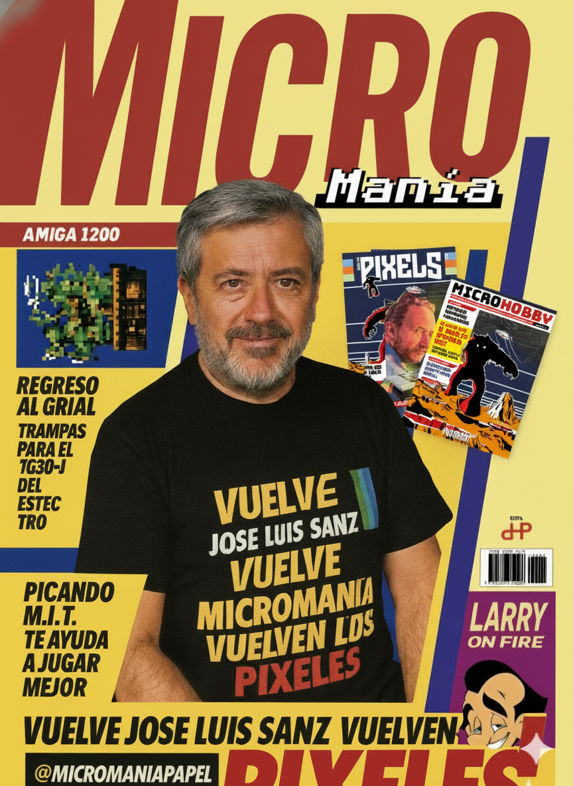
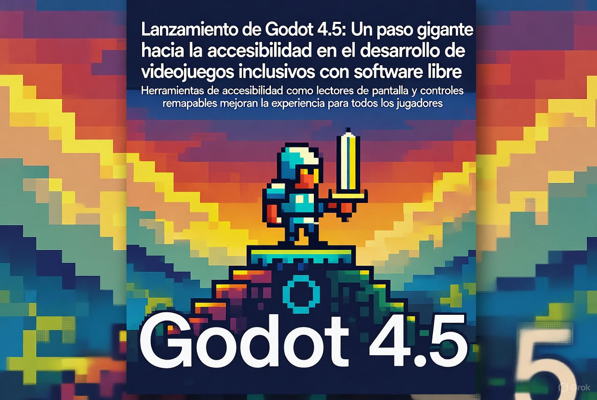
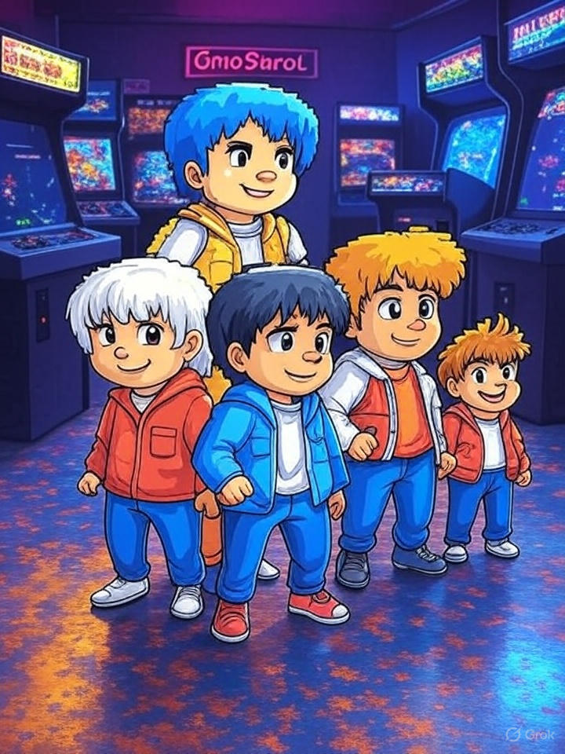
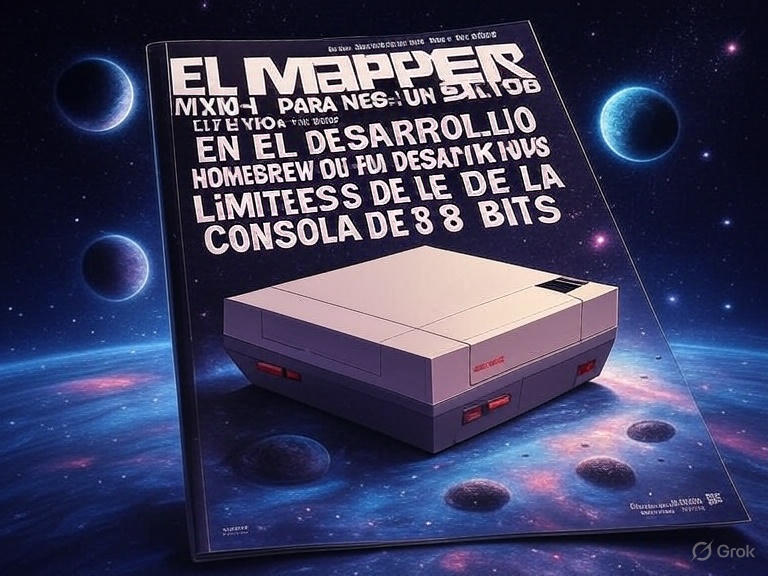
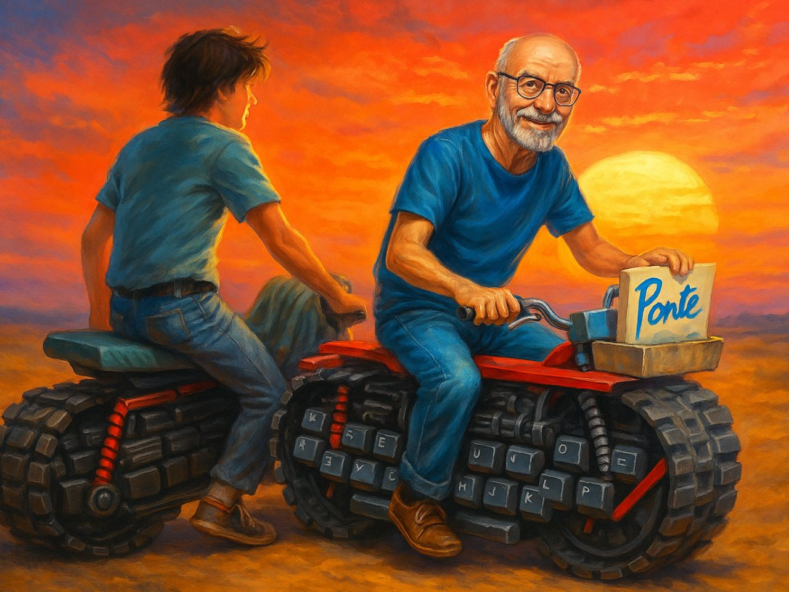
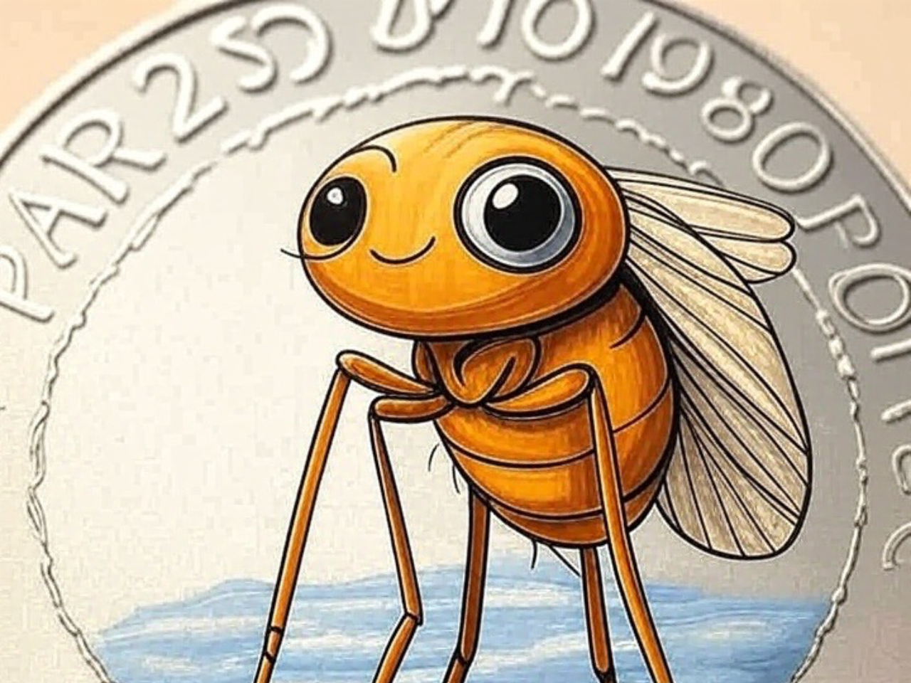
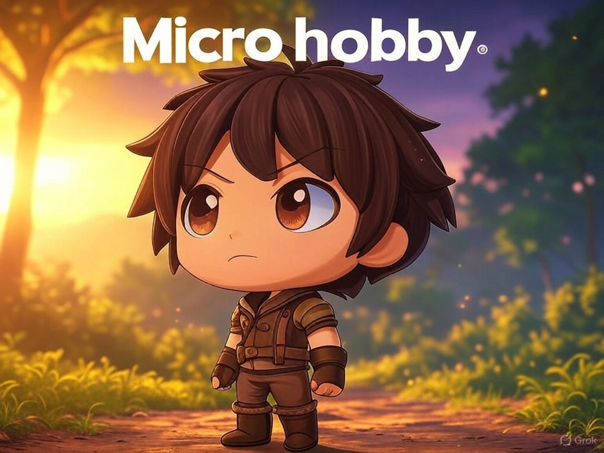

# Noticias

[[Index]]


--- start-multi-column: BloqueNoticias
```column-settings  
Number of Columns: 2
Border: off
```



## Noticias - El esperadísimo regreso de Micromanía: Una nueva etapa para una revista absolutamente icónica

**¡Qué alegría para los amantes de los videojuegos retro!** 

Diciembre de 2025 - Después de algo más de un año y medio, que se hizo interminable, la legendaria revista **Micromanía** vuelve a la vida. El pasado domingo 7 de diciembre de 2025, en el animado Salón del Videojuego de Madrid, José Luis Sanz, conocido como "Skywalker", y Marcos García, "The Elf", compartieron los primeros detalles de esta cuarta etapa. 

Es un renacimiento que mezcla el encanto de los años 80 y 90 con el ritmo actual del mundo de los videojuegos, uniendo generaciones de aficionados.

Continua leyendo en ... [[Noticias - El esperadísimo regreso de Micromanía Una nueva etapa para una revista absolutamente icónica - 2025-12-09 🟡③]]

--- column-end ---


## Noticias - Preventa de Cinco Duros Vol. 3 El legado olvidado del videojuego español cobra vida con un salto hacia los 90 en edición coleccionista

**Octubre de 2025** – El año 2025 está siendo un auténtico renacimiento para la escena retro española. Tras [[Noticias - El esperadísimo regreso de Microhobby - 2025-05-05 🟡③|el regreso de Microhobby]], el [[Noticias - Estreno del Episodio 1 de "Cinco Duros" - El arranque épico de la historia del videojuego español llega a la pantalla - 2025-09-28 🟡③|estreno del primer episodio de la serie documental Cinco Duros]] y el [[Noticias - Malasombra para NES - una nueva obra maestra de 4MHz - 2025-04-28 🟡③|lanzamiento de títulos homebrew como Malasombra para NES]], Dolmen Editorial acaba de abrir la **preventa del Volumen 3 de *Cinco Duros: La historia del videojuego en España para todos***. Este libro, escrito por **Diego Vargas Pardo**, nos sumerge en los años **1990-1993**: la época en que la industria española pasó de los microordenadores de 8 bits al dominio de las consolas, la profesionalización del sector y la presión del mercado internacional.

Continuar leyendo en ... [[Noticias - Preventa de Cinco Duros Vol. 3 El legado olvidado del videojuego español cobra vida con un salto hacia los 90 en edición coleccionista - 2025-10-27 🟡③]]

--- column-end ---


## Noticias - Lanzamiento de Godot 4.3: Un Avance Revolucionario en Accesibilidad y Software Libre para el Desarrollo de Videojuegos Inclusivos

Octubre, 2025 - En un movimiento que promete transformar el panorama del desarrollo de videojuegos indie y retro, el equipo detrás de Godot Engine ha liberado la versión 4.3, apodada "Inclusive Horizons", el pasado 10 de octubre de 2025. 

Esta actualización, disponible de forma gratuita bajo la licencia MIT de software libre, se centra en herramientas avanzadas de accesibilidad que permiten a creadores de todo el mundo diseñar experiencias jugables para jugadores con discapacidades diversas, alineándose perfectamente con iniciativas como Accessible Player Experiences (APX) y proyectos como MetsuOS, que buscan democratizar el acceso al mundo del videojuego y la retroinformática.

Continuar leyendo en ... [[Noticias - Lanzamiento de Godot 4.3 - Un Avance Revolucionario en Accesibilidad y Software Libre para el Desarrollo de Videojuegos Inclusivos - 2025-10-12  🔴②]]

--- column-end ---


## Noticias - Estreno del Episodio 1 de "Cinco Duros" - El arranque épico de la historia del videojuego español llega a la pantalla

Septiembre, 2025 - "Durante más de **cuatro décadas**, la historia de la industria española del videojuego ha permanecido sistemáticamente **invisibilizada**. Este oscurecimiento no ocurrió por accidente ni por casualidad, sino que fue el resultado de **decisiones conscientes** que han privado a varias generaciones de conocer su propio **patrimonio cultural y tecnológico**. Este legado, incluso en la actualidad, ha sido en muchos casos **demonizado**." no puedo estar mas de acuerdo con la declaración de intenciones de esta serie documental, cuyo primer capítulo ha sido liberado.

Continuar leyendo en ... [[Noticias - Estreno del Episodio 1 de "Cinco Duros" - El arranque épico de la historia del videojuego español llega a la pantalla - 2025-09-28 🟡③]]

--- column-end ---



## El Mapper MXM-1 para NES -  Un Salto Cuántico en el Desarrollo Homebrew que Desafía los Límites de la Consola de 8 Bits

Septiembre de 2025 – En un año repleto de resurgimientos en el mundo del retrocomputing español, con momentos estelares como [[Noticias - El esperadísimo regreso de Microhobby - 2025-05-05 🟡③|la vuelta de Microhobby]] o el [[Noticias - Malasombra para NES - una nueva obra maestra de 4MHz - 2025-04-28 🟡③|anuncio de Malasombra para NES]] , la comunidad global de desarrolladores homebrew está de enhorabuena con un avance técnico que promete cambiar las reglas del juego para la Nintendo Entertainment System (NES). 

Continuar leyendo en ... [[Noticias - El Mapper MXM-1 para NES -  Un Salto Cuántico en el Desarrollo Homebrew que Desafía los Límites de la Consola de 8 Bits 2025-09-20  🔴②]]

--- column-end ---


## En marcha la prereserva de la edición física de Castle of Terror de PCNONOGames

Junio, 2025 – La comunidad de jugadores retro y coleccionistas de videojuegos está de celebración tras el anuncio de que la edición física de _Castle of Terror_, el nuevo título para Game Boy desarrollado por PCNONOGames. 

Este lanzamiento, que combina nostalgia con un diseño innovador, ha generado gran expectación entre los aficionados a los videojuegos de 8 bits.

Continuar leyendo en ... [[Noticias - En marcha la prereserva de la edición física de Castle of Terror de PCNONOGames 2025-06-11   🟡③]]


--- column-end ---


## Reveladas Portada y Precio de Microhobby 218

Junio, 2025 - Sueño una vida que fué reviviéndola del modo que soy, en la decrepitud de mi cuerpo y la floreciente vivacidad de una mente que me ha apoyado en mil batallas, en cien victorias y diez mil derrotas.

Desde el horizonte observo el futuro presente y la presencia de un futuro ya pasado. Es la vida que pasa ante nuestros ojos cuando, desde una fiereza matizada por las cicatrices, desgarramos el futuro en busca de nuestro legado, he aquí, mi querido Sancho, Microhobby.

Continua leyendo en ... [[Noticias - Reveladas Portada y Precio de Microhobby 218 - 2025-06-06 🟡③]]

--- column-end ---


## Cinco Duros anuncia la primera serie documental sobre la industria del videojuego español

Mayo, 2025 - "Mientras el mundo vivia la primera crisis del videojuego con Atari, en España se gestaba una revolución silenciosa que nadie se atrevió a contar. Hasta ahora..." con esta introducción digna de cualquiera de los videojuegos míticos, se anuncia la serie documental Cinco Duros, dirigida por Diego Vargas Pardo, a través del canal de "El Spectrumero Javi Ortiz". 

Esta serie explorará en su primera temporada (8-12 capítulos) la historia del videojuego en España, desde sus orígenes en los años 80 hasta su impacto cultural. Basada en el podcast y los libros de Vargas Pardo, la serie dará voz a los creadores de la época y educará al público general sobre el valor de esta industria, destacando el emprendimiento y la creatividad detrás de ella.

Continua leyendo en ... [[Noticias - Cinco Duros anuncia la primera serie documental sobre la industria del videojuego español - 2025-05-30 🟡③]]

--- column-end ---


## Jesus Martinez del Vas (JMV) nuevo portadista de la mítica Microhobby

Mayo, 2025 - Jesús Martínez del Vas (JMV), reconocido historietista y colaborador histórico de Microhobby, ha sido anunciado como el nuevo portadista de la mítica revista.

La revisa prepara su regreso en Julio de 2025. Este hito marca un momento clave para los amantes del retro y el Sinclair ZX Spectrum, con JMV aportando su talento característico a las portadas de la publicación.

Continua leyendo en ... [[Noticias - Jesus Martinez del Vas (JMV) nuevo portadista de la mítica Microhobby - 2025-05-19 🟡③]]

--- column-end ---


## ¡Vuelve con nosotros la mítica revista Microhobby!

Mayo, 2025 - La revista _Microhobby_ es un símbolo de la historia de los videojuegos y la informática en España. 

Lanzada en noviembre de 1984, coincidiendo con la llegada del Sinclair ZX Spectrum, se convirtió en una referencia imprescindible para los aficionados a los ordenadores de 8 bits. Durante casi ocho años, hasta su cierre en enero de 1992 tras 217 números.

Fue un faro de conocimiento, creatividad y comunidad para una generación. Ahora, en 2025, _Microhobby_ parece resurgir, liderada por José Luis Sanz, un veterano periodista del equipo original. Este regreso, anunciado en mayo de 2025, promete unir generaciones a través de la nostalgia y la pasión por el retrocomputing, combinando formatos físicos y digitales para adaptarse a los tiempos modernos.

Continua leyendo en ... [[Noticias - El esperadísimo regreso de Microhobby - 2025-05-05 🟡③]]
 
--- column-end ---


## Malasombra para NES, una nueva obra maestra de 4MHz

Abril, 2025 - _Malasombra_, el nuevo título de 4MHz para la Nintendo Entertainment System (NES), es una aventura mágica que fusiona plataformas, narrativa envolvente y un estilo visual deslumbrante. 

Tras cinco años de desarrollo, este juego español, presentado en el Museo Arcade Vintage de Ibi, destaca por su excelencia técnica y artística. Una experiencia retro que cautivará a los fans de los 8 bits, estará disponible en formato físico y digital en el segundo trimestre de 2025.

Continua leyendo en ... [[Noticias - Malasombra para NES - una nueva obra maestra de 4MHz - 2025-04-28 🟡③]]

 --- column-end ---


## GBRetroDev'24: Heroes of ASM de la mano de Fran Gallego

Noviembre, 2024 - El certamen GBRetroDev'24: Heroes of ASM, organizado por la Universidad de Alicante y liderado por Fran Gallego (Profesor Retroman), ha concluido con éxito, desatando la creatividad de desarrolladores de todo el mundo. 

Este concurso internacional de desarrollo en ensamblador para Game Boy Classic destacó por su desafío técnico y su homenaje a la nostalgia retro, premiando juegos innovadores y demostrando que la pasión por lo clásico sigue viva.

Continua leyendo en ... [[Noticias - GBRetroDev'24 - Heroes of ASM - La pasión retro de Fran Gallego impulsa la creatividad - 2024-11-30 🟡③]]

 --- column-end ---
--- multi-column-end

![[Plantilla - 1MT#One More Thing]]


