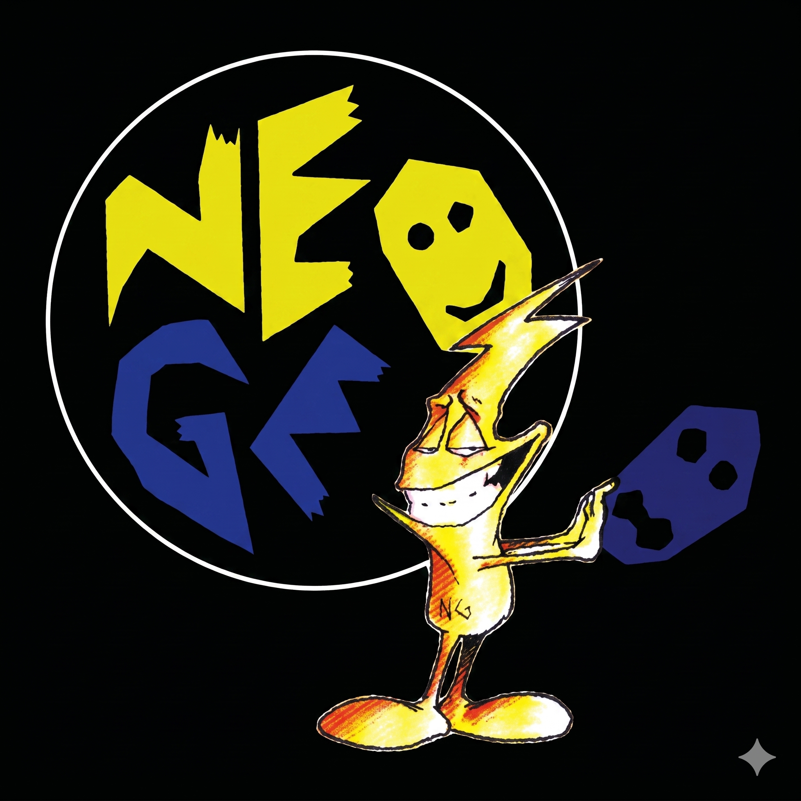

# Noticias

[[Index]] | [[Hemeroteca]]

## Scene News

> Año 1 - número 4 - 20/04/2026 a 26/04/2026

## JMV inicia rondas de negociación: Neo Vatio busca el trono de la nueva NEOGEO AES

Ya [[Hemeroteca - Scene News 001|comentábamos en fechas recientes sobre el contrato de exclusividad]] que **Neo Vatio** había firmado con **JMV** para la gestión de su imagen y derechos de explotación. En esta ocasión, y coincidiendo con [[Hemeroteca - Scene News 003]], el agente ha movido ficha rápidamente.

**JMV**, actuando como representante legal y portavoz del carismático personaje, ha postulado formalmente a Neo Vatio como la **imagen oficial** del sistema. Según fuentes cercanas al "agente", el perfil de Vatio encaja perfectamente con el estándar de lujo y potencia que siempre ha definido a la consola de SNK.

### Los puntos clave de la "negociación":

- **Sinatgia de Marca:** JMV sostiene que el nombre "Neo Vatio" no es una coincidencia, sino un destino. La unión comercial con NeoGeo AES supondría el mayor 'crossover' de la historia del _home arcade_.
    
- **Exigencias del Contrato:** Se rumorea que las cláusulas incluyen el suministro ilimitado de energía para el personaje y un píxel de oro de 24 quilates en cada sprite.
    
- **Posicionamiento:** JMV busca que su representado no solo sea un rostro en la caja, sino que el sistema reconozca a Neo Vatio como su "espíritu eléctrico" residente.
    
> "Neo Vatio no es solo un personaje, es un estilo de vida de 16 bits y 330 megas", habría declarado JMV en la primera toma de contacto con los directivos.

Por ahora, **PlayOnRetro** no ha emitido un comunicado oficial, pero el sector respira una tensión eléctrica. ¿Veremos finalmente el logo de la compañía flanqueado por la inconfundible silueta creada por JMV? La moneda está en el aire (y es de 100 pesetas).

Puedes saber más en [el anuncio oficial de JMV   🟡③🌐](https://x.com/YedaiJamao/status/2046260404641313260?s=20)

![[Plantilla - 1MT#One More Thing]]

