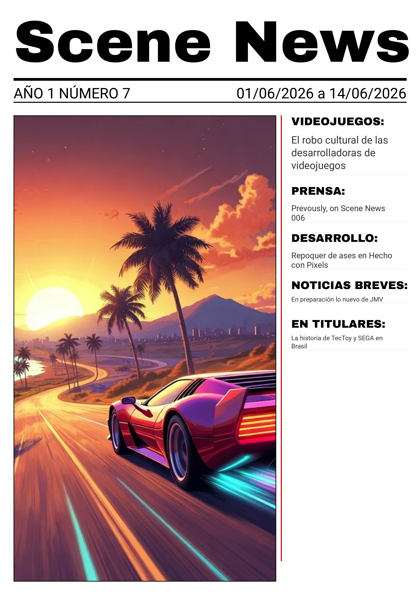

# Noticias


 
 [[Index]] | [[Hemeroteca]]
## Scene News 007

> Año 1 - número 7 - 01/06/2026 a 14/06/2026


## El robo cultural de las desarrolladoras de videojuegos

Si, robo cultural. Cuando una empresa, como pasa con Horizon Chase Turbo, elimina un juego de una tienda, aunque legalmente (tambien era legal discriminar al pueblo judio en la alemania nazi y eso no lo hacia aceptable), en realidad esta robando a sus usuarios una parte de su acervo cultural.

Lo mismo pasa con libros, revistas, musica, películas  ... con la EXCUSA de la digitalizacion, se toma nuestro dinero sin darnos realmente el producto, como si un albañil quisiera cobrarnos veinte años por la existencia de un muro. Esto es inaceptable, una vez superados los dos años de explotacion comercial monopolística, cualquier obra cultural deberia pasar a dominio publico de plano y, mientras la legislación no cambie - que tiene que cambiar - lo mínimo EXIGIBLE es la posesion de la obra digital adquirida. 

No es valido convertir la cultura en una suscripción perpetua, como no lo es el cobro "por protección de la mafia", en obras que pueden perfectamente correr en local y ocupar un espacio de mínimo a razonable. Es hora de DEJAR DE APOYAR a cualquiera que pretenda robar nuestra cultura - quizá deba usted, querido lector, repasar el caso de la muerte de superman - y apoyar en esos dos años de explotación comercial a los autores de las obras comprandoles y NO distribuyendo antes de hora, que se confunde facilmente libre con gratis.

Porque ojo, para poder exigir posesión, se nos debe exigir responsabilidad, a fin de que la hormésis cultural lleve al aumento de calidad, no a la banalización de la basura cognitiva.

* [Sobre la trepanación de Horizon Chase Turbo 🟡③🌐](https://x.com/bigodeverso/status/2060703429832417559?s=20)

> OJO WIP

**Prevously, on Scene News 006**

--- start-multi-column: BloqueMicrohobbit01\
```column-settings  
Number of Columns: 2
Border: off
```


## Repoquer de ases en Hecho con Pixels

Está siendo un mes de Infarto, el Segundo número de Micromanía Cuarta Época, Pixels 15, Microhobby 226, el regalo para suscriptores de Pixels en forma de Número 0 de Última Generación, y las reediciones numeradas del primer número de Microhobby y Micromanía.

Empiezo a dudar si la edad dorada es hoy, publicaciones de calidad everywhere, para los más cafeteros, eso si, pero sin duda los brotes verdes empiezan a desarrollar corteza ;)

* [Tienda Hecho con Pixels 🟡③🌐](https://tienda.hechoconpixels.com/)
* [El quiosco retro de MetsuOS, único que tiene estas revistas 🟡③🌐](https://metsuke.com/quiosco/)


 --- column-end ---


## Concurso Japponés de desaarrollo con limite en 1.44MB

Comienza un concurso de desarrollo de videojuegos con un límite de "1.44 MB", el equivalente a un disquete. El uso de motores de juego también es libre, siempre y cuando quepa.

Vamos a tener que usar traductor para seguirlo, pero la pinta es espectacular.

* [Enlace a la noticia  🟡③🌐](Comienza un concurso de desarrollo de videojuegos con un límite de "1.44 MB", el equivalente a un disquete. El uso de motores de juego también es libre, siempre y cuando quepa.)

 --- column-end ---
--- multi-column-end


--- start-multi-column: BloqueMicrohobbit01\
```column-settings  
Number of Columns: 2
Border: off
```
## Noticias Breves

* [En preparación lo nuevo de JMV  🟡③🌐](https://x.com/YedaiJamao/status/2059379993893879947?s=20) - Será la quinta entrega de la colección, y parece ser que estará en Verkami próximamente.

 --- column-end ---
 
## En Titulares

* [La historia de TecToy y SEGA en Brasil  🟡③🌐](https://x.com/RetroplayingBCN/status/2059737597576949970?s=20)

 --- column-end ---
--- multi-column-end

## Por Gnomerergan


![[Plantilla - 1MT#One More Thing]]


