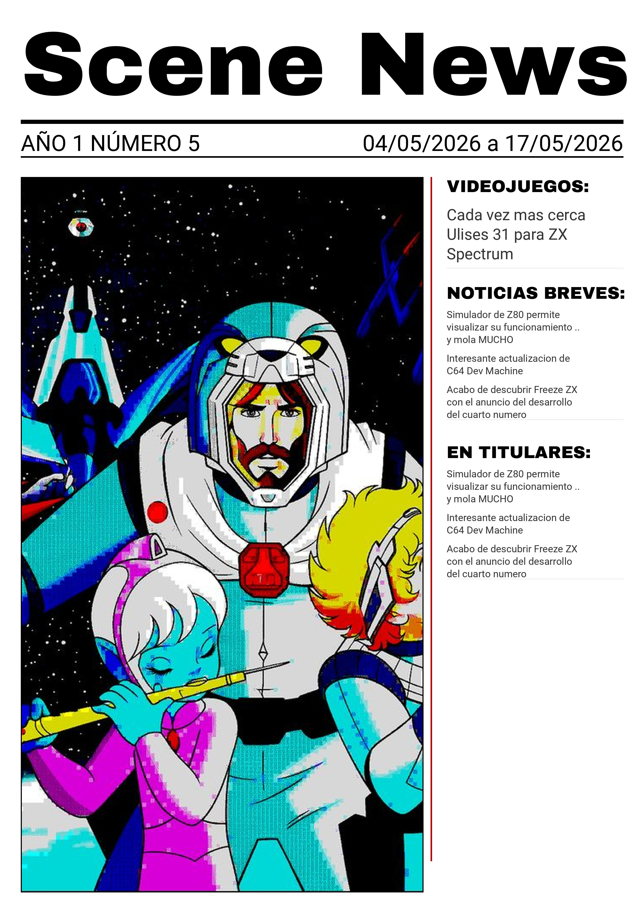
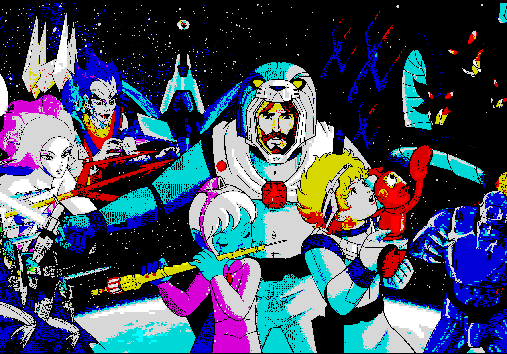
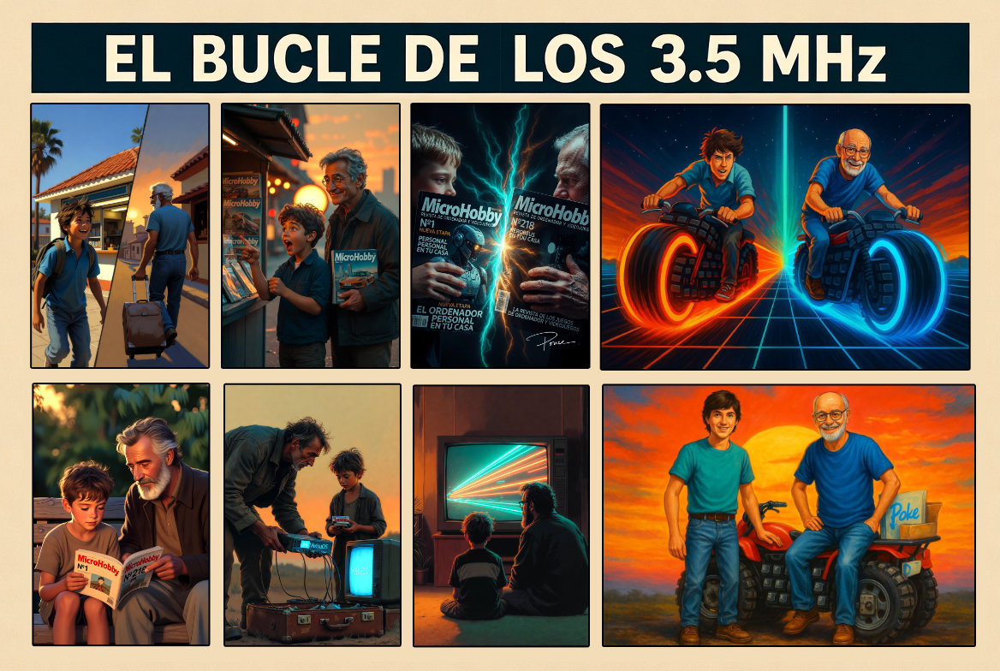

# Noticias



[[Index]] | [[Hemeroteca]]
## Scene News

> Año 1 - número 5 - 04/05/2026 a 17/05/2026


## Cada vez mas cerca Ulises 31 para ZX Spectrum

Es uno de los proyectos más esperados en la Scene, un videojuego de Ulises 31 en nuestro querido Speccy y, por lo que se ha visto hasta ahora, de una factura excelente.

Tras cuatro décadas de silencio en el bus de datos, el proyecto **Odyssey 31** está entrando en su fase de carga final. Bajo el sello de **Sequentia Soft** y con **Fran Kapilla** a los mandos, este desarrollo no es solo un juego; es el parche definitivo que la escena retro le debía a una generación entera. Estamos ante una pieza de artesanía en 8 bits que exprime el hardware para devolvernos la estética del anime original con una fidelidad que asombra.

A nivel de "picar código", el trabajo es masivo. Se nota un mimo extremo en el redibujado de cada bloque y sprite, respetando la iconografía de los 80 pero sin miedo a expandir el universo de Jean Chalopin. El título hibrida la aventura gráfica por opciones con mecánicas de acción y puzles, inyectando incluso mitos clásicos que se quedaron fuera del guion original de la serie. Es, en esencia, una expansión de memoria para nuestra nostalgia, ejecutada con una precisión técnica envidiable.

La cuenta atrás ya ha empezado y el contador de progreso marca el **2026** como el año del lanzamiento, con el objetivo fijado **antes del verano**. Actualmente, el equipo está puliendo las versiones en español, inglés y francés mientras la comunidad sigue sumando apoyos al proyecto. Estamos cada vez más cerca de ver a Ulises surcando de nuevo el cosmos de píxeles; una deuda histórica que, por fin, está a punto de ser saldada con un "Ready" en pantalla.

- [Página Oficial de Desarrollo (Itch.io 🟡③🌐](https://sequentia-soft.itch.io/odyssey31)   
- [Perfil de X para el "minuto a minuto -@sequentiasoft 🟡③🌐](https://x.com/sequentiasoft)


--- start-multi-column: BloqueMicrohobbit01\
```column-settings  
Number of Columns: 2
Border: off
```
## Noticias Breves

* [Anunciada reedición de Microhobby número 1 🟡③🌐](https://x.com/MicroHobbyPapel/status/2053752060407865359?s=20)

 --- column-end ---
 
## En Titulares

* [Simulador de Z80 permite visualizar su funcionamiento .. y mola MUCHO 🟡③🌐](https://x.com/motaz_shokry/status/2052800960414785823?s=20)
* [Interesante actualizacion de C64 Dev Machine 🟡③🌐](https://x.com/AmigamagazineGA/status/2052396888041705938?s=20)
* [Acabo de descubrir Freeze ZX con el anuncio del desarrollo del cuarto numero 🟡③🌐](https://x.com/FREEZEZXUK/status/2052297050650263881?s=20)

--- column-end ---

## El Directorio

* Nothing Relevant ... Yet

--- column-end ---

## En Dizque ¿seco?

Dizqueeee como el sol cuando amaneceeeee ... 


 --- column-end ---
--- multi-column-end

## Un tebeo, medio limón




![[Plantilla - 1MT#One More Thing]]


