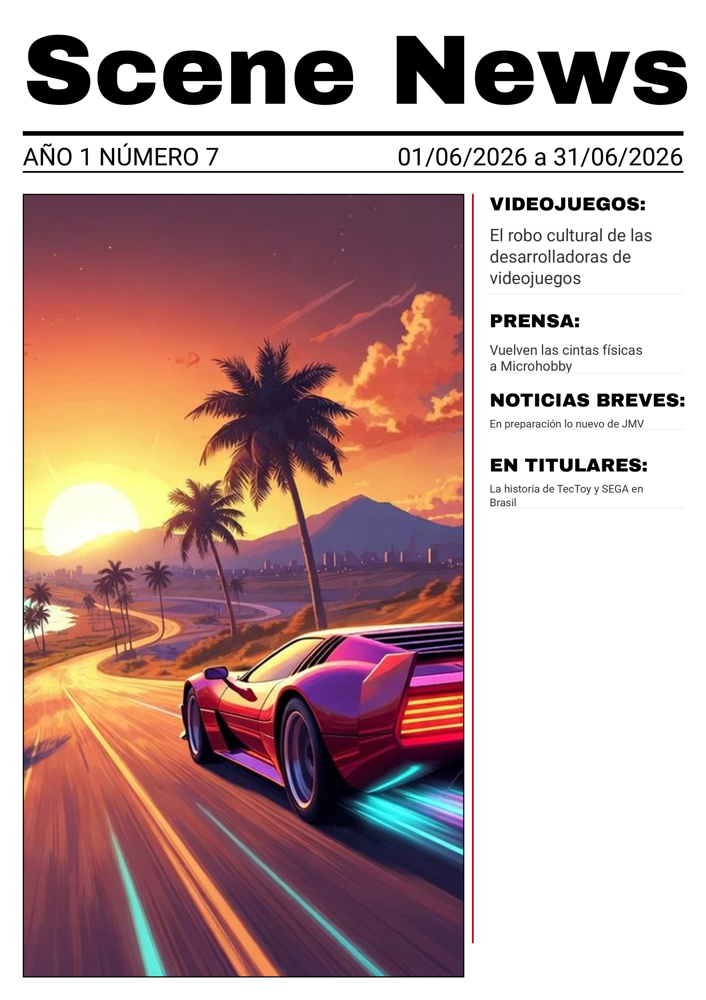
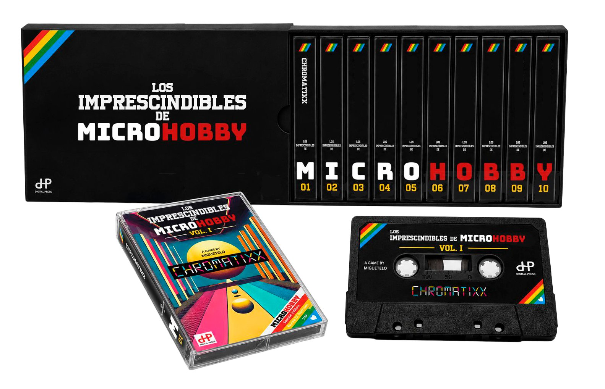

# Noticias


 
 [[Index]] | [[Hemeroteca]]
## Scene News 007

> Año 1 - número 7 - 01/06/2026 a 31/06/2026


## El robo cultural de las desarrolladoras de videojuegos

Si, robo cultural. Cuando una empresa, como pasa con Horizon Chase Turbo, elimina un juego de una tienda, aunque legalmente (tambien era legal discriminar al pueblo judio en la alemania nazi y eso no lo hacia aceptable), en realidad esta robando a sus usuarios una parte de su acervo cultural.

Lo mismo pasa con libros, revistas, musica, películas  ... con la EXCUSA de la digitalizacion, se toma nuestro dinero sin darnos realmente el producto, como si un albañil quisiera cobrarnos veinte años por la existencia de un muro. Esto es inaceptable, una vez superados los dos años de explotacion comercial monopolística, cualquier obra cultural deberia pasar a dominio publico de plano y, mientras la legislación no cambie - que tiene que cambiar - lo mínimo EXIGIBLE es la posesion de la obra digital adquirida. 

No es valido convertir la cultura en una suscripción perpetua, como no lo es el cobro "por protección de la mafia", en obras que pueden perfectamente correr en local y ocupar un espacio de mínimo a razonable. Es hora de DEJAR DE APOYAR a cualquiera que pretenda robar nuestra cultura - quizá deba usted, querido lector, repasar el caso de la muerte de superman - y apoyar en esos dos años de explotación comercial a los autores de las obras comprandoles y NO distribuyendo antes de hora, que se confunde facilmente libre con gratis.

Porque ojo, para poder exigir posesión, se nos debe exigir responsabilidad, a fin de que la hormésis cultural lleve al aumento de calidad, no a la banalización de la basura cognitiva.

* [Sobre la trepanación de Horizon Chase Turbo 🟡③🌐](https://x.com/bigodeverso/status/2060703429832417559?s=20)

> OJO WIP

--- start-multi-column: BloqueMicrohobbit01\
```column-settings  
Number of Columns: 2
Border: off
```


## Vuelven las cintas físicas a Microhobby

No exactamente a cinta por semana, pero vuelven con nosotros en forma de selección de juegos imprescindibles curados por el equipo de la revista. El propio equipo nos comenta en X:

- 10 juegos en total, actuales, que irán llegando escalonadamente en los próximos meses, algunos todavía hoy en desarrollo y de los estudios/programadores más TOP de la escena española e internacional. - Será la única oportunidad de conseguirlos (**) en cinta, en formato físico. - Todos los juegos tendrán doble carátula reversible (con diseño estilo ERBE o de la colección). - El primer juego será [#Chromatixx 🟡③🌐](https://x.com/hashtag/Chromatixx?src=hashtag_click), de Miguetelo.

¡Una oportunidad única para los amantes del formato físico, que probablemente no querras perderte!

DISCLAIMER: Desde MH indican que el diseño es tentativo y que podría cambiar durante el proces de creación sirviendo, no obstante al propósito de ilustrar el pack.

* [Anuncio en X  🟡③🌐](https://x.com/MicroHobbyPapel/status/2062555560440971660?s=20)


 --- column-end ---
 
## ¿Doom en NeoGeo AES?

Pues no se si acabará siendo un proyecto comercial, pero desde luego están creando un motor para ello,  aun no puedo dedicarle tiempo pero me ponen los dientes largos para explorar ese camino.

Falta mucho por pulir, pero desde luego promete.

* [Avances del motor ray casting para Doom en NeoGeo AES 🟡③🌐](https://x.com/Neo_Geo_Forever/status/2064030057681563982?s=20)
 
 --- column-end ---
--- multi-column-end

--- start-multi-column: BloqueMicrohobbit01\
```column-settings  
Number of Columns: 2
Border: off
```
## Noticias Breves

* WIP

 --- column-end ---
 
## En Titulares

* WIP

 --- column-end ---
--- multi-column-end


![[Plantilla - 1MT#One More Thing]]


