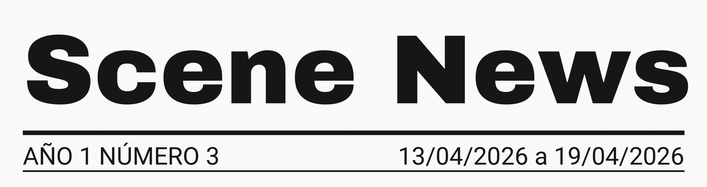
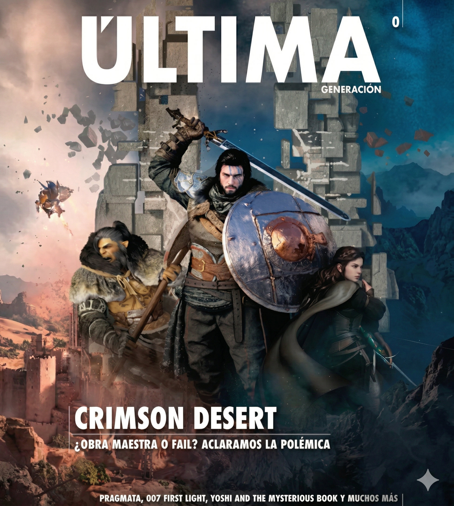

# Noticias

[[Index]] | [[Hemeroteca]]



## Scene News

> Año 1 - número 3 - 13/04/2026 a 19/04/2026



## Jose Luis Sanz anuncia en directo que, la revista Ultima Generación, NO vuelve, pero nos da una de arena

Hoy lunes se nos han dado una interesante alegría al desvelar la nu... estoooo el regalo que vamos a recibir aquellos que compramos asiduamente Pixels, una edición especial actualidad de Ultima Generación, y NO, ya hablando en serio, no es que la revista vuelva (por ahora), sino que es la forma que tieenen desde el equipo de Pixels y que recibimos con grán ilusión.

En el video del directo de hoy, y en sus redes sociales, puedes acceder a las condiciones necesarias para recibirlo, mirad sobre todo el video, porque quizá te pueda interesar "Ponerte al dia"...

Informate en [el directo de hoy lunes en YT 🟡③🌐](https://www.youtube.com/watch?v=Mqcf8V932pw)

--- start-multi-column: BloqueMicrohobbit01\
```column-settings  
Number of Columns: 2
Border: off
```

![[_resources/2ec2eabd4f0f400f24ca74878f4ed89b_MD5.jpg]]
## Quizá si lleguen a unirse lo viejo y lo nuevo

Siembre subestimo la velocidad de los cambios, me pasó con la IA, con las distintas fases de avance y retroceso social en torno a ella, y de nuevo parece que me equivoco con el momento en que nace cierto movimiento de integración entre la red y el mundo fíasico. 

No puedo estar mas contento con dicho movimiento incipiente, coincidiendo como rumores sobre la [transformacion de revistas relevantes en puro papel 🟡③🌐](https://pronto.es/) y de la salida - como veniomos compartiendo en el quiosco retro - de [publicaciones mixtas fisico y digital en el mundo del videojuego retro  🟡③🌐](https://metsuke.com/quiosco)

Y dentro de este movimiento, gracias a Guillermo Cid, asisto a un nuevo capítulo de este movimiento que consolida futuro pasado y sentido común, y en este capñitulo, cuando en lo personal había perdido del todo la confianza en el periodismo español, por haberse vuelto evidente propaganda, surgen algunos habitantes de una aldea gala que, de la mano de Panoramix, aún osan investigar y sobre todo, presionar al poder para mantenerlo a raya.

Es este un periodismo que, más allá de estar formado por cabeceras, está formado por personas que trabajan en varias de estas cabeceras y cuya trayectoria y etica, parecen apoyar un renacimiento del verdadero periodismo, tras unos años de absoluta ignominia.

Es por ello que, del mismo modo que apoyo las publicaciones que comparto en el quiosco, y aprovechando como excusa el artículo que enlazo debao - y alguino más que enlaza en el - , junto con una oferta de suscripcion de prueba trimestral que es imposible rechazar, que - como dije antes contra todo pronóstico - me he suscrito a El Confidencial, cuando menos, para dar la oportunidad de que su labor dependa un poco menos de las inversiones de los anunciantes.

Y no, no me considero periodista, ni mucho menos, solo un aprendiz de estudiante de cronista de su propio mundo.

Puedes ampliar información en [el artículo de Guillermo Cid en El Confidencial 🟡③🌐](https://www.elconfidencial.com/empresas/2026-03-28/jovenes-abriendo-negocios-kiosco-extra-casa-pibe-libreria-pergamo-cbtrrptj_4328003/)

 --- column-end ---
--- multi-column-end


--- start-multi-column: BloqueMicrohobbit01\
```column-settings  
Number of Columns: 2
Border: off
```

# Noticias Breves

* [Se anuncia NEOGEO AES+ cero emulacion todo cartucho  🟡③🟡③](https://x.com/NEOGEO_JP/status/2044793121096290735?s=20) - Parece que se lanza el 12 de Noviembre y que habrá 10 juegos. desalida, a más de futuras reediciones de clásicos. ¡Quizá más de un desarrollador se plantee lanzar en esa plataforma!
* [A la venta el número 2 de la cuarta época de MicroManía  🟡③🌐](https://metsuke.com/quiosco/) - Y viene con portador de Space Moves una de las novedades de Dinamic, que incluye versión Amiga. No os perdais la demo exclusiva. ¡Podeis acceder a través de nuestro quiosco!
* [Próximamente, curso sobre Zesarux en MetsuOS  🟡③🌐](https://x.com/zesarux/status/2043745852909392371?s=20) - Ya tenía claro que para ejecución local GNU Fan, Zesarux tiene que ser el emulador de elección para Speccy*.* pero tras ver lo de las caratulas, y teniendo pendiente aún explorar su relación con el lector de pantalla, amerita un curso en profundidad sobre el emulador, al mismo tiempo que aprendo a exprimirlo e integrarlo con MOS 2.

 --- column-end ---

## En Titulares

* [Javier Fopiani inicia un proyecto de motor de aventuras con graficos y textos a toda pantalla, en ensamblador, cuyo progreso será interesante seguir  🟡③🌐](https://x.com/metsuke/status/2044478488611020926?s=20)
* [SDL3 libreria que permite controlar hardware para videojuegos, incluye soporte para MS-DOS 🟡③🌐](https://www.generationamiga.com/2026/04/13/sdl3-dos-port-brings-modern-cross-platform-development-to-classic-ms-dos/)
* [Nuevo Mirror de Metsulke.com en GitHub Pages 🟡③🌐](https://metsuke.github.io/web/noticias.html)

--- column-end ---

## El Directorio

* [SDL en GitHub 🟡③🌐](https://github.com/libsdl-org/SDL)

 --- column-end ---
--- multi-column-end

## La tira "comica" de la semana


![[Plantilla - 1MT#One More Thing]]


