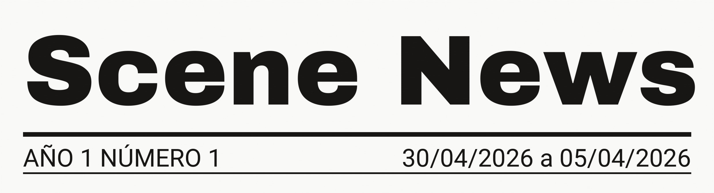
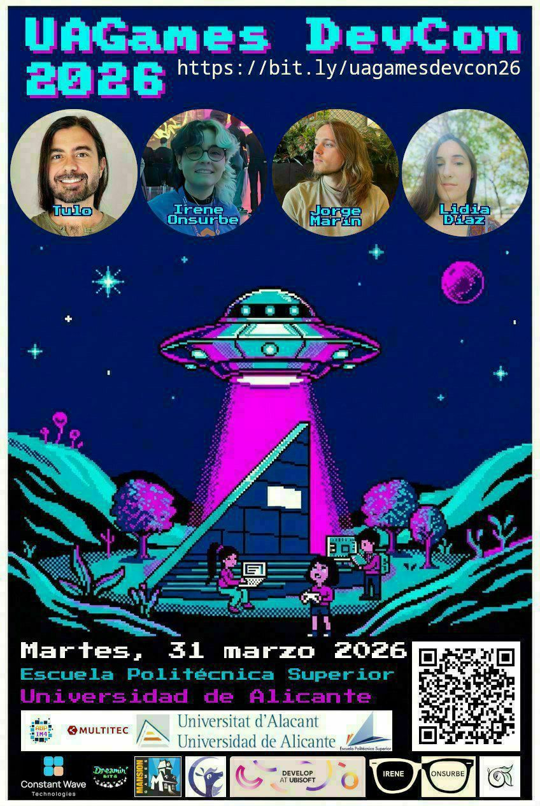
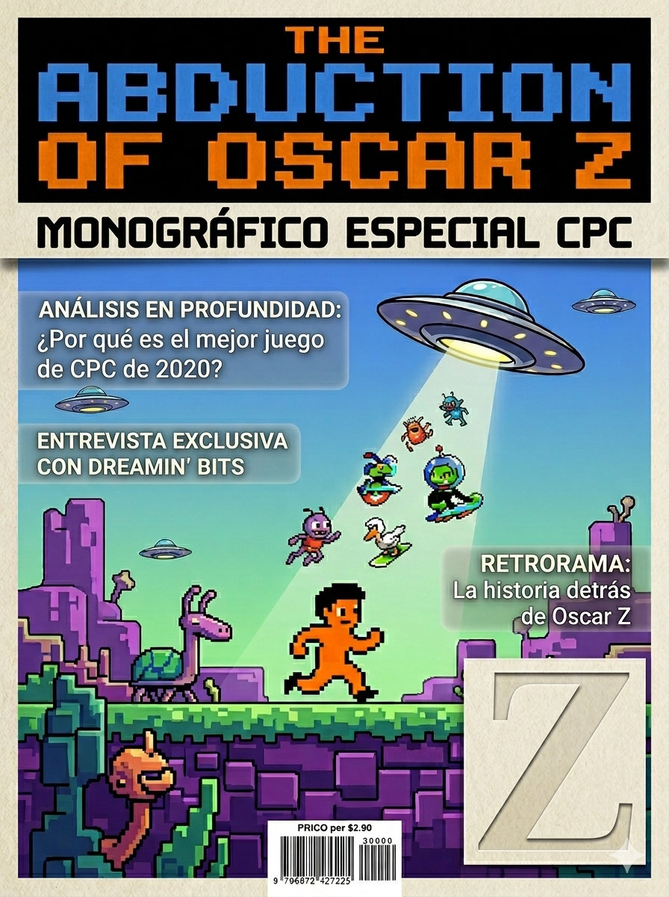

# Noticias

[[Index]]


## Scene News

> Año 1 - número 1 - 30/04/2026 a 05/04/2026


## Juntelart libera ZX-Draw un nuevo editor graficco para ZX Spectrum

Compatible con ZX Spectrum Game Maker y orientado a la edición de gráficos para juegos en ZX Spectrum usando formatos habituales de la plataforma, esta nueva herramienta viene a cubrir una enorme deficiencia en la scene de modo sobresaliente.

*A destacar:*

- **Apertura y guardado**: soporte nativo para `.zxp` y `.scr`.
- **Importar imágenes**: importa PNG/JPG y convierte a paleta Spectrum con modal interactivo.
- **Edición por bloques**: lienzo en bloques 8×8 con atributos ink/paper/bright/flash.
- **Exportar**: exporta PNG o guarda en `.zxp` para seguir editando.
- El mimo y cariño que se ha puesto en el desarrollo.

Más sobre la herramienta y descarga en la [página oficial de ZX-Draw  🟡③🟡](https://juntelart.itch.io/zxdraw)


--- start-multi-column: BloqueMicrohobbit01\
```column-settings  
Number of Columns: 2
Border: off
```


## Celebrada con éxito la UAGames DevCon 2026 en la Universidad de Alicante

Este martes 31 de marzo de 2026 se celebró en el Salón de Actos de la Escuela Politécnica Superior de la Universidad de Alicante la quinta edición de la UAGames DevCon 2026. El evento reunió a estudiantes, egresados y profesionales del sector del videojuego en una jornada que combinó charlas inspiradoras y exposición de proyectos. 

Destacó la keynote de Tulo, desarrollador en Constant Wave y ganador del CPCRetroDev 2020, quien compartió sus experiencias creando juegos, junto a ponencias de Irene Onsurbe (Ubisoft), Jorge Marín (Mansion Games) y Lídia Díaz (Ungulab) sobre la transición de la universidad al mundo laboral, motores comerciales y cómo encontrar el propio camino en la industria. Paralelamente, seis equipos de estudiantes de 4º de Ingeniería Multimedia expusieron y permitieron probar sus videojuegos en desarrollo en el atrio de la EPS, fomentando el contacto directo entre el talento emergente y el sector.

Puedes [aprender más sobre el evento aquí 🟡③🌐](https://eps.ua.es/es/ingenieria-multimedia/videojuegos/webs-uagames/uagames-devcon-2026.html) y [ver las ponencias en el canal de youtube de UA - Universitat d'Alacant / Universidad de Alicante 🟡③🌐](https://www.youtube.com/@UaEsAlicante/streams)
 

--- column-end ---


## Llega "The abduction of Oscar Z" al Hall of Games

De la mano de Fran Gallego  a raiz de una interesante ponencia en UA Games 2026, llega hasta nosotros este fantastico juego para Amstrad CPC que podrás ver en nuestro quiosco.

Consíguelo en [nuestro quiosco](https://metsuke.com/quiosco/) y en la [web de CPCRetroDev'20 en CPCRulez.fr  🟡③🌐](https://cpcrulez.fr/GamesTest/the_abduction_of_oscar_2.htm)

 --- column-end ---
--- multi-column-end

--- start-multi-column: BloqueMicrohobbit01\
```column-settings  
Number of Columns: 2
Border: off
```

## Noticias Breves

* [Juanje Juega lleva al autor del libro "Inteligencia Artificial para Z80" al canal 🟡③ 🌐](https://www.youtube.com/watch?v=UAGL213o_0Q) .- En el video el propio autor nos ilustra sobre este fantástico libro, que estoy usando de referencia para #MetsuOS
 
 --- column-end ---

## En titulares

* [JMV desvela lo sucecido en 1993 con el diseño de la mascota oficial de NEO-GEO a través de un concurso en HobbyConsolas 🟡③🌐](https://x.com/YedaiJamao/status/2039397194382311870?s=20)
* [Sale a la venta la trilogía "Con Cinco Duros" este miércoles 1 de Abril 🟡③🌐](https://x.com/dvargaspardo/status/2039049270125285394?s=20)

 --- column-end ---
--- multi-column-end


![[Plantilla - 1MT#One More Thing]]


