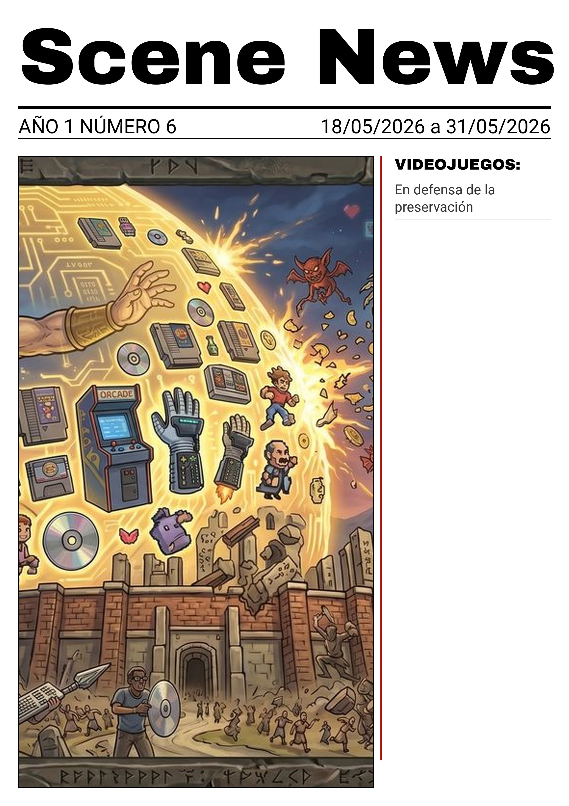

# Noticias


 
 [[Index]] | [[Hemeroteca]]
## Scene News 005

> Año 1 - número 6 - 18/05/2026 a 31/05/2026

 

## En defensa de la preservación

Es un viejo reclamo en el mundo del videojuego, la preservación y evitar que la dejadez, ansia econímuca y porque no decirlo, carencia de amor por el videojuego en la propia industria permitan que nuestro legado cultural se pierda y es que no, una vez superada la vida comercial de un producto (unos dos años), deberia ser delito lesa humanidad dejar perder la cultura, cerrar servidores o rehacer un contenido al punto de cambiar su significado.

Los mas cafeteros se echaran las manos a la cabeza ¡es mi obra!¡ladrones! y puede que - al contrario de lo que reconoce la legislacion actual de una forma  a mi entender absolutamente enfermiza - si, al compienzo fuera tu producto, pero una vez comercializado y compartido por los lectores o jugadores, ya no es tu producto, es NUESTRA CULTURA.

En cualquier caso, y consciente de lo polémico de este punto de vista, quisiera compartir una noticia que avanza un paso mas en la dirección de la preservación cualtural por encima de cualquier internto de destrucción o limitación de la cultura común. En tiempos de IA, esto ya es cuestion de supervivencia de NUESTRO conocimiento.

* [Tu unidad Blu-ray ya puede preservar juegos de GameCube, Wii, y Xbox legalmente  🟡③🌐](https://x.com/TechSpot/status/2057928075321495746?s=20)
* [A new project called OmniDrive enables some Blu-ray drives to rip older console games directly to a PC 🟡③🌐](https://x.com/Pirat_Nation/status/2059379296461115626?s=20)
* [OmniDrive: convierte tu Blu-ray en grabadora de juegos retro 🟡③🌐](https://x.com/elhackernet/status/2059362843942608935?s=20)

--- start-multi-column: BloqueMicrohobbit01\
```column-settings  
Number of Columns: 2
Border: off
```


## Repoquer de ases en Hecho con Pixels

Está siendo un mes de Infarto, el Segundo número de Micromanía Cuarta Época, Pixels 15, Microhobby 226, el regalo para suscriptores de Pixels en forma de Número 0 de Última Generación, y las reediciones numeradas del primer número de Microhobby y Micromanía.

Empiezo a dudar si la edad dorada es hoy, publicaciones de calidad everywhere, para los más cafeteros, eso si, pero sin duda los brotes verdes empiezan a desarrollar corteza ;)

* [Tienda Hecho con Pixels 🟡③🌐](https://tienda.hechoconpixels.com/)
* [El quiosco retro de MetsuOS, único que tiene estas revistas 🟡③🌐](https://metsuke.com/quiosco/)


 --- column-end ---


## Concurso Japponés de desaarrollo con limite en 1.44MB

Comienza un concurso de desarrollo de videojuegos con un límite de "1.44 MB", el equivalente a un disquete. El uso de motores de juego también es libre, siempre y cuando quepa.

Vamos a tener que usar traductor para seguirlo, pero la pinta es espectacular.

* [Enlace a la noticia  🟡③🌐](Comienza un concurso de desarrollo de videojuegos con un límite de "1.44 MB", el equivalente a un disquete. El uso de motores de juego también es libre, siempre y cuando quepa.)

 --- column-end ---
--- multi-column-end


--- start-multi-column: BloqueMicrohobbit01\
```column-settings  
Number of Columns: 2
Border: off
```
## Noticias Breves

* [En preparación lo nuevo de JMV  🟡③🌐](https://x.com/YedaiJamao/status/2059379993893879947?s=20) - Será la quinta entrega de la colección, y parece ser que estará en Verkami próximamente.

 --- column-end ---
 
## En Titulares

* X

--- column-end ---

## El Directorio

* X

--- column-end ---

## En Dizque ¿seco?

* X


 --- column-end ---
--- multi-column-end

## Por Gnomerergan


![[Plantilla - 1MT#One More Thing]]


