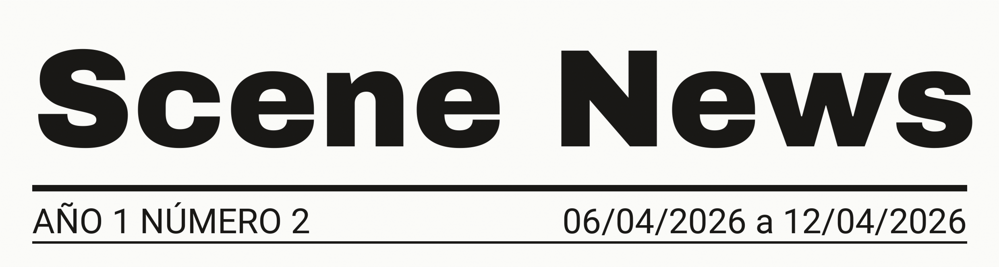
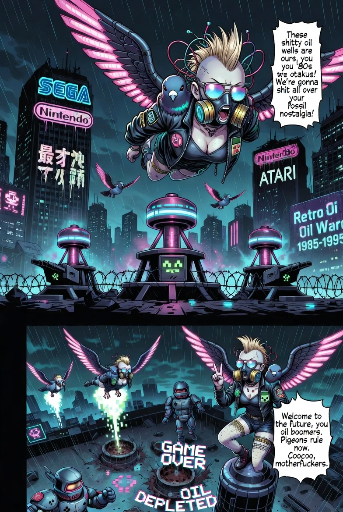

# Noticias

[[Index]] | [[Hemeroteca]]


## Scene News

> Año 1 - número 2 - 06/04/2026 a 12/04/2026


## El Mundo del Specturm anuncia la liberación de una implementación python del concepto del proyecto PALOMA que diseñó Paco Menéndez

El simulador, creado por un desarrollador llamado **Jorge (louzaonet)** y liberado como GNU Affero, implementa en python el proyecto PALOMA, del que nos hablaba en su dia, tambíen, El Mundo del Spectrum en este [artículo de EMS sobre PALOMA 🟡③🌐](https://www.elmundodelspectrum.com/descubrimos-proyecto-paloma-el-visionario-trabajo-al-que-paco-menendez-dedico-sus-ultimos-anos-de-vida/).

Es este un proyecto que amerita probar y, si es viable, trabajar con el de forma standar tanto en el mundo retro, como en IA al uso... sus amplias posibilidades, si no voy errado, son brutales, haciendo quizá viable algo que trasciende la barrera entre el software y el hardware, permitiendo trabajar en ambos mundos... ¿Será este un proyecto que permita llevar las FPGA al próximo nivel? sin duda parece necesario explorar este punto.

Solo diré, desde esta tribuna informativa, y dejando entrever a mi developer fan de las "locuras" técnicas, que este proyecto no ha podido llegar en mejor momento, dejémoslo ahí #tarjetita

Continua leyendo en [la noticia en detalle publicada en EMS 🟡③🌐](https://www.elmundodelspectrum.com/ejecuta-el-proyecto-paloma-en-python/) y hazte con el código (GNU Affero) en [el repositorio oficial 🟡③🌐](https://codeberg.org/louzaonet/Paloma_Simulator)

--- start-multi-column: BloqueMicrohobbit01\
```column-settings  
Number of Columns: 2
Border: off
```
## Que será será

 --- column-end ---

## Whatever will be will be

 --- column-end ---
--- multi-column-end


--- start-multi-column: BloqueMicrohobbit01\
```column-settings  
Number of Columns: 2
Border: off
```
## Noticias Breves

* [Samdax 3D esta haciendo un video sobre algo con algunos temas ilusionantes  🟡③🌐](https://www.youtube.com/samdax3d) - A más de lo que llega próximamente, quizá uno de los mejores canales sobre la era dorada de SEGA, los arcades y todo lo sucedido a su alrededor, con detalles técnicos imprescindibles.
* [Agotada la edición física del  número 1 de la cuarta época de MicroManía 🟡③🌐](https://x.com/MicroManiaPapel/status/2041536610651545782?s=20) - Tras un éxito arrollador, se acaba la primera edicición de la revista, y no había prevista reedición pero parece que al final, si.

--- column-end ---
## En Titulares

* [Se pone a la venta la segunda edición del primer número de la cuarta época de MicroMania 🟡③🌐](https://x.com/MicroManiaPapel/status/2042152322596258122?s=20)
 
 --- column-end ---

## El Directorio

* [JUEGOS - lostgamer.io 🟡③🌐](https://lostgamer.io/) - El GeoGuersser de los videojuegos.  
* [IA - canirun.ai 🟡③🌐](https://www.canirun.ai/) - De la mano de midudev, averigua si puedes correr IA localmente.

 --- column-end ---
--- multi-column-end
## La tira cómica de la semana




![[Plantilla - 1MT#One More Thing]]


