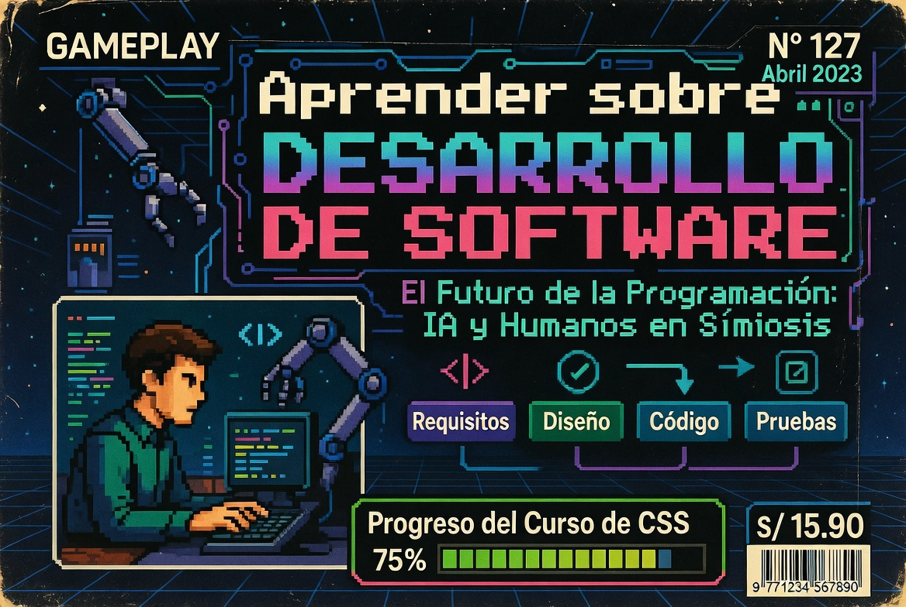
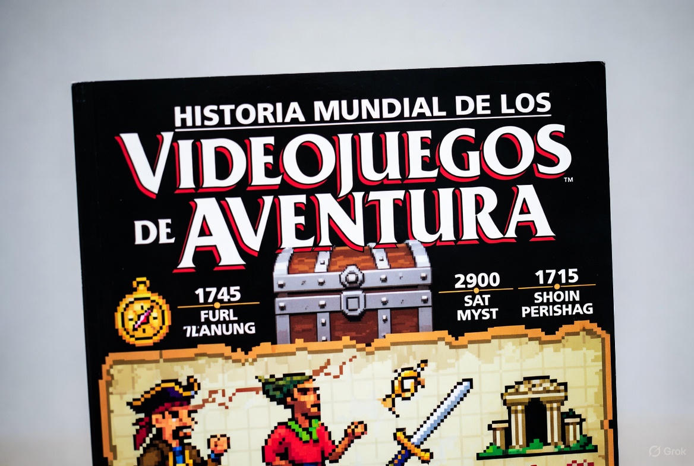
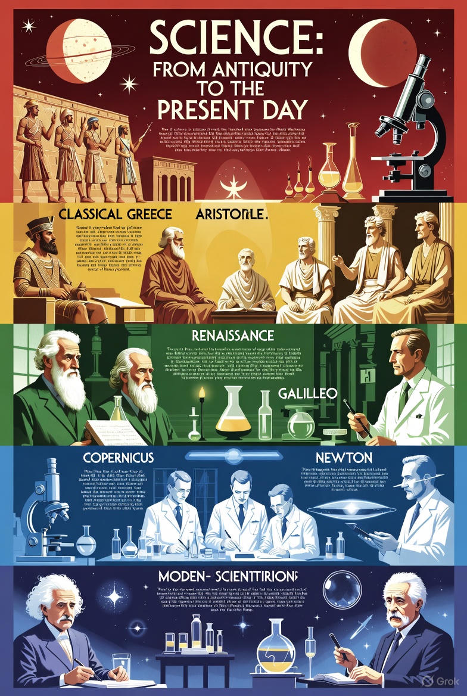
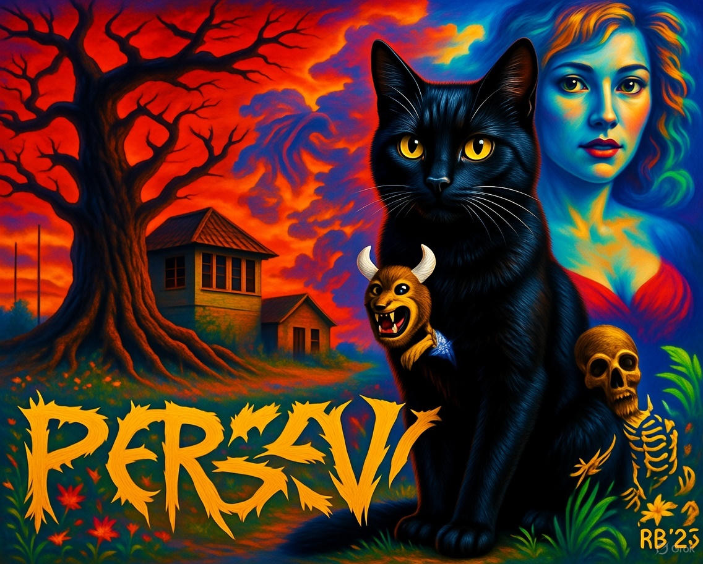
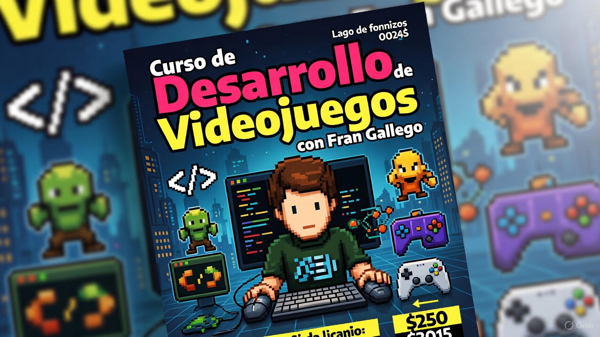

# Novedades

[[Index]]

--- start-multi-column: BloqueMicrohobbit00
```column-settings  
Number of Columns: 2
Border: off
```


## KB - La Biblioteca del Archivero del Retro

Este proyecto busca crear una base de datos completa y detallada de libros, revistas, juegos, autores, desarrolladores, diseñadores, grafistas, compañias, eventos y, en general todo lo relacionado con la historia del videojuego.

Continua leyendo en ... [[La Biblioteca del Archivero del Retro 🟡③]]

--- column-end ---


## Desarrollo - Aprender sobre Desarrollo de Software

El aprendizaje del desarrollo de software hoy no consiste en memorizar comandos, sino en heredar el **legado intelectual** que la humanidad ha construido bit a bit. Esta sección nace de una convicción: la Inteligencia Artificial no es un sustituto del intelecto, sino un espejo de nuestro conocimiento acumulado.

Continua leyendo en ... [[Aprender sobre Desarrollo de Software 🟡③]]

--- column-end ---

## Blog - El Archivero del Retro

Es esta una parte del proyecto que tenia reservada para más adelante, pero la "actualidad" manda, es hora de aprovechar mi fondo en cuanto a cds y disquettes para aportar mi minúsculo grano de arena en este mundillo retro tan activo en nuestros dias.

Continua leyendo en ... [[Blog - El Archivero del Retro  ⚫①]]

--- column-end ---


## Videojuegos Aventura - Historia Mundial de los videojuegos de aventura

Este curso ofrece un recorrido completo y apasionante por la evolución de los videojuegos de aventura, un género que ha marcado la historia del entretenimiento interactivo. Desde sus humildes inicios basados en texto hasta las experiencias narrativas modernas e híbridas, exploraremos cómo estos juegos han combinado exploración, rompecabezas y relatos cautivadores para capturar la imaginación de millones de jugadores en todo el mundo. 

A lo largo de los módulos, analizaremos innovaciones técnicas, influencias culturales y los desarrolladores clave que han dado forma a este universo lúdico.

Continua leyendo en [[Curso Historia Mundial de los videojuegos de aventura 🟡③]]

--- column-end ---


## Ciencia - Conceptos básicos sobre ciencia y su evolución histórica

La ciencia es nuestra herramienta más poderosa para descifrar el universo, desde las estrellas más lejanas hasta el latido de nuestro corazón. No es solo una lista de hechos, sino un viaje dinámico de preguntas, observaciones y pruebas que genera conocimiento fiable y transformador. Guiada por el método científico, la ciencia nos ha dado vacunas, teléfonos inteligentes y soluciones al cambio climático, pero también nos enseña a pensar con claridad y a cuestionar lo que damos por sentado. Su historia es un reflejo de nuestra curiosidad infinita y nuestra capacidad para reinventar la forma en que entendemos el mundo. Pero, ¿qué hace que la ciencia sea tan especial?

Continuar leyendo en ... [[Conceptos básicos sobre ciencia y su evolución histórica 🟡③]]

--- column-end ---


## Epistemología - Diferencias y similitudes entre epistemología y gnoseología

Aunque el término "gnoseología" aparece de forma breve en el módulo inicial, como parte de un apartado sobre diferencias y similitudes con la epistemología, no se profundiza mucho en el sitio principal ni en los enlaces directos (como las definiciones o los elementos del conocimiento humano (...)

Continua leyendo en ... [[Diferencias y similitudes entre epistemología y gnoseología 🟡③]]

--- column-end ---


## Noticias - Lanzamiento de  Perseus para ZX Spectrum 128K: Una aventura épica impulsada por el motor Tuerkas128

Diciembre 2025 - La escena retro sigue llena de sorpresas, y esta vez el protagonista es *Perseus*, un nuevo título para ZX Spectrum 128K desarrollado por RetroBensoft que ha generado mucho interés en la comunidad. 

Este juego te sumerge en la mitología griega, donde debes derrotar a Medusa, y utiliza el potente motor Tuerkas128, una herramienta que promete elevar el nivel de los desarrollos actuales para esta plataforma clásica.

Continuar leyendo en ... [[Noticias - Lanzamiento de Perseus para ZX Spectrum 128K -  Una aventura épica impulsada por el motor Tuerkas128 - 2025-12-26 🟡③]]

--- column-end ---



## GameDev C++ - Curso de Desarrollo de Videojuegos a pelo con Fran Gallego

Desarrollar "a pelo" no es lo más rápido, pero te da una comprensión profunda de cómo funcionan los videojuegos. Este curso, construido mientras estudio los contenidos publicados por Fran Gallego, te equipa con habilidades para crear prototipos, experimentar sin límites y, si quieres, dar el salto a motores comerciales con una base sólida. ¡Es tu oportunidad de programar como los pioneros de los 90, pero con herramientas modernas!

Continuar leyendo en ... [[Curso de Desarrollo de Videojuegos a pelo con Fran Gallego 🟡③]]

--- column-end ---


## Herramientas - Curso de ZX-Paintbrush

Este curso te invita a sumergirte en el fascinante mundo de ZX-Paintbrush, una herramienta clásica para diseñar gráficos en el legendario ZX Spectrum. 

A lo largo de los módulos, aprenderás desde los fundamentos hasta técnicas avanzadas para crear pantallas, tiles y sprites, integrándolos en tus propios juegos retro. 

Continua leyendo en ... [[Curso de ZX-Paintbrush - Creación de Gráficos para ZX Spectrum  🟡③]]

--- column-end ---


## Arquitectura Software - Curso Patrones y Calidad del Software

En este curso trataremos las cuestiones relacionadas con patrones de diseño y calidad del software. Comenzaremos con las bases e iremos avanzando hacia una serie de prompts de contexto que nos sirvan en nuestro desarrollo en el dia a dia.

Continuar leyendo en ... [[Curso sobre Patrones y Calidad del Software 🔴②]]

--- column-end ---


## Motores - Curso de Programación de Videojuegos con Godot Engine

Este curso ofrece una formación completa y práctica en la programación de videojuegos con el motor Godot Engine, centrándonos en los lenguajes C y C++ mediante el sistema GDExtension, que permite integrar código nativo de manera eficiente en versiones de Godot 4 y superiores. 

Continuar leyendo en [[Curso de Programación de Videojuegos con Godot Engine 🔴②]]

 --- column-end ---


## Public Brain - Estructura del Conocimiento Humano y Científico

La estructura del conocimiento humano y científico se fundamenta en la interacción dinámica entre observación, experimentación y reflexión crítica. A través de la historia, las disciplinas científicas han evolucionado mediante la sistematización de datos y la construcción de teorías que integran el pensamiento lógico con la creatividad, permitiendo a la humanidad desentrañar los misterios del universo y aplicar este saber en avances tecnológicos y sociales.

Continua leyendo en ... [[Estructura del Conocimiento Humano y Científico ⚫①]]

 --- column-end ---
--- multi-column-end


![[Plantilla - 1MT#One More Thing]]


