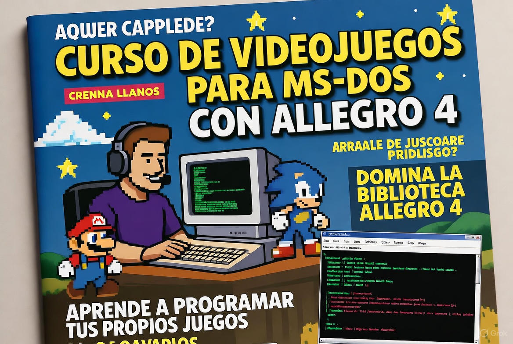
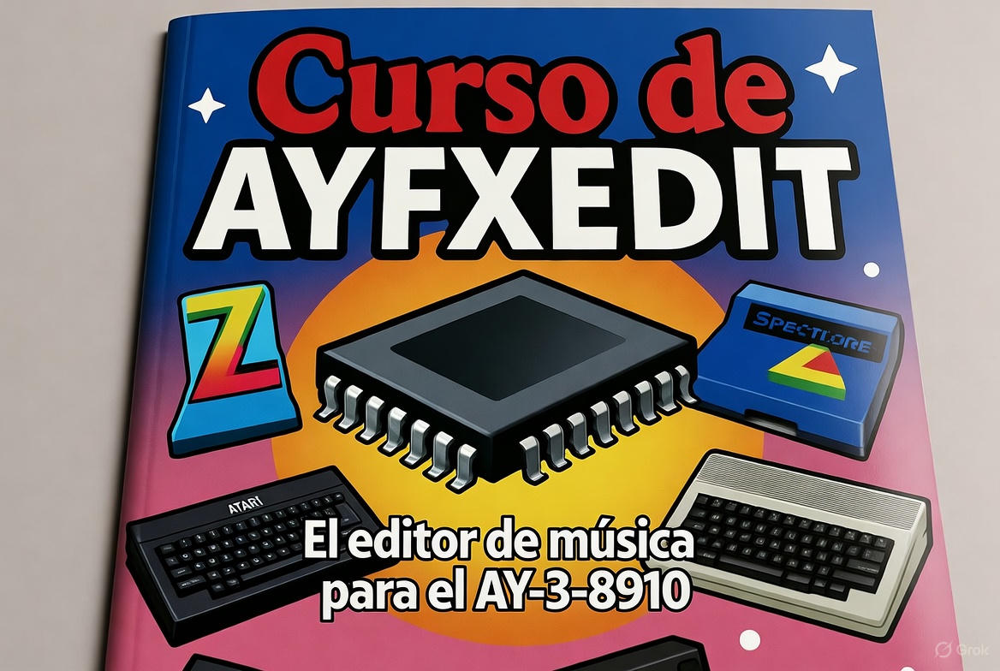
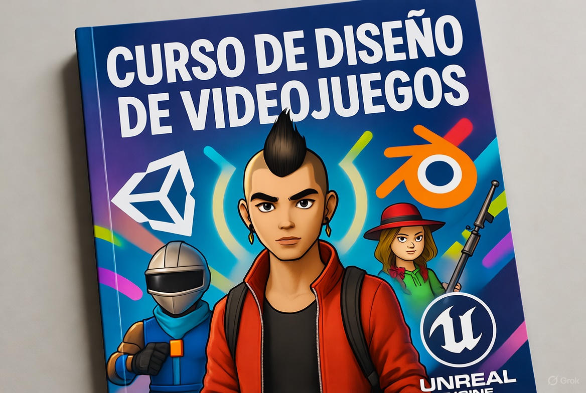
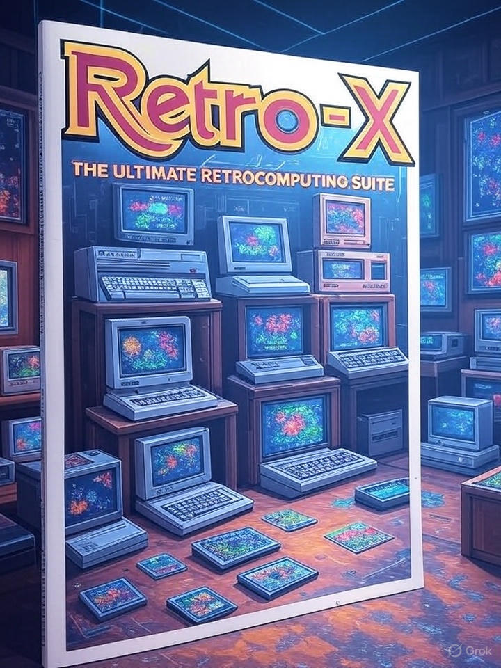
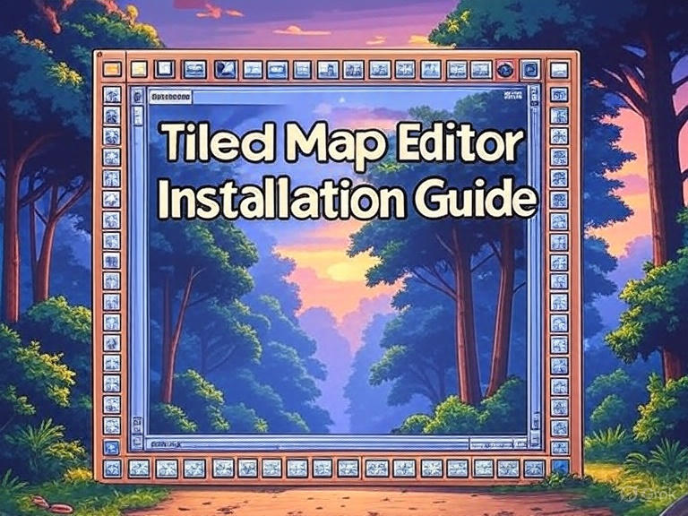

# Novedades

--- start-multi-column: BloqueMicrohobbit00
```column-settings  
Number of Columns: 2
Border: off
```



## Curso crea juegos para MS-DOS con Allegro 4

Como siempre, la "Culpa" es de [El Spectrumero 🌐](https://www.youtube.com/watch?v=wts4lN7X_MY), abordamos antes delo que tenia pensado el tema de MS-DOS (me planteo incluso meter MetsuOS en el), entre otras cosas como medio para meterme caña con C, lenguaje que necesito tanto para el SO, como para Prisma, CPCTelera, etc, etc, etc.

Lo divertido, que apenas hice bats, cosas basicas de menus para lanzar juegos, pinitos con Div Games Studio y lo que aprendí en el curso de Unix/C/Oracle, que tengo casi olvidado, por lo que para mi, la diversión está en aprender, y de paso, que eso pueda servir a otros para llegar más allá.

Continua leyendo en ... [[Curso crea juegos para MS-DOS con Allegro 4   🔴②]]

--- column-end ---


## Noticias - Preventa de Cinco Duros Vol. 3 El legado olvidado del videojuego español cobra vida con un salto hacia los 90 en edición coleccionista

**Octubre de 2025** – El año 2025 está siendo un auténtico renacimiento para la escena retro española. Tras [[Noticias - El esperadísimo regreso de Microhobby - 2025-05-05 🟡③|el regreso de Microhobby]], el [[Noticias - Estreno del Episodio 1 de "Cinco Duros" - El arranque épico de la historia del videojuego español llega a la pantalla - 2025-09-28 🟡③|estreno del primer episodio de la serie documental Cinco Duros]] y el [[Noticias - Malasombra para NES - una nueva obra maestra de 4MHz - 2025-04-28 🟡③|lanzamiento de títulos homebrew como Malasombra para NES]], Dolmen Editorial acaba de abrir la **preventa del Volumen 3 de *Cinco Duros: La historia del videojuego en España para todos***. Este libro, escrito por **Diego Vargas Pardo**, nos sumerge en los años **1990-1993**: la época en que la industria española pasó de los microordenadores de 8 bits al dominio de las consolas, la profesionalización del sector y la presión del mercado internacional.

Continuar leyendo en ... [[Noticias - Preventa de Cinco Duros Vol. 3 El legado olvidado del videojuego español cobra vida con un salto hacia los 90 en edición coleccionista - 2025-10-27 🟡③]]

--- column-end ---


## Historia de los videojuegos de aventura a traves de CAAD

En las profundidades de la era dorada del software español, cuando los ordenadores de 8 bits parpadeaban con promesas de mundos imposibles, nació un fanzine que no solo documentó, sino que *tejió* la historia viva de los videojuegos de aventura: **CAAD**. Desde su primer número en 1989 hasta la Tercera Edad digital de 2025, este boletín epistolar, luego foro y ahora archivo interactivo, no es un mero repositorio de soluciones y reseñas: es el **diario de bitácora de una generación** que convirtió la imaginación en código, el parser en poesía y la comunidad en resistencia cultural. Este curso no estudia la aventura —la *vive* a través de sus páginas—, desgranando número por número la evolución de un género que, contra todo pronóstico, sigue desafiando al tiempo.

Continua leyendo en ... [[Historia de los videojuegos de aventura a traves de CAAD  🔴②]]


--- column-end ---


## Noticias - Lanzamiento de Godot 4.3: Un Avance Revolucionario en Accesibilidad y Software Libre para el Desarrollo de Videojuegos Inclusivos

Octubre, 2025 - En un movimiento que promete transformar el panorama del desarrollo de videojuegos indie y retro, el equipo detrás de Godot Engine ha liberado la versión 4.3, apodada "Inclusive Horizons", el pasado 10 de octubre de 2025. 

Esta actualización, disponible de forma gratuita bajo la licencia MIT de software libre, se centra en herramientas avanzadas de accesibilidad que permiten a creadores de todo el mundo diseñar experiencias jugables para jugadores con discapacidades diversas, alineándose perfectamente con iniciativas como Accessible Player Experiences (APX) y proyectos como MetsuOS, que buscan democratizar el acceso al mundo del videojuego y la retroinformática.

Continuar leyendo en ... [[Noticias - Lanzamiento de Godot 4.3 - Un Avance Revolucionario en Accesibilidad y Software Libre para el Desarrollo de Videojuegos Inclusivos - 2025-10-12  🔴②]]

--- column-end ---


## Curso de AYFXEDIT

Este curso es un recurso completo y práctico sobre AYFXEDIT, un editor gratuito y de código abierto para crear efectos de sonido (SFX) en formato AYFX. Está optimizado para chips de sonido de tres canales, como el General Instrument AY-3-8910, que marcó una época en la informática retro. Con un enfoque pedagógico, combina teoría sobre computación vintage con ejercicios prácticos, perfecto para desarrolladores de juegos chiptune, fans del hardware antiguo (como ZX Spectrum, Atari ST o Amstrad CPC) y compositores de música 8-bit que buscan revivir esos sonidos nostálgicos.

Continuar leyendo en ... [[Curso de AYFXEDIT 🔴②]]

--- column-end ---



## Curso de Diseño de Videojuegos

¡Crear videojuegos es una experiencia única que une creatividad, tecnología y diversión! Pero para convertir esta pasión en una carrera profesional, no basta con imaginar mundos vibrantes o retos emocionantes. En nuestro **Curso de Diseño de Videojuegos**, te guiaremos paso a paso para que domines las herramientas y técnicas necesarias, desde idear conceptos originales hasta desarrollar prototipos jugables. Con un enfoque práctico y estratégico, aprenderás a destacar en la industria del gaming, combinando creatividad con habilidades técnicas y de gestión. ¡Da el salto y transforma tu pasión en una profesión que impacte a millones de jugadores!

Continuar leyendo en [[Curso de Diseño de Videojuegos 🔴②]]

--- column-end ---


## Curso Patrones y Calidad del Software

En este curso trataremos las cuestiones relacionadas con patrones de diseño y calidad del software. Comenzaremos con las bases e iremos avanzando hacia una serie de prompts de contexto que nos sirvan en nuestro desarrollo en el dia a dia.

Continuar leyendo en ... [[Curso sobre Patrones y Calidad del Software 🔴②]]

--- column-end ---


## Historia de la Epistemología y su aplicación en la Ciencia

Te invito a un fascinante recorrido por la historia de la epistemología, desde sus raíces filosóficas hasta su impacto en la ciencia moderna. Exploraremos cómo las teorías del conocimiento han dado forma a las prácticas científicas y cómo los descubrimientos científicos han transformado, a su vez, nuestra comprensión del saber. 

Combinando un enfoque histórico con aplicaciones prácticas, trataré de fomentar la reflexión crítica y la conexión entre disciplinas, preparando a todo aquel capaz de aceptar el reto para analizar el conocimiento científico en un mundo complejo.

Continuar leyendo en [[Historia de la Epistemología y su aplicación en la Ciencia 🔴②]]

--- column-end ---


## Historia de la Ciencia y del Método Científico

La ciencia representa una de las aventuras más fascinantes de la humanidad, un proceso sistemático para comprender el mundo que nos rodea. El método científico, por su parte, es el conjunto de pasos lógicos y rigurosos que guían esta exploración, evolucionando a lo largo de los siglos. 

En esta sección, exploraremos los conceptos básicos sobre la ciencia y su desarrollo histórico, distinguiendo entre ciencia pura, tecnología aplicada y otras formas de conocimiento, como la filosofía o la tradición oral.

Continuar leyendo en ... [[Historia de la Ciencia y del Método Científico 🔴②]]

--- column-end ---


## Curso de Retro-X

Iniciamos hoy un curso sobre **Retro-X**, una aplicación para Windows de 32 bits abandonada en 2009, diseñada para la conversión, edición y gestión de gráficos para sistemas retro de 8 bits, como ZX Spectrum, SAM Coupé, Commodore 64 (C64), Atari XL/XE, Amstrad CPC, Sprinter 2000 y otros. 

El curso se fundamenta en fuentes verificadas, como el README de la versión Alpha 8, el sitio web archivado del desarrollador (LCD), repositorios como World of Spectrum y discusiones en foros especializados en retrocomputing.

Contuar leyendo en [[Curso de Retro-X 🔴②]]

--- column-end ---


## Curso Tiled / Instalación y Configuración

Vamos a sumergirnos de lleno en la instalación y puesta en marcha de Tiled, ese editor de mapas 2D de código abierto que se ha convertido en un aliado indispensable para tantos desarrolladores independientes. Imagina poder diseñar mundos enteros para tus juegos de rol, plataformas o puzles con una herramienta tan versátil y accesible. 

Tiled te permite crear mapas basados en teselas de forma intuitiva, y aquí te guiaré paso a paso, desde la descarga hasta los trucos iniciales para que tu flujo de trabajo sea lo más fluido posible. Todo lo que verás se basa en la versión más actualizada disponible en este momento (Tiled 1.11.2, lanzada el 28 de enero de 2025), pero recuerda verificar el sitio oficial por si hay novedades.

Seguir leyendo en ... [[Curso de Tiled Capítulo 02 - Instalación y Configuracion  🔴②]]

--- column-end ---


## A11Y: Definición y conceptos básicos: 

Una exploración en profundidad sobre qué implica la accesibilidad en entornos digitales, físicos y educativos. Diferenciaremos entre accesibilidad universal e inclusiva, poniendo énfasis en cómo la evidencia científica respalda las prácticas para evitar basarnos únicamente en suposiciones intuitivas.

Continuar leyendo en ... [[A11Y - Definición y conceptos básicos  🔴②]]

--- column-end ---


## Curso PixiJS / Carga y gestion de imágenes y texturas

En este capítulo, vamos a sumergirnos de forma exhaustiva y detallada en cómo cargar, crear, gestionar y optimizar estas imágenes y texturas en PixiJS. 

Abordaremos el ciclo de vida completo de las texturas, los métodos de carga asíncrona, los tipos de fuentes de datos compatibles, las mejores prácticas para el manejo de la memoria y el rendimiento, junto con ejemplos prácticos de código. 

Continuar leyendo en ... [[Carga y gestión de imágenes y texturas (PixiJS) 🔴②]]

--- column-end ---


## Curso de ZXGM / Capítulo Básico 07: Creando nuestros Tiles

Hoy nos sumergimos en el apasionante mundo de los tiles, esos bloques fundamentales que dan forma a los escenarios de tus juegos retro. 

Si eres nuevo en el desarrollo para ZX Spectrum, no te preocupes: vamos a desgranarlo paso a paso de manera clara y práctica. 

Continuar leyendo en ... [[Curso de ZXGM Básico 07 - Creando nuestros Tiles 🟡③]]

--- column-end ---


## Curso de Vortex Tracker II

Sumergete a fondo en Vortex Tracker II, una herramienta fantástica para componer música chiptune destinada a chips de sonido como el AY-3-8910/12 y el YM2149. Estos chips eran habituales en microordenadores retro como el ZX Spectrum, el Amstrad CPC o el Atari ST. 

Dentro del marco de "Aprender a crear videojuegos", el curso pone el acento en cómo incorporar esta música chiptune al proceso de desarrollo de juegos, sobre todo en títulos retro o indie con un toque 8-bit. El planteamiento es muy práctico: empezamos desde lo más básico y avanzamos hacia lo complejo, con proyectos que recrean la elaboración de bandas sonoras para videojuegos reales.

Continuar leyendo en [[Curso de Vortex Tracker II - Musica y sfx en videojuegos retro 🔴②]]

--- column-end ---


## Curso de GB Studio / Capítulo 04: Estilo retro y su relevancia actual

Imagina retroceder en el tiempo hasta 1989, cuando la Game Boy de Nintendo irrumpió en el mundo con su pantalla monocromática y su encanto sencillo. 

Ese espíritu revive hoy gracias a Game Boy Studio, una herramienta que nos invita a explorar el estilo retro con un enfoque fresco y actual. Vamos a sumergirnos en este fascinante mundo, analizando sus características técnicas, su filosofía creativa y su impacto en el panorama actual del desarrollo de videojuegos, todo ello desde la perspectiva de un curso que combina aprendizaje y pasión.

Continuar leyendo en ... [[Curso de GB Studio - Capítulo 04 - Estilo retro y su relevancia actual 🟡③]]

--- column-end ---


## Curso de AGD / Capítulo 32: Información detallada sobre la estructura en memoria de AGD

Gracias a [Sergio thEpOpE  🌐🟡③](https://www.youtube.com/c/thEpOpESergio), tenemos disponible un increible documento, que convierto a html a continuación, adicionalmente, puedes consultar este [artículo que nos muestra como trabajar con ASM desde AGD](https://web.archive.org/web/20190326191446/https://www.funspot.it/agd-asm-calls).

Continuar leyendo en ... [[Tutorial de AGD 2018 Capítulo 32 - Información detallada sobre la estructura en memoria de AGD ⚫①]]

--- column-end ---


## MOS Games - Cursed Zapatilla - La Excéntrica Cruzada de Sir Patillas (2025)

¡Ponte la armadura de Sir Patillas en este emocionante juego de plataformas homenaje a los clásicos _Ghouls 'n Ghosts_, _Ghosts 'n Goblins_ y, especialmente, el naravilloso _Cursed Castilla_! 

Con tus botas de batalla como arma principal, te enfrentarás a zombis, esqueletos y criaturas infernales a base de zapatillazos. En un mundo tétrico pero lleno de color, con cementerios decorados con ...

Continuar leyendo en ... [[MOS Games - Cursed Zapatilla - La Excéntrica Cruzada de Sir Patillas (2025)]]

--- column-end ---


## Blog / El tiempo, resulta que si es oro

Los que programamos, como forma de vida, con independencia de que sea nuestra profesion habitual o no, sabemos desde siempre que el tiempo es oro, o, de forma más precisa, que si no automatizas, no llegarás muy lejos.

De las máquinas programables con decenas de miles de cablecitos físicos, los transistores que permitieron máquinas cada vez mas genéricas programadas directamente con ceros y unos, el assembler, c y todos los niveles de abstracción posteriores que han permitido una explosión de creatividad expansiva, son hijos de la misma premisa, y a nadie en su sano juicio se le ha ocurido reivindicar lo injusto de los compiladores de c que vienen a quitar el trabajo a los creadores de código artesano para la ENIAC.

Continua leyendo en ... [[Blog - El tiempo resulta que si es oro - 2025-08-11 ⚫①]]

--- column-end ---


## Curso de ZX-Paintbrush

Este curso te invita a sumergirte en el fascinante mundo de ZX-Paintbrush, una herramienta clásica para diseñar gráficos en el legendario ZX Spectrum. 

A lo largo de los módulos, aprenderás desde los fundamentos hasta técnicas avanzadas para crear pantallas, tiles y sprites, integrándolos en tus propios juegos retro. 

Continua leyendo en ... [[Curso de ZX-Paintbrush - Creación de Gráficos para ZX Spectrum  ⚫①]]

--- column-end ---


## Curso Maquinitas Boriel / Curso Crea Juegos al Estilo Maquinita con Boriel BASIC

¡Bienvenidos a un apasionante viaje al corazón de la nostalgia! Este curso te invita a redescubrir la magia de las **maquinitas** —esas pequeñas joyas electrónicas como **Game & Watch**, **Tronica** o los coloridos **Jungler**, **Popeye** y **Defender**— y a crear tus propios juegos inspirados en ellas usando **Boriel BASIC** en el **ZX Spectrum**. 

No importa si nunca has programado o si el ZX Spectrum es un desconocido para ti: esta guía está pensada para principiantes y amantes del retro por igual. Desde explorar la historia de estas máquinas icónicas hasta construir un juego completo con múltiples pantallas, gráficos vibrantes y mecánicas adictivas, te guiaremos paso a paso con ejemplos prácticos, ejercicios y un proyecto final que podrás compartir con el mundo.

Continuar leyendo en ... [[Curso Crea Juegos al Estilo Maquinita con Boriel BASIC 🟡③]]

--- column-end ---


## Curso de Visual bB / Historia y contexto del Atari 2600 y su relación con Visual bB

El Atari 2600, lanzado en 1977, supuso un antes y un después en la historia de los videojuegos al introducir los sistemas de entretenimiento doméstico basados en cartuchos intercambiables, una innovación que revolucionó el sector. Su influencia no se limita al ámbito tecnológico, sino que también dejó una huella imborrable en la cultura popular, sentando las bases para la industria moderna de los videojuegos. 

Por otro lado, Visual Batari Basic (Visual bB), una herramienta contemporánea, facilita a desarrolladores, desde principiantes hasta expertos, la creación de juegos para esta icónica consola. Este documento analiza la historia del Atari 2600, su impacto cultural y cómo Visual bB actúa como un puente entre el pasado y el presente del desarrollo de videojuegos.

Continuar leyendo en ... [[Historia y contexto del Atari 2600 y su relación con Visual bB 🟡③]]


--- column-end ---


## Curso de CPCTelera / Características principales del motor en CPCTelera

CPCtelera es una potente librería diseñada para facilitar el desarrollo de videojuegos y aplicaciones en el ordenador Amstrad CPC, utilizando principalmente lenguajes C y ensamblador Z80.

Su "motor" abarca un conjunto de herramientas y funciones que simplifican la gestión de gráficos, sonido, entrada/salida y otros aspectos clave para programar en esta plataforma retro. A continuación, se describen las principales características del motor de CPCtelera, ideales para explorar en un curso sobre esta librería.

Continuar leyendo en ... [[Curso de CPCTelera 02 - Características principales del motor en CPCTelera 🟡③]]


 --- column-end ---


## Public Brain / Estructura del Conocimiento Humano y Científico

La estructura del conocimiento humano y científico se fundamenta en la interacción dinámica entre observación, experimentación y reflexión crítica. A través de la historia, las disciplinas científicas han evolucionado mediante la sistematización de datos y la construcción de teorías que integran el pensamiento lógico con la creatividad, permitiendo a la humanidad desentrañar los misterios del universo y aplicar este saber en avances tecnológicos y sociales.

Continua leyendo en ... [[Estructura del Conocimiento Humano y Científico ⚫①]]

 --- column-end ---


## Public Brain / Estudiar libro - Think Fast and Slow - Daniel Kahneman

Bajo el título **Estudiar Thinking, Fast and Slow **, el libro de Kahneman desentraña la estructura del conocimiento humano y científico al explorar cómo nuestras mentes procesan información a través de dos sistemas: uno rápido, impulsado por la intuición, y otro lento, guiado por la lógica. 

Este marco revela los mecanismos detrás de nuestras decisiones, destacando la importancia de comprender sesgos y errores para mejorar el pensamiento crítico en la ciencia y la vida diaria.

Continua leyendo en ... [[Estudiar libro - Think Fast and Slow - Daniel Kahneman 🔴②]]

 --- column-end ---
--- multi-column-end


![[Plantilla - 1MT#One More Thing]]


