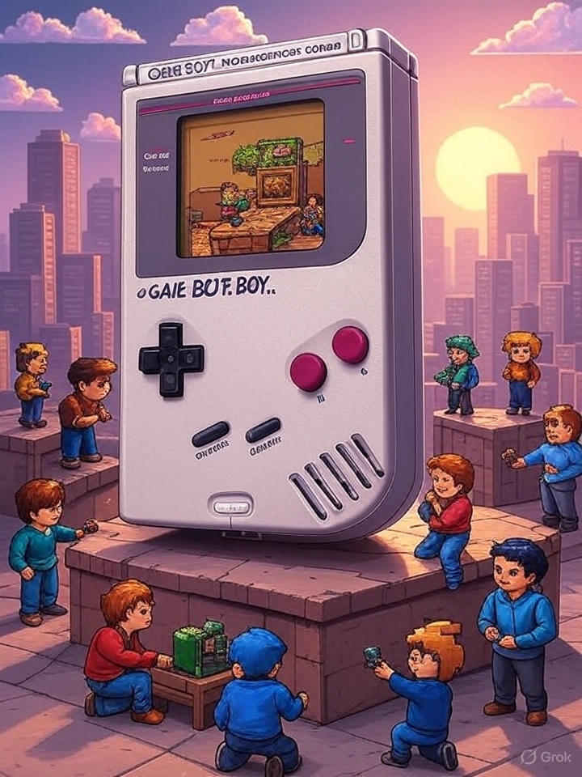
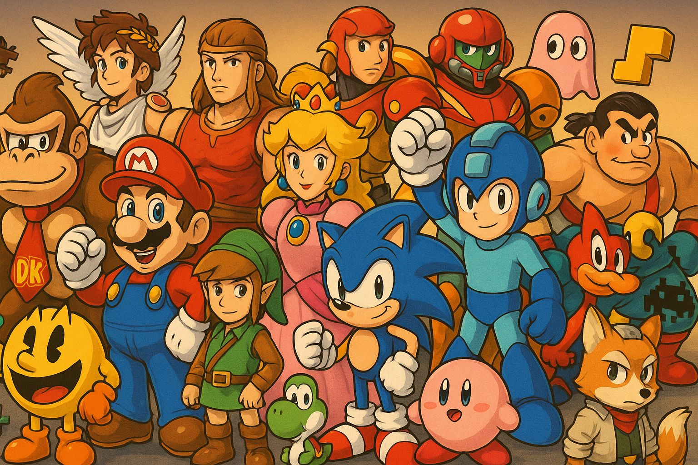
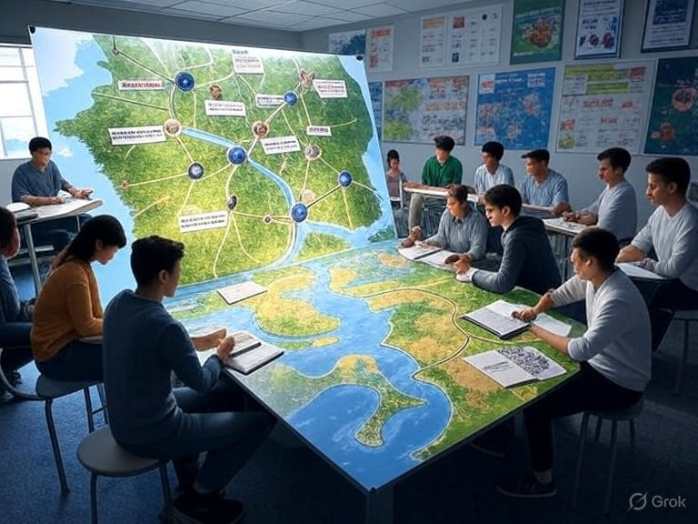

# Novedades

--- start-multi-column: BloqueMicrohobbit00
```column-settings  
Number of Columns: 2
Border: off
```


## Curso de ZXGM / Capítulo Básico 04: Configuración de un nuevo proyecto

En este cuarto capítulo del curso básico de ZX Game Maker (ZXGM), aprenderás a configurar un nuevo proyecto desde "cero" (el motor está ideado para que partas de una plantilla mínima), siguiendo un enfoque estructurado y gradual, como un escultor tallando una obra a partir de una piedra en bruto. 

Usaremos como ejemplo el desarrollo de [[MOS Games - Cursed Zapatilla - La Excéntrica Cruzada de Sir Patillas (2025)|Cursed Zapatilla: La Excéntrica Cruzada de Sir Patillas]], un juego de plataformas inspirado en _Ghosts 'n Goblins_, _Ghouls 'n Ghosts_ y _Cursed Castilla_. 

Continuar leyendo en ... [[Curso de ZXGM Básico 04 - Configuración de un nuevo proyecto  🔴②]]

--- column-end ---


## Curso de AGD / Capítulo 32: Información detallada sobre la estructura en memoria de AGD

Gracias a [Sergio thEpOpE  🌐🟡③](https://www.youtube.com/c/thEpOpESergio), tenemos disponible un increible documento, que convierto a html a continuación, adicionalmente, puedes consultar este [artículo que nos muestra como trabajar con ASM desde AGD](https://web.archive.org/web/20190326191446/https://www.funspot.it/agd-asm-calls).

Continuar leyendo en ... [[Tutorial de AGD 2018 Capítulo 32 - Información detallada sobre la estructura en memoria de AGD ⚫①]]

--- column-end ---


## MOS Games - Cursed Zapatilla - La Excéntrica Cruzada de Sir Patillas (2025)

¡Ponte la armadura de Sir Patillas en este emocionante juego de plataformas homenaje a los clásicos _Ghouls 'n Ghosts_, _Ghosts 'n Goblins_ y, especialmente, el naravilloso _Cursed Castilla_! 

Con tus botas de batalla como arma principal, te enfrentarás a zombis, esqueletos y criaturas infernales a base de zapatillazos. En un mundo tétrico pero lleno de color, con cementerios decorados con ...

Continuar leyendo en ... [[MOS Games - Cursed Zapatilla - La Excéntrica Cruzada de Sir Patillas (2025)]]

--- column-end ---


### Curso Tiled / Capítulo 01 - ¿Qué es Tiled Map Editor?

En este capítulo, vamos a descubrir Tiled Map Editor, una herramienta potente y gratuita que te ayudará a dar forma a los niveles de tus juegos. Se ha convertido en un referente para desarrolladores independientes y aficionados que quieren materializar sus ideas sin gastar en software caro. 

Es un punto de partida perfecto si estás empezando o si buscas pulir tus habilidades en el diseño de niveles, con una curva de aprendizaje amigable y resultados profesionales.

Seguir leyendo en ... [[Curso de Tiled Capítulo 01 - Qué es Tiled Map Editor 🟡③]]

--- column-end ---



## Curso GB Studio / Capítulo 03: Contexto histórico de la Game Boy

La Game Boy, lanzada por Nintendo en 1989, supuso un antes y un después en el mundo de los videojuegos portátiles. 

Esta pequeña consola no solo sentó las bases del gaming móvil tal como lo conocemos hoy, sino que también estableció un estándar único para los juegos retro en 8 bits, un legado que sigue vivo gracias a herramientas como GB Studio. 

Continuar leyendo en [[Curso de GB Studio - Capítulo 03 - Contexto histórico de la Game Boy 🟡③]]

--- column-end ---


## Blog / El tiempo, resulta que si es oro

Los que programamos, como forma de vida, con independencia de que sea nuestra profesion habitual o no, sabemos desde siempre que el tiempo es oro, o, de forma más precisa, que si no automatizas, no llegarás muy lejos.

De las máquinas programables con decenas de miles de cablecitos físicos, los transistores que permitieron máquinas cada vez mas genéricas programadas directamente con ceros y unos, el assembler, c y todos los niveles de abstracción posteriores que han permitido una explosión de creatividad expansiva, son hijos de la misma premisa, y a nadie en su sano juicio se le ha ocurido reivindicar lo injusto de los compiladores de c que vienen a quitar el trabajo a los creadores de código artesano para la ENIAC.

Continua leyendo en ... [[Blog - El tiempo resulta que si es oro - 2025-08-11 ⚫①]]

--- column-end ---


## Curso de ZX-Paintbrush

Este curso te invita a sumergirte en el fascinante mundo de ZX-Paintbrush, una herramienta clásica para diseñar gráficos en el legendario ZX Spectrum. 

A lo largo de los módulos, aprenderás desde los fundamentos hasta técnicas avanzadas para crear pantallas, tiles y sprites, integrándolos en tus propios juegos retro. 

Continua leyendo en ... [[Curso de ZX-Paintbrush - Creación de Gráficos para ZX Spectrum  ⚫①]]

--- column-end ---




## KB / Galería de Imágenes de Efemérides

En esta sección agrego una pequeña galería de las imáganes de cabecera creadas para las diferentes efemérides de las que hablamos en la cabecera de la web.

¡Espero que la disfruten!

Continuar leyendo en ... [[Galería de Imágenes de Efemétides  ⚫①]]

--- column-end ---


## Curso PixiJS / Dibujando formas básicas y gráficos

PixiJS es una biblioteca de JavaScript para gráficos 2D que aprovecha WebGL para un renderizado rápido y eficiente, con Canvas como alternativa si WebGL no está disponible. 

Comenzaremos hoy con el dibujado de formas básicas

Continuar leyendo en ... [[Dibujando formas básicas y gráficos (PixiJS) 🟡③]] 

--- column-end ---


## Curso Maquinitas Boriel / Curso Crea Juegos al Estilo Maquinita con Boriel BASIC

¡Bienvenidos a un apasionante viaje al corazón de la nostalgia! Este curso te invita a redescubrir la magia de las **maquinitas** —esas pequeñas joyas electrónicas como **Game & Watch**, **Tronica** o los coloridos **Jungler**, **Popeye** y **Defender**— y a crear tus propios juegos inspirados en ellas usando **Boriel BASIC** en el **ZX Spectrum**. 

No importa si nunca has programado o si el ZX Spectrum es un desconocido para ti: esta guía está pensada para principiantes y amantes del retro por igual. Desde explorar la historia de estas máquinas icónicas hasta construir un juego completo con múltiples pantallas, gráficos vibrantes y mecánicas adictivas, te guiaremos paso a paso con ejemplos prácticos, ejercicios y un proyecto final que podrás compartir con el mundo.

Continuar leyendo en ... [[Curso Crea Juegos al Estilo Maquinita con Boriel BASIC 🟡③]]

--- column-end ---


## Curso de Visual bB / Historia y contexto del Atari 2600 y su relación con Visual bB

El Atari 2600, lanzado en 1977, supuso un antes y un después en la historia de los videojuegos al introducir los sistemas de entretenimiento doméstico basados en cartuchos intercambiables, una innovación que revolucionó el sector. Su influencia no se limita al ámbito tecnológico, sino que también dejó una huella imborrable en la cultura popular, sentando las bases para la industria moderna de los videojuegos. 

Por otro lado, Visual Batari Basic (Visual bB), una herramienta contemporánea, facilita a desarrolladores, desde principiantes hasta expertos, la creación de juegos para esta icónica consola. Este documento analiza la historia del Atari 2600, su impacto cultural y cómo Visual bB actúa como un puente entre el pasado y el presente del desarrollo de videojuegos.

Continuar leyendo en ... [[Historia y contexto del Atari 2600 y su relación con Visual bB 🟡③]]


--- column-end ---


## Curso de CPCTelera / Características principales del motor en CPCTelera

CPCtelera es una potente librería diseñada para facilitar el desarrollo de videojuegos y aplicaciones en el ordenador Amstrad CPC, utilizando principalmente lenguajes C y ensamblador Z80.

Su "motor" abarca un conjunto de herramientas y funciones que simplifican la gestión de gráficos, sonido, entrada/salida y otros aspectos clave para programar en esta plataforma retro. A continuación, se describen las principales características del motor de CPCtelera, ideales para explorar en un curso sobre esta librería.

Continuar leyendo en ... [[Características principales del motor en CPCTelera 🟡③]]

--- column-end ---


## KB / Aprender a desarrollar videojuegos

Aprender a desarrollar videojuegos es una aventura apasionante que combina creatividad, tecnología y narrativa. 

Este proceso no solo implica programar, sino también diseñar mundos, personajes e historias que cautiven a los jugadores. Desde pequeños proyectos independientes hasta grandes producciones AAA, el desarrollo de videojuegos ofrece un espacio para explorar ideas innovadoras y conectar con audiencias globales. 

Continuar leyendo en ... [[Aprender a desarrollar videojuegos  ⚫①]]

 --- column-end ---


## Noticias / En marcha la prereserva de la edición física de Castle of Terror de PCNONOGames

Junio, 2025 – La comunidad de jugadores retro y coleccionistas de videojuegos está de celebración tras el anuncio de que la edición física de _Castle of Terror_, el nuevo título para Game Boy desarrollado por PCNONOGames. 

Este lanzamiento, que combina nostalgia con un diseño innovador, ha generado gran expectación entre los aficionados a los videojuegos de 8 bits.

Continuar leyendo en ... [[En marcha la prereserva de la edición física de Castle of Terror de PCNONOGames 🔴②]]

--- column-end ---


## KB / Aprendeizaje basado en evidencia

Imagina un camino de aprendizaje donde cada paso que das está guiado por luces que te muestran lo que realmente funciona. 

Eso es el aprendizaje basado en evidencia (EBL, por sus siglas en inglés: Evidence-Based Learning), una aventura educativa en la que usamos datos, investigaciones y experiencias reales para crear momentos de aprendizaje que de verdad conectan contigo. 

No se trata solo de teorías frías; es un enfoque vivo que combina lo mejor de la ciencia con las historias y necesidades únicas de cada estudiante. ¿Te animas a descubrir cómo aprender de una manera más efectiva y personalizada?


Continuar leyendo en ... [[Aprendizaje basado en evidencia  ⚫①]]

--- column-end ---


## Public Brain / Estructura del Conocimiento Humano y Científico

La estructura del conocimiento humano y científico se fundamenta en la interacción dinámica entre observación, experimentación y reflexión crítica. A través de la historia, las disciplinas científicas han evolucionado mediante la sistematización de datos y la construcción de teorías que integran el pensamiento lógico con la creatividad, permitiendo a la humanidad desentrañar los misterios del universo y aplicar este saber en avances tecnológicos y sociales.

Continua leyendo en ... [[Estructura del Conocimiento Humano y Científico ⚫①]]

 --- column-end ---


## Public Brain / Estudiar libro - Think Fast and Slow - Daniel Kahneman

Bajo el título **Estudiar Thinking, Fast and Slow **, el libro de Kahneman desentraña la estructura del conocimiento humano y científico al explorar cómo nuestras mentes procesan información a través de dos sistemas: uno rápido, impulsado por la intuición, y otro lento, guiado por la lógica. 

Este marco revela los mecanismos detrás de nuestras decisiones, destacando la importancia de comprender sesgos y errores para mejorar el pensamiento crítico en la ciencia y la vida diaria.

Continua leyendo en ... [[Estudiar libro - Think Fast and Slow - Daniel Kahneman 🔴②]]

 --- column-end ---
--- multi-column-end


![[Plantilla - 1MT#One More Thing]]


