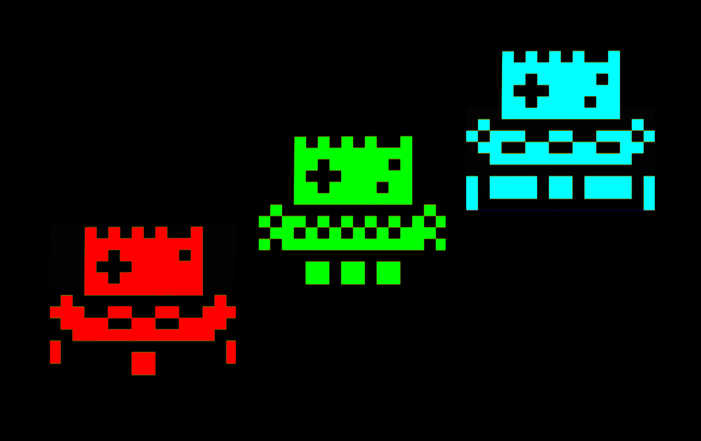
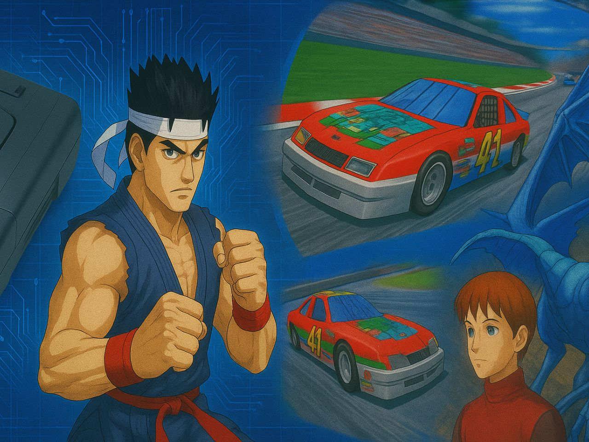
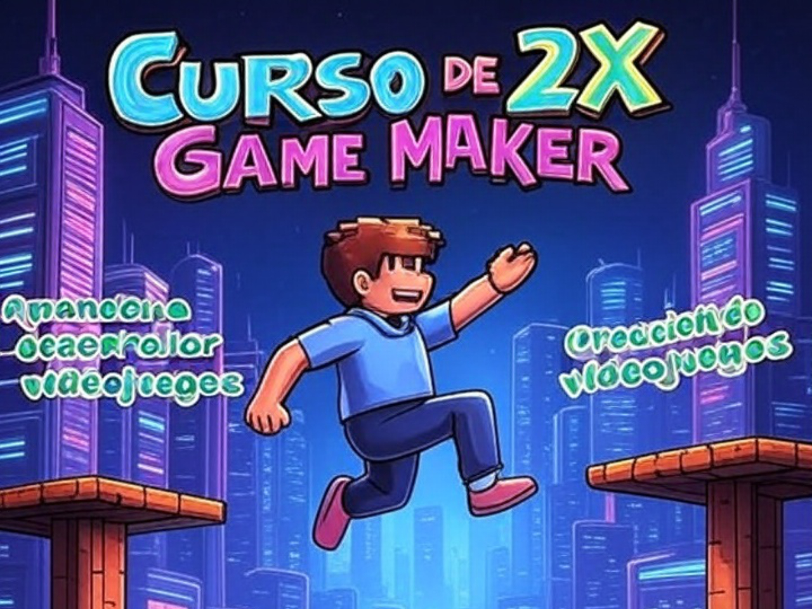
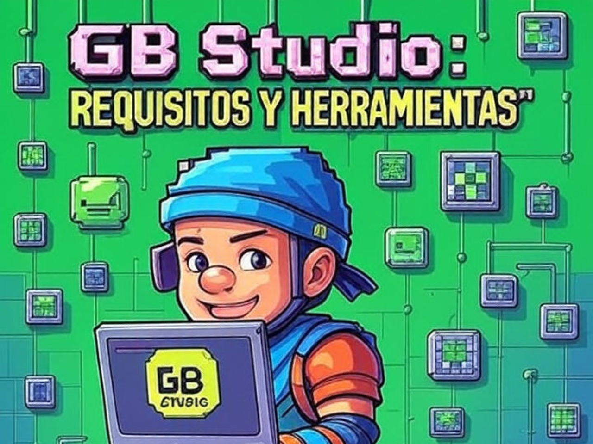

# Novedades

--- start-multi-column: BloqueMicrohobbit00
```column-settings  
Number of Columns: 2
Border: off
```


## Dibujando formas básicas y gráficos

PixiJS es una biblioteca de JavaScript para gráficos 2D que aprovecha WebGL para un renderizado rápido y eficiente, con Canvas como alternativa si WebGL no está disponible. 

Comenzaremos hoy con el dibujado de formas básicas

Continuar leyendo en ... [[Dibujando formas básicas y gráficos (PixiJS) 🟡③]] 

--- column-end ---


## Capítulo 16: Nuestro primer enemigo.

Mucho hemos caminado desde que creamos nuestra primera pantalla, nuestra primera animación o pusimos a nuestro prota en movimiento. 

Hoy vamos a comenzar a dar vida a nuestro primer enemigo.

Continuar leyendo en ... [[Tutorial de AGD 2018 Capítulo 16 - Nuestro primer enemigo. ⚫①]]


--- column-end ---



## Galería de Imágenes de Efemérides

En esta sección agrego una pequeña galería de las imáganes de cabecera creadas para las diferentes efemérides de las que hablamos en la cabecera de la web.

¡Espero que la disfruten!

Continuar leyendo en ... [[Galería de Imágenes de Efemétides  ⚫①]]

--- column-end ---


## Curso Crea Juegos al Estilo Maquinita con Boriel BASIC

¡Bienvenidos a un apasionante viaje al corazón de la nostalgia! Este curso te invita a redescubrir la magia de las **maquinitas** —esas pequeñas joyas electrónicas como **Game & Watch**, **Tronica** o los coloridos **Jungler**, **Popeye** y **Defender**— y a crear tus propios juegos inspirados en ellas usando **Boriel BASIC** en el **ZX Spectrum**. 

No importa si nunca has programado o si el ZX Spectrum es un desconocido para ti: esta guía está pensada para principiantes y amantes del retro por igual. Desde explorar la historia de estas máquinas icónicas hasta construir un juego completo con múltiples pantallas, gráficos vibrantes y mecánicas adictivas, te guiaremos paso a paso con ejemplos prácticos, ejercicios y un proyecto final que podrás compartir con el mundo.

Continuar leyendo en ... [[Curso Crea Juegos al Estilo Maquinita con Boriel BASIC 🟡③]]

--- column-end ---


## Curso de ZX Game Maker

El Curso de ZX Game Maker está diseñado para introducir a principiantes y entusiastas en el apasionante mundo del desarrollo de videojuegos 2D utilizando el motor ZX Game Maker, una herramienta accesible y potente para crear juegos sin necesidad de conocimientos avanzados de programación. 

Este curso te guiará paso a paso desde los fundamentos del entorno hasta la creación de un videojuego completo, combinando teoría, práctica y proyectos reales. 

Aprenderás a manejar sprites, colisiones, sonidos, niveles y lógicas básicas de programación con el lenguaje GML (Game Maker Language), ideal para dar vida a tus ideas de manera sencilla y divertida. Al finalizar, estarás preparado para desarrollar tus propios videojuegos y explorar oportunidades en la industria del entretenimiento digital.

Continuar leyendo en ... [[Curso de ZX Game Maker ⚫①]]

--- column-end ---


## Historia y contexto del Atari 2600 y su relación con Visual bB

El Atari 2600, lanzado en 1977, supuso un antes y un después en la historia de los videojuegos al introducir los sistemas de entretenimiento doméstico basados en cartuchos intercambiables, una innovación que revolucionó el sector. Su influencia no se limita al ámbito tecnológico, sino que también dejó una huella imborrable en la cultura popular, sentando las bases para la industria moderna de los videojuegos. 

Por otro lado, Visual Batari Basic (Visual bB), una herramienta contemporánea, facilita a desarrolladores, desde principiantes hasta expertos, la creación de juegos para esta icónica consola. Este documento analiza la historia del Atari 2600, su impacto cultural y cómo Visual bB actúa como un puente entre el pasado y el presente del desarrollo de videojuegos.

Continuar leyendo en ... [[Historia y contexto del Atari 2600 y su relación con Visual bB 🟡③]]

--- column-end ---


## Requisitos previos y herramientas necesarias para GBStudio

GB Studio es una herramienta accesible y poderosa para desarrollar videojuegos retro al estilo Game Boy, ideal tanto para principiantes como para entusiastas del diseño de juegos. 

Este documento detalla los requisitos previos y las herramientas necesarias para aprovechar al máximo un curso de GB Studio, con una redacción optimizada para claridad y un enfoque práctico, acompañado de referencias verificadas que respaldan y cuestionan el contenido.

Continuar leyendo en [[Requisitos previos y herramientas necesarias para GBStudio 🟡③]]


--- column-end ---


## Características principales del motor en CPCTelera

CPCtelera es una potente librería diseñada para facilitar el desarrollo de videojuegos y aplicaciones en el ordenador Amstrad CPC, utilizando principalmente lenguajes C y ensamblador Z80.

Su "motor" abarca un conjunto de herramientas y funciones que simplifican la gestión de gráficos, sonido, entrada/salida y otros aspectos clave para programar en esta plataforma retro. A continuación, se describen las principales características del motor de CPCtelera, ideales para explorar en un curso sobre esta librería.

Continuar leyendo en ... [[Características principales del motor en CPCTelera 🟡③]]

--- column-end ---


## Aprender a desarrollar videojuegos

Aprender a desarrollar videojuegos es una aventura apasionante que combina creatividad, tecnología y narrativa. 

Este proceso no solo implica programar, sino también diseñar mundos, personajes e historias que cautiven a los jugadores. Desde pequeños proyectos independientes hasta grandes producciones AAA, el desarrollo de videojuegos ofrece un espacio para explorar ideas innovadoras y conectar con audiencias globales. 

Continuar leyendo en ... [[Aprender a desarrollar videojuegos  ⚫①]]

 --- column-end ---


## Aprendeizaje basado en evidencia

Imagina un camino de aprendizaje donde cada paso que das está guiado por luces que te muestran lo que realmente funciona. 

Eso es el aprendizaje basado en evidencia (EBL, por sus siglas en inglés: Evidence-Based Learning), una aventura educativa en la que usamos datos, investigaciones y experiencias reales para crear momentos de aprendizaje que de verdad conectan contigo. 

No se trata solo de teorías frías; es un enfoque vivo que combina lo mejor de la ciencia con las historias y necesidades únicas de cada estudiante. ¿Te animas a descubrir cómo aprender de una manera más efectiva y personalizada?


Continuar leyendo en ... [[Aprendizaje basado en evidencia  ⚫①]]

--- column-end ---


## Estructura del Conocimiento Humano y Científico

La estructura del conocimiento humano y científico se fundamenta en la interacción dinámica entre observación, experimentación y reflexión crítica. A través de la historia, las disciplinas científicas han evolucionado mediante la sistematización de datos y la construcción de teorías que integran el pensamiento lógico con la creatividad, permitiendo a la humanidad desentrañar los misterios del universo y aplicar este saber en avances tecnológicos y sociales.

Continua leyendo en ... [[Estructura del Conocimiento Humano y Científico ⚫①]]

 --- column-end ---


## Estudiar libro - Think Fast and Slow - Daniel Kahneman

Bajo el título **Estudiar Thinking, Fast and Slow **, el libro de Kahneman desentraña la estructura del conocimiento humano y científico al explorar cómo nuestras mentes procesan información a través de dos sistemas: uno rápido, impulsado por la intuición, y otro lento, guiado por la lógica. 

Este marco revela los mecanismos detrás de nuestras decisiones, destacando la importancia de comprender sesgos y errores para mejorar el pensamiento crítico en la ciencia y la vida diaria.

Continua leyendo en ... [[Estudiar libro - Think Fast and Slow - Daniel Kahneman 🔴②]]

 --- column-end ---
--- multi-column-end


![[Plantilla - 1MT#One More Thing]]


