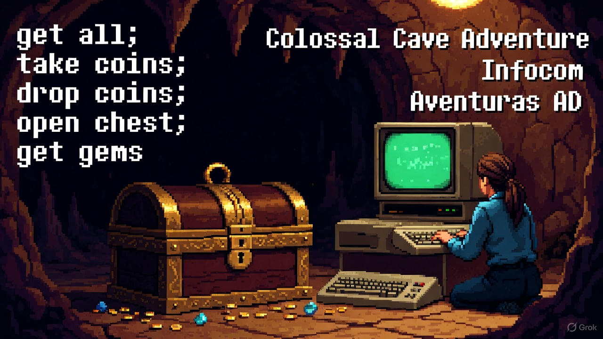
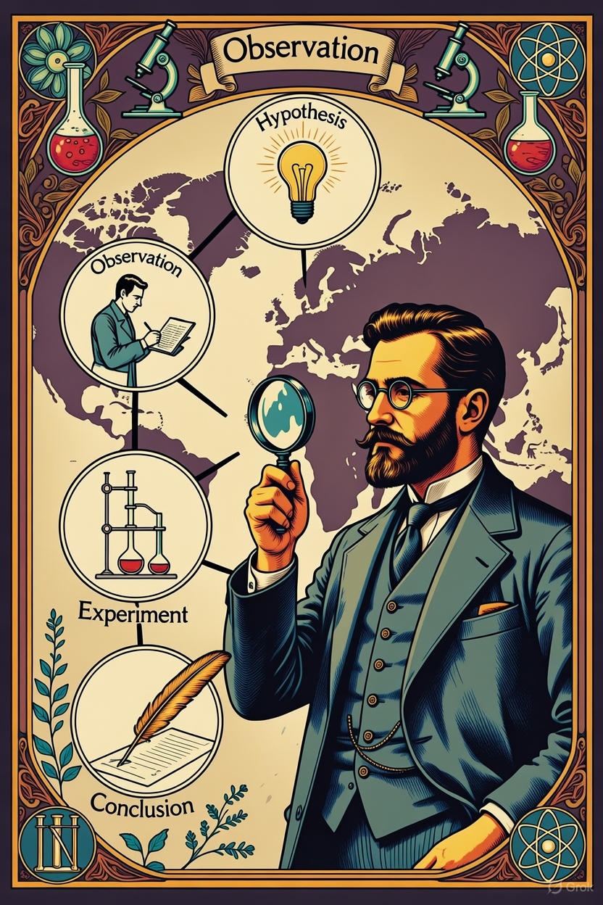

# Novedades

--- start-multi-column: BloqueMicrohobbit00
```column-settings  
Number of Columns: 2
Border: off
```


## Noticias - Lanzamiento de  Perseus para ZX Spectrum 128K: Una aventura épica impulsada por el motor Tuerkas128

Diciembre 2025 - La escena retro sigue llena de sorpresas, y esta vez el protagonista es *Perseus*, un nuevo título para ZX Spectrum 128K desarrollado por RetroBensoft que ha generado mucho interés en la comunidad. 

Este juego te sumerge en la mitología griega, donde debes derrotar a Medusa, y utiliza el potente motor Tuerkas128, una herramienta que promete elevar el nivel de los desarrollos actuales para esta plataforma clásica.

Continuar leyendo en ... [[Lanzamiento de Perseus para ZX Spectrum 128K -  Una aventura épica impulsada por el motor Tuerkas128 - 2025-12-26 🟡③]]

--- column-end ---


## GameDev C++ - Curso de Desarrollo de Videojuegos a pelo con Fran Gallego

Desarrollar "a pelo" no es lo más rápido, pero te da una comprensión profunda de cómo funcionan los videojuegos. Este curso, construido mientras estudio los contenidos publicados por Fran Gallego, te equipa con habilidades para crear prototipos, experimentar sin límites y, si quieres, dar el salto a motores comerciales con una base sólida. ¡Es tu oportunidad de programar como los pioneros de los 90, pero con herramientas modernas!

Continuar leyendo en ... [[Curso de Desarrollo de Videojuegos a pelo con Fran Gallego 🟡③]]

--- column-end ---


## Videojuegos Aventura - Orígenes globales: Colossal Cave Adventure (1976) → Infocom → Aventuras AD (1987).

Imagina que estás explorando una cueva oscura, solo guiado por tus comandos de texto, donde cada decisión puede llevarte a un tesoro o a un final prematuro. Así nació el género de las aventuras conversacionales, un viaje que empezó en los mainframes universitarios de Estados Unidos y llegó hasta los ZX Spectrum españoles. En el marco del curso sobre la **historia de los videojuegos de aventura a través de CAAD** (Club de Aventuras AD), este módulo introductorio (Módulo 0) nos sumerge en los cimientos globales del género. 

Continuar leyendo en ... [[Orígenes globales - Colossal Cave Adventure (1976) → Infocom → Aventuras AD (1987) 🟡③]]

--- column-end ---


## Herramientas - Curso de ZX-Paintbrush

Este curso te invita a sumergirte en el fascinante mundo de ZX-Paintbrush, una herramienta clásica para diseñar gráficos en el legendario ZX Spectrum. 

A lo largo de los módulos, aprenderás desde los fundamentos hasta técnicas avanzadas para crear pantallas, tiles y sprites, integrándolos en tus propios juegos retro. 

Continua leyendo en ... [[Curso de ZX-Paintbrush - Creación de Gráficos para ZX Spectrum  🟡③]]

--- column-end ---


## Epistemología - Definición y alcance de la epistemología

En el marco de la _Historia de la Epistemología y su aplicación en la Ciencia_, la epistemología se erige como una disciplina filosófica esencial que examina la naturaleza, los orígenes y los límites del conocimiento humano. Su relevancia para la ciencia radica en su capacidad para ofrecer un marco crítico que permite comprender cómo se construye, valida y aplica el saber científico. Este análisis define la epistemología de manera accesible, describe sus características fundamentales y explora su amplio alcance, destacando su influencia en el desarrollo del pensamiento científico y su importancia en la investigación práctica.

Continuar leyendo en ... [[Definición y alcance de la epistemología 🟡③]]

--- column-end ---



## Ciencia - Definición de ciencia y método científico

¿Te has preguntado alguna vez qué es realmente la ciencia o cómo sabemos que lo que nos cuenta es verdad? No estás solo: desde que los primeros curiosos miraron las estrellas o se preguntaron por qué una manzana cae del árbol, la humanidad ha buscado respuestas. 

Vamos a embarcarnos en un viaje por la historia para descubrir qué significa "ciencia" y cómo el método científico se convirtió en su compañero inseparable. No es solo un montón de datos fríos ni un libro de reglas para genios en bata blanca; es una aventura humana, llena de preguntas, pruebas y sorpresas, que ha transformado cómo vemos el mundo. ¿Listo para explorar cómo llegamos hasta aquí?

Continuar leyendo en ... [[Definición de ciencia y método científico 🔴②]]

--- column-end ---


## Blog - El Antiintromisionismo, una propuesta filosófica y práctica

El antiintromisionismo nace como una evolución crítica del liberalismo político. Su objetivo es preservar la libertad individual sin cargar con las distorsiones narrativas que afectan al término «liberalismo». En lugar de adoptar un ideario completo, se centra en un núcleo claro y poco ambiguo: **prohibir cualquier intromisión en la vida ajena**, salvo que se demuestre con lógica y evidencia científica que esa no-intromisión daña la libertad de terceros.

Continuar leyendo en ... [[Blog - El Antiintromisionismo, una propuesta filosófica y práctica 🟡③]]

--- column-end ---


## Arquitectura Software - Curso Patrones y Calidad del Software

En este curso trataremos las cuestiones relacionadas con patrones de diseño y calidad del software. Comenzaremos con las bases e iremos avanzando hacia una serie de prompts de contexto que nos sirvan en nuestro desarrollo en el dia a dia.

Continuar leyendo en ... [[Curso sobre Patrones y Calidad del Software 🔴②]]

--- column-end ---


## Motores - Curso de Programación de Videojuegos con Godot Engine

Este curso ofrece una formación completa y práctica en la programación de videojuegos con el motor Godot Engine, centrándonos en los lenguajes C y C++ mediante el sistema GDExtension, que permite integrar código nativo de manera eficiente en versiones de Godot 4 y superiores. 

Continuar leyendo en [[Curso de Programación de Videojuegos con Godot Engine 🔴②]]

 --- column-end ---


## Public Brain - Estructura del Conocimiento Humano y Científico

La estructura del conocimiento humano y científico se fundamenta en la interacción dinámica entre observación, experimentación y reflexión crítica. A través de la historia, las disciplinas científicas han evolucionado mediante la sistematización de datos y la construcción de teorías que integran el pensamiento lógico con la creatividad, permitiendo a la humanidad desentrañar los misterios del universo y aplicar este saber en avances tecnológicos y sociales.

Continua leyendo en ... [[Estructura del Conocimiento Humano y Científico ⚫①]]

 --- column-end ---
--- multi-column-end


![[Plantilla - 1MT#One More Thing]]


