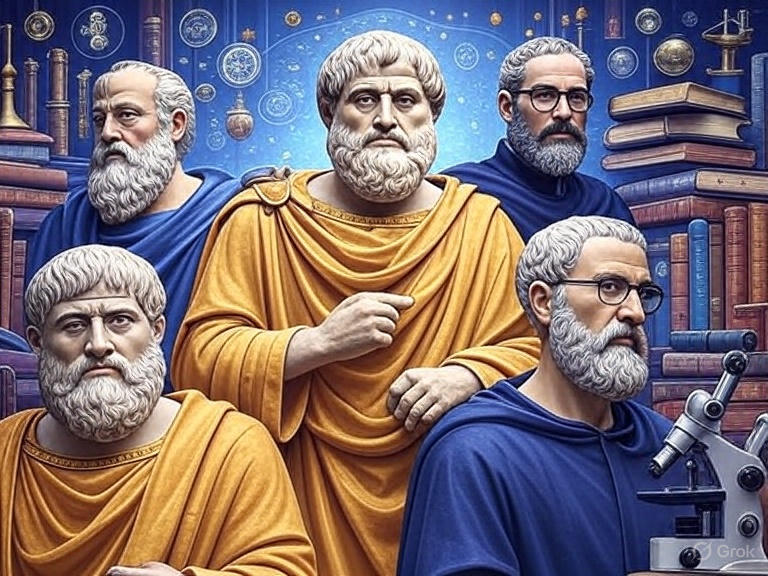

# Novedades

--- start-multi-column: BloqueMicrohobbit00
```column-settings  
Number of Columns: 2
Border: off
```


## Blog - El Antiintromisionismo, una propuesta filosófica y práctica

El antiintromisionismo nace como una evolución crítica del liberalismo político. Su objetivo es preservar la libertad individual sin cargar con las distorsiones narrativas que afectan al término «liberalismo». En lugar de adoptar un ideario completo, se centra en un núcleo claro y poco ambiguo: **prohibir cualquier intromisión en la vida ajena**, salvo que se demuestre con lógica y evidencia científica que esa no-intromisión daña la libertad de terceros.

Continuar leyendo en ... [[Blog - El Antiintromisionismo, una propuesta filosófica y práctica  🔴②]]

--- column-end ---

--- column-end ---


## KB - Curso de Programación de Videojuegos con Godot Engine

Este curso ofrece una formación completa y práctica en la programación de videojuegos con el motor Godot Engine, centrándonos en los lenguajes C y C++ mediante el sistema GDExtension, que permite integrar código nativo de manera eficiente en versiones de Godot 4 y superiores. 

Continuar leyendo en [[Curso de Programación de Videojuegos con Godot Engine 🔴②]]

--- column-end ---


## Noticias - Preventa de Cinco Duros Vol. 3 El legado olvidado del videojuego español cobra vida con un salto hacia los 90 en edición coleccionista

**Octubre de 2025** – El año 2025 está siendo un auténtico renacimiento para la escena retro española. Tras [[Noticias - El esperadísimo regreso de Microhobby - 2025-05-05 🟡③|el regreso de Microhobby]], el [[Noticias - Estreno del Episodio 1 de "Cinco Duros" - El arranque épico de la historia del videojuego español llega a la pantalla - 2025-09-28 🟡③|estreno del primer episodio de la serie documental Cinco Duros]] y el [[Noticias - Malasombra para NES - una nueva obra maestra de 4MHz - 2025-04-28 🟡③|lanzamiento de títulos homebrew como Malasombra para NES]], Dolmen Editorial acaba de abrir la **preventa del Volumen 3 de *Cinco Duros: La historia del videojuego en España para todos***. Este libro, escrito por **Diego Vargas Pardo**, nos sumerge en los años **1990-1993**: la época en que la industria española pasó de los microordenadores de 8 bits al dominio de las consolas, la profesionalización del sector y la presión del mercado internacional.

Continuar leyendo en ... [[Noticias - Preventa de Cinco Duros Vol. 3 El legado olvidado del videojuego español cobra vida con un salto hacia los 90 en edición coleccionista - 2025-10-27 🟡③]]

--- column-end ---



## Historia de la Epistemología y su aplicación en la Ciencia

Te invito a un fascinante recorrido por la historia de la epistemología, desde sus raíces filosóficas hasta su impacto en la ciencia moderna. Exploraremos cómo las teorías del conocimiento han dado forma a las prácticas científicas y cómo los descubrimientos científicos han transformado, a su vez, nuestra comprensión del saber. 

Combinando un enfoque histórico con aplicaciones prácticas, trataré de fomentar la reflexión crítica y la conexión entre disciplinas, preparando a todo aquel capaz de aceptar el reto para analizar el conocimiento científico en un mundo complejo.

Continuar leyendo en [[Historia de la Epistemología y su aplicación en la Ciencia 🔴②]]

 --- column-end ---


## Public Brain - Estructura del Conocimiento Humano y Científico

La estructura del conocimiento humano y científico se fundamenta en la interacción dinámica entre observación, experimentación y reflexión crítica. A través de la historia, las disciplinas científicas han evolucionado mediante la sistematización de datos y la construcción de teorías que integran el pensamiento lógico con la creatividad, permitiendo a la humanidad desentrañar los misterios del universo y aplicar este saber en avances tecnológicos y sociales.

Continua leyendo en ... [[Estructura del Conocimiento Humano y Científico ⚫①]]

 --- column-end ---

--- multi-column-end


![[Plantilla - 1MT#One More Thing]]


