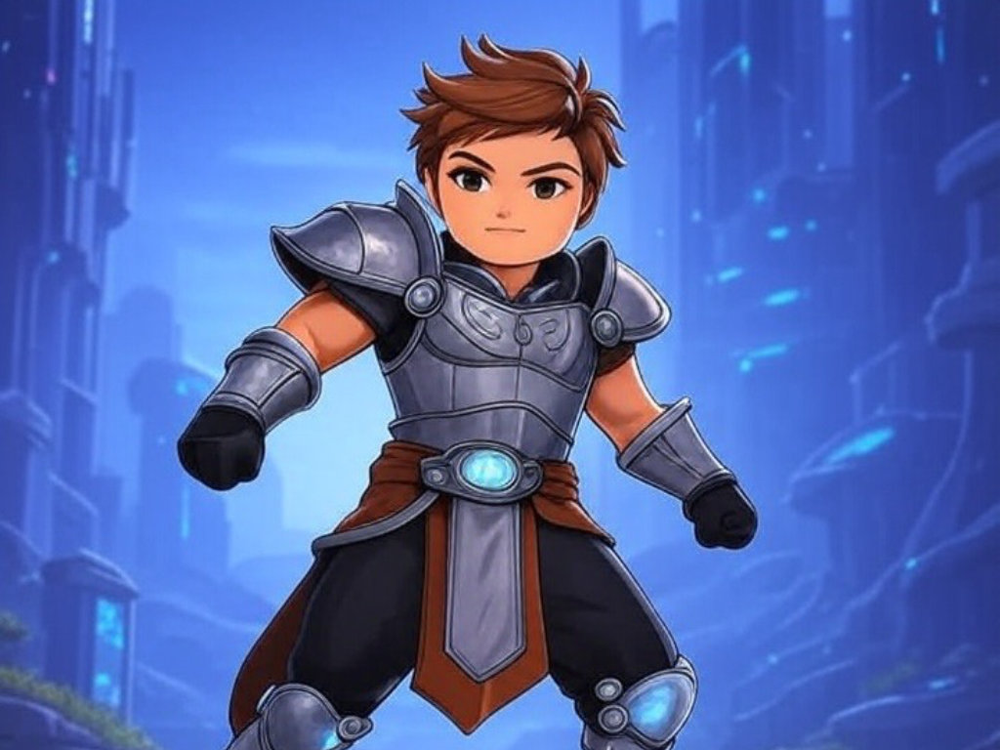

# Novedades

--- start-multi-column: BloqueMicrohobbit00
```column-settings  
Number of Columns: 2
Border: off
```


## Curso de CPCTelera

CPCTelera es un potente motor de desarrollo diseñado para la creación de videojuegos y aplicaciones gráficas para sistemas retro, especialmente para el ordenador Amstrad CPC. 

Este curso está diseñado para introducir a los participantes en el fascinante mundo de la programación de videojuegos utilizando esta herramienta, ofreciendo una base sólida para aquellos que deseen explorar el desarrollo en plataformas clásicas. 

Este es otro plan a 180-240 dias en el que desarrollaremos lo necesario para empezar a crear cosas en Web con esta plataforma.

Continuar leyendo en ... [[Curso de CPCTelera  ⚫①]]

 --- column-end ---


## Curso de PixiJS

Este es otro plan a 90-120 dias en el que desarrollaremos lo necesario para empezar a crear cosas en Web con esta plataforma.

El contenido es temporal y tengo que afinarlo documento por documento para dotarlo de la continuidad y narrativa necesarias para que sea util como curso, pero de este modo podreis seguir el progreso casi en tiempo real.

Continuar leyendo en ... [[Curso de PixiJS ⚫①]]

 --- column-end ---


## Tutorial de AGD 2018 Edition

Hace poco dos fans del este curso, que no estaba disponible online desde 2021, me recordaron que no predicaba solo en el desierto. Si, me tocaron la patata, así que además de lo que tengo en mente, he tomado la determinación de tomarme el tiempo para rescatar aquelllos contenidos de mi vieja y maltrecha web wordpress e incorporarlos en esta nueva etapa. ¡Espero que disfruten creando juego tanto como yo creando el curso!...

En este momento, este es un plan de restauración y republicación de entre 30-60 dias, modificandolo lo imprescindible para que funcione correctamente en esta nueva web. Ya habra tiempo de crear algo ... nuevo #tarjetita

Continua leyendo en ... [[Tutorial de AGD 2018 Edition ⚫①]]
 
--- column-end ---


## Estructura del Conocimiento Humano y Científico

La estructura del conocimiento humano y científico se fundamenta en la interacción dinámica entre observación, experimentación y reflexión crítica. A través de la historia, las disciplinas científicas han evolucionado mediante la sistematización de datos y la construcción de teorías que integran el pensamiento lógico con la creatividad, permitiendo a la humanidad desentrañar los misterios del universo y aplicar este saber en avances tecnológicos y sociales.

Continua leyendo en ... [[Estructura del Conocimiento Humano y Científico ⚫①]]


 --- column-end ---
--- multi-column-end


![[Plantilla - 1MT#One More Thing]]


