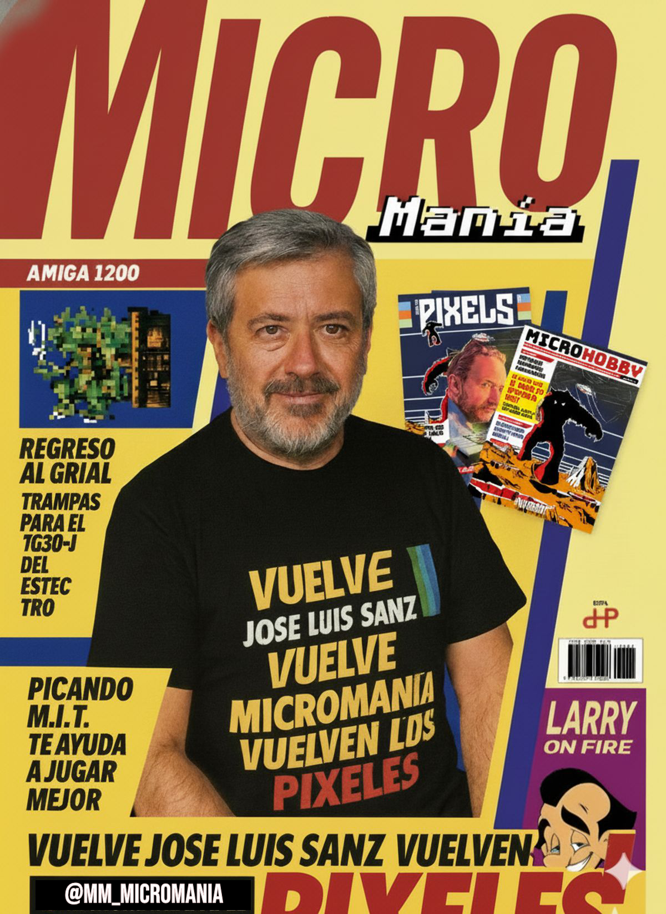

# Novedades

--- start-multi-column: BloqueMicrohobbit00
```column-settings  
Number of Columns: 2
Border: off
```


## Noticias - El esperadísimo regreso de Micromanía: Una nueva etapa para una revista absolutamente icónica

**¡Qué alegría para los amantes de los videojuegos retro!** 

Después de algo más de un año y medio, que se hizo interminable, la legendaria revista **Micromanía** vuelve a la vida. El pasado domingo 7 de diciembre de 2025, en el animado Salón del Videojuego de Madrid, José Luis Sanz, conocido como "Skywalker", y Marcos García, "The Elf", compartieron los primeros detalles de esta cuarta etapa. 

Es un renacimiento que mezcla el encanto de los años 80 y 90 con el ritmo actual del mundo de los videojuegos, uniendo generaciones de aficionados.

Continua leyendo en ... [[Noticias - El esperadísimo regreso de Micromanía Una nueva etapa para una revista absolutamente icónica - 2025-12-09 🟡③]]

--- column-end ---


## Blog - El Antiintromisionismo, una propuesta filosófica y práctica

El antiintromisionismo nace como una evolución crítica del liberalismo político. Su objetivo es preservar la libertad individual sin cargar con las distorsiones narrativas que afectan al término «liberalismo». En lugar de adoptar un ideario completo, se centra en un núcleo claro y poco ambiguo: **prohibir cualquier intromisión en la vida ajena**, salvo que se demuestre con lógica y evidencia científica que esa no-intromisión daña la libertad de terceros.

Continuar leyendo en ... [[Blog - El Antiintromisionismo, una propuesta filosófica y práctica 🟡③]]


--- column-end ---


## KB - Curso de Programación de Videojuegos con Godot Engine

Este curso ofrece una formación completa y práctica en la programación de videojuegos con el motor Godot Engine, centrándonos en los lenguajes C y C++ mediante el sistema GDExtension, que permite integrar código nativo de manera eficiente en versiones de Godot 4 y superiores. 

Continuar leyendo en [[Curso de Programación de Videojuegos con Godot Engine 🔴②]]

--- column-end ---


## Historia de la Epistemología y su aplicación en la Ciencia

Te invito a un fascinante recorrido por la historia de la epistemología, desde sus raíces filosóficas hasta su impacto en la ciencia moderna. Exploraremos cómo las teorías del conocimiento han dado forma a las prácticas científicas y cómo los descubrimientos científicos han transformado, a su vez, nuestra comprensión del saber. 

Combinando un enfoque histórico con aplicaciones prácticas, trataré de fomentar la reflexión crítica y la conexión entre disciplinas, preparando a todo aquel capaz de aceptar el reto para analizar el conocimiento científico en un mundo complejo.

Continuar leyendo en [[Historia de la Epistemología y su aplicación en la Ciencia 🟡③]]

 --- column-end ---


## Public Brain - Estructura del Conocimiento Humano y Científico

La estructura del conocimiento humano y científico se fundamenta en la interacción dinámica entre observación, experimentación y reflexión crítica. A través de la historia, las disciplinas científicas han evolucionado mediante la sistematización de datos y la construcción de teorías que integran el pensamiento lógico con la creatividad, permitiendo a la humanidad desentrañar los misterios del universo y aplicar este saber en avances tecnológicos y sociales.

Continua leyendo en ... [[Estructura del Conocimiento Humano y Científico ⚫①]]

 --- column-end ---

--- multi-column-end


![[Plantilla - 1MT#One More Thing]]


