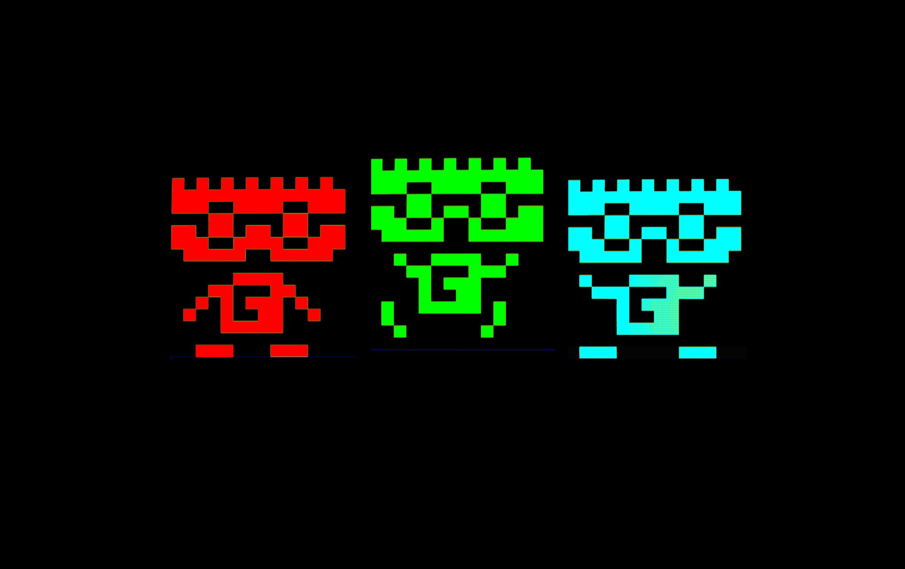
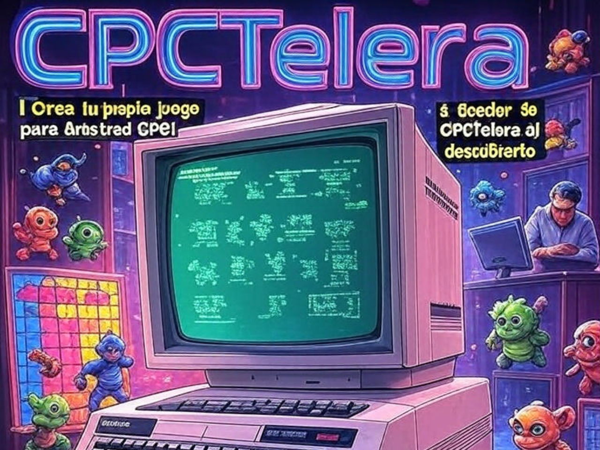
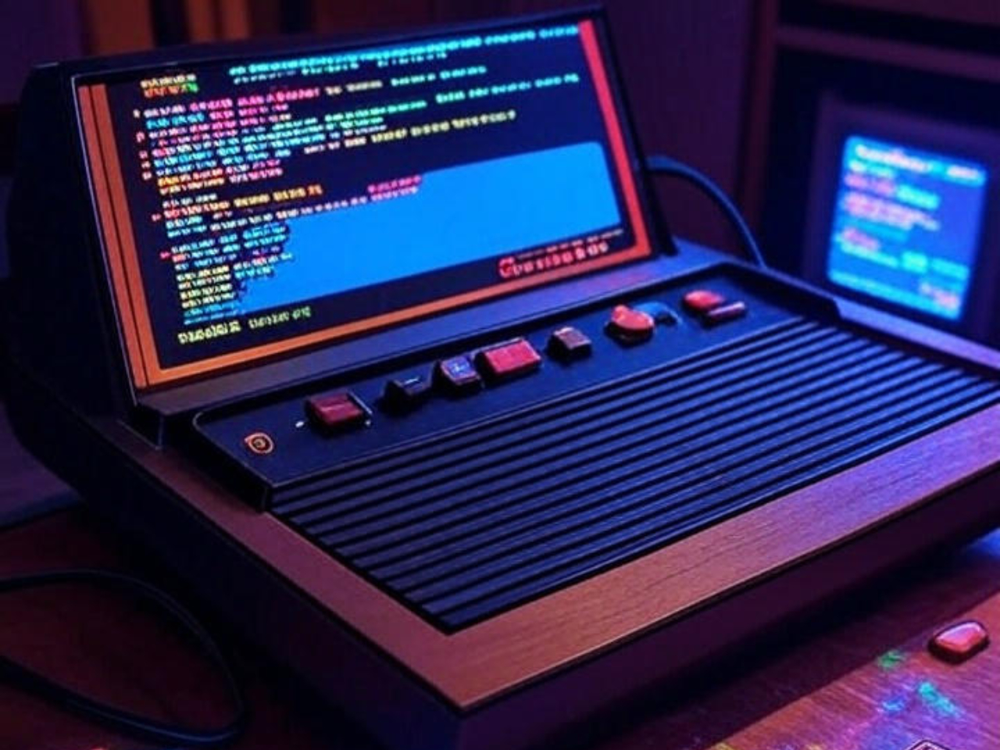

# Novedades

--- start-multi-column: BloqueMicrohobbit00
```column-settings  
Number of Columns: 2
Border: off
```



## Capítulo 06: Importando Sprite Sheets

Para lograrlo, lo primero es, si no estamos ya en ella, entrar a la pantalla de edicion de sprites (Letra S desde el menú principal), y una vez dentro, pulsar L. 

AGD nos preguntará si queremos cargar el "scratchpad" (que es como se llama en el sistema AGD)

Continuar leyendo en [[Tutorial de AGD 2018 Capitulo 06 - Importar Sprite Sheets ⚫①]]
--- column-end ---


## ¿Qué es CPCTelera? Historia y propósito

CPCTelera es un framework de desarrollo diseñado para facilitar la creación de videojuegos y aplicaciones multimedia para el Amstrad CPC, un ordenador personal de los años 80 conocido por su popularidad en Europa. 

Este entorno proporciona una colección de herramientas y funciones de bajo nivel que simplifican tareas esenciales en el desarrollo de juegos, como la gestión de sprites, gráficos, cambios de modos de vídeo, mapas de tiles y la programación de comportamientos autónomos, como la inteligencia artificial de enemigos. 

Continua leyendo en [[¿Qué es CPCTelera? Historia y propósito 🟡③]]

--- column-end ---



### ¿Qué es Visual Batari Basic?

Visual Batari Basic (Visual bB) es una herramienta innovadora diseñada para simplificar el desarrollo de videojuegos para la mítica consola Atari 2600.

Se trata de un entorno de desarrollo integrado (IDE) que combina la potencia del lenguaje batari Basic (bB), un compilador BASIC-like creado específicamente para programar juegos de Atari, con una interfaz visual intuitiva. 

Continuar leyendo ... [[¿Qué es Visual Batari Basic? 🟡③]]

--- column-end ---


### ¿Qué es GB Studio?

GB Studio es una herramienta gratuita y de código abierto diseñada para crear videojuegos retro al estilo de la Game Boy sin requerir conocimientos avanzados de programación. 

Su interfaz visual de tipo "arrastrar y soltar", disponible en Windows, Mac y Linux, simplifica el desarrollo, permitiendo a principiantes y aficionados crear juegos completos, desde aventuras de perspectiva cenital inspiradas en JRPG hasta proyectos personalizados. 

Continuar leyendo en ... [[Qué es GB Studio 🟡③]]

 --- column-end ---


## Aprender a desarrollar videojuegos

Aprender a desarrollar videojuegos es una aventura apasionante que combina creatividad, tecnología y narrativa. 

Este proceso no solo implica programar, sino también diseñar mundos, personajes e historias que cautiven a los jugadores. Desde pequeños proyectos independientes hasta grandes producciones AAA, el desarrollo de videojuegos ofrece un espacio para explorar ideas innovadoras y conectar con audiencias globales. 

Continuar leyendo en ... [[Aprender a desarrollar videojuegos  ⚫①]]

 --- column-end ---


## ¿Qué es PixiJS?

**PixiJS** es una potente biblioteca de renderizado 2D en JavaScript diseñada para crear gráficos y animaciones interactivas de alta calidad en navegadores web. 

Reconocida por su rendimiento optimizado y facilidad de uso, PixiJS permite a los desarrolladores construir desde juegos hasta visualizaciones dinámicas con gran eficiencia.

Continuar leyendo en ...  [[Qué es PixiJS y su historia 🟡③]]

 --- column-end ---


## Aprendeizaje basado en evidencia

Imagina un camino de aprendizaje donde cada paso que das está guiado por luces que te muestran lo que realmente funciona. 

Eso es el aprendizaje basado en evidencia (EBL, por sus siglas en inglés: Evidence-Based Learning), una aventura educativa en la que usamos datos, investigaciones y experiencias reales para crear momentos de aprendizaje que de verdad conectan contigo. 

No se trata solo de teorías frías; es un enfoque vivo que combina lo mejor de la ciencia con las historias y necesidades únicas de cada estudiante. ¿Te animas a descubrir cómo aprender de una manera más efectiva y personalizada?


Continuar leyendo en ... [[Aprendizaje basado en evidencia  ⚫①]]

--- column-end ---


## Estructura del Conocimiento Humano y Científico

La estructura del conocimiento humano y científico se fundamenta en la interacción dinámica entre observación, experimentación y reflexión crítica. A través de la historia, las disciplinas científicas han evolucionado mediante la sistematización de datos y la construcción de teorías que integran el pensamiento lógico con la creatividad, permitiendo a la humanidad desentrañar los misterios del universo y aplicar este saber en avances tecnológicos y sociales.

Continua leyendo en ... [[Estructura del Conocimiento Humano y Científico ⚫①]]

 --- column-end ---


## Estudiar libro - Think Fast and Slow - Daniel Kahneman

Bajo el título **Estudiar Thinking, Fast and Slow **, el libro de Kahneman desentraña la estructura del conocimiento humano y científico al explorar cómo nuestras mentes procesan información a través de dos sistemas: uno rápido, impulsado por la intuición, y otro lento, guiado por la lógica. 

Este marco revela los mecanismos detrás de nuestras decisiones, destacando la importancia de comprender sesgos y errores para mejorar el pensamiento crítico en la ciencia y la vida diaria.

Continua leyendo en ... [[Estudiar libro - Think Fast and Slow - Daniel Kahneman 🔴②]]

 --- column-end ---
--- multi-column-end


![[Plantilla - 1MT#One More Thing]]


