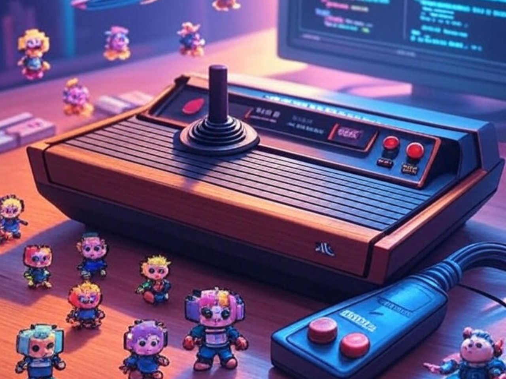
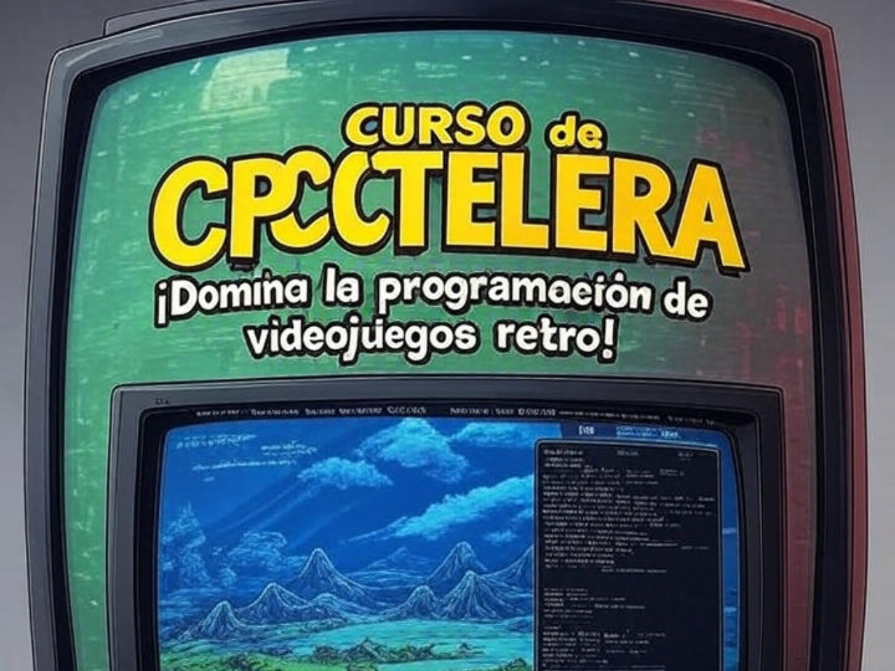

# Novedades

--- start-multi-column: BloqueMicrohobbit00
```column-settings  
Number of Columns: 2
Border: off
```


### ¿Qué es GB Studio?

GB Studio es una herramienta gratuita y de código abierto diseñada para crear videojuegos retro al estilo de la Game Boy sin requerir conocimientos avanzados de programación. 

Su interfaz visual de tipo "arrastrar y soltar", disponible en Windows, Mac y Linux, simplifica el desarrollo, permitiendo a principiantes y aficionados crear juegos completos, desde aventuras de perspectiva cenital inspiradas en JRPG hasta proyectos personalizados. 

Continuar leyendo en ... [[Qué es GB Studio 🟡③]]

 --- column-end ---


## Aprender a desarrollar videojuegos

Aprender a desarrollar videojuegos es una aventura apasionante que combina creatividad, tecnología y narrativa. 

Este proceso no solo implica programar, sino también diseñar mundos, personajes e historias que cautiven a los jugadores. Desde pequeños proyectos independientes hasta grandes producciones AAA, el desarrollo de videojuegos ofrece un espacio para explorar ideas innovadoras y conectar con audiencias globales. 

Continuar leyendo en ... [[Aprender a desarrollar videojuegos  ⚫①]]

 --- column-end ---


## Curso de Visual bB

Bienvenidos al Curso de Visual Batari Basic, una emocionante oportunidad para explorar el desarrollo de videojuegos para la clásica consola Atari 2600 utilizando una herramienta moderna y accesible. 

Visual Batari Basic combina la simplicidad del lenguaje Batari Basic con un entorno visual intuitivo, permitiendo a principiantes y entusiastas crear juegos retro con facilidad, sin sacrificar la flexibilidad que los programadores más experimentados buscan. 

Este es otro plan a 280-360 dias en el que desarrollaremos lo necesario para empezar a crear cosas en esta plataforma, salvando algunas dificultades como la ausencia de actualizaciones recientes, y la disponibilidad limitada de información.

Continuar leyendo en [[Curso de Visual bB ⚫①]]


 --- column-end ---


## Curso de CPCTelera

CPCTelera es un potente motor de desarrollo diseñado para la creación de videojuegos y aplicaciones gráficas para sistemas retro, especialmente para el ordenador Amstrad CPC. 

Este curso está diseñado para introducir a los participantes en el fascinante mundo de la programación de videojuegos utilizando esta herramienta, ofreciendo una base sólida para aquellos que deseen explorar el desarrollo en plataformas clásicas. 

Este es otro plan a 180-240 dias en el que desarrollaremos lo necesario para empezar a crear cosas en esta plataforma.

Continuar leyendo en ... [[Curso de CPCTelera  ⚫①]]

 --- column-end ---


## ¿Qué es PixiJS?

**PixiJS** es una potente biblioteca de renderizado 2D en JavaScript diseñada para crear gráficos y animaciones interactivas de alta calidad en navegadores web. 

Reconocida por su rendimiento optimizado y facilidad de uso, PixiJS permite a los desarrolladores construir desde juegos hasta visualizaciones dinámicas con gran eficiencia.

Continuar leyendo en ...  [[Qué es PixiJS y su historia 🟡③]]

 --- column-end ---


## Tutorial de AGD 2018 Edition

Hace poco dos fans del este curso, que no estaba disponible online desde 2021, me recordaron que no predicaba solo en el desierto. Si, me tocaron la patata, así que además de lo que tengo en mente, he tomado la determinación de tomarme el tiempo para rescatar aquelllos contenidos de mi vieja y maltrecha web wordpress e incorporarlos en esta nueva etapa. ¡Espero que disfruten creando juego tanto como yo creando el curso!...

En este momento, este es un plan de restauración y republicación de entre 30-60 dias, modificandolo lo imprescindible para que funcione correctamente en esta nueva web. Ya habra tiempo de crear algo ... nuevo #tarjetita

Continua leyendo en ... [[Tutorial de AGD 2018 Edition ⚫①]]
 
--- column-end ---


## Aprendeizaje basado en evidencia

Imagina un camino de aprendizaje donde cada paso que das está guiado por luces que te muestran lo que realmente funciona. 

Eso es el aprendizaje basado en evidencia (EBL, por sus siglas en inglés: Evidence-Based Learning), una aventura educativa en la que usamos datos, investigaciones y experiencias reales para crear momentos de aprendizaje que de verdad conectan contigo. 

No se trata solo de teorías frías; es un enfoque vivo que combina lo mejor de la ciencia con las historias y necesidades únicas de cada estudiante. ¿Te animas a descubrir cómo aprender de una manera más efectiva y personalizada?


Continuar leyendo en ... [[Aprendizaje basado en evidencia  ⚫①]]

--- column-end ---


## Estructura del Conocimiento Humano y Científico

La estructura del conocimiento humano y científico se fundamenta en la interacción dinámica entre observación, experimentación y reflexión crítica. A través de la historia, las disciplinas científicas han evolucionado mediante la sistematización de datos y la construcción de teorías que integran el pensamiento lógico con la creatividad, permitiendo a la humanidad desentrañar los misterios del universo y aplicar este saber en avances tecnológicos y sociales.

Continua leyendo en ... [[Estructura del Conocimiento Humano y Científico ⚫①]]

 --- column-end ---


## Estudiar libro - Think Fast and Slow - Daniel Kahneman

Bajo el título **Estudiar Thinking, Fast and Slow **, el libro de Kahneman desentraña la estructura del conocimiento humano y científico al explorar cómo nuestras mentes procesan información a través de dos sistemas: uno rápido, impulsado por la intuición, y otro lento, guiado por la lógica. 

Este marco revela los mecanismos detrás de nuestras decisiones, destacando la importancia de comprender sesgos y errores para mejorar el pensamiento crítico en la ciencia y la vida diaria.

Continua leyendo en ... [[Estudiar libro - Think Fast and Slow - Daniel Kahneman 🔴②]]

 --- column-end ---
--- multi-column-end


![[Plantilla - 1MT#One More Thing]]


