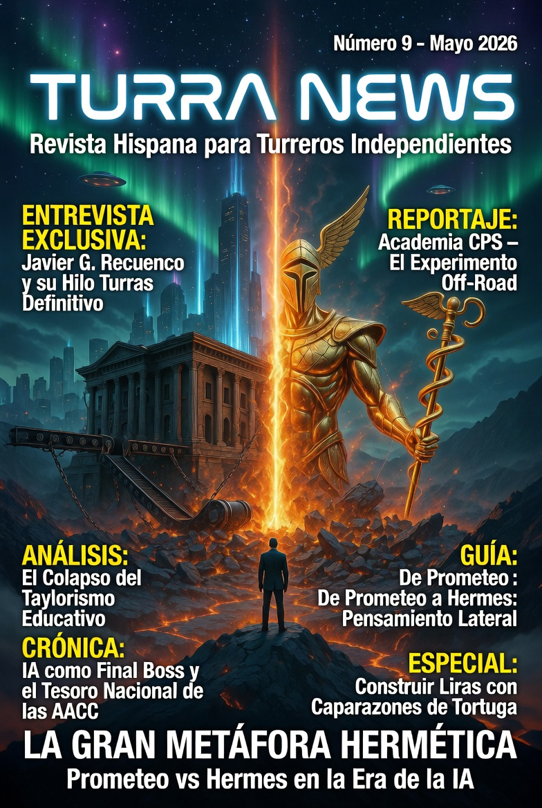

# Novedades

[[Index]]

--- start-multi-column: BloqueMicrohobbit01\
```column-settings  
Number of Columns: 2
Border: off
```



## Turra News 009

En este hilo turras del sábado 9 de mayo de 2026, Javier G. Recuenco deja a un lado su humor habitual y sus memes para lanzar un manifiesto claro y urgente sobre el colapso del sistema educativo español. 

Continua leyendo en ... [[Hemeroteca - Turra News 009 🟡③]]

--- column-end ---


## Desarrollo - Introducción al paradigma Spec-Driven Development: más allá del código

El **Desarrollo Impulsado por Especificaciones** (Spec-Driven Development o SDD) propone un cambio de paradigma en el ciclo de vida del software. En lugar de considerar la documentación como un subproducto del código, el SDD sitúa a la **especificación como el artefacto primario y la "única fuente de verdad"**.

Continua leyendo en ... [[Curso SDD 001 - Introducción al paradigma Spec-Driven Development - más allá del código 🟡③]]

--- column-end ---


## Blog - El "Pánico Bromado" Un Análisis Psicohistórico de la Campaña contra el Plástico Negro en la Cocina (2024-2026)

A mediados de la década de 2020, la sociedad occidental, ya sensibilizada por la crisis climática y una creciente quimiofobia, experimentó un nuevo y viral "pánico alimentario". Esta vez, el objeto del miedo no era un ingrediente, sino una herramienta omnipresente: el utensilio de cocina de plástico negro. Espátulas, cucharas y espumaderas, antes símbolos de modernidad y limpieza profesional, se convirtieron de la noche a la mañana en presuntos vectores de intoxicación masiva.

Continua leyendo en ... [[El "Pánico Bromado" Un Análisis Psicohistórico de la Campaña contra el Plástico Negro en la Cocina (2024-2026) 🟡③]]

--- column-end ---


## Herramientas - Curso de ZX-Draw

Este manual ofrece un recorrido exhaustivo por **ZX-Draw**, una herramienta contemporánea diseñada para dominar la estética y las restricciones técnicas del Sinclair ZX Spectrum. A través de este curso, aprenderás a transformar limitaciones de hardware en decisiones artísticas.

Continuar leyendo en ... [[Curso de ZX-DRAW 🔴②]]

--- column-end ---


## Negocios - Curso sobre Administración de un Negocio Automatizado

**En un mundo donde el tiempo se ha convertido en el recurso más valioso, la administración de un negocio automatizado representa la forma más inteligente y liberadora de emprender en la era digital.** Este curso te enseñará, paso a paso y de forma práctica, cómo diseñar, lanzar y gestionar un negocio que genera ingresos de manera prácticamente automática, con la mínima intervención humana diaria. A lo largo de estas semanas aprenderás a combinar las mejores herramientas *no-code*, la inteligencia artificial, sistemas de automatización y estrategias probadas para crear un sistema empresarial que trabaje por ti las 24 horas, los 7 días de la semana. Mientras tanto, tú podrás disfrutar de libertad geográfica, escalabilidad ilimitada y un verdadero ingreso pasivo.  

Continua leyendo en ... [[Curso sobre Administración de un Negocio Automatizado 🟡③]]

--- column-end ---


## Videojuegos Aventura - Historia Mundial de los videojuegos de aventura Subgéneros Principales

Los subgéneros, en el mundo de los videojuegos de aventura, no son meras etiquetas técnicas: son el pulso vivo de cómo la tecnología, la cultura y la imaginación humana han transformado este género desde sus humildes orígenes experimentales hasta convertirse en una de las formas más poderosas de contar historias interactivas. 

Continua leyendo en ... [[Curso Historia Mundial de los Videojuegos de Aventura 002 - Subgeneros principales 🟡③]]

--- column-end ---


## Epistemología como arquitectura del saber científico

La **epistemología** no es simplemente una rama de la filosofía; es el "sistema de control de calidad" del pensamiento humano. Etimológicamente derivada del griego _episteme_ (conocimiento sólido) y _logos_ (estudio o tratado), su propósito en la ciencia contemporánea es auditar cómo pasamos de una mera suposición a una verdad universalmente aceptada.

Continua leyendo en ... [[Epistemología - La Arquitectura del Saber Científico 🟡③]]

--- column-end ---


## Publicación Editorial - Curso Publicacion de Contenido Editorial como Aventura de Texto

Este curso te invita a sumergirte en el fascinante mundo de la publicación editorial transformada en aventuras de texto, un formato que convierte la lectura tradicional en una experiencia interactiva y envolvente. Imagina adaptar tus posts, artículos, libros o revistas a narrativas donde el lector toma decisiones que alteran el rumbo de la historia, todo ello en plataformas tanto retro como modernas, y enriquecido con elementos multimedia cuando sea posible. Es una oportunidad perfecta para creativos que quieran fusionar escritura, diseño y tecnología, desarrollando habilidades que innoven en el panorama digital actual. Si te apasiona contar historias de manera dinámica, este curso te ayudará a dar vida a tus ideas de forma original y atractiva.

Continuar leyendo en ... [[Curso Publicacion de Contenido Editorial como Aventura de Texto 🟡③]]


--- column-end ---


## KB - La Biblioteca del Archivero del Retro

Este proyecto busca crear una base de datos completa y detallada de libros, revistas, juegos, autores, desarrolladores, diseñadores, grafistas, compañias, eventos y, en general todo lo relacionado con la historia del videojuego.

Continua leyendo en ... [[La Biblioteca del Archivero del Retro 🟡③]]

--- column-end ---


## Ciencia - Conceptos básicos sobre ciencia y su evolución histórica

La ciencia es nuestra herramienta más poderosa para descifrar el universo, desde las estrellas más lejanas hasta el latido de nuestro corazón. No es solo una lista de hechos, sino un viaje dinámico de preguntas, observaciones y pruebas que genera conocimiento fiable y transformador. Guiada por el método científico, la ciencia nos ha dado vacunas, teléfonos inteligentes y soluciones al cambio climático, pero también nos enseña a pensar con claridad y a cuestionar lo que damos por sentado. Su historia es un reflejo de nuestra curiosidad infinita y nuestra capacidad para reinventar la forma en que entendemos el mundo. Pero, ¿qué hace que la ciencia sea tan especial?

Continuar leyendo en ... [[Conceptos básicos sobre ciencia y su evolución histórica 🟡③]]

--- column-end ---


## Reportajes - Lanzamiento de  Perseus para ZX Spectrum 128K: Una aventura épica impulsada por el motor Tuerkas128

Diciembre 2025 - La escena retro sigue llena de sorpresas, y esta vez el protagonista es *Perseus*, un nuevo título para ZX Spectrum 128K desarrollado por RetroBensoft que ha generado mucho interés en la comunidad. 

Este juego te sumerge en la mitología griega, donde debes derrotar a Medusa, y utiliza el potente motor Tuerkas128, una herramienta que promete elevar el nivel de los desarrollos actuales para esta plataforma clásica.

Continuar leyendo en ... [[Reportajes - Lanzamiento de Perseus para ZX Spectrum 128K -  Una aventura épica impulsada por el motor Tuerkas128 - 2025-12-26 🟡③]]

--- column-end ---


## GameDev C++ - Curso de Desarrollo de Videojuegos a pelo con Fran Gallego

Desarrollar "a pelo" no es lo más rápido, pero te da una comprensión profunda de cómo funcionan los videojuegos. Este curso, construido mientras estudio los contenidos publicados por Fran Gallego, te equipa con habilidades para crear prototipos, experimentar sin límites y, si quieres, dar el salto a motores comerciales con una base sólida. ¡Es tu oportunidad de programar como los pioneros de los 90, pero con herramientas modernas!

Continuar leyendo en ... [[Curso de Desarrollo de Videojuegos a pelo con Fran Gallego 🟡③]]

--- column-end ---


## Arquitectura Software - Curso Patrones y Calidad del Software

En este curso trataremos las cuestiones relacionadas con patrones de diseño y calidad del software. Comenzaremos con las bases e iremos avanzando hacia una serie de prompts de contexto que nos sirvan en nuestro desarrollo en el dia a dia.

Continuar leyendo en ... [[Curso sobre Patrones y Calidad del Software 🔴②]]

--- column-end ---


## Motores - Curso de Programación de Videojuegos con Godot Engine

Este curso ofrece una formación completa y práctica en la programación de videojuegos con el motor Godot Engine, centrándonos en los lenguajes C y C++ mediante el sistema GDExtension, que permite integrar código nativo de manera eficiente en versiones de Godot 4 y superiores. 

Continuar leyendo en [[Curso de Programación de Videojuegos con Godot Engine 🔴②]]

 --- column-end ---


## Public Brain - Estructura del Conocimiento Humano y Científico

La estructura del conocimiento humano y científico se fundamenta en la interacción dinámica entre observación, experimentación y reflexión crítica. A través de la historia, las disciplinas científicas han evolucionado mediante la sistematización de datos y la construcción de teorías que integran el pensamiento lógico con la creatividad, permitiendo a la humanidad desentrañar los misterios del universo y aplicar este saber en avances tecnológicos y sociales.

Continua leyendo en ... [[Estructura del Conocimiento Humano y Científico ⚫①]]

 --- column-end ---
--- multi-column-end


![[Plantilla - 1MT#One More Thing]]


