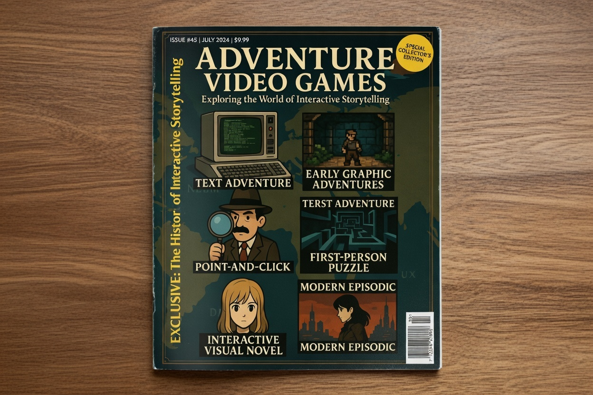
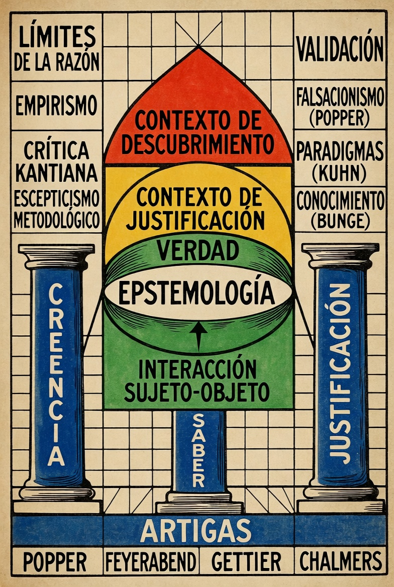
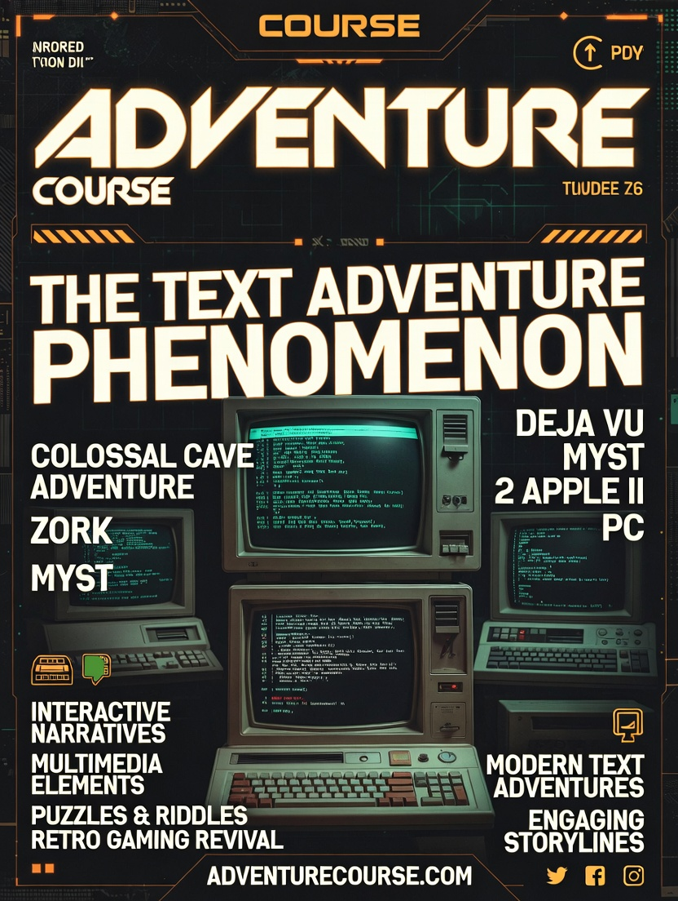
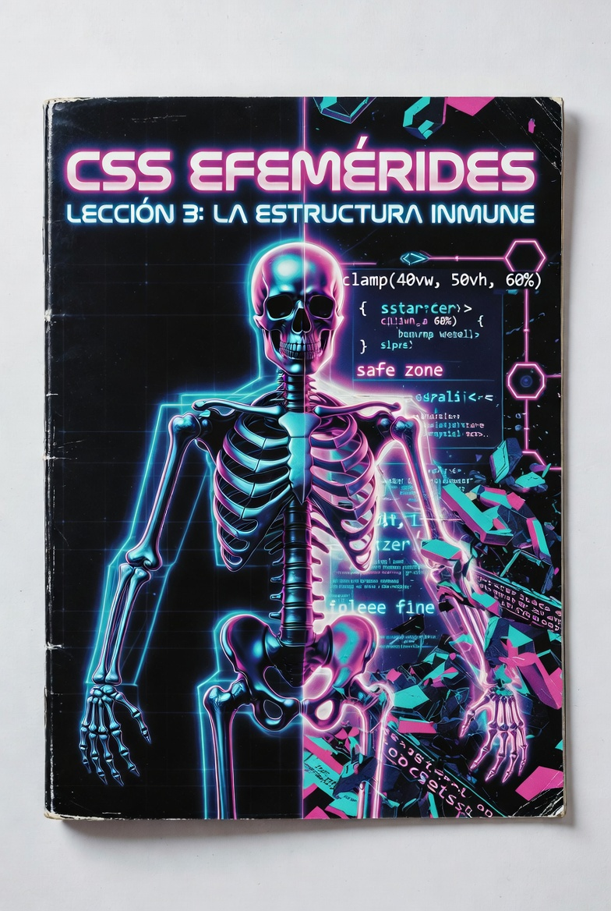

# Novedades

[[Index]]

--- start-multi-column: BloqueMicrohobbit01\
```column-settings  
Number of Columns: 2
Border: off
```




### Videojuegos Aventura - Historia Mundial de los videojuegos de aventura Subgéneros Principales

Los subgéneros, en el mundo de los videojuegos de aventura, no son meras etiquetas técnicas: son el pulso vivo de cómo la tecnología, la cultura y la imaginación humana han transformado este género desde sus humildes orígenes experimentales hasta convertirse en una de las formas más poderosas de contar historias interactivas. 

Continua leyendo en ... [[Curso Historia Mundial de los Videojuegos de Aventura 002 - Subgeneros principales 🔴②]]

--- column-end ---


### Epistemología como arquitectura del saber científico

La **epistemología** no es simplemente una rama de la filosofía; es el "sistema de control de calidad" del pensamiento humano. Etimológicamente derivada del griego _episteme_ (conocimiento sólido) y _logos_ (estudio o tratado), su propósito en la ciencia contemporánea es auditar cómo pasamos de una mera suposición a una verdad universalmente aceptada.

Continua leyendo en ... [[Epistemología - La Arquitectura del Saber Científico 🟡③]]

--- column-end ---




## Publicación Editorial - Curso Publicacion de Contenido Editorial como Aventura de Texto

Este curso te invita a sumergirte en el fascinante mundo de la publicación editorial transformada en aventuras de texto, un formato que convierte la lectura tradicional en una experiencia interactiva y envolvente. Imagina adaptar tus posts, artículos, libros o revistas a narrativas donde el lector toma decisiones que alteran el rumbo de la historia, todo ello en plataformas tanto retro como modernas, y enriquecido con elementos multimedia cuando sea posible. Es una oportunidad perfecta para creativos que quieran fusionar escritura, diseño y tecnología, desarrollando habilidades que innoven en el panorama digital actual. Si te apasiona contar historias de manera dinámica, este curso te ayudará a dar vida a tus ideas de forma original y atractiva.

Continuar leyendo en ... [[Curso Publicacion de Contenido Editorial como Aventura de Texto 🟡③]]


--- column-end ---



## Desarrollo - CSS Efemerides Lección 3 La "Estructura Inmune" Definición de los pilares del layout que garantizan la usabilidad frente al cambio.

La **Estructura Inmune** es el "esqueleto de titanio" de una web diseñada para el cambio constante. En un entorno de **Efemérides**, donde un sitio puede cambiar de un diseño minimalista (Día de la Paz) a uno barroco y saturado (Carnaval) en 24 horas, la estructura debe garantizar que los órganos vitales del sitio (navegación, lectura y conversión) no se vean comprometidos por la "infección" estética.

Continua leyendo en ... [[CSS Efemerides Lección 3 La "Estructura Inmune" Definición de los pilares del layout que garantizan la usabilidad frente al cambio 🟡③]]

--- column-end ---


## Negocios - Curso sobre Estructura e Implementación NO Automatizada de un Negocio

Este curso está pensado para emprendedores, dueños de pequeñas empresas y profesionales que desean construir y dirigir un negocio de manera manual y colaborativa, centrándose en el factor humano. 

Se inspira en enfoques automatizados, pero se adapta completamente a un modelo donde las personas son el eje principal. Definimos roles claros, habilidades necesarias, flujos de trabajo en equipo, herramientas de software **libre** (priorizando licencias GNU GPL o MIT; solo excepciones justificadas si no existe alternativa adecuada), y protocolos de documentación para mantener todo coordinado. 

Cada sección incluye una nota breve sobre cómo se podría automatizar, solo como complemento.

Continua leyendo en ... [[Curso sobre Estructura e Implementación NO Automatizada de un Negocio 🟡③]]

--- column-end ---


## KB - La Biblioteca del Archivero del Retro

Este proyecto busca crear una base de datos completa y detallada de libros, revistas, juegos, autores, desarrolladores, diseñadores, grafistas, compañias, eventos y, en general todo lo relacionado con la historia del videojuego.

Continua leyendo en ... [[La Biblioteca del Archivero del Retro 🟡③]]

--- column-end ---


## Blog - El Archivero del Retro

Es esta una parte del proyecto que tenia reservada para más adelante, pero la "actualidad" manda, es hora de aprovechar mi fondo en cuanto a cds y disquettes para aportar mi minúsculo grano de arena en este mundillo retro tan activo en nuestros dias.

Continua leyendo en ... [[Blog - El Archivero del Retro  ⚫①]]

--- column-end ---


## Ciencia - Conceptos básicos sobre ciencia y su evolución histórica

La ciencia es nuestra herramienta más poderosa para descifrar el universo, desde las estrellas más lejanas hasta el latido de nuestro corazón. No es solo una lista de hechos, sino un viaje dinámico de preguntas, observaciones y pruebas que genera conocimiento fiable y transformador. Guiada por el método científico, la ciencia nos ha dado vacunas, teléfonos inteligentes y soluciones al cambio climático, pero también nos enseña a pensar con claridad y a cuestionar lo que damos por sentado. Su historia es un reflejo de nuestra curiosidad infinita y nuestra capacidad para reinventar la forma en que entendemos el mundo. Pero, ¿qué hace que la ciencia sea tan especial?

Continuar leyendo en ... [[Conceptos básicos sobre ciencia y su evolución histórica 🟡③]]

--- column-end ---


## Noticias - Lanzamiento de  Perseus para ZX Spectrum 128K: Una aventura épica impulsada por el motor Tuerkas128

Diciembre 2025 - La escena retro sigue llena de sorpresas, y esta vez el protagonista es *Perseus*, un nuevo título para ZX Spectrum 128K desarrollado por RetroBensoft que ha generado mucho interés en la comunidad. 

Este juego te sumerge en la mitología griega, donde debes derrotar a Medusa, y utiliza el potente motor Tuerkas128, una herramienta que promete elevar el nivel de los desarrollos actuales para esta plataforma clásica.

Continuar leyendo en ... [[Noticias - Lanzamiento de Perseus para ZX Spectrum 128K -  Una aventura épica impulsada por el motor Tuerkas128 - 2025-12-26 🟡③]]

--- column-end ---


## GameDev C++ - Curso de Desarrollo de Videojuegos a pelo con Fran Gallego

Desarrollar "a pelo" no es lo más rápido, pero te da una comprensión profunda de cómo funcionan los videojuegos. Este curso, construido mientras estudio los contenidos publicados por Fran Gallego, te equipa con habilidades para crear prototipos, experimentar sin límites y, si quieres, dar el salto a motores comerciales con una base sólida. ¡Es tu oportunidad de programar como los pioneros de los 90, pero con herramientas modernas!

Continuar leyendo en ... [[Curso de Desarrollo de Videojuegos a pelo con Fran Gallego 🟡③]]

--- column-end ---


## Herramientas - Curso de ZX-Paintbrush

Este curso te invita a sumergirte en el fascinante mundo de ZX-Paintbrush, una herramienta clásica para diseñar gráficos en el legendario ZX Spectrum. 

A lo largo de los módulos, aprenderás desde los fundamentos hasta técnicas avanzadas para crear pantallas, tiles y sprites, integrándolos en tus propios juegos retro. 

Continua leyendo en ... [[Curso de ZX-Paintbrush - Creación de Gráficos para ZX Spectrum  🟡③]]

--- column-end ---


## Arquitectura Software - Curso Patrones y Calidad del Software

En este curso trataremos las cuestiones relacionadas con patrones de diseño y calidad del software. Comenzaremos con las bases e iremos avanzando hacia una serie de prompts de contexto que nos sirvan en nuestro desarrollo en el dia a dia.

Continuar leyendo en ... [[Curso sobre Patrones y Calidad del Software 🔴②]]

--- column-end ---


## Motores - Curso de Programación de Videojuegos con Godot Engine

Este curso ofrece una formación completa y práctica en la programación de videojuegos con el motor Godot Engine, centrándonos en los lenguajes C y C++ mediante el sistema GDExtension, que permite integrar código nativo de manera eficiente en versiones de Godot 4 y superiores. 

Continuar leyendo en [[Curso de Programación de Videojuegos con Godot Engine 🔴②]]

 --- column-end ---


## Public Brain - Estructura del Conocimiento Humano y Científico

La estructura del conocimiento humano y científico se fundamenta en la interacción dinámica entre observación, experimentación y reflexión crítica. A través de la historia, las disciplinas científicas han evolucionado mediante la sistematización de datos y la construcción de teorías que integran el pensamiento lógico con la creatividad, permitiendo a la humanidad desentrañar los misterios del universo y aplicar este saber en avances tecnológicos y sociales.

Continua leyendo en ... [[Estructura del Conocimiento Humano y Científico ⚫①]]

 --- column-end ---
--- multi-column-end


![[Plantilla - 1MT#One More Thing]]


