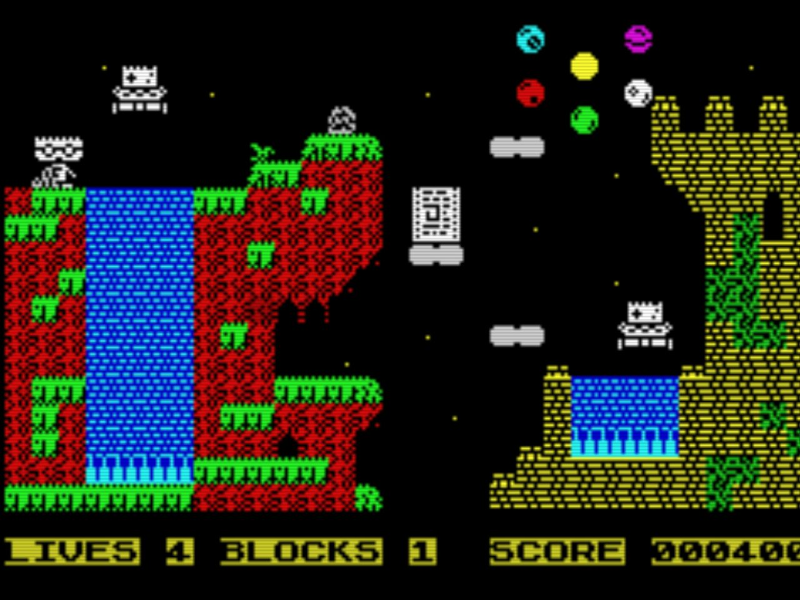
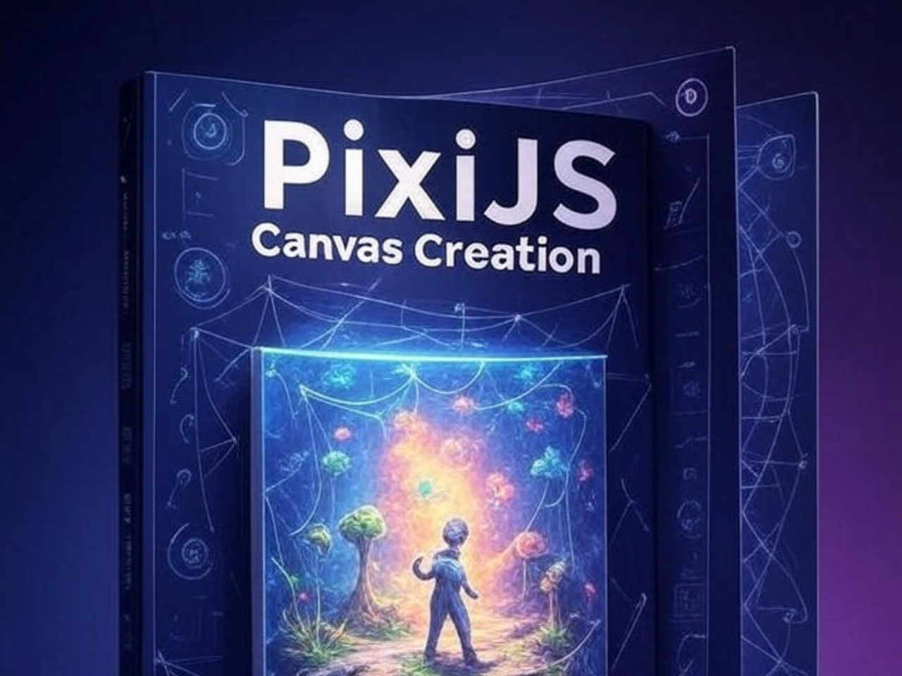

# Novedades

--- start-multi-column: BloqueMicrohobbit00
```column-settings  
Number of Columns: 2
Border: off
```


## Historia y contexto del Atari 2600 y su relación con Visual bB

El Atari 2600, lanzado en 1977, supuso un antes y un después en la historia de los videojuegos al introducir los sistemas de entretenimiento doméstico basados en cartuchos intercambiables, una innovación que revolucionó el sector. Su influencia no se limita al ámbito tecnológico, sino que también dejó una huella imborrable en la cultura popular, sentando las bases para la industria moderna de los videojuegos. 

Por otro lado, Visual Batari Basic (Visual bB), una herramienta contemporánea, facilita a desarrolladores, desde principiantes hasta expertos, la creación de juegos para esta icónica consola. Este documento analiza la historia del Atari 2600, su impacto cultural y cómo Visual bB actúa como un puente entre el pasado y el presente del desarrollo de videojuegos.

Continuar leyendo en ... [[Historia y contexto del Atari 2600 y su relación con Visual bB ⚫①]]

--- column-end ---


## Requisitos previos y herramientas necesarias para GBStudio

GB Studio es una herramienta accesible y poderosa para desarrollar videojuegos retro al estilo Game Boy, ideal tanto para principiantes como para entusiastas del diseño de juegos. 

Este documento detalla los requisitos previos y las herramientas necesarias para aprovechar al máximo un curso de GB Studio, con una redacción optimizada para claridad y un enfoque práctico, acompañado de referencias verificadas que respaldan y cuestionan el contenido.

Continuar leyendo en [[Requisitos previos y herramientas necesarias para GBStudio 游리膠묗]


--- column-end ---


## Características principales del motor en CPCTelera

CPCtelera es una potente librería diseñada para facilitar el desarrollo de videojuegos y aplicaciones en el ordenador Amstrad CPC, utilizando principalmente lenguajes C y ensamblador Z80.

Su "motor" abarca un conjunto de herramientas y funciones que simplifican la gestión de gráficos, sonido, entrada/salida y otros aspectos clave para programar en esta plataforma retro. A continuación, se describen las principales características del motor de CPCtelera, ideales para explorar en un curso sobre esta librería.

Continuar leyendo en ... [[Características principales del motor en CPCTelera 游리膠묗]

--- column-end ---


## Capítulo 08: Moviendo nuestro "muñequito" por la pantalla

En este capítulo abordamos el manejo de nuestro personaje protagonista con AGD.

Empezaremos por el ejemplo más simple para, en posteriores capítulos, afinar cada uno de los aspectos necesarios, desde la configuración de los bloques hasta la selección del modo de control.

Continuar leyendo en ... [[Tutorial de AGD 2018 Capitulo 08 - Mover a nuestro protagonista por la pantalla ⚫①]]

--- column-end ---


## Creación de un lienzo (canvas) en PixiJS

PixiJS es una biblioteca JavaScript versátil y potente que permite crear gráficos interactivos y experiencias visuales en la web de manera eficiente. 

En este artículo, te guiaremos paso a paso para configurar un lienzo (canvas) con PixiJS, preparando el escenario para tus proyectos gráficos.

Continuar leyendo en ... [[Creación de un lienzo (canvas) en PixiJS 游리膠묗]

--- column-end ---


## Aprender a desarrollar videojuegos

Aprender a desarrollar videojuegos es una aventura apasionante que combina creatividad, tecnología y narrativa. 

Este proceso no solo implica programar, sino también diseñar mundos, personajes e historias que cautiven a los jugadores. Desde pequeños proyectos independientes hasta grandes producciones AAA, el desarrollo de videojuegos ofrece un espacio para explorar ideas innovadoras y conectar con audiencias globales. 

Continuar leyendo en ... [[Aprender a desarrollar videojuegos  ⚫①]]

 --- column-end ---


## Aprendeizaje basado en evidencia

Imagina un camino de aprendizaje donde cada paso que das está guiado por luces que te muestran lo que realmente funciona. 

Eso es el aprendizaje basado en evidencia (EBL, por sus siglas en inglés: Evidence-Based Learning), una aventura educativa en la que usamos datos, investigaciones y experiencias reales para crear momentos de aprendizaje que de verdad conectan contigo. 

No se trata solo de teorías frías; es un enfoque vivo que combina lo mejor de la ciencia con las historias y necesidades únicas de cada estudiante. 쯊e animas a descubrir cómo aprender de una manera más efectiva y personalizada?


Continuar leyendo en ... [[Aprendizaje basado en evidencia  ⚫①]]

--- column-end ---


## Estructura del Conocimiento Humano y Científico

La estructura del conocimiento humano y científico se fundamenta en la interacción dinámica entre observación, experimentación y reflexión crítica. A través de la historia, las disciplinas científicas han evolucionado mediante la sistematización de datos y la construcción de teorías que integran el pensamiento lógico con la creatividad, permitiendo a la humanidad desentrañar los misterios del universo y aplicar este saber en avances tecnológicos y sociales.

Continua leyendo en ... [[Estructura del Conocimiento Humano y Científico ⚫①]]

 --- column-end ---


## Estudiar libro - Think Fast and Slow - Daniel Kahneman

Bajo el título **Estudiar Thinking, Fast and Slow **, el libro de Kahneman desentraña la estructura del conocimiento humano y científico al explorar cómo nuestras mentes procesan información a través de dos sistemas: uno rápido, impulsado por la intuición, y otro lento, guiado por la lógica. 

Este marco revela los mecanismos detrás de nuestras decisiones, destacando la importancia de comprender sesgos y errores para mejorar el pensamiento crítico en la ciencia y la vida diaria.

Continua leyendo en ... [[Estudiar libro - Think Fast and Slow - Daniel Kahneman 游댮膠멯]

 --- column-end ---
--- multi-column-end


![[Plantilla - 1MT#One More Thing]]


