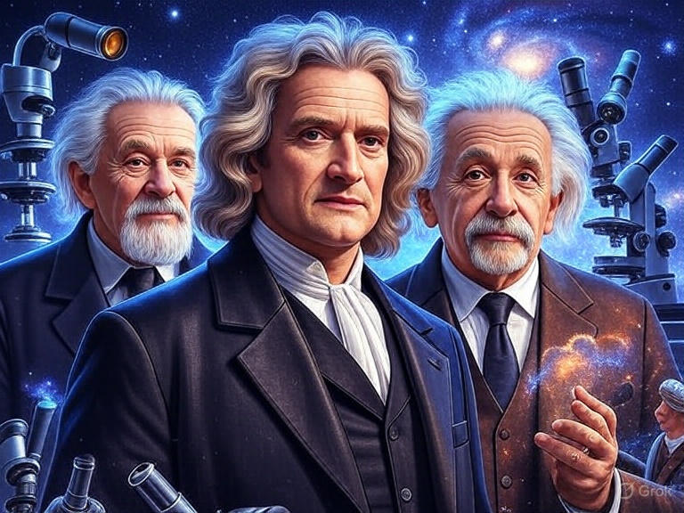

# Aprendizaje basado en evidencia  ⚫①


[[KB]]

Imagina un camino de aprendizaje donde cada paso que das está guiado por luces que te muestran lo que realmente funciona. 

Eso es el aprendizaje basado en evidencia (EBL, por sus siglas en inglés: Evidence-Based Learning), una aventura educativa en la que usamos datos, investigaciones y experiencias reales para crear momentos de aprendizaje que de verdad conectan contigo. 

No se trata solo de teorías frías; es un enfoque vivo que combina lo mejor de la ciencia con las historias y necesidades únicas de cada estudiante. ¿Te animas a descubrir cómo aprender de una manera más efectiva y personalizada?

En este viaje, todos somos aprendices y exploradores. Juntos, observamos qué funciona, escuchamos tus ideas y ajustamos el rumbo para que cada experiencia de aprendizaje sea más poderosa. 

El aprendizaje basado en evidencia nos invita a ser curiosos, a probar, a reflexionar y a crecer. Con la guía de investigaciones sólidas y la chispa de la colaboración, creamos un espacio donde tu desarrollo brilla. 

¡Ven, acompáñanos en este proceso y hagamos que el aprendizaje sea una aventura inolvidable!

--- start-multi-column: AprenderConEvidencia
```column-settings  
Number of Columns: 2
Border: off
```


## Historia de la Epistemología y su aplicación en la Ciencia

Te invito a un fascinante recorrido por la historia de la epistemología, desde sus raíces filosóficas hasta su impacto en la ciencia moderna. Exploraremos cómo las teorías del conocimiento han dado forma a las prácticas científicas y cómo los descubrimientos científicos han transformado, a su vez, nuestra comprensión del saber. 

Combinando un enfoque histórico con aplicaciones prácticas, trataré de fomentar la reflexión crítica y la conexión entre disciplinas, preparando a todo aquel capaz de aceptar el reto para analizar el conocimiento científico en un mundo complejo.

Continuar leyendo en [[Historia de la Epistemología y su aplicación en la Ciencia 🟡③]]

--- column-end ---


## Historia de la Ciencia y del Método Científico

La ciencia representa una de las aventuras más fascinantes de la humanidad, un proceso sistemático para comprender el mundo que nos rodea. El método científico, por su parte, es el conjunto de pasos lógicos y rigurosos que guían esta exploración, evolucionando a lo largo de los siglos. 

En esta sección, exploraremos los conceptos básicos sobre la ciencia y su desarrollo histórico, distinguiendo entre ciencia pura, tecnología aplicada y otras formas de conocimiento, como la filosofía o la tradición oral.

Continuar leyendo en ... [[Historia de la Ciencia y del Método Científico 🟡③]]

--- column-end ---


## Aprender sobre Accesibilidad basada en evidencia

Descubre cómo la accesibilidad basada en evidencia transforma entornos digitales, físicos y educativos para ser inclusivos. Este curso te guiará desde los fundamentos hasta prácticas avanzadas, usando datos científicos para crear soluciones que cumplen estándares como WCAG y mejoran la vida de todos los usuarios.

Aprende a diseñar con rigor, aplicando investigaciones y herramientas para superar barreras y fomentar la equidad. Ideal para diseñadores, desarrolladores y profesionales comprometidos con la inclusión, este curso te empoderará para liderar el cambio hacia un mundo más accesible.

Continuar leyendo en ... [[Aprender sobre Accesibilidad basada en evidencia 🟡③]]

--- column-end ---


## Aprender sobre Ejercicio basado en evidencia

Aprender sobre ejercicio basado en evidencia implica comprender cómo diseñar y aplicar rutinas de actividad física respaldadas por investigaciones científicas sólidas, maximizando beneficios para la salud y el rendimiento mientras se minimizan riesgos. Este enfoque se fundamenta en estudios que evalúan la eficacia de diferentes tipos de ejercicio, como el entrenamiento de fuerza, cardiovascular o de flexibilidad, considerando variables como intensidad, duración y frecuencia, adaptadas a objetivos específicos y características individuales.

Continua leyendo en ... [[Aprender sobre Ejercicio basado en evidencia 🔴②]]
 
 --- column-end ---
 

## Aprender sobre Nutrición basada en evidencia

Aprender sobre nutrición basada en evidencia significa adquirir conocimientos sobre cómo diseñar una alimentación saludable y efectiva, respaldada por investigaciones científicas rigurosas. Este enfoque se centra en entender el impacto de los nutrientes, patrones alimentarios y dietas en la salud, el rendimiento y la prevención de enfermedades, utilizando datos de estudios clínicos y epidemiológicos. Al priorizar la evidencia, se evitan mitos y modas pasajeras, permitiendo tomar decisiones informadas y personalizadas para optimizar el bienestar.

Continua leyendo en ... [[Aprender sobre Nutrición basada en evidencia 🔴②]]

 --- column-end ---
--- multi-column-end

![[Plantilla - 1MT#One More Thing]]