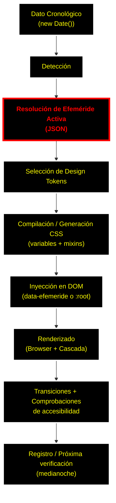

# CSS con Efemerides Lección 4 - El ciclo de vida de una efeméride  🔴②

()

[[Curso Estructura de CSS Dinámico con Efemérides 🟡③]]


**Flujo lógico desde el dato cronológico hasta el renderizado final**

Después de haber explorado en la Lección 1 el concepto de diseño por efemérides —ese equilibrio delicado entre una identidad fija y una narrativa visual que evoluciona con la fecha—, en la Lección 2 la auditoría técnica del sitio actual (y sus problemas de JavaScript y sobrescritura de CSS) y en la Lección 3 la definición de la **«Estructura Inmune»** (los pilares del diseño que permanecen estables aunque la estética cambie), ahora es el momento de entender el **flujo completo** de una efeméride.

Esta lección es fundamental porque une el mundo del dato (el tiempo) con el mundo de la presentación (HTML + CSS). Aquí definimos el **ciclo de vida** entero de una efeméride, desde que se detecta una fecha especial hasta que el usuario percibe el cambio visual, todo ello manteniendo accesibilidad, rendimiento y facilidad de mantenimiento.

### 1. ¿Qué es exactamente una efeméride en este contexto?

Una **efeméride** es cualquier fecha con un significado conmemorativo, cultural, histórico, personal o temático que justifica un cambio estético controlado en la interfaz.

Algunos ejemplos reales:
- 8 de marzo → Día Internacional de la Mujer (paleta violeta y empoderada).
- 21 de marzo → Día Internacional de la Eliminación de la Discriminación Racial (tonos cálidos y terrosos).
- 12 de octubre → Día de la Hispanidad o efemérides locales.
- Cumpleaños del sitio, aniversarios importantes, festividades nacionales o incluso fechas más poéticas como solsticios y equinoccios.

El objetivo no es transformar el sitio cada día, sino aplicar transformaciones estéticas coherentes y accesibles sobre una **estructura base inmutable**.

### 2. El ciclo de vida de una efeméride (8 etapas)

Imaginemos el flujo lógico paso a paso:

#### Etapa 1: Dato cronológico (el origen)
- Fuente de verdad: la fecha actual del sistema (`new Date()`) o una fecha simulada para pruebas.
- Formato recomendado: **ISO 8601** (`YYYY-MM-DD`), más la hora si hay efemérides que dependan del momento del día.
- Almacenamiento: archivo JSON central (`efemerides.json`), base de datos ligera o calendario estático generado en tiempo de compilación.

#### Etapa 2: Detección y resolución de la efeméride activa
- Se compara la fecha actual con el calendario de efemérides.
- Prioridades claras:
  1. Efeméride específica del día (prioridad máxima).
  2. Rangos de fechas (por ejemplo, «Semana de la Accesibilidad»).
  3. Tema por defecto (fallback).
- Resultado: un identificador único como `--efemeride: "dia-mujer-2026"` o un objeto con metadatos (`name`, `category`, `intensity`, `themeTokenSet`).

#### Etapa 3: Selección del conjunto de design tokens
- Cada efeméride apunta a un **paquete de tokens** (colores, tipografía, espaciado, máscaras, etc.).
- Ejemplo en JSON:
```json
{
  "id": "dia-mujer",
  "date": "03-08",
  "tokens": {
    "--color-primary": "#c026d3",
    "--color-accent": "#7e22ce",
    "--font-family-heading": "'Playfair Display', serif",
    "--spacing-scale": "1.15"
  }
}
```
- Estos tokens se inyectan como **propiedades personalizadas** (`:root`) o como clases de contexto (`[data-efemeride="dia-mujer"]`).

#### Etapa 4: Generación o compilación del CSS temático
- Aquí interviene el preprocesador (Sass, PostCSS o CSS nativo con paso de compilación).
- Opciones según el proyecto:
  - **En tiempo de compilación**: generar archivos CSS separados y cargarlos dinámicamente.
  - **En tiempo de ejecución**: inyectar variables CSS con JavaScript (rápido, pero menos óptimo para evitar FOUC).
  - **Híbrido recomendado**: CSS base + sobrescritura de variables + clases de contexto.

Esta etapa respeta siempre la **Estructura Inmune** de la Lección 3: solo se tocan las capas estéticas, nunca el layout ni la semántica.

#### Etapa 5: Aplicación al DOM (inyección)
- Métodos más recomendados:
  - Atributo `data-efemeride="id-efemeride"` en `<html>` o `<body>`.
  - Clase `.efemeride--dia-mujer`.
  - Propiedad personalizada en `:root`.
- La sincronización entre JavaScript y CSS se hace mediante Custom Properties.

#### Etapa 6: Renderizado final en el navegador
- El navegador resuelve la cascada:
  1. Estilos base (Estructura Inmune).
  2. Tokens de la efeméride (sobrescritura).
  3. Reglas específicas de cada componente.
- Se aplican transiciones suaves donde tenga sentido (`transition: background-color 0.6s ease`).
- Respeto estricto a `prefers-reduced-motion` y a los contrastes WCAG 2.2.

#### Etapa 7: Gestión de estados transitorios
- **FOUC** (Flash of Unstyled Content): se evita con critical CSS y precarga del tema actual.
- Cambio de efeméride a medianoche: detección con `setInterval` o Service Worker.
- Caché y Service Worker para temas offline.

#### Etapa 8: Feedback y registro (opcional pero muy útil)
- Registrar qué efeméride se aplicó (para analíticas y depuración).
- Posibilidad de sobrescritura manual para administradores (modo preview).

### 3. Diagrama conceptual del flujo



### 4. Claves para mantener la «Estructura Inmune»

- **Nunca** modificar `display`, `position`, `grid-template`, `flex`, anchos fijos, etc., con efemérides.
- Solo tocar: color, background, border-color, box-shadow, filter, mask, font-family (con cuidado), spacing-scale…
- Aprovechar la **herencia** y la **cascada**: los tokens viven en capas altas y descienden de forma natural.
- Validar siempre el contraste automático en la Etapa 4 (herramienta que veremos más adelante).

### 5. Ejercicio práctico de esta lección

1. Crea un archivo `efemerides.json` mínimo con 3 efemérides (incluye una de prueba para hoy).
2. Escribe la función JavaScript `getActiveEfemeride()` que devuelva el ID y los tokens.
3. Aplica manualmente el atributo `data-efemeride` al `<html>` y crea 3 reglas CSS sencillas que cambien `--color-primary` y el fondo del header.
4. Observa el flujo: ¿dónde se rompe la usabilidad? ¿dónde aparece FOUC?

## Referencias bibliográficas que apoyan este contenido

Estas fuentes respaldan el uso de design tokens, propiedades personalizadas de CSS, ciclos de vida temáticos y estrategias para mantener una estructura estable con cambios estéticos controlados:

- Mozilla Developer Network (MDN). *Using CSS custom properties (variables)*. Disponible en: https://developer.mozilla.org/en-US/docs/Web/CSS/Using_CSS_custom_properties (consultado marzo 2026). Explica cómo las Custom Properties actúan como tokens centrales y participan en la cascada, facilitando temas dinámicos sin romper el layout.
- CSS-Tricks. *A Complete Guide to Custom Properties*. 27 de abril de 2021. Disponible en: https://css-tricks.com/a-complete-guide-to-custom-properties/ (consultado marzo 2026). Detalla el uso de variables CSS para temas de color y su integración con JavaScript, alineado con el ciclo de detección e inyección.
- Smashing Magazine. *Global vs. Local Styling In Next.js*. 27 de julio de 2021. Disponible en: https://www.smashingmagazine.com/2021/07/global-local-styling-nextjs/ (consultado marzo 2026). Propone almacenar valores compartidos como design tokens en CSS Custom Properties para mantener consistencia y escalabilidad.
- Kholmatova, Alla. *Design Systems: A practical guide to creating design languages for digital products*. Smashing Magazine, 2017. ISBN: 978-0993585517. (Reseña en Goodreads: https://www.goodreads.com/book/show/35857970-design-systems). Defiende los tokens como fuente única de verdad y la separación entre estructura y estética.
- YouTube. *Design Tokens for Dummies | A Complete Guide*. Kirk (canal UX/UI). Disponible en: https://www.youtube.com/watch?v=CJyJN0ZdEGA (consultado marzo 2026). Tutorial práctico sobre jerarquía de tokens (primitivos, semánticos, temas) y su aplicación en flujos de trabajo reales.

## Referencias bibliográficas que refutan o cuestionan aspectos de este contenido

Estas fuentes destacan riesgos reales (rendimiento, FOUC, sobrecarga de complejidad o impacto en la experiencia del usuario) que pueden surgir al implementar ciclos de vida temáticos dinámicos con JavaScript y variables CSS:

- Medium. *The Dark Side of CSS-in-JS: Unveiling Performance Pitfalls*. Finn Kumar, 2025. Disponible en: https://medium.com/@finnkumar6/the-dark-side-of-css-in-js-unveiling-performance-pitfalls-and-how-to-optimize-your-web-535a8e332a21 (consultado marzo 2026). Analiza el overhead en tiempo de ejecución y recálculo de estilos al cambiar temas dinámicamente, lo que puede ralentizar la renderización aunque se usen solo Custom Properties.
- Dev.to. *Dark Mode Done Right: Performance & Accessibility Considerations*. 25 de marzo de 2025. Disponible en: https://dev.to/javascriptwizzard/dark-mode-done-right-performance-accessibility-considerations-43b1 (consultado marzo 2026). Advierte sobre el FOUC cuando el cambio de tema depende de JavaScript y recomienda estrategias estrictas de precarga que no siempre son infalibles en proyectos con múltiples efemérides.
- CSS-Tricks. *The Great Divide*. 21 de enero de 2019 (actualizado). Disponible en: https://css-tricks.com/the-great-divide/ (consultado marzo 2026). Critica la tendencia a añadir complejidad innecesaria (herramientas, JS y ciclos dinámicos) cuando un CSS más simple y estático sería suficiente para la mayoría de sitios, cuestionando la necesidad de flujos tan elaborados.
- Stack Overflow / comunidad. *Eliminate flash of unstyled content*. Discusión actualizada 2026. Disponible en: https://stackoverflow.com/questions/3221561/eliminate-flash-of-unstyled-content (consultado marzo 2026). Muestra que, incluso con técnicas avanzadas de variables CSS, el FOUC sigue siendo un problema frecuente en implementaciones dinámicas y requiere soluciones adicionales que complican el código.
- Smashing Magazine / artículos relacionados. *Modern CSS Capabilities: Guide to Scalable Styling*. Zignuts, 20 de enero de 2026. Disponible en: https://www.zignuts.com/blog/modern-css-capabilities (consultado marzo 2026). Recomienda priorizar CSS puro y evitar JavaScript innecesario para temas, ya que la sobrecarga puede afectar el rendimiento y la accesibilidad en proyectos pequeños o con usuarios en conexiones lentas.

![[Plantilla - 1MT#One More Thing]]