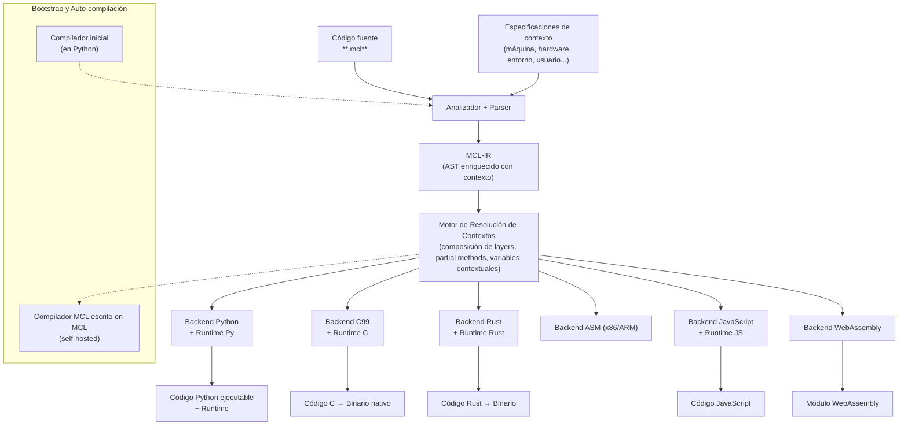

# Curso e introducción técnica sobre  MCL (MetsuOS Context Language) 🟡③

[[KB]]

> OJO WIP

**MCL** (MetsuOS Context Language) es un lenguaje de programación de alto nivel con sintaxis natural que convierte el **contexto** en una entidad de primera clase a lo largo de todo el ciclo de vida del software: desde el diseño y la compilación hasta la ejecución.

Su propósito principal es resolver un problema muy real y persistente en la ingeniería de software actual: la dispersión y fragilidad del código que depende de condiciones contextuales (entorno, hardware, usuario, estado del sistema, modo operativo, restricciones en tiempo real, etc.). En vez de llenar el código de `if`, `switch` o decoradores por todas partes, MCL permite definir **variaciones de comportamiento** de forma limpia y modular mediante **layers** (capas contextuales). Estas capas se activan, desactivan y combinan dinámicamente, tanto en tiempo de compilación como en tiempo de ejecución.

## Objetivo principal

Crear un paradigma y una herramienta **universal** que permita escribir una única especificación en MCL y generar código ejecutable para cualquier combinación de:

- Lenguaje de destino (Python, C99, Rust, JavaScript, WebAssembly, etc.)
- Plataforma o hardware (x86_64, ARM, GPU, FPGA…)
- Entorno operativo (escritorio, móvil, servidor, sistemas embebidos, bajo consumo…)
- Contexto del usuario o del sistema (conectado/desconectado, batería baja, modo depuración, usuario administrador, etc.)

## Conceptos centrales de MCL

- **Layer**: Unidad básica de variación contextual. Agrupa cambios de comportamiento (partial methods) y estado (contextual variables) que solo entran en juego cuando el contexto correspondiente está activo.
- **Contextual Activation**: Mecanismo para activar o desactivar capas de forma explícita, implícita o según reglas declaradas.
- **MCL-IR**: Formato intermedio neutral (un AST enriquecido con información contextual) que sirve de puente entre el código fuente `.mcl` y todos los backends.
- **Runtime Contextual**: Biblioteca ligera que se genera automáticamente para cada plataforma e implementa la resolución dinámica de capas y variables contextuales.
- **Compilación contextual**: El propio compilador decide qué código generar según los contextos que especifiques en la línea de comandos o en los metadatos del proyecto.

## Comparación técnica con ContextL y el paradigma COP clásico

| Aspecto                        | ContextL (Common Lisp, 2005)                  | Paradigma COP clásico (Hirschfeld et al.)          | MCL (MetsuOS Context Language)                                      |
|--------------------------------|-----------------------------------------------|----------------------------------------------------|---------------------------------------------------------------------|
| Objetivo principal             | Demostrar el paradigma en Lisp                | Convertir el contexto en abstracción de primera clase | Lenguaje universal con contexto como elemento central en diseño, compilación y ejecución |
| Nivel                          | Extensión de CLOS                             | Paradigma (independiente de lenguaje)              | Lenguaje completo + IR neutral + múltiples backends                 |
| Sintaxis                       | Lisp + operadores específicos                 | No define sintaxis                                 | Pseudocódigo natural legible en español e inglés                    |
| Activación de layers           | Ámbito dinámico (runtime)                     | Principalmente en tiempo de ejecución              | Tiempo de compilación + ejecución + reglas declarativas             |
| Composición de layers          | Orden de activación                           | Before/after/around                                | Explícita + precedencia declarativa + optimización en compilación   |
| Variables contextuales         | Layered slots (muy potentes)                  | Sí                                                 | Con shadowing, precedencia y ámbito definido en MCL                 |
| Partial methods                | Muy maduro                                    | Núcleo del paradigma                               | Partial methods + sustitución completa                              |
| Multi-plataforma               | Solo Common Lisp                              | Depende de cada implementación                     | Universal: Python, C, Rust, JS, WASM, ASM desde un mismo `.mcl`    |
| Compilación contextual         | No                                            | No                                                 | Sí (genera variantes según `--context mobile,low_battery`)         |
| Sobrecarga en tiempo de ejecución | Baja (aprovecha el MOP)                     | Variable                                           | Optimizada: eliminación de código muerto contextual                 |
| Self-hosting / bootstrap       | No aplica                                     | No aplica                                          | Sí (primer compilador en Python → self-hosted en MCL)               |
| Fortaleza principal            | Reflexión extrema                             | Modularización limpia                              | Universalidad + compilación contextual + sintaxis natural           |

**Conclusión de la comparación**: ContextL fue una prueba de concepto excelente dentro de Lisp. El paradigma COP clásico sentó las bases teóricas. **MCL** no pretende ser otra implementación más, sino la evolución práctica y universal del paradigma, pensada para sistemas reales, multiplataforma y de alto rendimiento, con compilación contextual y bootstrap completo incorporados desde el diseño.

### Arquitectura general del ecosistema MCL

## Características técnicas clave

- Sintaxis natural y legible tanto en español como en inglés.
- Un mismo archivo `.mcl` puede generar múltiples variantes del programa según los contextos activados.
- El runtime generado es mínimo: solo incluye lo necesario para los layers realmente usados.
- Bootstrap progresivo: primer compilador en Python puro → después se reescribe en MCL y se auto-compila.
- Total independencia de máquina: MCL no presupone ningún lenguaje ni arquitectura base.

## Alcance del proyecto

MCL constituye la base técnica de la capa de programación contextual de **MetsuOS**. Gracias a él, tanto el sistema operativo como sus aplicaciones podrán adaptarse de forma nativa y eficiente a cualquier contexto sin perder claridad ni rendimiento.

## Contenidos del Curso

**«MCL – MetsuOS Context Language:  
Construyendo el Paradigma Universal de Programación Orientada a Contextos  
Desde el bootstrap en Python hasta la auto-compilación total»**

### Módulo 0: Fundación y Preparación del Proyecto
0.1 Motivación real: por qué PyContext, COP clásico y los LLMs actuales no bastan  
0.2 Visión completa del ecosistema MCL  
0.3 Definición formal y precisa de «contexto» en MCL  
0.4 Arquitectura del compilador bootstrap (Python) y plan de self-hosting  
0.5 Estructura de repositorio y herramientas base  
0.6 Convenciones de nombrado, versiones y licencia  
0.7 Plan de desarrollo paso a paso

### Módulo 1: Paradigma Context-Oriented Programming en Profundidad
1.1 Historia real y papers fundamentales  
1.2 Los cuatro pilares de COP  
1.3 Diferencias con DCI, Context-Aware Computing y Context Engineering  
1.4 El «entorno» como un contexto más  
1.5 Reglas de composición, precedencia y desactivación  
1.6 Ejemplos reales en Lisp, Smalltalk, Java, Kotlin y Python  
1.7 Ventajas y limitaciones conocidas

### Módulo 2: Diseño del Lenguaje MCL
2.1 Objetivos de diseño  
2.2 Gramática completa (BNF + ejemplos)  
2.3 Sintaxis natural y pseudocódigo genérico  
2.4 Palabras clave y constructores  
2.5 Sistema de contextos, activación y composición  
2.6 Variables contextuales  
2.7 Especificación del formato intermedio MCL-IR  
2.8 Representación de cualquier nivel de abstracción

### Módulo 3: Implementación del Compilador Bootstrap (en Python)
3.1 Arquitectura general  
3.2 Parser de archivos `.mcl`  
3.3 Motor de resolución de contextos  
3.4 Generación de código Python  
3.5 CLI completa  
3.6 Errores y diagnóstico contextual  
3.7 Tests exhaustivos  
3.8 Optimizaciones iniciales

### Módulo 4: Motor Universal de Contextos (Runtime MCL)
4.1 Diseño del runtime  
4.2 Layers y partial methods  
4.3 Variables contextuales con precedencia  
4.4 Activación dinámica vs estática  
4.5 Bindings para Python, C, Rust y JavaScript  
4.6 Optimizaciones de rendimiento  
4.7 Inclusión automática del runtime

### Módulo 5: Uso Avanzado y Patrones en MCL
5.1 Patrones comunes (logging adaptativo, algoritmos hardware-aware, etc.)  
5.2 Inyección de contexto, herencia de layers y despliegue multi-contexto  
5.3 Depuración contextual  
5.4 Integración con MetsuOS  
5.5 Migración automática de código existente  
5.6 Ejemplos reales que construiremos juntos

### Módulo 6: Bootstrap Avanzado y Auto-Compilación Total
6.1 Compilar el compilador con MCL (self-hosting)  
6.2 Generación automática de compiladores para nuevos targets  
6.3 Cadena completa `.mcl` → C → binario nativo  
6.4 Versionado y compatibilidad  
6.5 Distribución y empaquetado  
6.6 Hoja de ruta futura (GPU, FPGA, quantum…)

### Anexos
A. Glosario oficial de MCL  
B. Plantillas de archivos `.mcl`  
C. Suite completa de tests  
D. Ejemplos reales para MetsuOS  
E. Comparativas de rendimiento  
F. Referencias bibliográficas

## Referencias bibliográficas que apoyan este contenido

1. [Hirschfeld, R., Costanza, P. y Nierstrasz, O. (2008). Context-oriented Programming. Journal of Object Technology, 7(3), 125-151. 🟡③🌐](https://www.jot.fm/issues/issue_2008_03/article4.pdf) .- Artículo fundacional que presenta la Programación Orientada al Contexto (COP) como técnica para adaptar dinámicamente el comportamiento del software.
2. [Costanza, P. y Hirschfeld, R. (2005). Language Constructs for Context-oriented Programming: An Overview of ContextL. En Proceedings of the 2005 Symposium on Dynamic Languages (DLS ’05). ACM. 🟡③🌐](https://dl.acm.org/doi/10.1145/1094811.1094818) .- Descripción técnica de ContextL, la primera extensión de lenguaje diseñada específicamente para soportar los conceptos de la programación orientada al contexto.
3. [von Löwis, M., Denker, M. y Nierstrasz, O. (2007). Context-Oriented Programming: Beyond Layers. En Proceedings of the 2007 Symposium on Dynamic Languages. ACM. 🟡③🌐](https://dl.acm.org/doi/10.1145/1352678.1352688) .- Investigación sobre mecanismos de composición en COP que van más allá del concepto de capas, explorando adaptaciones más granulares y dinámicas.
4. [Appeltauer, M., Hirschfeld, R., Haupt, M., Lincke, J. y Perscheid, M. (2009). A Comparison of Context-oriented Programming Languages. En COP ’09. ACM. 🟡③🌐](https://www.hpi.uni-potsdam.de/hirschfeld/publications/media/AppeltauerHirschfeldHauptLinckePerscheid_2009_AComparisonOfContextOrientedProgrammingLanguages_AcmDL.pdf) .- Estudio comparativo de diversas implementaciones de lenguajes orientados al contexto, evaluando sus abstracciones, diseño y rendimiento relativo.
5. [Karpathy, A. (2025). Deep Dive into LLMs like ChatGPT (minuto 56:40 aprox., donde explica la ingeniería de contexto como el nuevo núcleo de la computación con LLMs). 🟡③🌐](https://www.youtube.com/watch?v=7xTGNNLPyMI) .- Vídeo educativo detallado donde se analiza el funcionamiento interno de los LLM y la importancia estratégica de la gestión del contexto en la computación moderna.

## Referencias bibliográficas que refutan o cuestionan este contenido

1. [Salvaneschi, G., Ghezzi, C. y Pradella, M. (2012). Context-oriented programming: a software engineering perspective. Journal of Systems and Software (o versión completa en PDF). 🟡③🌐](https://programming-group.com/assets/pdf/papers/2012_Context-oriented-programming-a-software-engineering-perspective.pdf) .- Análisis exhaustivo del paradigma COP desde la ingeniería de software, identificando retos en adopción, rendimiento y herramientas de verificación. 
2. [You, K. et al. (2025). The Impact of Context-Oriented Programming on Declarative UI Design in React. 🟡③🌐](https://www.scitepress.org/Papers/2025/134323/134323.pdf) .- Estudio sobre la integración de COP en React que revela beneficios limitados (15-20% de componentes) y un incremento en la complejidad semántica y estructural. 
3. [Appeltauer et al. (2009) – misma referencia anterior, sección de evaluación de rendimiento. 🟡③🌐](https://www.hpi.uni-potsdam.de/hirschfeld/publications/media/AppeltauerHirschfeldHauptLinckePerscheid_2009_AComparisonOfContextOrientedProgrammingLanguages_AcmDL.pdf) .- Evaluación técnica que cuantifica la sobrecarga de rendimiento introducida por las construcciones de COP en comparación con sus lenguajes base respectivos.

![[Plantilla - 1MT#One More Thing]]