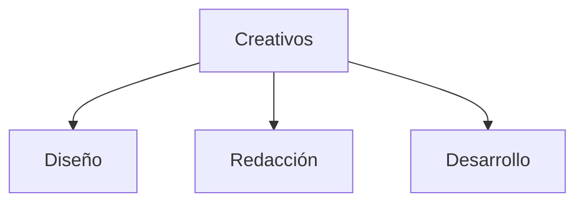

# Departamento Creativo (Microagencia Marketing Digital) 🔴②

* [[Estructurar una Microagencia de Marketing Digital  ⚫①]] 
	* [[Glosario de Marketing Digital ⚫①]]

En una microagencia de marketing digital, el departamento creativo es el corazón que late con ideas innovadoras y contenido atractivo para las campañas de marketing de los clientes. A continuación, te presentamos una descripción de las responsabilidades y funciones típicas del departamento creativo:

## Perfiles

* [[Rol Diseño Gráfico 🔴②|Diseño Gráfico 🔴②]]
* [[Rol Redacción publicitaria|Redacción publicitaria]]
* [[Rol Desarrollo web  ⚫①|Desarrollo Web]]

## Estructura

## Funciones y Responsabilidades

### 1. Dirección Creativa

* Establece la visión creativa de la agencia y de cada proyecto.
* Supervisa y guía la ejecución de las ideas creativas.

### 2. Diseño Gráfico

* Crea elementos visuales para campañas digitales, como logotipos, banners, infografías y elementos para redes sociales.
* Asegura que el diseño sea coherente con la identidad de marca del cliente y las tendencias actuales.

### 3. Diseño Web

* Desarrolla y actualiza sitios web para los clientes, asegurando una experiencia de usuario intuitiva y atractiva.
* Se asegura de que el diseño sea receptivo y compatible con dispositivos móviles.

### 4. Producción de Contenido

* Genera ideas creativas para contenido digital, como publicaciones en redes sociales, blogs, videos y podcasts.
* Crea guiones, storyboards y escritura de copia para el contenido digital.

### 5. Fotografía y Video

* Produce fotografías y videos para campañas publicitarias y contenido promocional.
* Edita y postproduce material visual para su uso en diversos canales digitales.

### 6. Animación y Motion Graphics

* Crea animaciones y gráficos en movimiento para aumentar el atractivo visual del contenido digital.
* Utiliza software de animación para desarrollar contenido interactivo y dinámico.

### 7. Experiencia de Usuario (UX) y Experiencia de Usuario (UI)

* Diseña interfaces de usuario intuitivas y atractivas para aplicaciones móviles y sitios web.
* Se asegura de que la experiencia del usuario sea fluida y satisfactoria en todos los puntos de contacto digitales.

### 8. Estrategia de Contenido

* Desarrolla estrategias de contenido creativas y efectivas para alcanzar los objetivos de marketing de los clientes.
* Colabora estrechamente con el equipo de estrategia para alinear el contenido con la marca y el público objetivo.

### 9. Innovación y Tendencias

* Investiga constantemente nuevas tendencias en diseño, tecnología y marketing para mantenerse actualizado.
* Propone ideas innovadoras y creativas para diferenciar a la agencia y sus clientes en un mercado competitivo.

### 10. Colaboración Interdepartamental

* Trabaja estrechamente con otros departamentos, como estrategia, cuentas y desarrollo, para garantizar la coherencia y la integración de las campañas digitales.
* Participa en reuniones de lluvia de ideas y sesiones de planificación estratégica para contribuir con perspectivas creativas.

## Referencias Bibliográficas que apoyan el contenido

* "The Creative Agency: A Guide to Building a Successful Digital Marketing Agency" de Jason Falls (2019)
* "Designing for Emotion" de Aarron Walter (2011)

## Referencias Bibliográficas que refutan el contenido

* "The Death of the Creative Agency" de Avi Dan (2019)
* "The End of the Agency Model" de Michael Farmer (2016)

## Cursos recomendados

* [Búsqueda en Platzi Departamento Creativo 🌐](https://platzi.com/buscar/?search=Creativo)

 ### Escuelas Platzi Recomendadas

* [Escuela Marketing Digital 🌐](https://platzi.com/escuela/marketing/)
* [Escuela de Inglés 🌐](https://platzi.com/escuela/ingles/)
* [Escuela Programación y Software 🌐](https://platzi.com/escuela/programacion-software/)

![[Platzi_Referal#¡Consigue un mes extra gratis en tu suscripción a Platzi!]]

![[⚫🔴🟡🟢🔵⚪ (🔴②)#Sobre el sistema de validez de un contenido en MetsuOS]]

