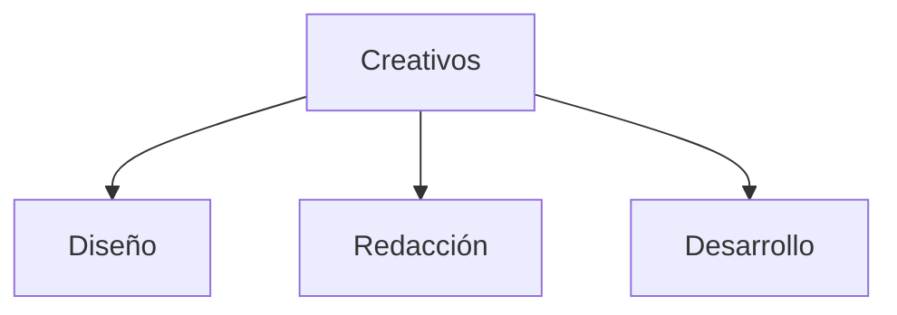

# Departamento Creativo (Microagencia Marketing Digital)

* [[Estructurar una Microagencia de Marketing Digital]] 
	* [[Glosario de Marketing Digital]]

En una microagencia de marketing digital, el departamento creativo desempeña un papel crucial en la generación de ideas innovadoras y la creación de contenido atractivo para las campañas de marketing de los clientes. Aquí tienes una descripción de las responsabilidades y funciones típicas del departamento creativo:

## Perfiles

* [[Rol Diseño Gráfico|Diseño Gráfico]]
* [[Rol Redacción publicitaria|Redacción publicitaria]]
* Desarrollo web

## Estructura

## Funciones y Responsabilidades

1. **Dirección Creativa**:
   - Encargado de establecer la visión creativa de la agencia y de cada proyecto.
   - Supervisa y guía la ejecución de las ideas creativas.

2. **Diseño Gráfico**:
   - Crea elementos visuales para campañas digitales, como logotipos, banners, infografías y elementos para redes sociales.
   - Asegura que el diseño sea coherente con la identidad de marca del cliente y las tendencias actuales.

3. **Diseño Web**:
   - Desarrolla y actualiza sitios web para los clientes, asegurando una experiencia de usuario intuitiva y atractiva.
   - Se asegura de que el diseño sea receptivo y compatible con dispositivos móviles.

4. **Producción de Contenido**:
   - Genera ideas creativas para contenido digital, como publicaciones en redes sociales, blogs, videos y podcasts.
   - Crea guiones, storyboards y escritura de copia para el contenido digital.

5. **Fotografía y Video**:
   - Produce fotografías y videos para campañas publicitarias y contenido promocional.
   - Edita y postproduce material visual para su uso en diversos canales digitales.

6. **Animación y Motion Graphics**:
   - Crea animaciones y gráficos en movimiento para aumentar el atractivo visual del contenido digital.
   - Utiliza software de animación para desarrollar contenido interactivo y dinámico.

7. **Experiencia de Usuario (UX) y Experiencia de Usuario (UI)**:
   - Diseña interfaces de usuario intuitivas y atractivas para aplicaciones móviles y sitios web.
   - Se asegura de que la experiencia del usuario sea fluida y satisfactoria en todos los puntos de contacto digitales.

8. **Estrategia de Contenido**:
   - Desarrolla estrategias de contenido creativas y efectivas para alcanzar los objetivos de marketing de los clientes.
   - Colabora estrechamente con el equipo de estrategia para alinear el contenido con la marca y el público objetivo.

9. **Innovación y Tendencias**:
   - Investiga constantemente nuevas tendencias en diseño, tecnología y marketing para mantenerse actualizado.
   - Propone ideas innovadoras y creativas para diferenciar a la agencia y sus clientes en un mercado competitivo.

10. **Colaboración Interdepartamental**:
    - Trabaja estrechamente con otros departamentos, como estrategia, cuentas y desarrollo, para garantizar la coherencia y la integración de las campañas digitales.
    - Participa en reuniones de lluvia de ideas y sesiones de planificación estratégica para contribuir con perspectivas creativas.

El departamento creativo es fundamental para el éxito de una microagencia de marketing digital, ya que su capacidad para generar ideas innovadoras y producir contenido visualmente atractivo puede marcar la diferencia en la efectividad de las campañas digitales.

## Cursos recomendados

* [Búsqueda en Platzi Departamento Creativo)](https://platzi.com/buscar/?search=Creativo)

 ### Escuelas Platzi Recomendadas

* [Escuela Marketing Digital](https://platzi.com/escuela/marketing/)
* [Escuela de Inglés](https://platzi.com/escuela/ingles/)
* [Escuela Programación y Software (platzi.com)](https://platzi.com/escuela/programacion-software/)

{{MOS::Templates::Platzi_Referal}}