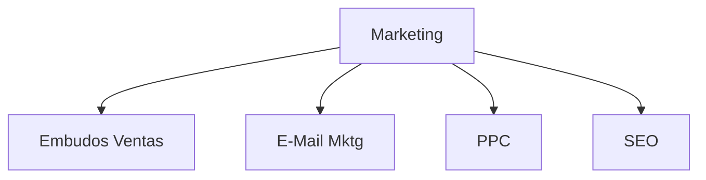

# Departamento Marketing (Microagencia Marketing Digital) 🔴②

* [[Estructurar una Microagencia de Marketing Digital  ⚫①]] 
	* [[Glosario de Marketing Digital ⚫①]]

El departamento de marketing es un pilar fundamental en cualquier organización, ya que se encarga de promover los productos o servicios de la empresa y de generar demanda entre los consumidores. En el contexto de una microagencia de marketing digital, el departamento de marketing desempeña un papel clave en la promoción y el éxito de la empresa.

## Perfiles

*  [[Rol Experto en Embudos de Venta 🔴②|Expertos en Embudos de ventas]]: especializados en la creación de estrategias de marketing para atraer y retener a los clientes.
* [[Rol Experto en EMail Marketing|Expertos en Email marketing]]: expertos en la creación y envío de correos electrónicos para promover productos o servicios.
* [[Rol Expertos en PPC|Expertos en PPC]]: expertos en la creación y gestión de campañas publicitarias en línea.
* [[Rol Expertos en SEO|Expertos en SEO]]: expertos en la optimización de motores de búsqueda para mejorar la visibilidad de la marca en los resultados de búsqueda.

## Estructura

## Funciones y Responsabilidades

### 1. Investigación de Mercado

* Realizar estudios de mercado para comprender las necesidades y preferencias de los clientes.
* Analizar tendencias del mercado, comportamiento del consumidor y actividades de la competencia.
* Recolectar datos y realizar análisis para identificar oportunidades de mercado.

### 2. Desarrollo de Estrategias

* Desarrollar estrategias de marketing para alcanzar los objetivos de la empresa.
* Definir el posicionamiento de la marca y la propuesta de valor.
* Establecer los segmentos de mercado y definir los mercados objetivo.

### 3. Planificación de Marketing

* Elaborar planes de marketing integrados que incluyan publicidad, promoción, relaciones públicas y actividades de ventas.
* Establecer presupuestos y asignar recursos para ejecutar las estrategias de marketing.
* Definir calendarios de lanzamiento de productos y campañas promocionales.

### 4. Ejecución de Campañas

* Implementar campañas de marketing en diversos canales, como publicidad en línea, medios sociales, correo electrónico y eventos.
* Supervisar la creación de contenido publicitario, materiales promocionales y actividades de relaciones públicas.
* Coordinar con otros departamentos para garantizar la coherencia y la integridad de la marca en todas las comunicaciones.

### 5. Evaluación de Resultados

* Medir el rendimiento de las campañas de marketing y analizar los resultados obtenidos.
* Utilizar métricas clave como el retorno de la inversión (ROI), la participación del mercado y las conversiones para evaluar la efectividad de las estrategias.
* Realizar ajustes en las estrategias y tácticas según sea necesario para mejorar los resultados.

### 6. Gestión de Relaciones

* Mantener relaciones con clientes, socios y proveedores.
* Gestionar la reputación de la marca y responder a comentarios y opiniones de los clientes.
* Colaborar con otros departamentos, como ventas, desarrollo de productos y atención al cliente, para garantizar la satisfacción del cliente y el éxito empresarial.

## Referencias Bibliográficas

* Kotler, P. (2017). Marketing management. Pearson Education.
* McCarthy, E. J. (1960). Basic marketing: A managerial approach. Richard D. Irwin.
* Smith, W. R. (1956). Product differentiation and market segmentation as alternative marketing strategies. Journal of Marketing, 20(3), 3-8.

## Referencias que Refutan

* Porter, M. E. (1985). Competitive advantage: Creating and sustaining superior performance. Free Press.
* Drucker, P. F. (1954). The practice of management. Harper & Row.

Nota: La sección de referencias bibliográficas y referencias que refutan se incluyen para proporcionar una visión más amplia y equilibrada del tema. Sin embargo, es importante tener en cuenta que las referencias que refutan pueden no ser necesariamente compatibles con el contenido presentado.
## Cursos recomendados

* [Búsqueda en Platzi Departamento Marleting)](https://platzi.com/buscar/?search=Marketing)

 ### Escuelas Platzi Recomendadas

* [Escuela Marketing Digital](https://platzi.com/escuela/marketing/)
* [Escuela de Inglés](https://platzi.com/escuela/ingles/)
* [Escuela Programación y Software (platzi.com)](https://platzi.com/escuela/programacion-software/)

![[Platzi_Referal#¡Consigue un mes extra gratis en tu suscripcion a Platzi!]]

![[⚫🔴🟡🟢🔵⚪ (🔴②)#Sobre el sistema de validez de un contenido en MetsuOS]]

