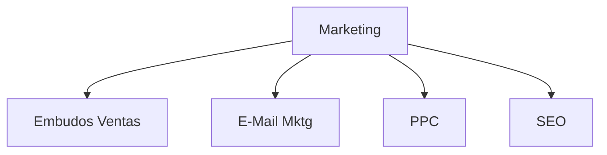

# Departamento Marketing (Microagencia Marketing Digital)

[[Estructurar una Microagencia de Marketing Digital]] | [[Glosario de Marketing Digital]]

El departamento de marketing en el contexto de una Microagencia de Marketing Digital es una parte fundamental de cualquier organización, ya que se encarga de promover los productos o servicios de la empresa y de generar demanda entre los consumidores. 

El departamento de marketing desempeña un papel clave en la promoción y el éxito de una empresa, ya que ayuda a generar demanda, construir relaciones con los clientes y mejorar la visibilidad y la reputación de la marca. Su trabajo es crucial para alcanzar los objetivos comerciales y mantener la competitividad en el mercado.

## Perfiles

* [[Rol Experto en Embudos de Venta|Expertos en Embudos de ventas]]
* Expertos en e-mail marketing
* Expertos en PPC
* Expertos en SEO

## Estructura

## Funciones y Responsabilidades

### 1. Investigación de Mercado
- Realizar estudios de mercado para comprender las necesidades y preferencias de los clientes.
- Analizar tendencias del mercado, comportamiento del consumidor y actividades de la competencia.
- Recolectar datos y realizar análisis para identificar oportunidades de mercado.

### 2. Desarrollo de Estrategias
- Desarrollar estrategias de marketing para alcanzar los objetivos de la empresa.
- Definir el posicionamiento de la marca y la propuesta de valor.
- Establecer los segmentos de mercado y definir los mercados objetivo.

### 3. Planificación de Marketing
- Elaborar planes de marketing integrados que incluyan publicidad, promoción, relaciones públicas y actividades de ventas.
- Establecer presupuestos y asignar recursos para ejecutar las estrategias de marketing.
- Definir calendarios de lanzamiento de productos y campañas promocionales.

### 4. Ejecución de Campañas
- Implementar campañas de marketing en diversos canales, como publicidad en línea, medios sociales, correo electrónico y eventos.
- Supervisar la creación de contenido publicitario, materiales promocionales y actividades de relaciones públicas.
- Coordinar con otros departamentos para garantizar la coherencia y la integridad de la marca en todas las comunicaciones.

### 5. Evaluación de Resultados
- Medir el rendimiento de las campañas de marketing y analizar los resultados obtenidos.
- Utilizar métricas clave como el retorno de la inversión (ROI), la participación del mercado y las conversiones para evaluar la efectividad de las estrategias.
- Realizar ajustes en las estrategias y tácticas según sea necesario para mejorar los resultados.

### 6. Gestión de Relaciones
- Mantener relaciones con clientes, socios y proveedores.
- Gestionar la reputación de la marca y responder a comentarios y opiniones de los clientes.
- Colaborar con otros departamentos, como ventas, desarrollo de productos y atención al cliente, para garantizar la satisfacción del cliente y el éxito empresarial.

## Cursos recomendados

* [Búsqueda en Platzi Departamento Marleting)](https://platzi.com/buscar/?search=Marketing)
* [Generación de Ruta en Platzi para el Departamento Marleting](https://platzi.com/buscar/?search=dame%20una%20ruta%20para%20formarme%20en%20el%20marketing)

 ### Escuelas Platzi Recomendadas

* [Escuela Marketing Digital](https://platzi.com/escuela/marketing/)
* [Escuela de Inglés](https://platzi.com/escuela/ingles/)
* [Escuela de Desarrollo Web](https://platzi.com/escuela/web/)
* [Escuela Programación y Software (platzi.com)](https://platzi.com/escuela/programacion-software/)
* [Escuela de Startups](https://platzi.com/escuela/startups/)
