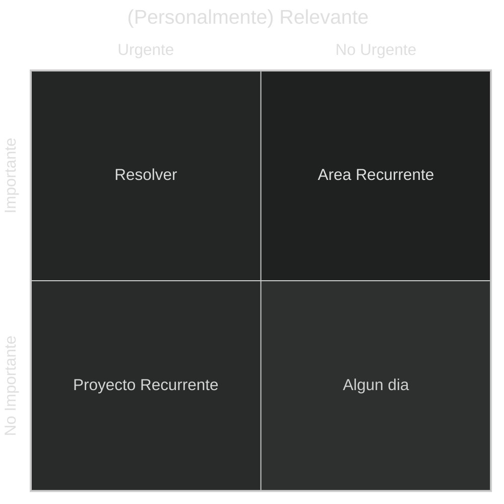
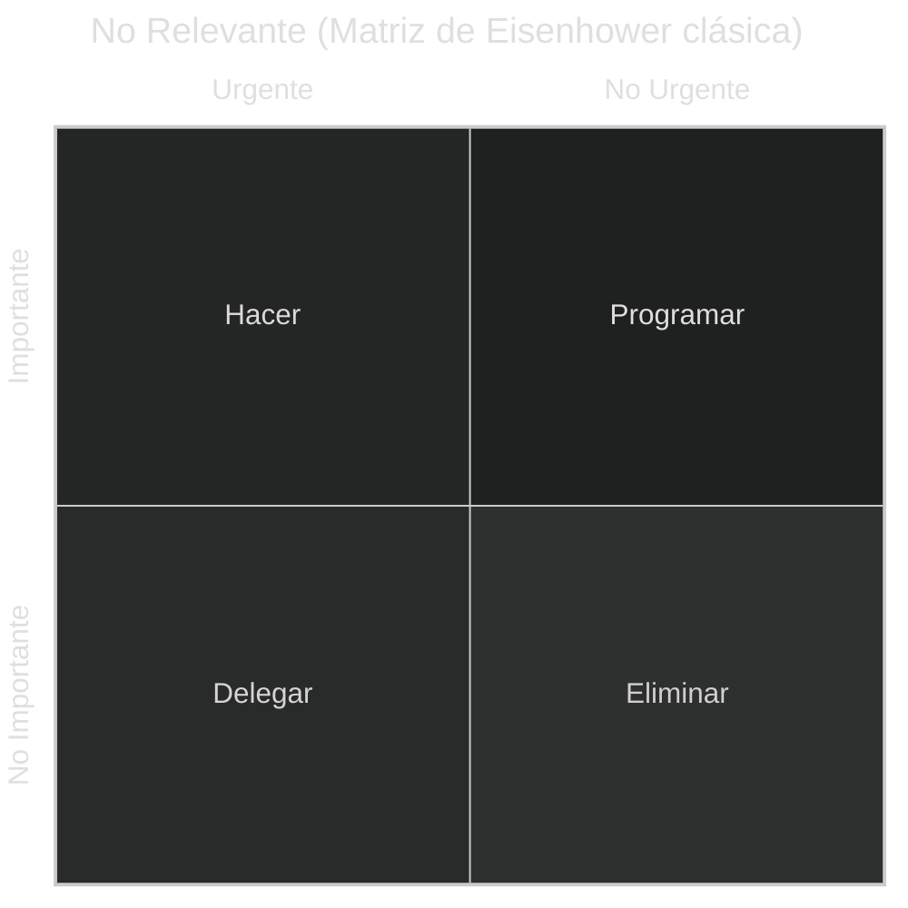

# El Cubo de MetsukeOS

[[Aprender sobre Gestión de Tareas]] | [[Métodos de Gestión de Tareas con papel y lápiz]]

Siguiendo la estela de la Matriz de Eisenhower, en el caso de MetsukeOS he llegado a aplicar una versión ampliada,  basada en el concepto de que toda gestion de tareas debe incluir tanto aspecto profesional como personal.

Por ello, a las dos dimensiones habituales Urgencia e Importancia, he añadido una tercera, Relevancia, que representa esta relevancia respecto de nuestro objetivo vital personal. De este modo, lo que antes eran cuatro cuadrantes, se convierten en 8 cubos , que represento en dos graficos de cuadrante:

## Relevantes Personalmente

En este sentido, entran en juego nuestro sueños, metas, aspiraciones y necesidades, aqui no se elimina nada, salvo que deje de ser relevante.

* Si es Urgente e Importante, es algo a resolver.
* Si es Importante pero no Urgente, constituye un Área que se alargará toda la vida, como aprender un idioma o mantener la forma física, esto constituyen áreas que se trabajarán continuamente, sin fecha de fin.
* Si es Urgente pero no Importante, se debe programar como un proyecto, con acciones recurrentes en caso necesario, pero que tiene una fecha de fin (ej. Comprar un piso). La Relevancia impide delegar, aunque se pueda buscar apoyo de terceros, debe mantenerse el control siempre.
* No Urgente , no Importante pero SI relevante, son cosas que deseamos, pero que por x motivos en este momento de nuestra vida no podemos o queremos abordar. Estos se guardan en una suerte de "Bucket List", que nos permite ver, recuperar, priorizar y sobre todo articular en red a la hora de convertirlos en areas o proyectos. 

Es importante destacar que, en esta categoría de "Algún Día", puede que algo no se lleve a materializar nunca, pero situarlo en el contexto de una vida completa y plena, permite priorizar y decidir, sin cargar con la sensación de que hemos renunciado a algo por las obligaciones, habremos priorizado unas cosas sobre otras. Sutil pero importante diferencia, a mi modo de ver capital en una gestión de tareas psicológicamente sana. 

Solo eliminaremos si algo deja de ser relevante para nosotros, nunca por otros motivos.

## No Relevante en lo personal

Simplemente resolvemos las tareas cuan items a resolver, sin más.

