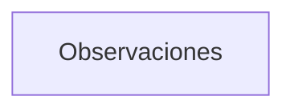
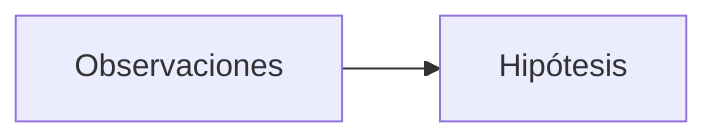

# Elementos del conocimiento humano y científico  🔴②

[[Estructura del Conocimiento Humano y Científico ⚫①]]

El conocimiento humano y científico se compone de varios elementos que se relacionan entre sí de manera jerárquica (Kuhn, 1962, p. 10).

A continuación, se presentan los diferentes niveles que componen esta estructura, desde la observación y experimentación hasta la metodología y técnicas (Popper, 1959, p. 20).

## Nivel 1: Observación y Experimentación

* **Observaciones**: Hechos y datos recopilados a través de la experiencia y la experimentación. Estas observaciones son la base para la construcción del conocimiento (Kuhn, 1962, p. 10).

## Nivel 2: Formulación de Hipótesis

* **Hipótesis**: Explicaciones provisionales y tentativas que intentan explicar un fenómeno o conjunto de observaciones. Las hipótesis se basan en las observaciones y son la primera etapa en la construcción de teorías (Popper, 1959, p. 30).

## Nivel 3: Desarrollo de Teorías

* **Teorías**: Conjuntos de hipótesis relacionadas que intentan explicar un fenómeno o conjunto de fenómenos. Las teorías se basan en las hipótesis y proporcionan una explicación más completa y coherente de los fenómenos (Lakatos, 1970, p. 15).
* **Modelos**: Representaciones simplificadas de un sistema o fenómeno que intentan explicar su comportamiento. Los modelos se basan en las teorías y proporcionan una representación más detallada y precisa de los fenómenos (Lakatos, 1970, p. 20).

## Nivel 4: Establecimiento de Leyes y Principios

* **Leyes**: Principios generales que describen la relación entre variables y que se consideran verdaderas en un determinado dominio. Las leyes se basan en las teorías y modelos y proporcionan una explicación más general y universal de los fenómenos (Popper, 1959, p. 40).
* **Principios**: Reglas o axiomas que guían la comprensión y la explicación de un fenómeno o conjunto de fenómenos. Los principios se basan en las leyes y proporcionan una guía más general y abstracta para la comprensión de los fenómenos (Lakatos, 1970, p. 25).

## Nivel 5: Conceptualización y Categorización

* **Conceptos**: Ideas abstractas que representan objetos, eventos o relaciones. Los conceptos se basan en los principios y proporcionan una representación más abstracta y general de los fenómenos (Kuhn, 1962, p. 50).
* **Categorías**: Agrupaciones de conceptos relacionados que permiten clasificar y organizar la información. Las categorías se basan en los conceptos y proporcionan una forma de organizar y clasificar la información (Lakatos, 1970, p. 30).

## Nivel 6: Desarrollo de Ideas y Escuelas de Pensamiento

* **Ideas**: Pensamientos o nociones que surgen de la reflexión y la imaginación. Las ideas se basan en los conceptos y categorías y proporcionan una forma de desarrollar y explorar nuevas perspectivas y enfoques (Popper, 1959, p. 50).
* **Escuelas de pensamiento**: Agrupaciones de ideas y conceptos que comparten una perspectiva o enfoque común. Las escuelas de pensamiento se basan en las ideas y proporcionan una forma de agrupar y organizar las ideas y conceptos relacionados (Kuhn, 1962, p. 60).

## Nivel 7: Paradigmas y Teorías de la Ciencia

* **Paradigmas**: Conjuntos de suposiciones, valores y creencias que guían la investigación y la comprensión de un fenómeno o conjunto de fenómenos. Los paradigmas se basan en las escuelas de pensamiento y proporcionan una forma de guiar la investigación y la comprensión de los fenómenos (Kuhn, 1962, p. 70).
* **Teorías de la ciencia**: Enfoques y perspectivas que intentan explicar la naturaleza de la ciencia y la forma en que se produce el conocimiento. Las teorías de la ciencia se basan en los paradigmas y proporcionan una forma de comprender y explicar la naturaleza de la ciencia (Lakatos, 1970, p. 40).

## Nivel 8: Metodologías y Técnicas

* **Metodologías**: Conjuntos de técnicas y procedimientos que se utilizan para recopilar y analizar datos. Las metodologías se basan en las teorías de la ciencia y proporcionan una forma de recopilar y analizar datos de manera sistemática y rigurosa (Popper, 1959, p. 60).
* **Técnicas**: Procedimientos y habilidades que se utilizan para recopilar y analizar datos. Las técnicas se basan en las metodologías y proporcionan una forma de aplicar las metodologías de manera práctica y efectiva (Lakatos, 1970, p. 50).
* **Instrumentos**: Herramientas y dispositivos que se utilizan para recopilar y analizar datos. Los instrumentos se basan en las técnicas y proporcionan una forma de aplicar las técnicas de manera práctica y efectiva (Kuhn, 1962, p. 80).

## Referencias bibliográficas que apoyan este contenido:

* Kuhn, T. S. (1962). La estructura de las revoluciones científicas. México: Fondo de Cultura Económica.
* Popper, K. R. (1959). La lógica de la investigación científica. Madrid: Tecnos.
* Lakatos, I. (1970). La metodología de los programas de investigación científica. Madrid: Alianza Editorial.

## Referencias bibliográficas que refutan este contenido

* Feyerabend, P. K. (1975). Against Method: Outline of an Anarchistic Theory of Knowledge. Londres: New Left Books.
* Kitcher, P. (1993). The Advancement of Science: Science Without Legend, Objectivity Without Illusions. Nueva York: Oxford University Press.
* Latour, B. (1987). Science in Action: How to Follow Scientists and Engineers Through Society. Cambridge: Harvard University Press.

Es importante destacar que las referencias bibliográficas que refutan el contenido, como Feyerabend (1975), Kitcher (1993) y Latour (1987), presentan perspectivas críticas y alternativas sobre la naturaleza del conocimiento y la ciencia, lo que puede ser útil para una discusión más amplia y profunda sobre el tema.

![[Plantilla - 1MT#One More Thing]]