# Estructurar una Microagencia de Marketing Digital  ⚫①  

* [[PublicBrain/Index|Index]] 
	* [[Mis Apuntes del Curso de Platzi Estructurar una Microagencia de Marketing Digital 🔴②]]
	* [[Glosario de Marketing Digital ⚫①]]

Inspirado en este [[Curso de Platzi sobre Estructurar una Microagencia de Marketing Digital 🔴②]] estoy desarrollando mi metodología sobre habilidades, perfiles y tareas para MetsuOS tomando como base lo aprendido en este curso, para posteriormente integrar mas conocimientos.

## Organigrama de la microagencia

{[MOS::Modelos:
	:Organizaciones::Negocio:
		:MicroagenciaPublicidad::GetStructure]}

* [[Rol Gestión Empresarial en una Microagencia de Marketing Digital 🔴②|Gestión Empresarial  🔴②]]
	* [[Rol Comercial 🔴②|Comercial 🔴②]]
	* [[Rol Administración Negocios 🔴②|Administración 🔴②]]
	* [[Rol Account Manager 🔴②|Account Manager 🔴②]]
		* [[Rol Project Manager 🔴②|Project Manager 🔴②]]
			* [[Departamento Marketing (Microagencia Marketing Digital) 🔴②|Marketing 🔴②]]
				* [[Rol Experto en Embudos de Venta 🔴②|Expertos en Embudos de ventas 🔴②]]
				* [[Rol Experto en EMail Marketing 🔴②|Expertos en Email marketing 🔴②]]
				* [[Rol Expertos en PPC 🔴②|Expertos en PPC 🔴②]]
				* [[Rol Expertos en SEO 🔴②|Expertos en SEO 🔴②]]
			* [[Departamento Creativo (Microagencia Marketing Digital) 🔴②|Creativo 🔴②]]
				* [[Rol Diseño Gráfico 🔴②|Diseño Gráfico 🔴②]]
				* [[Rol Redacción publicitaria 🔴②|Redacción Publicitaria 🔴②]]
				* [[Rol Desarrollo web 🔴②|Desarrollo Web 🔴②]]

```mermaid
graph TD
    GestionEmpresarial[Gestión Empresarial]
	Administracion[Administración]
	AccountManager[Account Manager]
	Comercial[Comercial]
	ProjectManager[Project Manager]
	ExpertoEmbudoVenta[Embudos Ventas]
	ExpertoEmailMarketing[E-Mail Mktg]
	ExpertoPPC[PPC]
	ExpertoSEO[SEO]
	DiseñoGrafico[Diseño]
	RedacciónPublicitaria[Redacción]
	DesarrolloWeb[Desarrollo]
	PerfilesMktg[Marketing]
	PerfilesCreativos[Creativos]
    GestionEmpresarial --> Administracion
    GestionEmpresarial --> Comercial
    GestionEmpresarial --> AccountManager
    AccountManager --> ProjectManager
    ProjectManager --> PerfilesMktg
    ProjectManager --> PerfilesCreativos
    PerfilesMktg --> ExpertoEmbudoVenta
    PerfilesMktg --> ExpertoEmailMarketing
    PerfilesMktg --> ExpertoPPC
    PerfilesMktg --> ExpertoSEO
    PerfilesCreativos --> DiseñoGrafico
    PerfilesCreativos --> RedacciónPublicitaria
    PerfilesCreativos --> DesarrolloWeb
```

![[Platzi_Referal#¡Consigue un mes extra gratis en tu suscripción a Platzi!]]

## Log

* Fase 0: Tomar apuntes del curso... DONE
* Fase 1: Modelar agencia (departamentos, puestos ...) ... IN PROGRESS
* Fase 2: Modelar puestos (rol, responsabilidades ...) .. IN PROGRESS
* Fase 3: Modelar roles, habilidades (duras y blandas) .. IN PROGRESS
* Fase 4: Modelar cada uno de los elementos de responsabilidad, etc, etc, etc) ... FUTURE
* Fase 5: Enlazar esto con la ejecución real de las diferentes tareas via MetsuOS ... FUTURE
* Fase 6: Georgi Dan ... FUTURE

![[Plantilla - 1MT#One More Thing]]